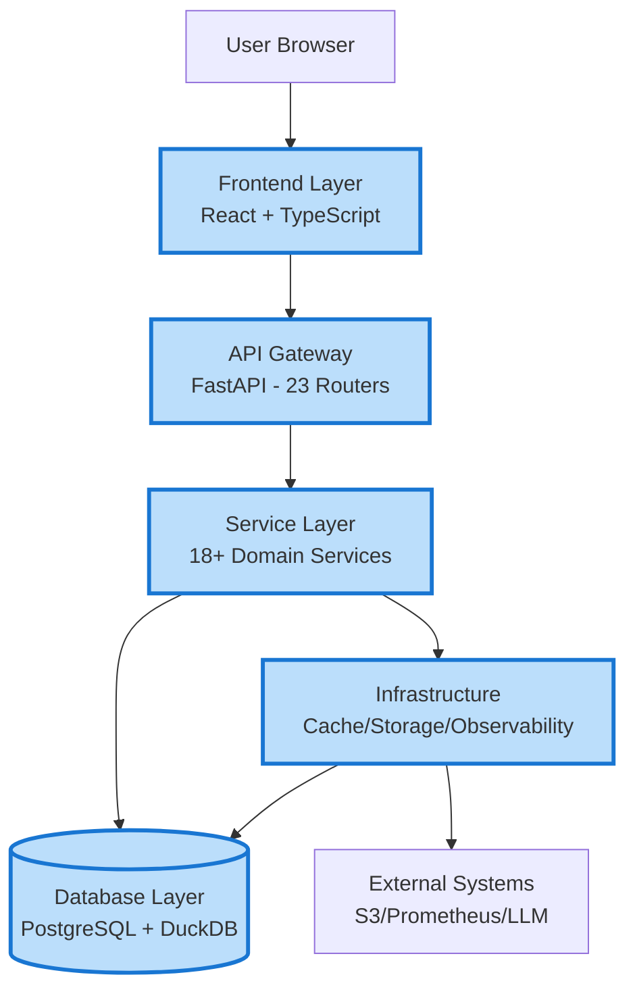
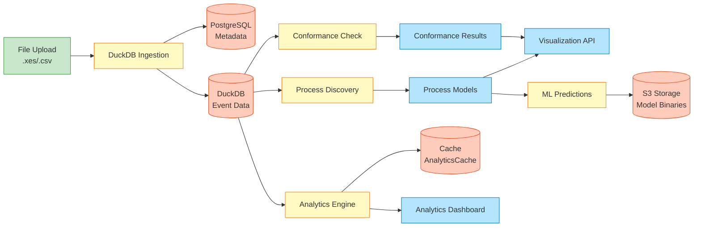
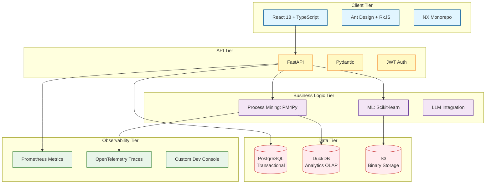
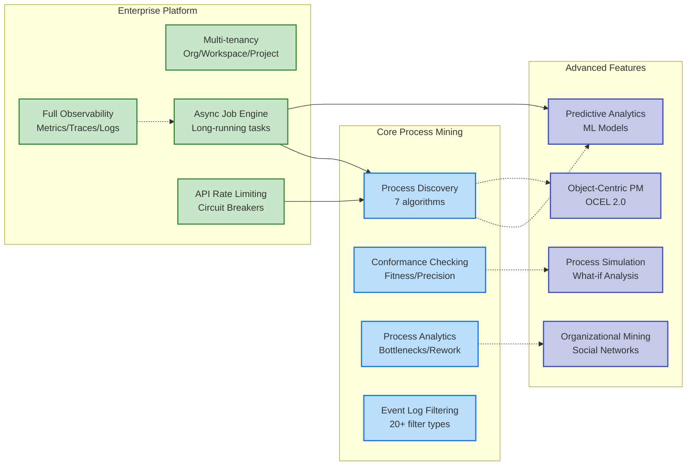

# System Architecture

## Quick Navigation

**Start here for quick understanding:**
1. [High-Level System View](#1-high-level-system-view-simplified) - 5 layers overview
2. [Data Flow View](#2-data-flow-view-event-log-processing) - How data moves
3. [Technology Stack View](#3-technology-stack-view) - Tech components
4. [Domain Capabilities View](#4-domain-capabilities-view) - Features overview

**For detailed exploration:**
5. [Complete Architecture Diagram](#5-complete-system-architecture-diagram-detailed) - All components
6. [Quick Reference](#quick-reference) - Key facts

**For improvements & future roadmap:**
→ See [ARCHITECTURE_IMPROVEMENTS.md](./ARCHITECTURE_IMPROVEMENTS.md) for target architecture, migration strategy, and recommendations

---

## 1. High-Level System View (Simplified)



## 2. Data Flow View (Event Log Processing)



## 3. Technology Stack View



## 4. Domain Capabilities View



## 5. Complete System Architecture Diagram (Detailed)

```mermaid
graph TB
    subgraph "Frontend Layer - React/TypeScript/Ant Design"
        FE_PROJECTS[Projects Manager]
        FE_DISCOVERY[Discovery UI]
        FE_ANALYTICS[Analytics Dashboard]
        FE_EXPLORER[Process Explorer]
        FE_UPLOAD[Upload Wizard]
        FE_KPI[KPI Tracker]
        FE_AI[AI Insights]
        FE_PLATFORM[Platform Settings]
    end

    subgraph "API Gateway - FastAPI Routers"
        subgraph "Core Platform APIs"
            API_AUTH[auth.py - Authentication]
            API_WORKSPACES[workspaces.py - Workspaces]
            API_PROJECTS[projects.py - Projects]
            API_DATASETS[datasets.py - Datasets]
        end

        subgraph "Process Mining APIs"
            API_DISCOVERY[discovery.py - Model Discovery]
            API_ANALYTICS[analytics.py - Process Analytics]
            API_CONFORMANCE[conformance.py - Conformance Check]
            API_FILTERING[filtering.py - Event Filtering]
            API_VIZ[visualization.py - Graph Viz]
        end

        subgraph "Advanced Features APIs"
            API_PREDICTIONS[predictions.py - ML Predictions]
            API_SIMULATION[simulation.py - Simulation]
            API_OCPM[ocpm.py - Object-Centric PM]
            API_WORKFLOWS[workflows.py - Workflows]
            API_ORGANIZATIONAL[organizational.py - Org Mining]
            API_BUSINESS[business_use_cases.py - Use Cases]
        end

        subgraph "Infrastructure APIs"
            API_JOBS[jobs.py - Async Jobs]
            API_HEALTH[health.py - Health Checks]
            API_ANALYSES[analyses.py - Analysis Mgmt]
            API_DEVLOG[dev_log.py - Dev Console]
            API_TELEMETRY[telemetry_proxy.py - Telemetry]
        end
    end

    subgraph "Service Layer"
        subgraph "Core Mining Services"
            SVC_MINING[mining.py - Discovery]
            SVC_INGESTION[duckdb_ingestion.py - Data Ingestion]
            SVC_EVENTLOG[event_log_loader.py - Log Loading]
            SVC_FILTERING[filtering.py - Filtering]
            SVC_ANALYTICS[analytics.py - Analytics Engine]
            SVC_CONFORMANCE[conformance.py - Conformance]
        end

        subgraph "Advanced Services"
            SVC_PREDICTION[prediction.py - ML Service]
            SVC_SIMULATION[simulation.py - Simulation Engine]
            SVC_OCPM[ocpm.py - OCPM Engine]
            SVC_ORGANIZATIONAL[organizational.py - Org Mining]
            SVC_WORKFLOW[workflow.py - Workflow Engine]
            SVC_RCA[root_cause_analysis.py - RCA]
            SVC_RECOMMENDATION[recommendation.py - Recommendations]
            SVC_LLM[llm.py - LLM Integration]
        end

        subgraph "Support Services"
            SVC_JOB[job_service.py - Job Orchestration]
            SVC_EVENTS[event_stream.py - SSE Streaming]
            SVC_PRIVACY[privacy.py - Anonymization]
            SVC_REGISTRY[analysis_registry.py - Registry]
        end
    end

    subgraph "Infrastructure Layer"
        subgraph "Storage & Data"
            INFRA_CACHE[cache.py - Cache Service]
            INFRA_DUCKDB[duckdb.py - DuckDB Manager]
            INFRA_S3[object_storage.py - S3 Client]
            INFRA_REPO[repositories.py - Data Access]
        end

        subgraph "Reliability"
            INFRA_CB[circuit_breaker.py - Circuit Breaker]
            INFRA_RETRY[retry.py - Retry Logic]
            INFRA_RATELIMIT[rate_limiter.py - Rate Limiter]
        end

        subgraph "Observability"
            INFRA_METRICS[metrics.py - Prometheus]
            INFRA_TRACING[tracing.py - OpenTelemetry]
            INFRA_LOGGING[log_broker.py - Log Broker]
            INFRA_DEVCONSOLE[devconsole_exporter.py - Dev Console]
        end

        subgraph "Core Infrastructure"
            INFRA_TASKS[tasks.py - Async Tasks]
            INFRA_SECURITY[security.py - JWT/Auth]
            INFRA_CONFIG[config.py - Settings]
            INFRA_EVENTS[domain_events.py - Event Bus]
        end
    end

    subgraph "Data Layer - PostgreSQL/SQLite + DuckDB"
        subgraph "Platform Models"
            DB_ORG[Organization]
            DB_WORKSPACE[Workspace]
            DB_USER[User]
            DB_MEMBER[WorkspaceMember]
            DB_PROJECT[Project]
            DB_JOB[AsyncJob]
            DB_ERROR[ErrorLog]
        end

        subgraph "Process Mining Models"
            DB_DATASET[Dataset]
            DB_FILE[UploadedFile]
            DB_CASE[ProcessCase]
            DB_EVENT[ProcessEvent]
            DB_MODEL[ProcessModel]
            DB_METRICS[ProcessModelMetrics]
            DB_ANALYSIS[Analysis]
        end

        subgraph "Advanced Feature Models"
            DB_CONFORMANCE[ConformanceResult]
            DB_MAPPING[ActivityMapping]
            DB_CACHE[AnalyticsCache]
            DB_SOCIAL[SocialNetwork]
            DB_PREDICTION[PredictionModel/Prediction]
            DB_RECOMMENDATION[Recommendation]
            DB_WORKFLOW[Workflow/WorkflowRun]
            DB_GRAPH[GraphCache]
            DB_OCEL[OCELLog/OCELObjectType]
            DB_OCPN[OCPetriNet]
            DB_HIERARCHICAL[HierarchicalProcessModel]
        end
    end

    subgraph "External Systems"
        EXT_S3[(S3/Object Storage)]
        EXT_PROMETHEUS[(Prometheus)]
        EXT_OTEL[(OpenTelemetry Collector)]
        EXT_LLM[LLM Provider API]
    end

    %% Frontend to API connections
    FE_PROJECTS --> API_PROJECTS
    FE_PROJECTS --> API_WORKSPACES
    FE_DISCOVERY --> API_DISCOVERY
    FE_ANALYTICS --> API_ANALYTICS
    FE_EXPLORER --> API_VIZ
    FE_UPLOAD --> API_DATASETS
    FE_KPI --> API_ANALYTICS
    FE_AI --> API_PREDICTIONS
    FE_PLATFORM --> API_AUTH

    %% API to Service Layer
    API_AUTH --> INFRA_SECURITY
    API_WORKSPACES --> DB_WORKSPACE
    API_PROJECTS --> DB_PROJECT
    API_DATASETS --> SVC_INGESTION
    API_DISCOVERY --> SVC_MINING
    API_ANALYTICS --> SVC_ANALYTICS
    API_CONFORMANCE --> SVC_CONFORMANCE
    API_FILTERING --> SVC_FILTERING
    API_VIZ --> SVC_EVENTLOG
    API_PREDICTIONS --> SVC_PREDICTION
    API_SIMULATION --> SVC_SIMULATION
    API_OCPM --> SVC_OCPM
    API_WORKFLOWS --> SVC_WORKFLOW
    API_ORGANIZATIONAL --> SVC_ORGANIZATIONAL
    API_BUSINESS --> SVC_RECOMMENDATION
    API_JOBS --> SVC_JOB
    API_ANALYSES --> DB_ANALYSIS

    %% Service to Infrastructure
    SVC_MINING --> INFRA_CACHE
    SVC_INGESTION --> INFRA_DUCKDB
    SVC_EVENTLOG --> INFRA_DUCKDB
    SVC_ANALYTICS --> INFRA_CACHE
    SVC_PREDICTION --> INFRA_S3
    SVC_LLM --> EXT_LLM
    SVC_JOB --> INFRA_TASKS
    SVC_EVENTS --> INFRA_LOGGING

    %% Infrastructure to Data
    INFRA_REPO --> DB_DATASET
    INFRA_REPO --> DB_PROJECT
    INFRA_DUCKDB --> DB_EVENT
    INFRA_S3 --> EXT_S3
    INFRA_CACHE --> DB_CACHE

    %% Observability
    INFRA_METRICS --> EXT_PROMETHEUS
    INFRA_TRACING --> EXT_OTEL
    INFRA_DEVCONSOLE --> API_DEVLOG

    %% Service to Database
    SVC_MINING --> DB_MODEL
    SVC_CONFORMANCE --> DB_CONFORMANCE
    SVC_PREDICTION --> DB_PREDICTION
    SVC_WORKFLOW --> DB_WORKFLOW
    SVC_ORGANIZATIONAL --> DB_SOCIAL
    SVC_OCPM --> DB_OCEL

    %% Cross-cutting concerns
    INFRA_CB -.-> SVC_MINING
    INFRA_CB -.-> SVC_PREDICTION
    INFRA_RETRY -.-> SVC_ANALYTICS
    INFRA_RATELIMIT -.-> API_AUTH
    INFRA_EVENTS -.-> SVC_JOB

    classDef frontend fill:#e1f5ff,stroke:#01579b
    classDef api fill:#fff9c4,stroke:#f57f17
    classDef service fill:#f3e5f5,stroke:#4a148c
    classDef infra fill:#e8f5e9,stroke:#1b5e20
    classDef database fill:#fce4ec,stroke:#880e4f
    classDef external fill:#fff3e0,stroke:#e65100

    class FE_PROJECTS,FE_DISCOVERY,FE_ANALYTICS,FE_EXPLORER,FE_UPLOAD,FE_KPI,FE_AI,FE_PLATFORM frontend
    class API_AUTH,API_WORKSPACES,API_PROJECTS,API_DATASETS,API_DISCOVERY,API_ANALYTICS,API_CONFORMANCE,API_FILTERING,API_VIZ,API_PREDICTIONS,API_SIMULATION,API_OCPM,API_WORKFLOWS,API_ORGANIZATIONAL,API_BUSINESS,API_JOBS,API_HEALTH,API_ANALYSES,API_DEVLOG,API_TELEMETRY api
    class SVC_MINING,SVC_INGESTION,SVC_EVENTLOG,SVC_FILTERING,SVC_ANALYTICS,SVC_CONFORMANCE,SVC_PREDICTION,SVC_SIMULATION,SVC_OCPM,SVC_ORGANIZATIONAL,SVC_WORKFLOW,SVC_RCA,SVC_RECOMMENDATION,SVC_LLM,SVC_JOB,SVC_EVENTS,SVC_PRIVACY,SVC_REGISTRY service
    class INFRA_CACHE,INFRA_DUCKDB,INFRA_S3,INFRA_REPO,INFRA_CB,INFRA_RETRY,INFRA_RATELIMIT,INFRA_METRICS,INFRA_TRACING,INFRA_LOGGING,INFRA_DEVCONSOLE,INFRA_TASKS,INFRA_SECURITY,INFRA_CONFIG,INFRA_EVENTS infra
    class DB_ORG,DB_WORKSPACE,DB_USER,DB_MEMBER,DB_PROJECT,DB_JOB,DB_ERROR,DB_DATASET,DB_FILE,DB_CASE,DB_EVENT,DB_MODEL,DB_METRICS,DB_ANALYSIS,DB_CONFORMANCE,DB_MAPPING,DB_CACHE,DB_SOCIAL,DB_PREDICTION,DB_RECOMMENDATION,DB_WORKFLOW,DB_GRAPH,DB_OCEL,DB_OCPN,DB_HIERARCHICAL database
    class EXT_S3,EXT_PROMETHEUS,EXT_OTEL,EXT_LLM external
```



## Architecture Summary

### Technology Stack
- **Frontend**: React, TypeScript, Ant Design, RxJS, NX monorepo
- **Backend**: Python, FastAPI, SQLAlchemy
- **Databases**: PostgreSQL/SQLite (transactional), DuckDB (analytics)
- **Storage**: S3/Object Storage
- **Observability**: Prometheus, OpenTelemetry, custom DevConsole
- **ML/AI**: LLM integration, predictive models

### Key Architectural Patterns
1. **Multi-tenant Platform**: Organization → Workspace → Project hierarchy
2. **Layered Architecture**: Frontend → API → Service → Infrastructure → Data
3. **Feature-based Modules**: Separate features for process mining, predictions, workflows, etc.
4. **Reliability Patterns**: Circuit breakers, retry logic, rate limiting
5. **Event-driven**: Domain events, SSE streaming, async job orchestration
6. **Hybrid Storage**: PostgreSQL for transactions, DuckDB for analytics
7. **Comprehensive Observability**: Metrics, tracing, logging, dev console

### Core Capabilities
- **Process Mining**: Discovery, conformance checking, analytics, visualization
- **Object-Centric Process Mining**: OCEL logs, object-centric Petri nets
- **Advanced Analytics**: Bottleneck detection, root cause analysis, organizational mining
- **ML/AI**: Predictive models, recommendations, LLM-powered insights
- **Workflow Automation**: Template-based workflows, execution tracking
- **Multi-tenancy**: Full workspace and project isolation
- **Enterprise Features**: Auth, rate limiting, caching, monitoring

---

## Quick Reference

### Component Count
| Layer | Count | Key Components |
|-------|-------|----------------|
| **Frontend Features** | 8 | Projects, Discovery, Analytics, Explorer, Upload, KPI, AI, Platform |
| **API Routers** | 23 | Auth, Workspaces, Projects, Datasets, Discovery, Analytics, Conformance, Predictions, etc. |
| **Services** | 18+ | Mining, Ingestion, Analytics, Prediction, Simulation, Workflow, LLM |
| **Infrastructure** | 16 | Cache, DuckDB, S3, Circuit Breaker, Metrics, Tracing, Security, Tasks |
| **Database Models** | 30+ | Platform (7), Process Mining (7), Advanced Features (16+) |

### Technology Stack Summary
```
Frontend:  React 18 + TypeScript + Ant Design + RxJS + NX
Backend:   FastAPI + Pydantic + SQLAlchemy + PM4Py
Database:  PostgreSQL (transactional) + DuckDB (analytics)
Storage:   S3 / Object Storage
Observability: Prometheus + OpenTelemetry + Custom DevConsole
ML/AI:     Scikit-learn + LLM APIs
```

### Key File Locations
```
frontend-new/src/
├── features/           # Feature modules (projects, discovery, analytics, etc.)
├── core/               # Core components and utilities
└── context/            # React contexts

backend/src/
├── api/routers/        # 23 FastAPI routers
├── services/           # Business logic layer
├── platform/           # Platform infrastructure
│   ├── models.py       # Platform database models
│   └── infrastructure/ # Core infra services
├── features/           # Feature-specific code
│   └── process_mining/
│       └── models/     # Process mining models
└── shared/             # Shared utilities
```

### API Router Categories
1. **Core Platform** (4): auth, workspaces, projects, datasets
2. **Process Mining** (5): discovery, analytics, conformance, filtering, visualization
3. **Advanced Features** (6): predictions, simulation, ocpm, workflows, organizational, business_use_cases
4. **Infrastructure** (8): jobs, health, analyses, dev_log, dev_logs_stream, telemetry_proxy, telemetry_test
