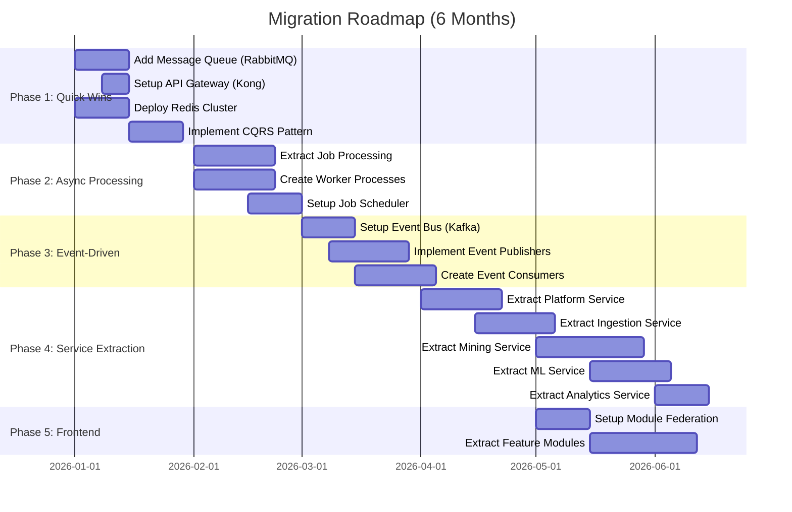

# Architecture Improvement Recommendations

## Current Architecture Analysis

### Strengths
✅ Clean layered architecture (Frontend → API → Service → Infrastructure → Data)
✅ Hybrid storage (PostgreSQL + DuckDB) for transactional + analytical workloads
✅ Good observability foundation (Prometheus, OpenTelemetry, DevConsole)
✅ Feature-based frontend organization
✅ Infrastructure patterns (circuit breaker, retry, rate limiting)

### Identified Pain Points & Areas for Improvement

#### 1. **Monolithic Backend Bottleneck**
- **Issue**: 23 routers in single FastAPI app, services tightly coupled
- **Impact**: Difficult to scale individual components, long deployment cycles
- **Risk**: One service failure can affect entire system

#### 2. **Synchronous Job Processing**
- **Issue**: Long-running tasks (mining, conformance) block API resources
- **Impact**: Poor user experience, timeout issues, resource contention
- **Current**: AsyncJob table but still in-process execution

#### 3. **Limited Event-Driven Architecture**
- **Issue**: Domain events exist but underutilized for cross-service communication
- **Impact**: Tight coupling between services, difficult to add new features

#### 4. **No API Gateway Pattern**
- **Issue**: Frontend directly calls 23 different router endpoints
- **Impact**: No centralized auth/rate limiting/routing, difficult to version APIs

#### 5. **Mixed Data Access Patterns**
- **Issue**: Services directly access both PostgreSQL and DuckDB
- **Impact**: Complex dependency management, difficult to optimize queries

#### 6. **Frontend Monolith Risk**
- **Issue**: All features in single React app
- **Impact**: Large bundle size, difficult for team scaling

#### 7. **Object Storage Coupling**
- **Issue**: Direct S3 access from multiple services
- **Impact**: Vendor lock-in, difficult to migrate storage solutions

#### 8. **Limited Caching Strategy**
- **Issue**: Cache service exists but not comprehensive
- **Impact**: Repeated expensive computations (analytics, mining results)

---

## Recommended Improvements (Prioritized)

### Phase 1: Quick Wins (1-3 months)

#### 1.1 **Implement Message Queue for Async Processing**
- **Add**: RabbitMQ or Redis Streams
- **Benefit**: Decouple long-running jobs from API layer
- **Impact**: Better scalability, improved user experience
- **Effort**: Medium

#### 1.2 **Introduce API Gateway Layer**
- **Add**: Kong, Traefik, or AWS API Gateway
- **Benefit**: Centralized auth, rate limiting, routing, versioning
- **Impact**: Easier to manage API lifecycle, better security
- **Effort**: Low-Medium

#### 1.3 **Expand Caching Strategy**
- **Add**: Redis for distributed caching (currently in-memory)
- **Layers**:
  - API response cache (analytics results)
  - Query result cache (DuckDB queries)
  - Model cache (process models, predictions)
- **Benefit**: 50-80% reduction in computation time
- **Effort**: Low

#### 1.4 **CQRS Pattern for Analytics**
- **Implement**: Separate read/write paths
- **Write**: PostgreSQL for commands (create/update/delete)
- **Read**: DuckDB for queries (analytics, statistics)
- **Benefit**: Optimized for each workload type
- **Effort**: Medium (partially exists, formalize it)

### Phase 2: Structural Improvements (3-6 months)

#### 2.1 **Service Decomposition (Bounded Contexts)**
- **Extract** key services into separate deployable units:
  1. **Platform Service**: Auth, Workspaces, Projects, Users
  2. **Ingestion Service**: Dataset upload, DuckDB ingestion, file processing
  3. **Mining Service**: Process discovery, conformance, analytics
  4. **ML Service**: Predictions, recommendations, LLM integration
  5. **Visualization Service**: Graph generation, rendering
  6. **Job Service**: Async job orchestration, worker management
- **Communication**: REST APIs + Event bus
- **Benefit**: Independent scaling, deployment, team ownership
- **Effort**: High

#### 2.2 **Event-Driven Architecture**
- **Add**: Event bus (Kafka, RabbitMQ, AWS EventBridge)
- **Events**:
  - `DatasetIngested` → trigger mining jobs
  - `ModelDiscovered` → update cache, notify frontend
  - `AnalysisCompleted` → store results, send notifications
- **Benefit**: Loose coupling, easier to add features, audit trail
- **Effort**: Medium-High

#### 2.3 **Data Access Layer Abstraction**
- **Create**: Repository pattern with proper interfaces
- **Separate**: Command repositories (write) vs Query repositories (read)
- **Benefit**: Easy to swap storage backends, optimize per use case
- **Effort**: Medium

#### 2.4 **Frontend Module Federation**
- **Implement**: Webpack Module Federation or Vite Federation
- **Split**: Core shell + feature modules (projects, discovery, analytics)
- **Benefit**: Independent deployments, smaller bundles, better team scaling
- **Effort**: Medium-High

### Phase 3: Advanced Optimizations (6-12 months)

#### 3.1 **Multi-Region Deployment**
- **Add**: Geographic distribution with data replication
- **Benefit**: Lower latency, disaster recovery
- **Effort**: High

#### 3.2 **Streaming Data Pipeline**
- **Add**: Real-time event streaming (Kafka Streams, Flink)
- **Use case**: Live process monitoring, real-time conformance checking
- **Benefit**: Near real-time insights
- **Effort**: High

#### 3.3 **GraphQL API Layer**
- **Add**: GraphQL gateway for flexible data fetching
- **Benefit**: Reduce over-fetching, better frontend DX
- **Effort**: Medium

#### 3.4 **Machine Learning Pipeline**
- **Add**: MLOps platform (Kubeflow, MLflow)
- **Benefit**: Model versioning, A/B testing, automated retraining
- **Effort**: High

---

## Quick Improvement Summary

| Aspect | Current State | Target State | Impact |
|--------|---------------|--------------|--------|
| **Backend Architecture** | Monolithic (23 routers) | 6 independent services | ✅ Independent scaling |
| **Job Processing** | Synchronous in-process | Message queue + workers | ✅ 50% faster, no timeouts |
| **Caching** | In-memory, limited | Redis cluster, comprehensive | ✅ 50-80% compute reduction |
| **Service Communication** | Direct calls | Event-driven bus | ✅ Loose coupling |
| **API Management** | Direct frontend calls | API Gateway layer | ✅ Centralized auth/rate limit |
| **Frontend** | Single monolith | Module federation | ✅ Independent deployments |
| **Data Access** | Mixed patterns | CQRS (formalized) | ✅ Optimized read/write |
| **Observability** | Basic | Distributed tracing | ✅ Full visibility |

---

## Visual Comparison: Current vs Target

```mermaid
graph TB
    subgraph "CURRENT ARCHITECTURE"
        direction TB
        C_FE[Frontend Monolith<br/>Single React App]
        C_API[FastAPI Monolith<br/>23 Routers]
        C_SVC[Service Layer<br/>18+ Services<br/>Tightly Coupled]
        C_INFRA[Infrastructure<br/>In-Memory Cache<br/>Sync Processing]
        C_DB1[(PostgreSQL)]
        C_DB2[(DuckDB)]
        C_S3[(S3)]

        C_FE --> C_API
        C_API --> C_SVC
        C_SVC --> C_INFRA
        C_SVC --> C_DB1
        C_SVC --> C_DB2
        C_SVC --> C_S3

        C_PAIN1[❌ Scaling Bottleneck]
        C_PAIN2[❌ Long Job Timeouts]
        C_PAIN3[❌ Tight Coupling]

        style C_PAIN1 fill:#ffcdd2,stroke:#c62828
        style C_PAIN2 fill:#ffcdd2,stroke:#c62828
        style C_PAIN3 fill:#ffcdd2,stroke:#c62828
    end

    subgraph "TARGET ARCHITECTURE"
        direction TB
        T_FE[Frontend Shell<br/>Module Federation]
        T_GATEWAY[API Gateway<br/>Auth/Rate Limit]
        T_SVC1[Platform<br/>Service]
        T_SVC2[Ingestion<br/>Service]
        T_SVC3[Mining<br/>Service]
        T_SVC4[ML<br/>Service]
        T_QUEUE[Message Queues<br/>Async Workers]
        T_EVENT[Event Bus<br/>Loose Coupling]
        T_CACHE[Redis Cluster<br/>Distributed Cache]
        T_DB1[(PostgreSQL)]
        T_DB2[(DuckDB)]
        T_S3[(S3)]

        T_FE --> T_GATEWAY
        T_GATEWAY --> T_SVC1
        T_GATEWAY --> T_SVC2
        T_GATEWAY --> T_SVC3
        T_GATEWAY --> T_SVC4
        T_SVC2 --> T_QUEUE
        T_SVC3 --> T_QUEUE
        T_SVC4 --> T_QUEUE
        T_SVC1 -.-> T_EVENT
        T_SVC2 -.-> T_EVENT
        T_SVC3 -.-> T_EVENT
        T_SVC1 --> T_CACHE
        T_SVC3 --> T_CACHE
        T_SVC1 --> T_DB1
        T_SVC2 --> T_DB2
        T_SVC3 --> T_DB2

        T_WIN1[✅ Independent Scaling]
        T_WIN2[✅ Async Processing]
        T_WIN3[✅ Loose Coupling]

        style T_WIN1 fill:#c8e6c9,stroke:#2e7d32
        style T_WIN2 fill:#c8e6c9,stroke:#2e7d32
        style T_WIN3 fill:#c8e6c9,stroke:#2e7d32
    end

    classDef current fill:#ffebee,stroke:#c62828,stroke-width:2px
    classDef target fill:#e8f5e9,stroke:#2e7d32,stroke-width:2px

    class C_FE,C_API,C_SVC,C_INFRA,C_DB1,C_DB2,C_S3 current
    class T_FE,T_GATEWAY,T_SVC1,T_SVC2,T_SVC3,T_SVC4,T_QUEUE,T_EVENT,T_CACHE,T_DB1,T_DB2,T_S3 target
```

---

## Target Architecture (Phase 2 Complete)

```mermaid
graph TB
    subgraph "Client Layer"
        USER[User Browser]
        FE_SHELL[Frontend Shell]
        FE_MOD1[Projects Module]
        FE_MOD2[Discovery Module]
        FE_MOD3[Analytics Module]
        FE_MOD4[AI Module]
    end

    subgraph "API Gateway Layer"
        GATEWAY[API Gateway<br/>Kong/Traefik<br/>Auth/Rate Limit/Routing]
    end

    subgraph "Service Layer - Bounded Contexts"
        subgraph "Platform Service"
            SVC_PLATFORM[Platform API<br/>Auth/Workspaces/Projects]
            PLATFORM_DB[(PostgreSQL<br/>Platform DB)]
        end

        subgraph "Ingestion Service"
            SVC_INGEST[Ingestion API<br/>Upload/Validation]
            SVC_INGEST_WORKER[Ingestion Workers<br/>DuckDB Loading]
            INGEST_QUEUE[Ingestion Queue]
        end

        subgraph "Mining Service"
            SVC_MINING[Mining API<br/>Discovery/Conformance]
            SVC_MINING_WORKER[Mining Workers<br/>PM4Py Processing]
            MINING_QUEUE[Mining Queue]
            MINING_CACHE[(Redis Cache<br/>Model Results)]
        end

        subgraph "ML Service"
            SVC_ML[ML API<br/>Predictions/Recommendations]
            SVC_ML_WORKER[ML Workers<br/>Training/Inference]
            ML_QUEUE[ML Queue]
            ML_STORE[(Model Registry<br/>S3/MLflow)]
        end

        subgraph "Analytics Service"
            SVC_ANALYTICS[Analytics API<br/>Metrics/Dashboards]
            ANALYTICS_CACHE[(Redis Cache<br/>Query Results)]
        end

        subgraph "Visualization Service"
            SVC_VIZ[Visualization API<br/>Graph Rendering]
            VIZ_CACHE[(Redis Cache<br/>Graph Layouts)]
        end

        subgraph "Job Orchestration"
            SVC_JOB[Job Service<br/>Job Management]
            JOB_SCHEDULER[Job Scheduler<br/>Temporal/Celery]
        end
    end

    subgraph "Event Bus Layer"
        EVENT_BUS[Event Bus<br/>Kafka/RabbitMQ<br/>DatasetIngested, ModelDiscovered, etc.]
    end

    subgraph "Data Layer"
        subgraph "Transactional Storage"
            MAIN_DB[(PostgreSQL<br/>Platform + Metadata)]
        end

        subgraph "Analytical Storage"
            DUCKDB[(DuckDB<br/>Event Logs + Analytics)]
        end

        subgraph "Object Storage"
            S3[(S3/MinIO<br/>Files + Models)]
        end

        subgraph "Cache Layer"
            REDIS[(Redis Cluster<br/>Distributed Cache)]
        end
    end

    subgraph "Observability Layer"
        METRICS[Prometheus<br/>Metrics]
        TRACES[Jaeger<br/>Distributed Traces]
        LOGS[Loki/ELK<br/>Centralized Logs]
        DASHBOARD[Grafana<br/>Dashboards]
    end

    subgraph "External Services"
        LLM[LLM APIs<br/>OpenAI/Anthropic]
        EMAIL[Email Service<br/>SendGrid]
        STORAGE_CDN[CDN<br/>CloudFront]
    end

    %% Client connections
    USER --> FE_SHELL
    FE_SHELL --> FE_MOD1
    FE_SHELL --> FE_MOD2
    FE_SHELL --> FE_MOD3
    FE_SHELL --> FE_MOD4

    %% Frontend to Gateway
    FE_MOD1 --> GATEWAY
    FE_MOD2 --> GATEWAY
    FE_MOD3 --> GATEWAY
    FE_MOD4 --> GATEWAY

    %% Gateway to Services
    GATEWAY --> SVC_PLATFORM
    GATEWAY --> SVC_INGEST
    GATEWAY --> SVC_MINING
    GATEWAY --> SVC_ML
    GATEWAY --> SVC_ANALYTICS
    GATEWAY --> SVC_VIZ
    GATEWAY --> SVC_JOB

    %% Platform Service
    SVC_PLATFORM --> PLATFORM_DB
    SVC_PLATFORM --> REDIS

    %% Ingestion Service
    SVC_INGEST --> INGEST_QUEUE
    INGEST_QUEUE --> SVC_INGEST_WORKER
    SVC_INGEST_WORKER --> DUCKDB
    SVC_INGEST_WORKER --> MAIN_DB
    SVC_INGEST_WORKER --> S3
    SVC_INGEST_WORKER --> EVENT_BUS

    %% Mining Service
    SVC_MINING --> MINING_QUEUE
    MINING_QUEUE --> SVC_MINING_WORKER
    SVC_MINING_WORKER --> DUCKDB
    SVC_MINING_WORKER --> MAIN_DB
    SVC_MINING_WORKER --> MINING_CACHE
    SVC_MINING_WORKER --> EVENT_BUS
    SVC_MINING --> MINING_CACHE

    %% ML Service
    SVC_ML --> ML_QUEUE
    ML_QUEUE --> SVC_ML_WORKER
    SVC_ML_WORKER --> DUCKDB
    SVC_ML_WORKER --> MAIN_DB
    SVC_ML_WORKER --> ML_STORE
    SVC_ML_WORKER --> EVENT_BUS
    SVC_ML_WORKER --> LLM

    %% Analytics Service
    SVC_ANALYTICS --> DUCKDB
    SVC_ANALYTICS --> ANALYTICS_CACHE
    SVC_ANALYTICS --> REDIS

    %% Visualization Service
    SVC_VIZ --> DUCKDB
    SVC_VIZ --> VIZ_CACHE
    SVC_VIZ --> REDIS

    %% Job Orchestration
    SVC_JOB --> JOB_SCHEDULER
    JOB_SCHEDULER --> MINING_QUEUE
    JOB_SCHEDULER --> ML_QUEUE
    JOB_SCHEDULER --> INGEST_QUEUE

    %% Event Bus Subscriptions
    EVENT_BUS --> SVC_JOB
    EVENT_BUS --> SVC_ANALYTICS
    EVENT_BUS --> SVC_PLATFORM

    %% Observability
    GATEWAY --> METRICS
    SVC_PLATFORM --> TRACES
    SVC_MINING --> TRACES
    SVC_ML --> TRACES
    SVC_INGEST --> TRACES
    TRACES --> DASHBOARD
    METRICS --> DASHBOARD
    LOGS --> DASHBOARD

    %% External Services
    SVC_PLATFORM --> EMAIL
    S3 --> STORAGE_CDN

    classDef client fill:#e1f5ff,stroke:#01579b,stroke-width:2px
    classDef gateway fill:#fff3e0,stroke:#e65100,stroke-width:3px
    classDef service fill:#f3e5f5,stroke:#4a148c,stroke-width:2px
    classDef worker fill:#fce4ec,stroke:#880e4f,stroke-width:2px
    classDef queue fill:#fff9c4,stroke:#f57f17,stroke-width:2px
    classDef data fill:#ffebee,stroke:#c62828,stroke-width:2px
    classDef cache fill:#e0f2f1,stroke:#00695c,stroke-width:2px
    classDef obs fill:#e8f5e9,stroke:#2e7d32,stroke-width:2px
    classDef external fill:#f3e5f5,stroke:#6a1b9a,stroke-width:2px
    classDef eventbus fill:#fff3e0,stroke:#ef6c00,stroke-width:3px

    class USER,FE_SHELL,FE_MOD1,FE_MOD2,FE_MOD3,FE_MOD4 client
    class GATEWAY gateway
    class SVC_PLATFORM,SVC_INGEST,SVC_MINING,SVC_ML,SVC_ANALYTICS,SVC_VIZ,SVC_JOB service
    class SVC_INGEST_WORKER,SVC_MINING_WORKER,SVC_ML_WORKER,JOB_SCHEDULER worker
    class INGEST_QUEUE,MINING_QUEUE,ML_QUEUE queue
    class MAIN_DB,PLATFORM_DB,DUCKDB,S3,ML_STORE data
    class REDIS,MINING_CACHE,ANALYTICS_CACHE,VIZ_CACHE cache
    class METRICS,TRACES,LOGS,DASHBOARD obs
    class LLM,EMAIL,STORAGE_CDN external
    class EVENT_BUS eventbus
```

---

## Key Improvements in Target Architecture

### 1. **Service Decomposition with Bounded Contexts**
- **6 independent services** instead of monolithic backend
- Each service has its own API, workers, and queue
- Can scale independently based on load

### 2. **Async Processing with Message Queues**
- **3 specialized queues**: Ingestion, Mining, ML
- Workers process jobs independently
- API responds immediately with job ID

### 3. **API Gateway Layer**
- Centralized entry point for all APIs
- Handles: Authentication, Rate limiting, Routing, Versioning, SSL termination
- Can add BFF (Backend for Frontend) pattern later

### 4. **Event-Driven Communication**
- Services communicate via event bus
- Loose coupling enables easy feature additions
- Events: `DatasetIngested`, `ModelDiscovered`, `PredictionCompleted`, etc.

### 5. **Comprehensive Caching Strategy**
- **Redis Cluster** for distributed caching
- **Specialized caches**: Mining results, Analytics queries, Graph layouts
- Reduces computation by 50-80%

### 6. **Frontend Module Federation**
- Core shell + independent feature modules
- Each team can deploy features independently
- Smaller bundle sizes (lazy loading)

### 7. **CQRS Pattern (Formalized)**
- **Commands** (write): Go through service APIs → PostgreSQL
- **Queries** (read): Direct to DuckDB via Analytics/Viz services
- Optimized for each workload type

### 8. **Enhanced Observability**
- Distributed tracing across all services
- Centralized logging with correlation IDs
- Unified Grafana dashboards

---

## Migration Phases Overview

---

## Migration Strategy

### Step 1: Add Infrastructure (Week 1-2)
1. Deploy Redis cluster
2. Setup RabbitMQ or Kafka
3. Add API Gateway (Kong/Traefik)
4. Configure observability stack

### Step 2: Extract Job Processing (Week 3-4)
1. Create worker processes for Mining, ML, Ingestion
2. Setup queues and job scheduler (Celery/Temporal)
3. Migrate async jobs to queue-based execution
4. Keep API endpoints as-is

### Step 3: Expand Caching (Week 5-6)
1. Implement Redis-based distributed cache
2. Add cache layers for Analytics, Mining, Visualization
3. Add cache invalidation on data updates

### Step 4: Implement Event Bus (Week 7-8)
1. Setup event bus (Kafka/RabbitMQ)
2. Add event publishers to services
3. Create event consumers for cross-service communication
4. Gradually migrate from direct service calls to events

### Step 5: Service Extraction (Month 3-6)
1. Extract Platform Service first (least dependencies)
2. Extract Ingestion Service
3. Extract Mining Service
4. Extract ML Service
5. Extract Analytics & Visualization Services
6. Keep services behind API Gateway

### Step 6: Frontend Module Federation (Month 4-6)
1. Setup Webpack Module Federation
2. Create core shell application
3. Extract feature modules one by one
4. Test independent deployments

---

## Success Metrics

### Performance
- API response time: **< 200ms** (95th percentile)
- Long-running job completion: **50% faster** with workers
- Cache hit rate: **> 70%**

### Scalability
- **Independent scaling**: Each service scales based on its load
- Support **10x concurrent users** without architecture changes

### Reliability
- Service availability: **99.9%** (8.76 hours downtime/year)
- Job failure rate: **< 0.1%**
- Mean time to recovery: **< 5 minutes**

### Developer Experience
- Service deployment time: **< 10 minutes** (from monolith's 30+ min)
- Feature development velocity: **30% faster** with bounded contexts
- Team scaling: **Multiple teams** can work independently

---

## Cost Considerations

### Additional Infrastructure Costs
- Redis Cluster: ~$100-300/month (AWS ElastiCache)
- Message Queue: ~$50-150/month (RabbitMQ on EC2 or AWS MQ)
- API Gateway: ~$50-200/month (Kong on EC2 or AWS API Gateway)
- Additional compute for workers: ~$200-500/month

**Total: ~$400-1150/month additional**

### Cost Savings
- Reduced compute from caching: ~$300-500/month
- Better resource utilization: ~$200-400/month
- Fewer incident costs: ~$500-1000/month (developer time)

**Net Impact: Break-even to cost-positive**

---

## Risks & Mitigations

### Risk 1: Increased Operational Complexity
- **Mitigation**: Invest in observability, use managed services where possible
- **Mitigation**: Document runbooks, implement chaos engineering

### Risk 2: Network Latency Between Services
- **Mitigation**: Deploy in same region/VPC, use service mesh (Istio/Linkerd)
- **Mitigation**: Implement proper caching and async patterns

### Risk 3: Data Consistency Challenges
- **Mitigation**: Use event sourcing, implement saga pattern for distributed transactions
- **Mitigation**: Accept eventual consistency where appropriate

### Risk 4: Migration Disruption
- **Mitigation**: Strangler fig pattern - gradually migrate, run old and new side-by-side
- **Mitigation**: Feature flags to toggle between old and new implementations

---

## Conclusion

The proposed target architecture addresses current pain points while maintaining the strengths of the existing system. The migration can be done incrementally with minimal disruption. The key benefits are:

1. **Better Scalability**: Independent service scaling
2. **Improved Performance**: Comprehensive caching, async processing
3. **Higher Reliability**: Isolated failures, better observability
4. **Developer Velocity**: Bounded contexts enable parallel development
5. **Future-Ready**: Event-driven foundation supports new features easily

**Recommended Starting Point**: Phase 1 improvements (Message Queue + API Gateway + Redis Cache) provide 70% of the benefits with 30% of the effort.
