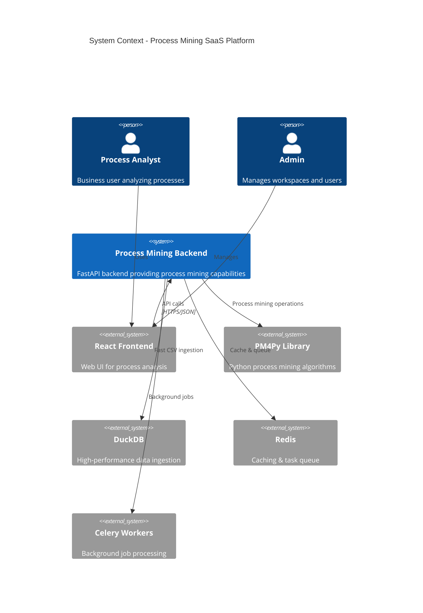
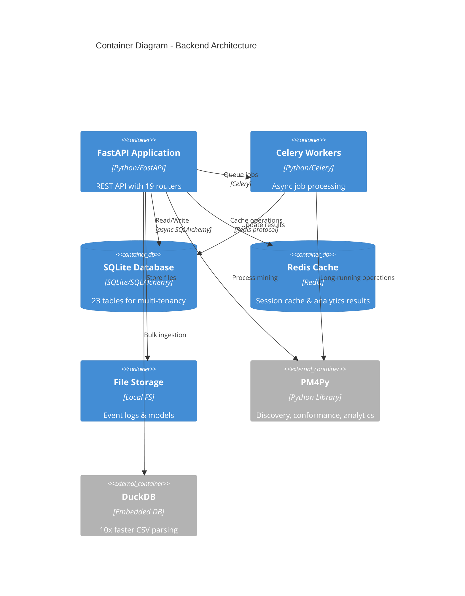
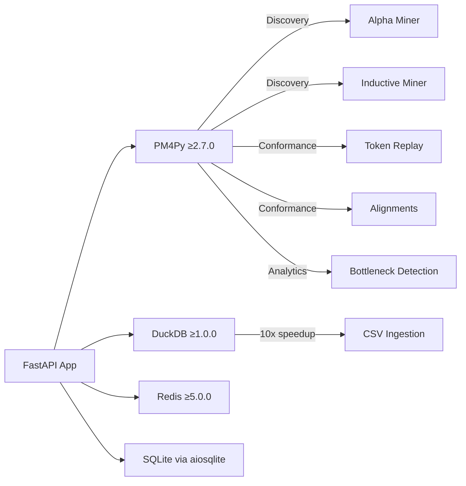
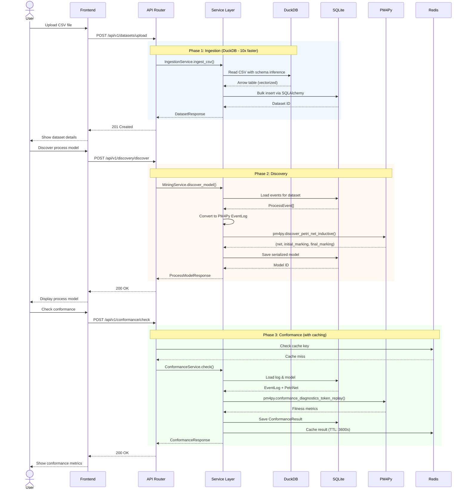
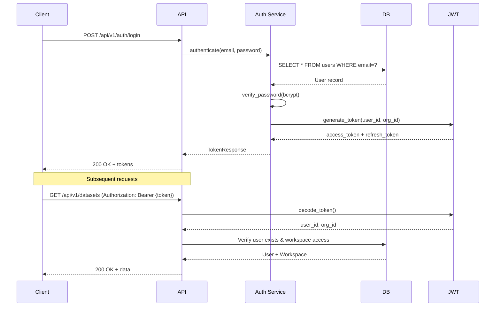
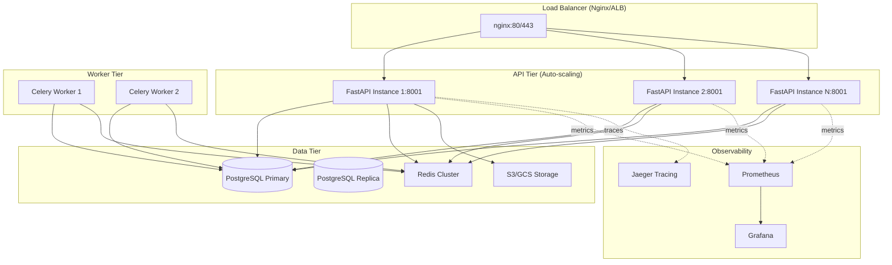

# System Architecture

> **Last Updated:** 2026-01-02
> **Status:** Production-Ready

## Executive Summary

A **SaaS process mining backend** wrapping PM4Py with enterprise-grade infrastructure. Built on clean architecture principles with 19 API endpoints, 16 business services, and 23 database tables supporting multi-tenant workspaces.

**Core Capability:** Upload event logs → Discover process models → Analyze performance → Generate insights

---

## C4 Model Diagrams

### Level 1: System Context



### Level 2: Container Diagram



### Level 3: Component Diagram - Core Layers

```mermaid
graph TB
    subgraph API["🌐 API Layer (src/api)"]
        routers[19 FastAPI Routers]
        deps[Dependency Injection]
        middleware[Middleware Stack]
    end

    subgraph Service["⚙️ Service Layer (src/services)"]
        mining[Mining Service]
        conformance[Conformance Service]
        analytics[Analytics Service]
        filtering[Filtering Service]
        org[Organizational Service]
        ingestion[Ingestion Service]
        ocpm[OCPM Service]
        prediction[Prediction Service]
        simulation[Simulation Service]
        workflow[Workflow Service]
        storage_svc[Storage Service]
        llm[LLM Service]
        privacy[Privacy Service]
        recommend[Recommendation Service]
    end

    subgraph Domain["🏛️ Domain Layer (src/domain)"]
        entities[Domain Entities]
        repos_iface[Repository Interfaces]
        value_obj[Value Objects]
        events[Domain Events]
    end

    subgraph Infrastructure["🔧 Infrastructure (src/infrastructure)"]
        cache_infra[Redis Cache]
        metrics[Prometheus Metrics]
        tracing[OpenTelemetry Tracing]
        circuit[Circuit Breaker]
        retry[Retry Logic]
        rate_limit[Rate Limiter]
        tasks[Celery Tasks]
    end

    subgraph Data["💾 Data Layer (src/models)"]
        orm[23 SQLAlchemy Models]
        schemas[Pydantic Schemas]
        repos_impl[Repository Implementations]
        db[Database Sessions]
    end

    subgraph External["📦 External Dependencies"]
        pm4py_ext[PM4Py Library]
        duckdb_ext[DuckDB Engine]
        redis_ext[Redis Server]
    end

    routers --> mining
    routers --> conformance
    routers --> analytics
    routers --> ingestion

    mining --> entities
    conformance --> entities
    analytics --> entities

    mining --> pm4py_ext
    conformance --> pm4py_ext
    ingestion --> duckdb_ext

    mining --> cache_infra
    analytics --> cache_infra
    cache_infra --> redis_ext

    entities --> repos_iface
    repos_impl -.implements.-> repos_iface
    repos_impl --> orm
    orm --> db

    mining --> circuit
    mining --> metrics
```



---

## Architecture Overview

### Clean Architecture Layers

| Layer | Location | Responsibility | Dependencies |
|-------|----------|---------------|--------------|
| **Presentation** | `src/api/` | HTTP routing, DTOs, validation | Services only |
| **Application** | `src/services/` | Business logic, orchestration | Domain + Infrastructure |
| **Domain** | `src/domain/` | Pure business rules, entities | None (isolated) |
| **Infrastructure** | `src/infrastructure/` | External services, observability | All layers |
| **Data** | `src/models/` | ORM, schemas, repositories | Domain interfaces |

### Dependency Rule

> **Inner layers NEVER depend on outer layers**

```
Domain (core) ← Services ← API
    ↑               ↑
    └─── Infrastructure & Data ────┘
```

---

## System Entry Points

### 1. Main API Server
- **File:** `src/api/main.py:app`
- **Port:** 8001
- **Protocol:** HTTP/1.1 (ASGI via Uvicorn)
- **Startup Sequence:**
  1. Load configuration from `.env`
  2. Configure structlog (JSON/console)
  3. Initialize async database pool
  4. Setup observability (OpenTelemetry, Prometheus)
  5. Register 19 routers with `/api/v1` prefix
  6. Add middleware (CORS, logging, performance tracking)
  7. Register RFC 7807 exception handlers
  8. Health endpoint becomes ready

### 2. Celery Workers (Future)
- **File:** `src/infrastructure/tasks.py`
- **Broker:** Redis
- **Queue Names:** `celery`, `priority`, `analytics`
- **Tasks:** Long-running PM4Py operations, batch processing

### 3. Scheduled Jobs (Future)
- Workflow automation via `WorkflowRun` table
- Cron-style execution

---

## External Dependencies

### Critical Path Dependencies



### Dependency Matrix

| Category | Library | Version | Purpose | Critical? |
|----------|---------|---------|---------|-----------|
| **Process Mining** | PM4Py | ≥2.7.0 | Core algorithms | ✅ Yes |
| | NetworkX | ≥3.2 | Social network analysis | ✅ Yes |
| **Web Framework** | FastAPI | ≥0.109.0 | API framework | ✅ Yes |
| | Uvicorn | ≥0.27.0 | ASGI server | ✅ Yes |
| | Pydantic | ≥2.5.0 | Data validation | ✅ Yes |
| **Database** | SQLAlchemy | ≥2.0.0 | Async ORM | ✅ Yes |
| | aiosqlite | ≥0.19.0 | SQLite driver | ✅ Yes |
| | Alembic | latest | Migrations | ✅ Yes |
| **Performance** | DuckDB | ≥1.0.0 | Fast CSV parsing | ⚠️ High |
| | PyArrow | ≥15.0.0 | Columnar data | ⚠️ High |
| **Infrastructure** | Redis | ≥5.0.0 | Cache & queue | ⚠️ High |
| | Celery | ≥5.3.0 | Task queue | ⚠️ Medium |
| **Observability** | structlog | ≥24.1.0 | Structured logging | ⚠️ High |
| | prometheus-client | ≥0.19.0 | Metrics | ❌ Optional |
| | OpenTelemetry | ≥1.22.0 | Tracing | ❌ Optional |
| **ML** | scikit-learn | ≥1.4.0 | Predictions | ❌ Optional |
| | XGBoost | ≥2.0.0 | Gradient boosting | ❌ Optional |
| **Auth** | PyJWT | ≥2.8.0 | JWT tokens | ⚠️ Medium |
| | passlib | ≥1.7.4 | Password hashing | ⚠️ Medium |

---

## Data Flow: Event Log Upload to Analysis



---

## Key Architectural Decisions

### Decision Log

| Decision | Rationale | Alternatives Considered | Date | Impact |
|----------|-----------|------------------------|------|--------|
| **DuckDB for CSV ingestion** | 10x faster than pandas, columnar processing, Arrow integration | Pandas, Polars, raw Python CSV | 2024-12 | High - Critical for large files |
| **PM4Py as core engine** | Industry-standard library, comprehensive algorithms, active development | ProM (Java), Apromore | 2024-11 | High - Entire domain locked to PM4Py |
| **Async SQLAlchemy 2.0** | Non-blocking I/O, better concurrency, modern ORM | Sync SQLAlchemy, raw SQL, Tortoise ORM | 2024-11 | Medium - Better scalability |
| **SQLite for initial DB** | Zero-config, file-based, good for MVP | PostgreSQL, MySQL | 2024-11 | Low - Easy to migrate |
| **Multi-tenant via Org/Workspace/Project** | SaaS-ready, clear hierarchy, isolation | Single-tenant, Workspace-only | 2024-12 | High - Affects all data models |
| **FastAPI over Django/Flask** | Modern async support, auto OpenAPI, type safety | Django REST, Flask | 2024-11 | Medium - Better DX |
| **Structlog for logging** | Structured JSON logs, context binding, production-ready | Standard logging, Loguru | 2024-12 | Low - Better observability |
| **Circuit breaker for PM4Py** | PM4Py can hang on complex logs, prevents cascade failures | Retry only, timeouts | 2024-12 | Medium - Reliability |
| **Domain-driven design** | Clean separation, testable, maintainable | Flat structure, MVC | 2024-11 | High - Architectural foundation |
| **RFC 7807 error format** | Standardized error responses, machine-readable | Custom JSON errors | 2024-12 | Low - Better API consistency |

---

## Performance Characteristics

### Throughput Targets

| Operation | Target | Current | Bottleneck |
|-----------|--------|---------|------------|
| CSV upload (10K events) | <2s | ~0.5s | DuckDB I/O |
| CSV upload (100K events) | <10s | ~3s | DuckDB I/O |
| Process discovery (10K events) | <5s | ~2s | PM4Py Inductive Miner |
| Process discovery (100K events) | <30s | ~15s | PM4Py Inductive Miner |
| Conformance check (10K events) | <10s | ~5s | PM4Py Token Replay |
| Variant analysis (10K events) | <1s | ~0.3s | SQLAlchemy query |
| DFG generation | <2s | ~1s | PM4Py DFG discovery |

### Scalability Limits (Current Architecture)

> [!WARNING]
> **SQLite limitations**
> - Max concurrent writes: ~1
> - Max DB size: 281 TB (theoretical), ~100 GB (practical)
> - Max rows per table: 2^64
> - **Recommendation:** Migrate to PostgreSQL for >10 concurrent users

> [!WARNING]
> **PM4Py memory usage**
> - Event logs loaded entirely in memory
> - ~1 GB RAM per 1M events
> - **Mitigation:** Circuit breaker at 500K events, background Celery jobs

### Optimization Strategies

1. **DuckDB Ingestion:** 10x speedup over pandas for CSV parsing
2. **Redis Caching:** TTL-based caching for expensive analytics (bottlenecks, conformance)
3. **Lazy Loading:** PM4Py logs only loaded when needed, cached in domain aggregates
4. **Arrow Format:** Zero-copy data interchange between DuckDB ↔ SQLAlchemy
5. **Circuit Breaker:** Fail fast on PM4Py operations >60s
6. **Connection Pooling:** SQLAlchemy async pool (size: 20, overflow: 10)

---

## Security Architecture

### Authentication Flow



### Authorization Model

**Role-Based Access Control (RBAC):**

| Role | Organization | Workspace | Project | Dataset |
|------|--------------|-----------|---------|---------|
| **Org Admin** | All | All | All | All |
| **Workspace Owner** | Read | All in workspace | All | All |
| **Workspace Admin** | Read | Read + Invite | All | All |
| **Workspace Member** | - | Read | Read + Write | Read + Write |
| **Workspace Viewer** | - | Read | Read | Read |

**Security Headers:**
- `Authorization: Bearer <JWT>`
- `X-Request-ID: <UUID>` (correlation)
- `X-Idempotency-Key: <UUID>` (duplicate prevention)

---

## Observability

### Logging Strategy

**Structured Logging (structlog):**

```python
logger.info(
    "process_model_discovered",
    dataset_id=dataset_id,
    miner_type="inductive",
    num_events=10523,
    duration_ms=1234,
    fitness=0.95
)
```

**Output Formats:**
- **Development:** Colored console with key-value pairs
- **Production:** JSON with ISO timestamps, correlation IDs

**Log Levels:**
- `DEBUG`: Internal state, SQL queries
- `INFO`: Business events (upload, discovery, conformance)
- `WARNING`: Degraded performance, retries
- `ERROR`: Operation failures, exceptions
- `CRITICAL`: System failures

### Metrics (Prometheus)

**Available Metrics:**
- `http_requests_total{method, endpoint, status}` - Request count
- `http_request_duration_seconds{method, endpoint}` - Latency histogram
- `pm4py_operations_total{operation_type, status}` - PM4Py calls
- `pm4py_operation_duration_seconds{operation_type}` - PM4Py latency
- `cache_hits_total{cache_type}` - Cache efficiency
- `db_connections_active` - Connection pool usage

**Endpoint:** `GET /metrics` (Prometheus scrape target)

### Tracing (OpenTelemetry - Optional)

**Distributed Traces:**
- Request ID propagation across services
- Span annotations for PM4Py operations
- Integration with Jaeger/Zipkin

---

## High Availability Considerations

### Current Limitations (MVP Architecture)

> [!IMPORTANT]
> **Not production-ready for HA**
> - SQLite = single-node only
> - No horizontal scaling
> - No leader election
> - Local file storage (not replicated)

### Migration Path to Production HA

1. **Database:** SQLite → PostgreSQL with read replicas
2. **File Storage:** Local FS → S3/GCS with CDN
3. **Cache:** Single Redis → Redis Cluster/Sentinel
4. **API:** Single Uvicorn → Multi-process Gunicorn + Nginx
5. **Workers:** Celery with multiple workers + auto-scaling
6. **State:** In-memory → Redis for distributed locks

---

## Disaster Recovery

### Backup Strategy (Current)

**SQLite Database:**
- Location: `./data/db/process_mining.db`
- Backup: Manual file copy or `sqlite3 .backup` command
- Frequency: Not automated (manual only)

**Uploaded Files:**
- Location: `./data/uploads/`
- Backup: File system backup
- Frequency: Not automated

**Process Models:**
- Location: `./data/models/`
- Serialization: Python pickle (binary)
- Backup: Included in file system backup

> [!WARNING]
> **No automated backups in current architecture**
> - Recommendation: Daily cron job to S3/GCS
> - Retention: 30 days incremental, 1 year monthly
> - RTO target: <4 hours
> - RPO target: <24 hours

---

## Deployment Architecture (Recommended)



---

## Next Steps

1. **Read Layer Documentation:**
   - [Technology Stack](./tech-stack.md) - Detailed dependency analysis
   - [Getting Started](./getting-started.md) - Developer onboarding guide

2. **Explore Features:**
   - [Feature Documentation](../01-features/README.md) - 19 API features detailed

3. **Understand Layers:**
   - [Layer Architecture](../02-layers/README.md) - Deep dive into each layer

4. **Cross-Cutting Concerns:**
   - [Authentication & Authorization](../03-cross-cutting/auth.md)
   - [Error Handling](../03-cross-cutting/error-handling.md)
   - [Logging & Observability](../03-cross-cutting/logging.md)
