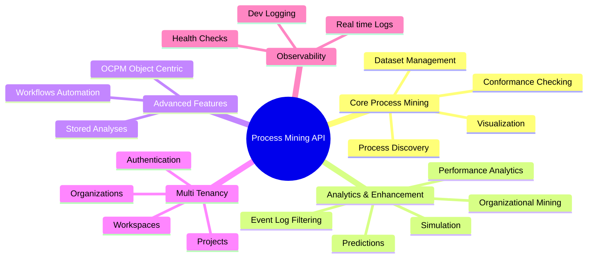
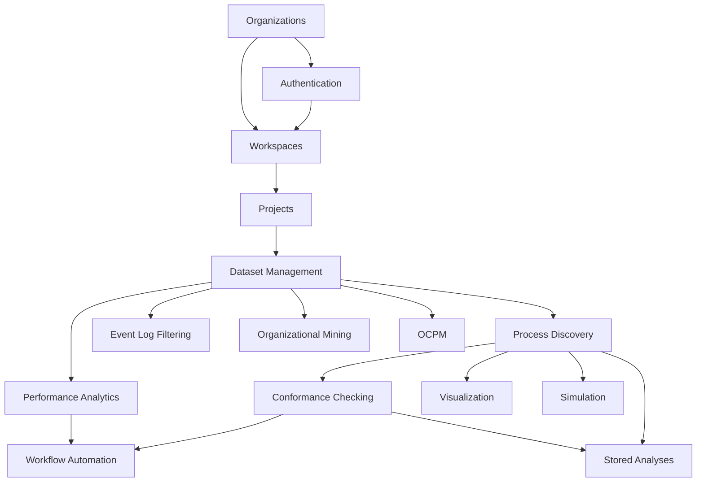
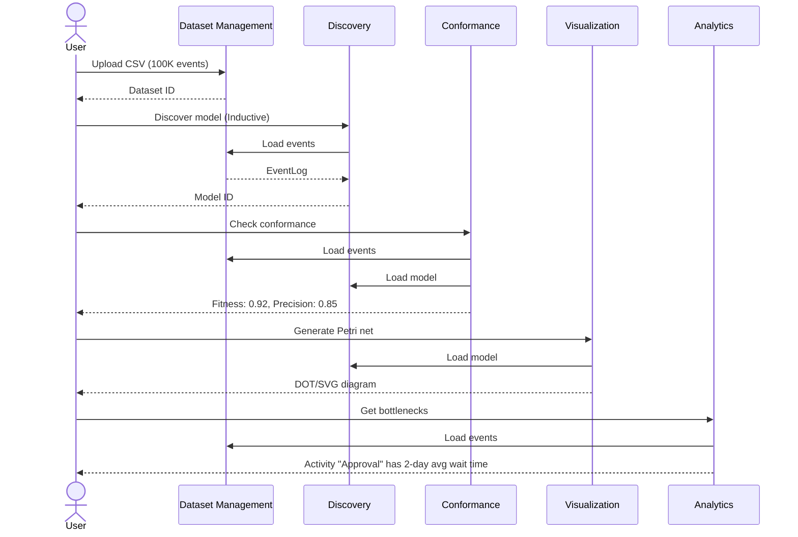

# Feature Documentation Index

This directory contains detailed documentation for all 19 API features, organized by domain.

---

## Feature Map



---

## Core Process Mining Features

### 1. Dataset Management
**Path:** [core-process-mining/datasets.md](./core-process-mining/datasets.md)

Upload and manage event logs (CSV, XES, OCEL). Modern replacement for legacy `/processes` endpoint.

**Key Endpoints:**
- `POST /api/v1/datasets/upload` - Upload event logs
- `GET /api/v1/datasets` - List datasets with pagination
- `GET /api/v1/datasets/{id}/statistics` - Get dataset stats

**Use Cases:**
- Upload 100K+ event CSV in <3s using DuckDB
- Detect columns automatically
- Track upload progress

### 2. Process Discovery
**Path:** [core-process-mining/discovery.md](./core-process-mining/discovery.md)

Discover process models from event logs using PM4Py algorithms.

**Key Endpoints:**
- `POST /api/v1/discovery/discover` - Discover model (Alpha, Inductive, Heuristics, ILP)
- `GET /api/v1/discovery/models` - List discovered models
- `GET /api/v1/discovery/miners` - List available algorithms

**Algorithms:**
- **Alpha Miner:** Fast, simple models
- **Inductive Miner:** Sound models, handles noise
- **Heuristics Miner:** Tolerates noise, frequency-based
- **ILP Miner:** Optimal models (slow)

### 3. Conformance Checking
**Path:** [core-process-mining/conformance.md](./core-process-mining/conformance.md)

Check how well event logs match discovered models.

**Key Endpoints:**
- `POST /api/v1/conformance/check` - Check conformance
- `GET /api/v1/conformance/quality/{log_id}/{model_id}` - Full quality metrics

**Metrics:**
- **Fitness:** How many traces can be replayed?
- **Precision:** Does the model allow too much?
- **Generalization:** Can it handle unseen cases?
- **Simplicity:** How complex is the model?

### 4. Visualization
**Path:** [core-process-mining/visualization.md](./core-process-mining/visualization.md)

Generate visual representations of processes and models.

**Key Endpoints:**
- `GET /api/v1/visualization/dfg/{log_id}` - Directly-Follows Graph
- `GET /api/v1/visualization/petri-net/{model_id}` - Petri net visualization
- `GET /api/v1/visualization/process-tree/{model_id}` - Process tree
- `GET /api/v1/visualization/bpmn/{model_id}` - BPMN diagram

**Output Formats:**
- DOT (Graphviz)
- SVG
- PNG (via Graphviz)
- BPMN XML

---

## Analytics & Enhancement Features

### 5. Performance Analytics
**Path:** [analytics/performance-analytics.md](./analytics/performance-analytics.md)

Analyze process performance: bottlenecks, rework, cycle time, throughput.

**Key Endpoints:**
- `GET /api/v1/analytics/logs/{log_id}/bottlenecks` - Detect bottlenecks
- `GET /api/v1/analytics/logs/{log_id}/rework` - Analyze rework
- `GET /api/v1/analytics/logs/{log_id}/performance` - Comprehensive dashboard

**Metrics:**
- Waiting time per activity
- Service time distribution
- Case duration (p50, p95, p99)
- Throughput over time

### 6. Event Log Filtering
**Path:** [analytics/filtering.md](./analytics/filtering.md)

Filter event logs by time, variants, activities, or attributes.

**Key Endpoints:**
- `POST /api/v1/filtering/filter` - Apply generic filter
- `POST /api/v1/filtering/time-range` - Filter by date range
- `POST /api/v1/filtering/variants` - Keep top N variants

**Filter Types:**
- Time range
- Top/bottom N variants
- Activity inclusion/exclusion
- Case attribute conditions
- Resource filters

### 7. Organizational Mining
**Path:** [analytics/organizational.md](./analytics/organizational.md)

Analyze social networks and resource interactions.

**Key Endpoints:**
- `GET /api/v1/organizational/{log_id}/handover-of-work` - Handover network
- `GET /api/v1/organizational/{log_id}/working-together` - Collaboration network
- `GET /api/v1/organizational/{log_id}/resource-profiles` - Resource analysis

**Networks:**
- Handover of work (activity transfers)
- Working together (co-occurrence)
- Subcontracting (delegation)

### 8. Predictions
**Path:** [analytics/predictions.md](./analytics/predictions.md)

ML-based predictions for next activity, remaining time, and outcomes.

**Key Endpoints:**
- `POST /api/v1/predictions/train` - Train prediction model
- `POST /api/v1/predictions/predict` - Make predictions

**Prediction Types:**
- Next activity (classification)
- Remaining time (regression)
- Case outcome (classification)

### 9. Simulation
**Path:** [analytics/simulation.md](./analytics/simulation.md)

Simulate process execution for what-if analysis.

**Key Endpoints:**
- `POST /api/v1/simulation/simulate` - Run simulation
- `POST /api/v1/simulation/what-if` - What-if scenarios

**Scenarios:**
- Resource allocation changes
- Activity duration modifications
- Process model changes

---

## Advanced Features

### 10. Object-Centric Process Mining (OCPM)
**Path:** [advanced/ocpm.md](./advanced/ocpm.md)

OCEL 2.0 support for multi-object processes.

**Key Endpoints:**
- `POST /api/v1/ocpm/upload` - Upload OCEL file
- `POST /api/v1/ocpm/discover` - Discover OC-Petri net
- `GET /api/v1/ocpm/dfg/{log_id}` - Object-centric DFG

**Use Cases:**
- Order-to-cash (orders, items, deliveries)
- Manufacturing (products, machines, operators)
- Healthcare (patients, tests, treatments)

### 11. Workflow Automation
**Path:** [advanced/workflows.md](./advanced/workflows.md)

Automate multi-step process mining pipelines.

**Key Endpoints:**
- `POST /api/v1/workflows` - Create workflow
- `POST /api/v1/workflows/{id}/run` - Execute workflow

**Workflow Steps:**
- Upload → Discover → Check conformance → Generate report
- Scheduled execution (cron-style)
- Error handling & retries

### 12. Stored Analyses
**Path:** [advanced/analyses.md](./advanced/analyses.md)

Save and retrieve analysis configurations.

**Key Endpoints:**
- `POST /api/v1/analyses` - Create analysis
- `GET /api/v1/analyses` - List analyses

**Analysis Types:**
- Discovery configurations
- Conformance checks
- Analytics dashboards

---

## Multi-Tenancy Features

### 13. Organizations
**Path:** [multi-tenancy/organizations.md](./multi-tenancy/organizations.md)

Root-level tenant isolation.

**Hierarchy:**
```
Organization (root)
  └─ Workspace (work context)
      └─ Project (dataset container)
          └─ Dataset (event log)
```

### 14. Workspaces
**Path:** [multi-tenancy/workspaces.md](./multi-tenancy/workspaces.md)

Isolated work environments within an organization.

**Key Endpoints:**
- `POST /api/v1/workspaces` - Create workspace
- `POST /api/v1/workspaces/{id}/members` - Add member

**Roles:**
- Owner (all permissions)
- Admin (manage members)
- Member (read/write)
- Viewer (read-only)

### 15. Projects
**Path:** [multi-tenancy/projects.md](./multi-tenancy/projects.md)

Organize datasets into projects.

**Key Endpoints:**
- `POST /api/v1/projects` - Create project
- `GET /api/v1/projects` - List projects

**Features:**
- Tagging (JSON array)
- Statistics tracking
- Dataset grouping

### 16. Authentication
**Path:** [multi-tenancy/authentication.md](./multi-tenancy/authentication.md)

JWT-based authentication with RBAC.

**Key Endpoints:**
- `POST /api/v1/auth/login` - User login
- `POST /api/v1/auth/register` - User registration
- `POST /api/v1/auth/refresh` - Refresh token

**Token Structure:**
```json
{
  "sub": "user_id",
  "org_id": "org_uuid",
  "email": "user@example.com",
  "role": "workspace_member",
  "exp": 1704153600
}
```

---

## Observability Features

### 17. Health Checks
**Path:** [observability/health.md](./observability/health.md)

System health monitoring for Kubernetes/load balancers.

**Key Endpoints:**
- `GET /health` - Basic health check
- `GET /health/live` - Liveness probe
- `GET /health/ready` - Readiness probe
- `GET /health/detailed` - Component health

**Checks:**
- Database connectivity
- Redis availability
- Disk space
- Memory usage

### 18. Development Logging
**Path:** [observability/dev-logging.md](./observability/dev-logging.md)

Collect and display backend logs in frontend DevConsole.

**Key Endpoints:**
- `GET /api/v1/dev/logs` - Get recent logs

**Log Levels:**
- DEBUG, INFO, WARNING, ERROR, CRITICAL

### 19. Real-time Log Streaming
**Path:** [observability/log-streaming.md](./observability/log-streaming.md)

Server-Sent Events (SSE) for live log streaming.

**Key Endpoints:**
- `GET /api/v1/dev/logs/stream` - SSE endpoint

**Use Case:**
- Frontend DevConsole real-time updates
- Live debugging during development

---

## Feature Comparison Matrix

| Feature | Priority | Complexity | PM4Py Dependency | Caching | Background Jobs |
|---------|----------|------------|------------------|---------|-----------------|
| Dataset Management | 🔴 Critical | Medium | ❌ No | ✅ Stats | ⚠️ Large uploads |
| Process Discovery | 🔴 Critical | High | ✅ Yes | ✅ Models | ✅ Complex logs |
| Conformance Checking | 🔴 Critical | High | ✅ Yes | ✅ Results | ✅ Alignments |
| Visualization | 🟡 High | Medium | ✅ Yes | ✅ Graphs | ❌ No |
| Performance Analytics | 🟡 High | Medium | ✅ Yes | ✅ Metrics | ❌ No |
| Filtering | 🟡 High | Low | ✅ Yes | ❌ No | ❌ No |
| Organizational Mining | 🟢 Medium | Medium | ✅ Yes | ✅ Networks | ❌ No |
| Predictions | 🟢 Medium | High | ⚠️ Partial | ✅ Models | ✅ Training |
| Simulation | 🟢 Medium | High | ✅ Yes | ❌ No | ✅ Long runs |
| OCPM | 🟢 Medium | Very High | ✅ Yes | ✅ Models | ✅ Discovery |
| Workflows | ⚪ Low | Medium | ❌ No | ❌ No | ✅ Execution |
| Stored Analyses | ⚪ Low | Low | ❌ No | ❌ No | ❌ No |
| Organizations | 🔴 Critical | Low | ❌ No | ❌ No | ❌ No |
| Workspaces | 🔴 Critical | Medium | ❌ No | ❌ No | ❌ No |
| Projects | 🟡 High | Low | ❌ No | ❌ No | ❌ No |
| Authentication | 🔴 Critical | Medium | ❌ No | ✅ Sessions | ❌ No |
| Health Checks | 🟡 High | Low | ❌ No | ❌ No | ❌ No |
| Dev Logging | ⚪ Low | Low | ❌ No | ❌ No | ❌ No |
| Log Streaming | ⚪ Low | Medium | ❌ No | ❌ No | ❌ No |

**Legend:**
- 🔴 Critical - System cannot function without it
- 🟡 High - Major feature, important for users
- 🟢 Medium - Nice to have, adds value
- ⚪ Low - Development/admin feature

---

## Feature Dependencies



---

## Quick Reference: "I want to..."

| Goal | Feature | Endpoint |
|------|---------|----------|
| Upload a CSV event log | Dataset Management | `POST /api/v1/datasets/upload` |
| Discover a process model | Process Discovery | `POST /api/v1/discovery/discover` |
| Check if log matches model | Conformance Checking | `POST /api/v1/conformance/check` |
| Find process bottlenecks | Performance Analytics | `GET /api/v1/analytics/logs/{id}/bottlenecks` |
| Filter log to top 10 variants | Event Log Filtering | `POST /api/v1/filtering/variants` |
| See who works with whom | Organizational Mining | `GET /api/v1/organizational/{id}/working-together` |
| Predict next activity | Predictions | `POST /api/v1/predictions/train` → `predict` |
| Simulate process changes | Simulation | `POST /api/v1/simulation/what-if` |
| Analyze multi-object processes | OCPM | `POST /api/v1/ocpm/upload` → `discover` |
| Automate analysis pipeline | Workflow Automation | `POST /api/v1/workflows` → `run` |
| Create isolated workspace | Workspaces | `POST /api/v1/workspaces` |
| Monitor system health | Health Checks | `GET /health/detailed` |

---

## Data Flow: Typical Analysis Session



---

## Performance Targets by Feature

| Feature | 10K Events | 100K Events | 1M Events |
|---------|------------|-------------|-----------|
| **Dataset Upload** | <0.5s | <3s | <30s |
| **Discovery (Inductive)** | <2s | <15s | <2min |
| **Conformance (Token Replay)** | <1s | <5s | <30s |
| **Conformance (Alignments)** | <5s | <30s | <5min |
| **DFG Generation** | <0.5s | <1s | <3s |
| **Bottleneck Detection** | <0.3s | <1s | <5s |
| **Variant Analysis** | <0.2s | <0.5s | <2s |
| **Filtering** | <0.3s | <1s | <5s |

> [!WARNING]
> **PM4Py Memory Limits**
> - 1M events ≈ 1 GB RAM
> - Circuit breaker triggers at 500K events
> - Recommendation: Use background jobs (Celery) for large logs

---

## Next Steps

1. **Deep Dive into Features:**
   - Start with [Dataset Management](./core-process-mining/datasets.md)
   - Then [Process Discovery](./core-process-mining/discovery.md)
   - Finally [Conformance Checking](./core-process-mining/conformance.md)

2. **Understand Architecture:**
   - [Architecture Overview](../00-overview/architecture.md)
   - [Layer Documentation](../02-layers/README.md)

3. **Integration Examples:**
   - See `tests/integration_test.py` for end-to-end examples
   - Check Swagger UI at `/docs` for interactive testing

4. **Build Custom Features:**
   - Read [Development Guide](../03-cross-cutting/development-guide.md)
   - Follow [Testing Guide](../03-cross-cutting/testing.md)
