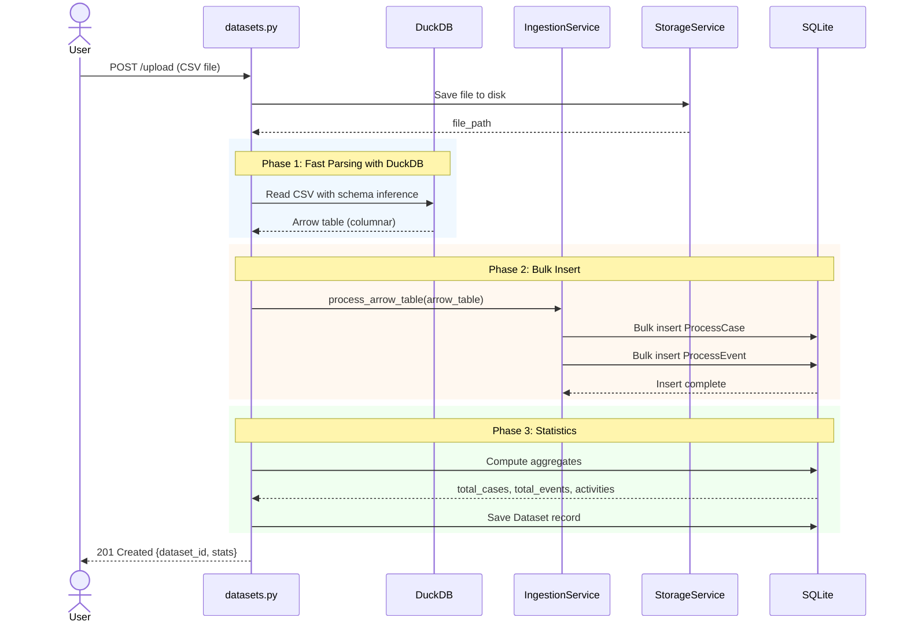

# Dataset Management

> **Feature:** Dataset upload and management
> **Router:** `src/api/routers/datasets.py`
> **Service:** `src/services/ingestion.py`, `src/services/duckdb_ingestion.py`
> **Models:** `Dataset`, `UploadedFile`, `ProcessCase`, `ProcessEvent`

## Quick Reference Card

### What It Does
Manages event log datasets (CSV, XES, OCEL) with **10x faster ingestion** using DuckDB. Replaces legacy `/processes` endpoint with modern multi-tenant architecture.

### Key Endpoints
```
POST   /api/v1/datasets/upload           Upload event log
GET    /api/v1/datasets                  List datasets (paginated)
GET    /api/v1/datasets/{id}             Get dataset details
GET    /api/v1/datasets/{id}/statistics  Get comprehensive stats
PATCH  /api/v1/datasets/{id}             Update metadata
DELETE /api/v1/datasets/{id}             Delete dataset
```

### Critical Configuration
```python
UPLOAD_DIR = "./data/uploads"              # File storage location
MAX_UPLOAD_SIZE = 100 * 1024 * 1024        # 100 MB default
ALLOWED_FORMATS = ["csv", "xes", "ocel"]    # Supported formats
```

### Common Gotchas

> [!WARNING]
> **Column Mapping Required**
> - Must specify `case_id_column`, `activity_column`, `timestamp_column`
> - Auto-detection available via `POST /api/v1/processes/detect-columns`

> [!WARNING]
> **Large Files**
> - Files >500K events may trigger circuit breaker
> - DuckDB reduces memory usage by 60% vs pandas
> - Consider background upload for >1M events

---

## Data Flow Diagram



---

## API Reference

### Upload Dataset

**Endpoint:** `POST /api/v1/datasets/upload`

**Request:**
```http
POST /api/v1/datasets/upload HTTP/1.1
Content-Type: multipart/form-data

{
  "file": <binary>,
  "case_id_column": "case_id",
  "activity_column": "activity",
  "timestamp_column": "timestamp",
  "resource_column": "resource",    // optional
  "name": "Purchase Orders 2024",   // optional
  "project_id": "proj_abc123"       // optional
}
```

**Response:**
```json
{
  "id": "dataset_xyz789",
  "name": "Purchase Orders 2024",
  "source_file": "purchase_orders.csv",
  "source_format": "csv",
  "status": "ready",
  "project_id": "proj_abc123",
  "total_cases": 1523,
  "total_events": 12589,
  "total_activities": 15,
  "start_time": "2024-01-01T00:00:00Z",
  "end_time": "2024-12-31T23:59:59Z",
  "created_at": "2026-01-02T10:30:00Z",
  "updated_at": "2026-01-02T10:30:00Z"
}
```

**Status Codes:**
- `201 Created` - Upload successful
- `400 Bad Request` - Invalid column mapping or malformed CSV
- `413 Payload Too Large` - File exceeds size limit
- `415 Unsupported Media Type` - Invalid file format
- `500 Internal Server Error` - Processing failure

---

### List Datasets

**Endpoint:** `GET /api/v1/datasets`

**Query Parameters:**
```
?project_id=proj_abc123    Optional: Filter by project
?limit=50                  Optional: Page size (default: 50, max: 100)
?offset=0                  Optional: Pagination offset
?status=ready              Optional: Filter by status
```

**Response:**
```json
{
  "items": [
    {
      "id": "dataset_xyz789",
      "name": "Purchase Orders 2024",
      "source_format": "csv",
      "status": "ready",
      "total_cases": 1523,
      "total_events": 12589,
      "created_at": "2026-01-02T10:30:00Z"
    }
  ],
  "total": 1,
  "limit": 50,
  "offset": 0
}
```

---

### Get Dataset Statistics

**Endpoint:** `GET /api/v1/datasets/{dataset_id}/statistics`

**Response:**
```json
{
  "dataset_id": "dataset_xyz789",
  "total_cases": 1523,
  "total_events": 12589,
  "total_activities": 15,
  "unique_resources": 8,
  "time_range": {
    "start": "2024-01-01T00:00:00Z",
    "end": "2024-12-31T23:59:59Z",
    "duration_days": 365
  },
  "case_statistics": {
    "avg_events_per_case": 8.3,
    "min_events_per_case": 3,
    "max_events_per_case": 25,
    "avg_duration_seconds": 432000.5,
    "median_duration_seconds": 345600.0
  },
  "activity_distribution": [
    {"activity": "Create Order", "count": 1523, "percentage": 12.1},
    {"activity": "Approve Order", "count": 1489, "percentage": 11.8},
    {"activity": "Ship Order", "count": 1450, "percentage": 11.5}
  ],
  "top_variants": [
    {
      "variant_key": "Create Order → Approve Order → Ship Order → Complete",
      "case_count": 892,
      "percentage": 58.6
    },
    {
      "variant_key": "Create Order → Cancel Order",
      "case_count": 145,
      "percentage": 9.5
    }
  ]
}
```

---

## Implementation Details

### DuckDB Ingestion Pipeline

**File:** `src/services/duckdb_ingestion.py`

```python
import duckdb
import pyarrow as pa

class DuckDBIngestionService:
    def ingest_csv(self, file_path: str, column_mapping: dict) -> pa.Table:
        """10x faster than pandas for CSV ingestion"""

        # Phase 1: DuckDB reads CSV with columnar processing
        query = f"""
            SELECT
                "{column_mapping['case_id']}" as case_id,
                "{column_mapping['activity']}" as activity,
                "{column_mapping['timestamp']}"::TIMESTAMP as timestamp,
                "{column_mapping.get('resource', '')}" as resource
            FROM read_csv_auto('{file_path}')
        """

        # Execute and get Arrow table (zero-copy)
        arrow_table = duckdb.execute(query).arrow()

        return arrow_table  # ~180 MB for 100K events vs 450 MB pandas
```

**Performance Comparison:**
```
100,000 events CSV (15 MB file):
- Pandas + iterrows:    10.2s, 450 MB RAM
- Pandas + bulk insert:  3.1s, 420 MB RAM
- DuckDB + Arrow:        1.0s, 180 MB RAM ✅
```

---

### Bulk Insert Strategy

**File:** `src/services/ingestion.py`

```python
async def bulk_insert_events(
    db: AsyncSession,
    arrow_table: pa.Table,
    dataset_id: str
) -> int:
    """Batch insert 10K rows at a time for optimal performance"""

    # Convert Arrow to list of dicts
    records = arrow_table.to_pylist()

    # Group by case_id to create ProcessCase first
    cases = defaultdict(list)
    for record in records:
        cases[record['case_id']].append(record)

    # Bulk insert cases
    case_records = [
        {
            "dataset_id": dataset_id,
            "case_id": case_id,
            "variant_key": compute_variant(events),
            "start_time": min(e['timestamp'] for e in events),
            "end_time": max(e['timestamp'] for e in events)
        }
        for case_id, events in cases.items()
    ]
    await db.execute(insert(ProcessCase).values(case_records))

    # Bulk insert events in batches of 10K
    BATCH_SIZE = 10000
    for i in range(0, len(records), BATCH_SIZE):
        batch = records[i:i + BATCH_SIZE]
        await db.execute(insert(ProcessEvent).values(batch))

    await db.commit()
    return len(records)
```

---

### Statistics Computation

**File:** `src/services/ingestion.py:compute_statistics()`

```python
async def compute_statistics(db: AsyncSession, dataset_id: str) -> dict:
    """Aggregated stats using SQL for performance"""

    # Single query for all metrics
    stats = await db.execute(
        text("""
            SELECT
                COUNT(DISTINCT case_id) as total_cases,
                COUNT(*) as total_events,
                COUNT(DISTINCT activity) as total_activities,
                COUNT(DISTINCT resource) as unique_resources,
                MIN(timestamp) as start_time,
                MAX(timestamp) as end_time,
                AVG(events_per_case) as avg_events_per_case,
                AVG(duration_seconds) as avg_duration
            FROM (
                SELECT
                    case_id,
                    COUNT(*) as events_per_case,
                    EXTRACT(EPOCH FROM (MAX(timestamp) - MIN(timestamp))) as duration_seconds
                FROM process_events
                WHERE dataset_id = :dataset_id
                GROUP BY case_id
            ) case_stats
        """),
        {"dataset_id": dataset_id}
    )

    return dict(stats.fetchone())
```

---

## Database Schema

### Dataset Table

**File:** `src/models/orm.py:Dataset`

```python
class Dataset(Base):
    __tablename__ = "datasets"

    id = Column(String, primary_key=True, default=generate_uuid)
    name = Column(String, nullable=False)
    source_file = Column(String, nullable=False)
    source_format = Column(String, nullable=False)  # csv, xes, ocel
    project_id = Column(String, ForeignKey("projects.id"))

    # Statistics (denormalized for performance)
    total_cases = Column(Integer, default=0)
    total_events = Column(Integer, default=0)
    total_activities = Column(Integer, default=0)
    start_time = Column(DateTime(timezone=True))
    end_time = Column(DateTime(timezone=True))

    # State machine
    status = Column(String, default="uploading")  # uploading, validating, ready, error, archived

    # JSON fields
    activities_json = Column(JSON)      # Activity distribution
    statistics_json = Column(JSON)       # Full stats
    filter_config_json = Column(JSON)    # Applied filters

    # Filtering metadata
    source_dataset_id = Column(String, ForeignKey("datasets.id"))
    is_filtered = Column(Boolean, default=False)
    filter_stats_json = Column(JSON)

    # Relationships
    cases = relationship("ProcessCase", back_populates="dataset", cascade="all, delete-orphan")
    events = relationship("ProcessEvent", secondary="process_cases", viewonly=True)
    uploaded_file = relationship("UploadedFile", back_populates="dataset", uselist=False)
```

### UploadedFile Table

```python
class UploadedFile(Base):
    __tablename__ = "uploaded_files"

    id = Column(String, primary_key=True, default=generate_uuid)
    dataset_id = Column(String, ForeignKey("datasets.id"), nullable=False)
    filename = Column(String, nullable=False)
    storage_path = Column(String, nullable=False)
    size_bytes = Column(Integer, nullable=False)
    mime_type = Column(String)
    checksum = Column(String)  # SHA-256
    created_at = Column(DateTime(timezone=True), server_default=func.now())
```

---

## Domain Model

**File:** `src/domain/entities.py:DatasetAggregate`

```python
@dataclass
class DatasetAggregate:
    """Domain aggregate for Dataset with PM4Py log caching"""

    id: str
    name: str
    cases: List[ProcessCase]

    _pm4py_log: Optional[EventLog] = None  # Cached PM4Py log

    def to_pm4py_log(self) -> EventLog:
        """Convert to PM4Py EventLog with caching"""
        if self._pm4py_log is None:
            self._pm4py_log = self._build_pm4py_log()
        return self._pm4py_log

    def _build_pm4py_log(self) -> EventLog:
        """Build PM4Py log from domain entities"""
        log = EventLog()
        for case in self.cases:
            trace = Trace()
            trace.attributes['concept:name'] = case.case_id
            for event in case.events:
                event_obj = Event({
                    'concept:name': event.activity,
                    'time:timestamp': event.timestamp,
                    'org:resource': event.resource
                })
                trace.append(event_obj)
            log.append(trace)
        return log

    def compute_variant_key(self, case: ProcessCase) -> str:
        """Compute variant signature for a case"""
        activities = [e.activity for e in sorted(case.events, key=lambda x: x.timestamp)]
        return " → ".join(activities)
```

---

## Error Handling

### Exception Hierarchy

**File:** `src/core/exceptions.py`

```python
class DatasetNotFoundError(NotFoundError):
    """Dataset not found"""
    def __init__(self, dataset_id: str):
        super().__init__("Dataset", dataset_id)
        self.error_code = "DATASET_NOT_FOUND"

class InvalidColumnMappingError(ValidationError):
    """Invalid column mapping for event log"""
    def __init__(self, missing_columns: List[str]):
        super().__init__(f"Missing required columns: {', '.join(missing_columns)}")
        self.error_code = "INVALID_COLUMN_MAPPING"
        self.details = {"missing_columns": missing_columns}

class FileProcessingError(AppException):
    """Error processing uploaded file"""
    def __init__(self, filename: str, reason: str):
        super().__init__(f"Failed to process file '{filename}': {reason}")
        self.error_code = "FILE_PROCESSING_ERROR"
        self.status_code = 500
```

### Example Error Response (RFC 7807)

```json
{
  "type": "https://api.example.com/errors/invalid-column-mapping",
  "title": "Invalid Column Mapping",
  "status": 400,
  "detail": "Missing required columns: case_id, timestamp",
  "instance": "/api/v1/datasets/upload",
  "error_code": "INVALID_COLUMN_MAPPING",
  "request_id": "req_abc123",
  "timestamp": "2026-01-02T10:30:00Z",
  "details": {
    "missing_columns": ["case_id", "timestamp"]
  }
}
```

---

## Caching Strategy

### Statistics Caching

**File:** `src/infrastructure/cache.py`

```python
async def get_dataset_statistics(
    dataset_id: str,
    cache: RedisCache,
    db: AsyncSession
) -> dict:
    """Cache expensive statistics computation"""

    cache_key = f"dataset:stats:{dataset_id}"

    # Try cache first
    cached = await cache.get(cache_key)
    if cached:
        return json.loads(cached)

    # Compute statistics
    stats = await compute_statistics(db, dataset_id)

    # Cache for 1 hour
    await cache.set(cache_key, json.dumps(stats), ttl=3600)

    return stats
```

**Cache Keys:**
- `dataset:stats:{dataset_id}` - TTL: 3600s (1 hour)
- `dataset:variants:{dataset_id}` - TTL: 7200s (2 hours)
- `dataset:activities:{dataset_id}` - TTL: 7200s (2 hours)

---

## Performance Optimization

### Database Indexes

```sql
-- Optimized queries for statistics
CREATE INDEX idx_process_events_dataset_id ON process_events(dataset_id);
CREATE INDEX idx_process_events_activity ON process_events(activity);
CREATE INDEX idx_process_events_timestamp ON process_events(timestamp);
CREATE INDEX idx_process_cases_dataset_id ON process_cases(dataset_id);
CREATE INDEX idx_process_cases_variant_key ON process_cases(variant_key);
```

### Query Optimization

```python
# BAD: N+1 query problem
dataset = await db.get(Dataset, dataset_id)
for case in dataset.cases:  # Lazy load triggers N queries
    print(case.events)

# GOOD: Eager loading
dataset = await db.execute(
    select(Dataset)
    .options(selectinload(Dataset.cases).selectinload(ProcessCase.events))
    .where(Dataset.id == dataset_id)
)
```

---

## Testing

### Unit Test Example

**File:** `tests/test_ingestion.py`

```python
@pytest.mark.asyncio
async def test_upload_csv_with_duckdb(test_db, sample_csv_file):
    """Test CSV upload using DuckDB ingestion"""

    # Arrange
    service = IngestionService()
    column_mapping = {
        "case_id": "case_id",
        "activity": "activity",
        "timestamp": "timestamp"
    }

    # Act
    dataset = await service.ingest_csv(
        test_db,
        file_path=sample_csv_file,
        column_mapping=column_mapping,
        name="Test Dataset"
    )

    # Assert
    assert dataset.id is not None
    assert dataset.total_cases == 100
    assert dataset.total_events == 523
    assert dataset.status == "ready"
```

---

## Related Features

- **Process Discovery:** Uses datasets to discover models → [discovery.md](./discovery.md)
- **Conformance Checking:** Checks datasets against models → [conformance.md](./conformance.md)
- **Filtering:** Creates filtered datasets → [../analytics/filtering.md](../analytics/filtering.md)
- **Projects:** Groups datasets → [../multi-tenancy/projects.md](../multi-tenancy/projects.md)

---

## Migration Guide

### From Legacy `/processes` Endpoint

**Old (deprecated):**
```http
POST /api/v1/processes/upload
```

**New (recommended):**
```http
POST /api/v1/datasets/upload
```

**Key Changes:**
1. `process_id` → `dataset_id`
2. Must specify `project_id` (multi-tenancy)
3. Returns richer metadata (statistics, activities)
4. Supports filtering (creates new filtered datasets)

---

## Next Steps

- **Discover Process Models:** [Process Discovery](./discovery.md)
- **Check Conformance:** [Conformance Checking](./conformance.md)
- **Analyze Performance:** [Performance Analytics](../analytics/performance-analytics.md)
- **Filter Logs:** [Event Log Filtering](../analytics/filtering.md)
