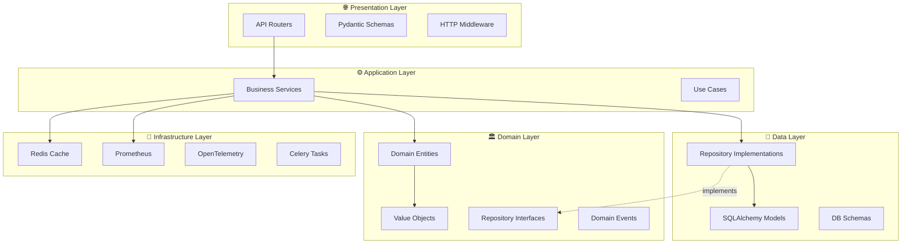
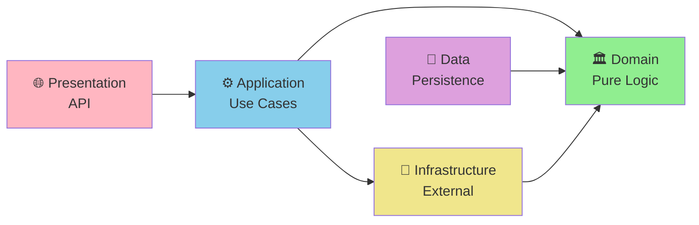
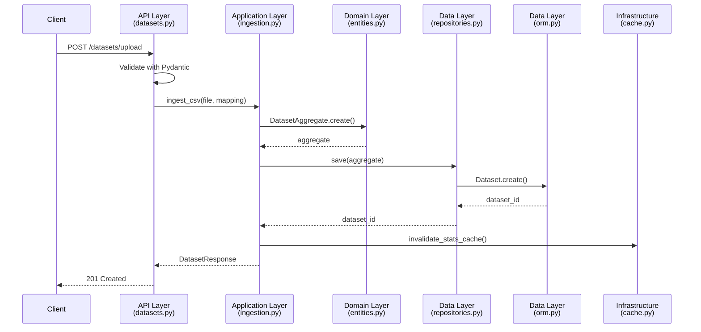
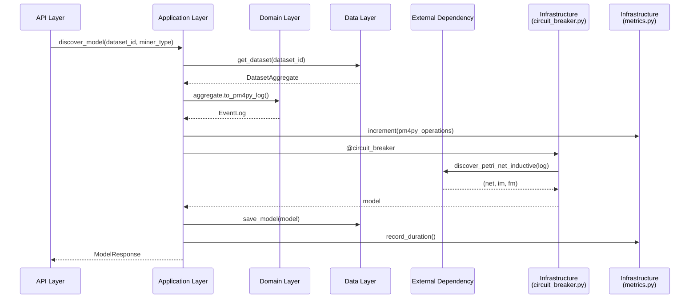

# Architectural Layers Documentation

> **Architecture Pattern:** Clean Architecture (Hexagonal/Ports & Adapters)
> **Dependency Rule:** Inner layers NEVER depend on outer layers

---

## Layer Overview



---

## Layer Hierarchy

| Layer | Location | Responsibility | Can Import From | Cannot Import |
|-------|----------|---------------|----------------|---------------|
| **Domain** | `src/domain/` | Pure business logic | Nothing (isolated) | Any other layer |
| **Application** | `src/services/` | Orchestration, use cases | Domain, Infrastructure | API, Data |
| **Presentation** | `src/api/` | HTTP routing, validation | Application | Domain (direct), Data |
| **Data** | `src/models/` | Persistence | Domain (interfaces) | Application, API |
| **Infrastructure** | `src/infrastructure/` | External services | All layers | None (cross-cutting) |
| **Core** | `src/core/` | Config, exceptions | Nothing | Any layer (cross-cutting) |

---

## Layer Documentation

### 1. [API Layer](./api-layer.md)
**Location:** `src/api/`

- 19 FastAPI routers
- Pydantic request/response schemas
- Dependency injection
- HTTP middleware
- Exception handling

**Key Files:**
- `main.py` - FastAPI app factory
- `dependencies.py` - Dependency injection
- `routers/*.py` - 19 endpoint groups

### 2. [Service Layer](./service-layer.md)
**Location:** `src/services/`

- 16 business services
- PM4Py wrappers
- Orchestration logic
- Use case implementations

**Key Services:**
- `mining.py` - Process discovery
- `conformance.py` - Conformance checking
- `analytics.py` - Performance analytics
- `ingestion.py` - Event log upload
- `duckdb_ingestion.py` - High-performance CSV parsing

### 3. [Domain Layer](./domain-layer.md)
**Location:** `src/domain/`

- Domain entities (DDD)
- Value objects
- Repository interfaces
- Domain events
- **Pure Python - no external dependencies**

**Key Components:**
- `entities.py` - `DatasetAggregate`, `ProcessCase`, `ProcessEvent`
- `value_objects.py` - `CaseId`, `ActivitySequence`, `TimeRange`
- `repositories.py` - Repository interfaces

### 4. [Data Layer](./data-layer.md)
**Location:** `src/models/`

- 23 SQLAlchemy tables
- Pydantic schemas (1276 lines)
- Repository implementations
- Database session management
- Alembic migrations

**Key Files:**
- `orm.py` - SQLAlchemy models (717 lines)
- `schemas.py` - Pydantic DTOs (1276 lines)
- `repositories.py` - Repository implementations
- `database.py` - Session management

### 5. [Infrastructure Layer](./infrastructure-layer.md)
**Location:** `src/infrastructure/`

- Redis caching
- Prometheus metrics
- OpenTelemetry tracing
- Circuit breaker
- Retry logic
- Rate limiting
- Celery tasks

**Key Files:**
- `cache.py` - Redis caching
- `metrics.py` - Prometheus metrics
- `circuit_breaker.py` - Resilience pattern
- `tasks.py` - Background jobs

### 6. [Core Layer](./core-layer.md)
**Location:** `src/core/`

- Configuration (settings)
- Exception hierarchy
- Logging configuration
- Middleware
- Error codes
- Enumerations

**Key Files:**
- `config.py` - Settings & env vars
- `exceptions.py` - RFC 7807 exceptions
- `logging_config.py` - Structlog setup
- `middleware.py` - HTTP middleware
- `error_codes.py` - Error catalog

---

## Dependency Flow

### Clean Architecture Principles



**Rules:**
1. **Domain Layer** has ZERO external dependencies
2. **Application Layer** orchestrates domain + infrastructure
3. **API Layer** only talks to application layer
4. **Data Layer** implements domain interfaces
5. **Infrastructure Layer** is imported by application

---

## Cross-Layer Communication Patterns

### Pattern 1: Request Flow (Upload Dataset)



### Pattern 2: Service Orchestration (Process Discovery)



---

## Layer Isolation Benefits

### 1. Testability

**Domain Layer - No Mocks Needed:**
```python
def test_dataset_aggregate_variant_computation():
    """Pure domain logic test - no mocks, no DB, no frameworks"""
    aggregate = DatasetAggregate(
        id="dataset_1",
        name="Test",
        cases=[
            ProcessCase(
                case_id="case_1",
                events=[
                    ProcessEvent(activity="A", timestamp=dt1),
                    ProcessEvent(activity="B", timestamp=dt2)
                ]
            )
        ]
    )

    variant = aggregate.compute_variant_key(aggregate.cases[0])
    assert variant == "A → B"
```

**Service Layer - Mock Infrastructure:**
```python
@patch('src.infrastructure.cache.RedisCache')
async def test_mining_service_with_cache(mock_cache):
    """Service test - mock infrastructure, use test DB"""
    service = MiningService(cache=mock_cache)
    model = await service.discover_model(dataset_id, "inductive")
    assert model is not None
```

### 2. Maintainability

**Change PM4Py Version:** Only update service layer
**Change Database:** Only update data layer
**Add New Endpoint:** Only touch API layer
**Add Business Rule:** Only touch domain layer

### 3. Flexibility

**Swap SQLite → PostgreSQL:**
```python
# Only change this file: src/models/database.py
DATABASE_URL = "postgresql+asyncpg://..."  # Was: sqlite+aiosqlite://...
```

**Add Redis Fallback:**
```python
# Only change: src/infrastructure/cache.py
class CacheService:
    def __init__(self):
        try:
            self.redis = Redis.from_url(REDIS_URL)
        except ConnectionError:
            self.redis = None  # Graceful degradation

    async def get(self, key: str):
        if self.redis:
            return await self.redis.get(key)
        return None  # No-op if Redis unavailable
```

---

## Anti-Patterns to Avoid

### ❌ Anti-Pattern 1: Direct ORM in API Layer

```python
# BAD: API router directly querying database
@router.get("/datasets/{dataset_id}")
async def get_dataset(dataset_id: str, db: AsyncSession = Depends(get_db)):
    dataset = await db.get(Dataset, dataset_id)  # ❌ Tight coupling
    return dataset
```

```python
# GOOD: API router calls service layer
@router.get("/datasets/{dataset_id}")
async def get_dataset(dataset_id: str, dataset_service: DatasetService = Depends()):
    return await dataset_service.get_dataset(dataset_id)  # ✅ Loose coupling
```

### ❌ Anti-Pattern 2: Business Logic in API Layer

```python
# BAD: Business logic in router
@router.post("/conformance/check")
async def check_conformance(request: ConformanceRequest, db: AsyncSession = Depends()):
    log = await load_log(db, request.dataset_id)
    model = await load_model(db, request.model_id)

    # ❌ Business logic in API layer
    if request.method == "token_replay":
        result = pm4py.conformance_diagnostics_token_based_replay(log, model)
    else:
        result = pm4py.conformance_diagnostics_alignments(log, model)

    fitness = result['average_trace_fitness']
    return {"fitness": fitness}
```

```python
# GOOD: Business logic in service layer
@router.post("/conformance/check")
async def check_conformance(
    request: ConformanceRequest,
    conformance_service: ConformanceService = Depends()
):
    # ✅ Delegate to service
    return await conformance_service.check_conformance(
        dataset_id=request.dataset_id,
        model_id=request.model_id,
        method=request.method
    )
```

### ❌ Anti-Pattern 3: Domain Logic in ORM Models

```python
# BAD: Domain logic in SQLAlchemy model
class Dataset(Base):
    __tablename__ = "datasets"

    def compute_variant_key(self, case_id: str) -> str:
        # ❌ Business logic in ORM model
        events = [e for e in self.events if e.case_id == case_id]
        return " → ".join(e.activity for e in sorted(events, key=lambda x: x.timestamp))
```

```python
# GOOD: Domain logic in domain entity
@dataclass
class DatasetAggregate:
    """Domain entity with business logic"""

    def compute_variant_key(self, case: ProcessCase) -> str:
        # ✅ Business logic in domain
        activities = [e.activity for e in sorted(case.events, key=lambda x: x.timestamp)]
        return " → ".join(activities)
```

---

## Layer Testing Strategy

| Layer | Test Type | Dependencies | Coverage Target |
|-------|-----------|--------------|-----------------|
| **Domain** | Unit tests | None (pure Python) | >95% |
| **Application** | Unit + Integration | Mock infrastructure, test DB | >90% |
| **API** | Integration | Test DB, mock external services | >85% |
| **Data** | Integration | Test DB | >80% |
| **Infrastructure** | Integration | Real Redis/test containers | >70% |

---

## File Count by Layer

```
src/
├── api/                 # 21 files (main.py + 19 routers + dependencies.py)
├── services/            # 16 files (business services)
├── domain/              # 4 files (entities, value_objects, repositories, events)
├── models/              # 5 files (orm, schemas, repositories, database, ocel2)
├── infrastructure/      # 7 files (cache, metrics, tracing, circuit_breaker, etc.)
└── core/                # 12 files (config, exceptions, logging, middleware, etc.)
```

---

## Next Steps

Read each layer's detailed documentation:

1. **[API Layer](./api-layer.md)** - 19 FastAPI routers, dependency injection
2. **[Service Layer](./service-layer.md)** - 16 business services, PM4Py wrappers
3. **[Domain Layer](./domain-layer.md)** - Pure business logic, DDD entities
4. **[Data Layer](./data-layer.md)** - 23 SQLAlchemy tables, repositories
5. **[Infrastructure Layer](./infrastructure-layer.md)** - Cache, metrics, tracing
6. **[Core Layer](./core-layer.md)** - Config, exceptions, logging

**Also See:**
- [Architecture Overview](../00-overview/architecture.md) - High-level system design
- [Feature Documentation](../01-features/README.md) - API feature guides
- [Cross-Cutting Concerns](../03-cross-cutting/README.md) - Auth, error handling, logging
