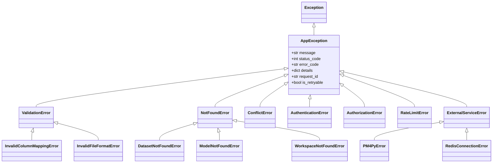

# Error Handling

> **Standard:** RFC 7807 Problem Details for HTTP APIs
> **Location:** `src/core/exceptions.py`, `src/core/error_codes.py`
> **Status:** ✅ Fully Implemented

---

## Quick Reference Card

### What It Does
Provides a consistent, machine-readable error response format across all API endpoints using the RFC 7807 standard.

### Key Components
- **Exception Hierarchy** - Typed exceptions for different error scenarios
- **Error Codes Catalog** - Centralized error code definitions
- **HTTP Status Mapping** - Automatic status code selection
- **Correlation IDs** - Request tracing across services
- **Retry Hints** - Client guidance for retryable errors

### RFC 7807 Response Format
```json
{
  "type": "https://api.example.com/errors/dataset-not-found",
  "title": "Dataset Not Found",
  "status": 404,
  "detail": "Dataset with ID 'abc123' does not exist",
  "instance": "/api/v1/datasets/abc123",
  "error_code": "DATASET_NOT_FOUND",
  "request_id": "req_xyz789",
  "timestamp": "2026-01-02T10:30:00Z"
}
```

### Common Gotchas

> [!WARNING]
> **Always raise typed exceptions**
> - Don't raise generic `Exception` or `ValueError`
> - Use specific exception classes (`NotFoundError`, `ValidationError`)
> - This ensures proper HTTP status codes and error responses

> [!IMPORTANT]
> **Include context in exceptions**
> - Provide entity name and ID: `NotFoundError("Dataset", dataset_id)`
> - Add validation details: `ValidationError("Invalid column mapping", {"missing": ["case_id"]})`

---

## Exception Hierarchy



---

## Base Exception Class

**File:** `src/core/exceptions.py`

```python
from dataclasses import dataclass, field
from typing import Optional, Dict, Any
from datetime import datetime

@dataclass
class AppException(Exception):
    """
    Base exception for all application errors.
    Follows RFC 7807 Problem Details standard.
    """

    message: str
    status_code: int = 500
    error_code: str = "INTERNAL_ERROR"
    details: Optional[Dict[str, Any]] = None
    request_id: Optional[str] = None
    is_retryable: bool = False  # Hint for clients
    timestamp: str = field(default_factory=lambda: datetime.utcnow().isoformat())

    def to_dict(self) -> dict:
        """Convert to RFC 7807 Problem Details format"""
        return {
            "type": f"https://api.example.com/errors/{self.error_code.lower().replace('_', '-')}",
            "title": self.__class__.__name__.replace("Error", " Error"),
            "status": self.status_code,
            "detail": self.message,
            "instance": f"/api/v1/...",  # Set by exception handler
            "error_code": self.error_code,
            "request_id": self.request_id,
            "timestamp": self.timestamp,
            "is_retryable": self.is_retryable,
            **({"details": self.details} if self.details else {})
        }
```

---

## Specific Exception Classes

### 1. NotFoundError (404)

```python
class NotFoundError(AppException):
    """Entity not found"""

    def __init__(self, entity_type: str, entity_id: str):
        super().__init__(
            message=f"{entity_type} with ID '{entity_id}' does not exist",
            status_code=404,
            error_code=f"{entity_type.upper().replace(' ', '_')}_NOT_FOUND",
            is_retryable=False
        )

# Usage
raise NotFoundError("Dataset", dataset_id)
raise NotFoundError("Process Model", model_id)
raise NotFoundError("Workspace", workspace_id)
```

### 2. ValidationError (400)

```python
class ValidationError(AppException):
    """Request validation failed"""

    def __init__(self, message: str, details: Optional[dict] = None):
        super().__init__(
            message=message,
            status_code=400,
            error_code="VALIDATION_ERROR",
            details=details,
            is_retryable=False
        )

# Usage
raise ValidationError(
    "Invalid column mapping",
    {"missing_columns": ["case_id", "timestamp"]}
)
```

### 3. ConflictError (409)

```python
class ConflictError(AppException):
    """Resource conflict (duplicate, concurrent modification)"""

    def __init__(self, message: str, details: Optional[dict] = None):
        super().__init__(
            message=message,
            status_code=409,
            error_code="CONFLICT_ERROR",
            details=details,
            is_retryable=True  # Client can retry with different data
        )

# Usage
raise ConflictError(
    "Dataset with name 'Q1 Sales' already exists in this project",
    {"existing_id": "dataset_abc123"}
)
```

### 4. AuthenticationError (401)

```python
class AuthenticationError(AppException):
    """Authentication failed"""

    def __init__(self, message: str = "Authentication required"):
        super().__init__(
            message=message,
            status_code=401,
            error_code="AUTHENTICATION_FAILED",
            is_retryable=False
        )

# Usage
raise AuthenticationError("Invalid or expired token")
raise AuthenticationError("Missing authorization header")
```

### 5. AuthorizationError (403)

```python
class AuthorizationError(AppException):
    """Insufficient permissions"""

    def __init__(self, message: str, required_role: Optional[str] = None):
        super().__init__(
            message=message,
            status_code=403,
            error_code="INSUFFICIENT_PERMISSIONS",
            details={"required_role": required_role} if required_role else None,
            is_retryable=False
        )

# Usage
raise AuthorizationError(
    "You do not have permission to delete this dataset",
    required_role="workspace_admin"
)
```

### 6. RateLimitError (429)

```python
class RateLimitError(AppException):
    """Rate limit exceeded"""

    def __init__(self, retry_after: int = 60):
        super().__init__(
            message=f"Rate limit exceeded. Try again in {retry_after} seconds",
            status_code=429,
            error_code="RATE_LIMIT_EXCEEDED",
            details={"retry_after": retry_after},
            is_retryable=True
        )

# Usage
raise RateLimitError(retry_after=120)
```

### 7. ExternalServiceError (502/503)

```python
class ExternalServiceError(AppException):
    """External service (PM4Py, Redis) failure"""

    def __init__(self, service: str, message: str, is_timeout: bool = False):
        super().__init__(
            message=f"{service} error: {message}",
            status_code=503 if is_timeout else 502,
            error_code=f"{service.upper()}_ERROR",
            is_retryable=True
        )

# Usage
raise ExternalServiceError("PM4Py", "Discovery algorithm timed out", is_timeout=True)
raise ExternalServiceError("Redis", "Connection refused")
```

---

## Domain-Specific Exceptions

### Dataset Exceptions

**File:** `src/core/exceptions.py`

```python
class DatasetNotFoundError(NotFoundError):
    """Dataset not found"""
    def __init__(self, dataset_id: str):
        super().__init__("Dataset", dataset_id)

class InvalidColumnMappingError(ValidationError):
    """Invalid column mapping for event log"""
    def __init__(self, missing_columns: list[str]):
        super().__init__(
            f"Missing required columns: {', '.join(missing_columns)}",
            details={"missing_columns": missing_columns}
        )

class FileProcessingError(AppException):
    """Error processing uploaded file"""
    def __init__(self, filename: str, reason: str):
        super().__init__(
            message=f"Failed to process file '{filename}': {reason}",
            status_code=500,
            error_code="FILE_PROCESSING_ERROR",
            is_retryable=False
        )

class FileTooLargeError(ValidationError):
    """Uploaded file exceeds size limit"""
    def __init__(self, size_mb: int, max_size_mb: int):
        super().__init__(
            f"File size ({size_mb} MB) exceeds maximum allowed ({max_size_mb} MB)",
            details={"size_mb": size_mb, "max_size_mb": max_size_mb}
        )
```

### Process Mining Exceptions

```python
class PM4PyError(ExternalServiceError):
    """PM4Py operation failed"""
    def __init__(self, operation: str, message: str):
        super().__init__(
            service="PM4Py",
            message=f"{operation} failed: {message}"
        )

class CircuitBreakerOpenError(AppException):
    """Circuit breaker is open (too many failures)"""
    def __init__(self, operation: str, retry_after: int = 60):
        super().__init__(
            message=f"Circuit breaker open for {operation}. System recovering.",
            status_code=503,
            error_code="CIRCUIT_BREAKER_OPEN",
            details={"retry_after": retry_after},
            is_retryable=True
        )
```

---

## Error Codes Catalog

**File:** `src/core/error_codes.py`

```python
from enum import Enum

class ErrorCode(str, Enum):
    """Centralized error code definitions"""

    # General errors (1000-1999)
    INTERNAL_ERROR = "INTERNAL_ERROR"
    VALIDATION_ERROR = "VALIDATION_ERROR"
    NOT_FOUND = "NOT_FOUND"
    CONFLICT = "CONFLICT"

    # Authentication & Authorization (2000-2999)
    AUTHENTICATION_FAILED = "AUTHENTICATION_FAILED"
    INVALID_TOKEN = "INVALID_TOKEN"
    TOKEN_EXPIRED = "TOKEN_EXPIRED"
    INSUFFICIENT_PERMISSIONS = "INSUFFICIENT_PERMISSIONS"

    # Dataset errors (3000-3999)
    DATASET_NOT_FOUND = "DATASET_NOT_FOUND"
    INVALID_COLUMN_MAPPING = "INVALID_COLUMN_MAPPING"
    FILE_PROCESSING_ERROR = "FILE_PROCESSING_ERROR"
    FILE_TOO_LARGE = "FILE_TOO_LARGE"
    UNSUPPORTED_FILE_FORMAT = "UNSUPPORTED_FILE_FORMAT"

    # Process mining errors (4000-4999)
    PM4PY_ERROR = "PM4PY_ERROR"
    DISCOVERY_FAILED = "DISCOVERY_FAILED"
    CONFORMANCE_CHECK_FAILED = "CONFORMANCE_CHECK_FAILED"
    MODEL_NOT_FOUND = "MODEL_NOT_FOUND"

    # External service errors (5000-5999)
    REDIS_CONNECTION_ERROR = "REDIS_CONNECTION_ERROR"
    DATABASE_ERROR = "DATABASE_ERROR"
    CIRCUIT_BREAKER_OPEN = "CIRCUIT_BREAKER_OPEN"

    # Rate limiting (6000-6999)
    RATE_LIMIT_EXCEEDED = "RATE_LIMIT_EXCEEDED"

    # Workspace & Organization (7000-7999)
    WORKSPACE_NOT_FOUND = "WORKSPACE_NOT_FOUND"
    ORGANIZATION_NOT_FOUND = "ORGANIZATION_NOT_FOUND"
    USER_NOT_IN_WORKSPACE = "USER_NOT_IN_WORKSPACE"
```

---

## Exception Handler (FastAPI)

**File:** `src/api/main.py`

```python
from fastapi import FastAPI, Request, status
from fastapi.responses import JSONResponse
from src.core.exceptions import AppException
import structlog

logger = structlog.get_logger(__name__)

def register_exception_handlers(app: FastAPI):
    """Register global exception handlers"""

    @app.exception_handler(AppException)
    async def app_exception_handler(request: Request, exc: AppException):
        """Handle application exceptions with RFC 7807 format"""

        # Bind request_id to exception
        exc.request_id = request.state.request_id if hasattr(request.state, "request_id") else None

        # Log the error
        logger.error(
            "application_error",
            error_code=exc.error_code,
            status_code=exc.status_code,
            detail=exc.message,
            request_id=exc.request_id,
            path=str(request.url)
        )

        # Build RFC 7807 response
        response = exc.to_dict()
        response["instance"] = str(request.url.path)

        return JSONResponse(
            status_code=exc.status_code,
            content=response
        )

    @app.exception_handler(Exception)
    async def generic_exception_handler(request: Request, exc: Exception):
        """Handle unexpected exceptions"""

        request_id = getattr(request.state, "request_id", None)

        logger.exception(
            "unexpected_error",
            error=str(exc),
            request_id=request_id,
            path=str(request.url)
        )

        return JSONResponse(
            status_code=500,
            content={
                "type": "https://api.example.com/errors/internal-error",
                "title": "Internal Server Error",
                "status": 500,
                "detail": "An unexpected error occurred. Please try again later.",
                "instance": str(request.url.path),
                "error_code": "INTERNAL_ERROR",
                "request_id": request_id
            }
        )
```

---

## Usage in Services

### Example: Dataset Service

**File:** `src/services/ingestion.py`

```python
from src.core.exceptions import (
    DatasetNotFoundError,
    InvalidColumnMappingError,
    FileProcessingError
)

class IngestionService:
    async def get_dataset(self, dataset_id: str, db: AsyncSession) -> Dataset:
        """Get dataset or raise NotFoundError"""

        dataset = await db.get(Dataset, dataset_id)

        if not dataset:
            raise DatasetNotFoundError(dataset_id)  # ✅ Typed exception

        return dataset

    async def ingest_csv(
        self,
        db: AsyncSession,
        file_path: str,
        column_mapping: dict,
        name: str
    ) -> Dataset:
        """Ingest CSV with proper error handling"""

        # Validate column mapping
        required_columns = ["case_id", "activity", "timestamp"]
        missing = [col for col in required_columns if col not in column_mapping]

        if missing:
            raise InvalidColumnMappingError(missing)  # ✅ Validation error

        try:
            # Parse CSV with DuckDB
            arrow_table = duckdb.execute(
                f"SELECT * FROM read_csv_auto('{file_path}')"
            ).arrow()

        except Exception as e:
            raise FileProcessingError(
                filename=Path(file_path).name,
                reason=str(e)
            )  # ✅ Wrap external errors

        # ... rest of ingestion logic
```

---

## Usage in API Routers

### Example: Dataset Router

**File:** `src/api/routers/datasets.py`

```python
from fastapi import APIRouter, Depends, UploadFile, File
from src.services.ingestion import IngestionService
from src.core.exceptions import FileTooLargeError

router = APIRouter(prefix="/api/v1/datasets", tags=["datasets"])

@router.post("/upload", status_code=201)
async def upload_dataset(
    file: UploadFile = File(...),
    case_id_column: str = Form(...),
    activity_column: str = Form(...),
    timestamp_column: str = Form(...),
    service: IngestionService = Depends()
):
    """
    Upload event log (CSV/XES)

    Raises:
        FileTooLargeError: File exceeds size limit
        InvalidColumnMappingError: Missing required columns
        FileProcessingError: CSV parsing failed
    """

    # Check file size (100 MB limit)
    file_size_mb = file.size / (1024 * 1024) if file.size else 0
    if file_size_mb > 100:
        raise FileTooLargeError(
            size_mb=int(file_size_mb),
            max_size_mb=100
        )  # ✅ Raise typed exception

    # Delegate to service (exceptions propagate automatically)
    dataset = await service.ingest_csv(
        db=db,
        file_path=temp_file_path,
        column_mapping={
            "case_id": case_id_column,
            "activity": activity_column,
            "timestamp": timestamp_column
        },
        name=file.filename
    )

    return dataset  # FastAPI auto-serializes to JSON
```

**Note:** No try/except needed! FastAPI exception handler catches and formats errors automatically.

---

## Error Response Examples

### Example 1: Dataset Not Found

**Request:**
```http
GET /api/v1/datasets/nonexistent HTTP/1.1
```

**Response:**
```http
HTTP/1.1 404 Not Found
Content-Type: application/json

{
  "type": "https://api.example.com/errors/dataset-not-found",
  "title": "Dataset Not Found",
  "status": 404,
  "detail": "Dataset with ID 'nonexistent' does not exist",
  "instance": "/api/v1/datasets/nonexistent",
  "error_code": "DATASET_NOT_FOUND",
  "request_id": "req_abc123",
  "timestamp": "2026-01-02T10:30:00Z",
  "is_retryable": false
}
```

### Example 2: Invalid Column Mapping

**Request:**
```http
POST /api/v1/datasets/upload HTTP/1.1
Content-Type: multipart/form-data

{
  "file": <binary>,
  "activity_column": "activity"
  // Missing: case_id_column, timestamp_column
}
```

**Response:**
```http
HTTP/1.1 400 Bad Request
Content-Type: application/json

{
  "type": "https://api.example.com/errors/invalid-column-mapping",
  "title": "Invalid Column Mapping Error",
  "status": 400,
  "detail": "Missing required columns: case_id, timestamp",
  "instance": "/api/v1/datasets/upload",
  "error_code": "INVALID_COLUMN_MAPPING",
  "request_id": "req_xyz789",
  "timestamp": "2026-01-02T10:31:00Z",
  "is_retryable": false,
  "details": {
    "missing_columns": ["case_id", "timestamp"]
  }
}
```

### Example 3: PM4Py Timeout (Circuit Breaker)

**Request:**
```http
POST /api/v1/discovery/discover HTTP/1.1

{
  "dataset_id": "large_dataset_500k_events",
  "miner_type": "inductive"
}
```

**Response:**
```http
HTTP/1.1 503 Service Unavailable
Content-Type: application/json

{
  "type": "https://api.example.com/errors/circuit-breaker-open",
  "title": "Circuit Breaker Open Error",
  "status": 503,
  "detail": "Circuit breaker open for pm4py_discovery. System recovering.",
  "instance": "/api/v1/discovery/discover",
  "error_code": "CIRCUIT_BREAKER_OPEN",
  "request_id": "req_def456",
  "timestamp": "2026-01-02T10:32:00Z",
  "is_retryable": true,
  "details": {
    "retry_after": 60
  }
}
```

---

## Client Error Handling

### TypeScript SDK Example

```typescript
import { DatasetsApi, Configuration } from '@/sdk';

const api = new DatasetsApi(new Configuration({
  basePath: 'http://localhost:8001'
}));

try {
  const dataset = await api.getDataset('nonexistent');
} catch (error) {
  if (error.response) {
    const problem = error.response.data;  // RFC 7807 format

    console.error(`Error ${problem.error_code}: ${problem.detail}`);

    // Check if retryable
    if (problem.is_retryable) {
      const retryAfter = problem.details?.retry_after || 60;
      console.log(`Retrying in ${retryAfter} seconds...`);
      setTimeout(() => retry(), retryAfter * 1000);
    }

    // Handle specific error codes
    switch (problem.error_code) {
      case 'DATASET_NOT_FOUND':
        router.push('/datasets');  // Redirect to list
        break;

      case 'INVALID_COLUMN_MAPPING':
        showValidationError(problem.details.missing_columns);
        break;

      case 'CIRCUIT_BREAKER_OPEN':
        showNotification('System is recovering. Please try again shortly.');
        break;

      default:
        showGenericError(problem.detail);
    }
  }
}
```

---

## Testing Error Handling

### Unit Test Example

**File:** `tests/test_exceptions.py`

```python
import pytest
from src.core.exceptions import DatasetNotFoundError, ValidationError

def test_dataset_not_found_error():
    """Test NotFoundError creates proper RFC 7807 response"""

    error = DatasetNotFoundError("dataset_123")

    assert error.status_code == 404
    assert error.error_code == "DATASET_NOT_FOUND"
    assert "dataset_123" in error.message
    assert error.is_retryable is False

    response = error.to_dict()
    assert response["status"] == 404
    assert response["type"].endswith("dataset-not-found")

def test_validation_error_with_details():
    """Test ValidationError includes details"""

    error = ValidationError(
        "Invalid columns",
        details={"missing": ["case_id"]}
    )

    assert error.status_code == 400
    assert error.details == {"missing": ["case_id"]}

    response = error.to_dict()
    assert "details" in response
    assert response["details"]["missing"] == ["case_id"]
```

### Integration Test Example

```python
from fastapi.testclient import TestClient

def test_dataset_not_found_returns_rfc7807(client: TestClient):
    """Test API returns RFC 7807 formatted errors"""

    response = client.get("/api/v1/datasets/nonexistent")

    assert response.status_code == 404
    body = response.json()

    # Verify RFC 7807 required fields
    assert "type" in body
    assert "title" in body
    assert "status" in body
    assert "detail" in body
    assert "instance" in body

    # Verify custom fields
    assert body["error_code"] == "DATASET_NOT_FOUND"
    assert "request_id" in body
    assert body["is_retryable"] is False

def test_invalid_column_mapping_returns_details(client: TestClient):
    """Test validation errors include details"""

    response = client.post(
        "/api/v1/datasets/upload",
        files={"file": ("test.csv", b"data")},
        data={"activity_column": "activity"}  # Missing required columns
    )

    assert response.status_code == 400
    body = response.json()

    assert body["error_code"] == "INVALID_COLUMN_MAPPING"
    assert "details" in body
    assert "missing_columns" in body["details"]
    assert "case_id" in body["details"]["missing_columns"]
```

---

## Best Practices

### ✅ DO: Raise Typed Exceptions

```python
# GOOD
raise DatasetNotFoundError(dataset_id)

# BAD
raise Exception(f"Dataset {dataset_id} not found")
```

### ✅ DO: Include Context in Exceptions

```python
# GOOD
raise ValidationError(
    "Invalid column mapping",
    details={"missing": ["case_id", "timestamp"], "provided": ["activity"]}
)

# BAD
raise ValidationError("Invalid columns")
```

### ✅ DO: Use Specific Exceptions

```python
# GOOD
if dataset is None:
    raise DatasetNotFoundError(dataset_id)

# BAD
if dataset is None:
    raise NotFoundError("Resource", "unknown")
```

### ❌ DON'T: Swallow Exceptions

```python
# BAD
try:
    dataset = await db.get(Dataset, dataset_id)
except Exception:
    pass  # ❌ Silently fails

# GOOD
try:
    dataset = await db.get(Dataset, dataset_id)
except DatabaseError as e:
    raise ExternalServiceError("Database", str(e))
```

### ❌ DON'T: Return Error Objects

```python
# BAD
if not dataset:
    return {"error": "Not found"}  # ❌ Inconsistent format

# GOOD
if not dataset:
    raise DatasetNotFoundError(dataset_id)  # ✅ Handled globally
```

---

## Related Documentation

- [Logging](./logging.md) - Error logging with structlog
- [Observability](./observability.md) - Error tracking & monitoring
- [API Layer](../02-layers/api-layer.md) - Exception handlers in FastAPI
- [Service Layer](../02-layers/service-layer.md) - Service error handling patterns

---

## References

- **RFC 7807:** https://datatracker.ietf.org/doc/html/rfc7807
- **HTTP Status Codes:** https://httpstatuses.com/
- **FastAPI Exception Handling:** https://fastapi.tiangolo.com/tutorial/handling-errors/
