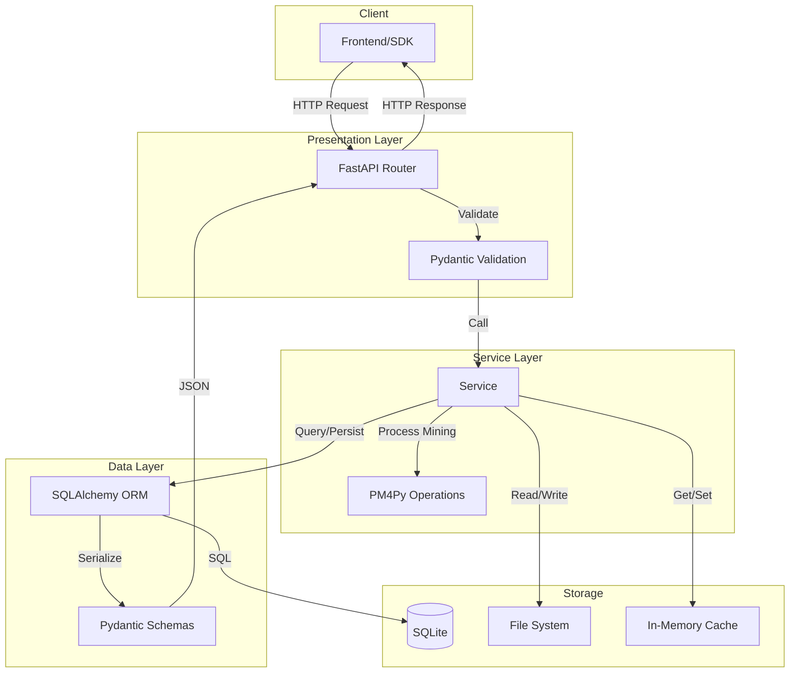
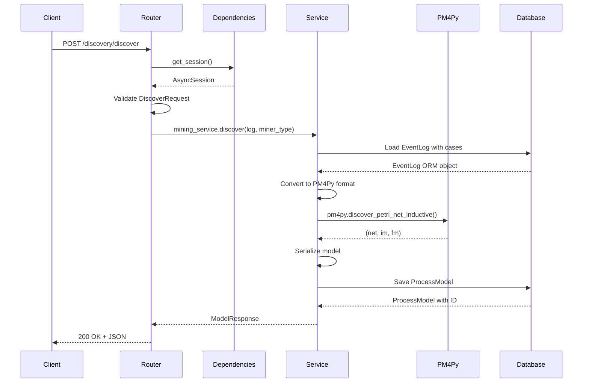
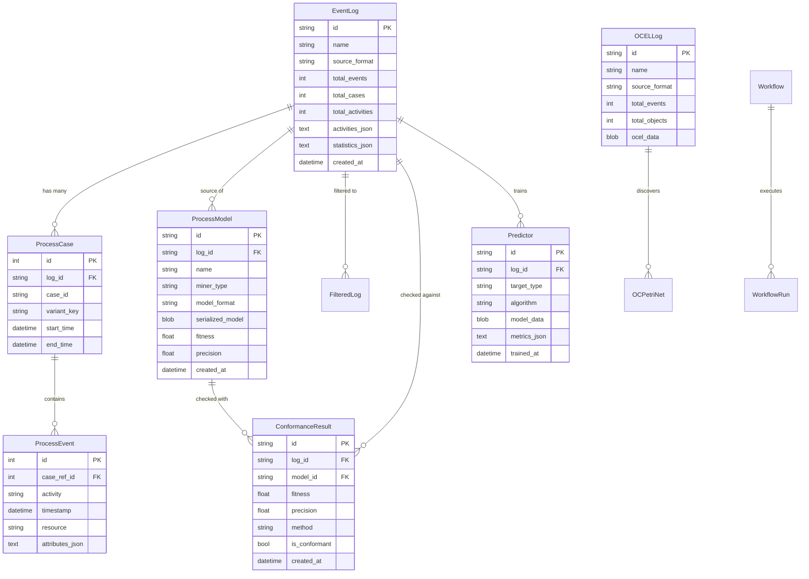

# Architecture

> **Stack:** FastAPI + PM4Py + SQLAlchemy (async) + SQLite  
> **Pattern:** Clean Architecture with DDD-inspired layers

---

## Folder Structure

```
backend/
├── src/
│   ├── api/                    # Presentation Layer
│   │   ├── main.py             # FastAPI app factory
│   │   ├── dependencies.py     # Dependency injection
│   │   └── routers/            # Route handlers only
│   │       ├── analytics.py    # GET /analytics/*
│   │       ├── conformance.py  # POST/GET /conformance/*
│   │       ├── discovery.py    # POST/GET /discovery/*
│   │       ├── filtering.py    # POST/GET /filtering/*
│   │       ├── ocpm.py         # POST/GET /ocpm/*
│   │       ├── organizational.py # GET /organizational/*
│   │       ├── predictions.py  # POST/GET /predictions/*
│   │       ├── processes.py    # POST/GET/DELETE /processes/*
│   │       ├── projects.py     # POST/GET/PUT/DELETE /projects/*
│   │       ├── simulation.py   # POST /simulation/*
│   │       ├── visualization.py # GET /visualization/*
│   │       └── workflows.py    # POST/GET /workflows/*
│   │
│   ├── services/               # Business Logic Layer
│   │   ├── analytics.py        # BottleneckDetection, ReworkAnalysis
│   │   ├── conformance.py      # TokenReplay, Alignments
│   │   ├── filtering.py        # LogFiltering, PM4PyConverter
│   │   ├── ingestion.py        # CSVParser, XESParser
│   │   ├── mining.py           # ProcessDiscovery, DFGBuilder
│   │   ├── ocpm.py             # OCELHandler, OCPetriNetDiscovery
│   │   ├── organizational.py   # SocialNetworkAnalysis
│   │   ├── prediction.py       # MLPredictor, FeatureExtraction
│   │   ├── simulation.py       # WhatIfSimulation, PlayOut
│   │   └── workflow.py         # WorkflowOrchestration
│   │
│   ├── models/                 # Data Layer
│   │   ├── orm.py              # SQLAlchemy models (10 tables)
│   │   ├── schemas.py          # Pydantic schemas (121+ models)
│   │   └── database.py         # Async session factory
│   │
│   ├── core/                   # Infrastructure/Config
│   │   ├── config.py           # Settings from env
│   │   ├── enums.py            # MinerType, ModelFormat, etc.
│   │   ├── exceptions.py       # Custom exceptions
│   │   └── logging_config.py   # Structured logging
│   │
│   ├── infrastructure/         # External Integrations
│   │   ├── cache.py            # In-memory cache service
│   │   └── workers/            # Celery async tasks
│   │
│   └── storage/                # File Storage
│       └── file_storage.py     # Upload handling
│
├── tests/                      # Test Suite
│   ├── conftest.py             # Fixtures
│   ├── test_api/               # API integration tests
│   └── test_services/          # Unit tests
│
├── data/                       # Runtime Data
│   ├── db/                     # SQLite database
│   ├── uploads/                # Uploaded files
│   └── models/                 # Serialized process models
│
├── docs/                       # Documentation
│   ├── API_REFERENCE.md
│   ├── DATA_CONTRACTS.md
│   ├── SDK_GUIDE.md
│   ├── ARCHITECTURE.md
│   └── CHANGELOG.md
│
├── alembic/                    # Database Migrations
│   └── versions/
│
├── pyproject.toml              # Dependencies
└── Makefile                    # Dev commands
```

---

## Layer Responsibilities

| Layer              | Responsibility                                           | Files                 |
| ------------------ | -------------------------------------------------------- | --------------------- |
| **Presentation**   | HTTP routing, request validation, response serialization | `api/routers/*.py`    |
| **Service**        | Business logic, PM4Py operations, orchestration          | `services/*.py`       |
| **Model**          | ORM entities, Pydantic schemas, DB access                | `models/*.py`         |
| **Core**           | Config, enums, exceptions, logging                       | `core/*.py`           |
| **Infrastructure** | Caching, async workers, external services                | `infrastructure/*.py` |
| **Storage**        | File system operations                                   | `storage/*.py`        |

---

## Data Flow



---

## Request Lifecycle



---

## Database Schema



---

## Key Design Decisions

### 1. Async-First Architecture

- **Why:** High I/O workload (file parsing, DB queries, PM4Py operations)
- **How:** `async/await` throughout, `aiosqlite` for DB, background tasks for long ops
- **Trade-off:** Slightly more complex code, but 3-5x better throughput

### 2. PM4Py as Core Engine

- **Why:** Industry-standard process mining library, academically validated
- **How:** Services wrap PM4Py functions, convert between ORM ↔ PM4Py log formats
- **Trade-off:** Python-only backend, but avoids reinventing complex algorithms

### 3. Event Log as Aggregate Root

- **Why:** All operations center around event logs
- **How:** `EventLog` → `ProcessCase` → `ProcessEvent` hierarchy
- **Trade-off:** Deep loading needed for some operations

### 4. In-Memory Caching

- **Why:** Analytics endpoints are expensive (full log scan)
- **How:** `cache_service` with TTL (1 hour default)
- **Trade-off:** Memory usage, stale data in read-heavy scenarios

### 5. Pydantic for Validation

- **Why:** Type safety, automatic OpenAPI generation
- **How:** Request/Response models in `schemas.py`
- **Trade-off:** Large schema file (1000+ lines)

### 6. Pickle for Model Serialization

- **Why:** PM4Py models (Petri nets, trees) are complex Python objects
- **How:** `pickle.dumps()` → `BLOB` column
- **Trade-off:** Python version coupling, no cross-language interop

### 7. SQLite for Simplicity

- **Why:** Local-first, zero config, good for dev/small deployments
- **How:** `aiosqlite` with SQLAlchemy async
- **Trade-off:** Limited concurrency, scaling requires PostgreSQL migration

### 8. Celery for Background Jobs

- **Why:** ML training can take minutes
- **How:** Optional Celery integration for async training
- **Trade-off:** Extra infrastructure (Redis/RabbitMQ broker)

---

## Service Patterns

### Router → Service Contract

```python
# Router: thin, handles HTTP only
@router.get("/logs/{log_id}/bottlenecks")
async def get_bottlenecks(log_id: str, db: AsyncSession = Depends(get_db)):
    pm4py_log, _ = await _get_pm4py_log(log_id, db)  # Load + convert
    result = analytics_service.detect_bottlenecks(pm4py_log)  # Pure logic
    return BottleneckListResponse(log_id=log_id, **result)  # Serialize
```

### Service: PM4Py Wrapper

```python
# Service: business logic, no HTTP knowledge
class AnalyticsService:
    def detect_bottlenecks(self, pm4py_log) -> dict:
        # 1. PM4Py analysis
        # 2. Transform results
        # 3. Return dict (not Pydantic model)
        pass
```

### Caching Pattern

```python
cache_key = f"bottlenecks:{log_id}"
cached = cache_service.get(cache_key)
if cached:
    return cached

result = expensive_operation()
cache_service.set(cache_key, result, ttl=3600)
return result
```

---

## PM4Py Integration Points

| Service             | PM4Py Functions Used                                                                   |
| ------------------- | -------------------------------------------------------------------------------------- |
| `mining.py`         | `discover_petri_net_alpha/inductive/heuristics()`, `discover_dfg()`                    |
| `conformance.py`    | `conformance_diagnostics_token_based_replay()`, `conformance_diagnostics_alignments()` |
| `analytics.py`      | `get_all_case_durations()`, `get_event_attributes()`                                   |
| `filtering.py`      | `filter_*()` family of functions                                                       |
| `organizational.py` | `discover_handover_of_work_network()`, `discover_working_together_network()`           |
| `ocpm.py`           | `read_ocel_*()`, `discover_oc_petri_net()`, `ocel_discover_ocdfg()`                    |
| `simulation.py`     | `play_out()`                                                                           |

---

## Extension Points

### Adding a New Endpoint

1. **Schema:** Add request/response models to `schemas.py`
2. **Service:** Add business logic method to appropriate service
3. **Router:** Add route handler to appropriate router
4. **Test:** Add API test to `tests/test_api/`

### Adding a New Service

1. Create `services/new_service.py`
2. Export singleton instance in `services/__init__.py`
3. Import in routers that need it

### Adding a New Entity

1. Add ORM model to `models/orm.py`
2. Create Alembic migration: `alembic revision --autogenerate -m "add X"`
3. Add Pydantic schemas to `schemas.py`

---

## Environment Configuration

```bash
# .env
DEBUG=true
AUTH_ENABLED=false
DATABASE_URL=sqlite+aiosqlite:///./data/db/process_mining.db
UPLOAD_DIR=./data/uploads
MODEL_DIR=./data/models

# Optional: Celery for async tasks
CELERY_BROKER_URL=redis://localhost:6379/0
CELERY_RESULT_BACKEND=redis://localhost:6379/0
```

---

## Monitoring & Health

| Endpoint               | Purpose                    |
| ---------------------- | -------------------------- |
| `GET /health`          | Quick liveness check       |
| `GET /health/live`     | Kubernetes liveness probe  |
| `GET /health/ready`    | Kubernetes readiness probe |
| `GET /health/detailed` | Full component status      |
| `GET /metrics`         | Prometheus metrics         |

---

## SDK Architecture

```
sdk/
├── src/
│   ├── client.ts           # HttpClient with auth, error handling
│   ├── index.ts            # ProcessMiningSdk main class
│   ├── clients/            # One file per resource
│   │   ├── logs.client.ts
│   │   ├── discovery.client.ts
│   │   ├── analytics.client.ts
│   │   └── ...17 total
│   ├── types/              # TypeScript interfaces
│   │   ├── common.ts       # Shared types
│   │   ├── logs.ts
│   │   ├── analytics.ts
│   │   └── ...
│   └── errors.ts           # ApiError class
├── dist/                   # Compiled output
└── package.json
```

### SDK Design Principles

1. **Business Verbs:** Methods named for actions (`ingest`, `analyze`, `discover`)
2. **Type Safety:** Full TypeScript with strict mode
3. **Thin Clients:** Direct API mapping, no caching or retry logic
4. **Error Normalization:** All errors become `ApiError` with RFC 7807 details
