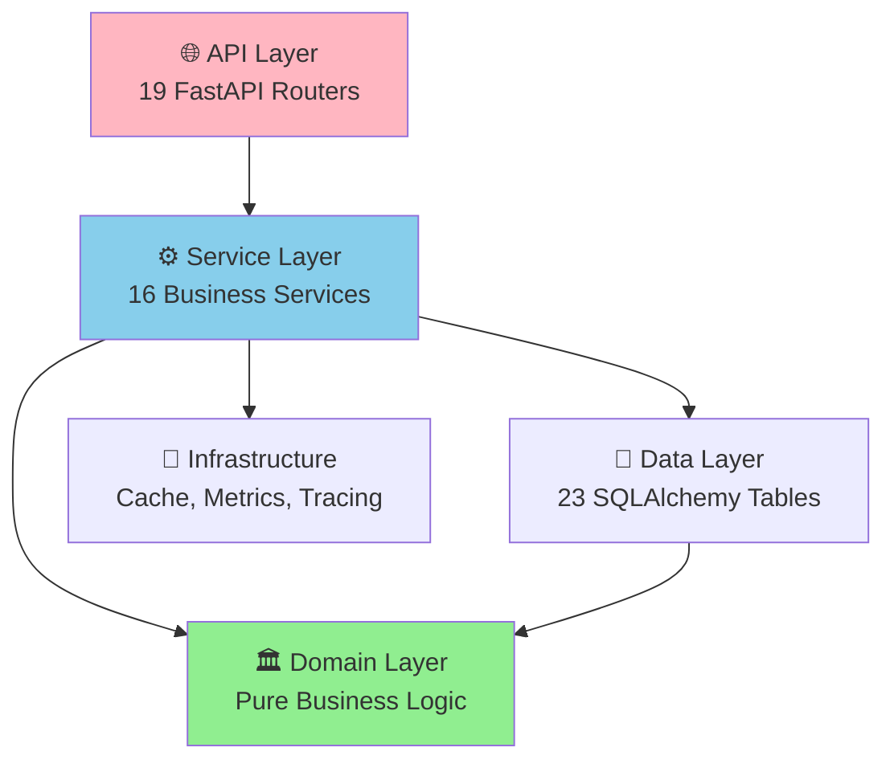

# Backend Documentation

> **📚 Complete Documentation for Process Mining SaaS Backend**
> **Last Updated:** 2026-01-02
> **Version:** 1.0.0

---

## 🎯 Quick Start

**New to the codebase?** Start here:

1. **[Getting Started Guide](./00-overview/getting-started.md)** (5-minute setup)
2. **[Architecture Overview](./00-overview/architecture.md)** (understand system design)
3. **[Feature Documentation](./01-features/README.md)** (explore 19 API features)

**Building a feature?** Check:
- [Development Guide](./03-cross-cutting/development-guide.md) - Workflow and best practices
- [Testing Guide](./03-cross-cutting/testing.md) - Writing tests
- [Layer Documentation](./02-layers/README.md) - Where to put your code

**Troubleshooting?** See:
- [Error Handling](./03-cross-cutting/error-handling.md) - Exception patterns
- [Logging](./03-cross-cutting/logging.md) - Debugging with logs
- [Common Issues](./99-appendix/troubleshooting.md) - FAQ and solutions

---

## 📖 Documentation Structure

```
docs/
├── 00-overview/              # System overview and architecture
│   ├── architecture.md       # C4 diagrams, system design
│   ├── tech-stack.md         # Dependencies and technologies
│   └── getting-started.md    # Setup and first API call
│
├── 01-features/              # Feature documentation (19 features)
│   ├── README.md             # Feature index and comparison
│   ├── core-process-mining/  # Core PM features
│   │   ├── datasets.md       # Dataset management
│   │   ├── discovery.md      # Process discovery
│   │   ├── conformance.md    # Conformance checking
│   │   └── visualization.md  # Visualization
│   ├── analytics/            # Analytics features
│   │   ├── performance-analytics.md
│   │   ├── filtering.md
│   │   ├── organizational.md
│   │   ├── predictions.md
│   │   └── simulation.md
│   ├── advanced/             # Advanced features
│   │   ├── ocpm.md           # Object-centric PM
│   │   ├── workflows.md      # Workflow automation
│   │   └── analyses.md       # Stored analyses
│   ├── multi-tenancy/        # Multi-tenancy features
│   │   ├── organizations.md
│   │   ├── workspaces.md
│   │   ├── projects.md
│   │   └── authentication.md
│   └── observability/        # Observability features
│       ├── health.md
│       ├── dev-logging.md
│       └── log-streaming.md
│
├── 02-layers/                # Architectural layers
│   ├── README.md             # Layer overview and dependencies
│   ├── api-layer.md          # FastAPI routers
│   ├── service-layer.md      # Business logic
│   ├── domain-layer.md       # Domain entities (DDD)
│   ├── data-layer.md         # Database and repositories
│   ├── infrastructure-layer.md # External services
│   └── core-layer.md         # Configuration and utilities
│
├── 03-cross-cutting/         # Cross-cutting concerns
│   ├── README.md             # Cross-cutting overview
│   ├── error-handling.md     # RFC 7807 exceptions
│   ├── logging.md            # Structlog configuration
│   ├── auth.md               # JWT authentication
│   ├── caching.md            # Redis caching
│   ├── testing.md            # Pytest guide
│   ├── performance.md        # Optimization strategies
│   ├── observability.md      # Metrics and tracing
│   ├── resilience.md         # Circuit breaker, retry
│   ├── privacy.md            # GDPR and anonymization
│   └── development-guide.md  # Development workflow
│
└── 99-appendix/              # Reference materials
    ├── glossary.md           # Terms and definitions
    ├── decision-log.md       # Architectural decisions
    ├── troubleshooting.md    # Common issues
    ├── api-reference.md      # Complete API reference
    └── changelog.md          # Version history
```

---

## 🏗️ System Architecture at a Glance

### Technology Stack

| Category | Technology | Purpose |
|----------|-----------|---------|
| **Web Framework** | FastAPI + Uvicorn | Async REST API |
| **Database** | SQLite (→ PostgreSQL) | Data persistence |
| **Process Mining** | PM4Py 2.7+ | Discovery, conformance, analytics |
| **Performance** | DuckDB + PyArrow | 10x faster CSV ingestion |
| **Caching** | Redis | Cache + task queue |
| **Observability** | Structlog + Prometheus | Logging + metrics |
| **Authentication** | JWT (PyJWT) | Token-based auth |

### Clean Architecture Layers



**Key Principle:** Inner layers never depend on outer layers.

### Core Features

- **Dataset Management:** Upload CSV/XES logs with DuckDB (10x faster)
- **Process Discovery:** Alpha, Inductive, Heuristics, ILP miners
- **Conformance Checking:** Token replay, alignments, fitness metrics
- **Performance Analytics:** Bottlenecks, rework, cycle time
- **Multi-Tenancy:** Organizations → Workspaces → Projects → Datasets
- **OCPM:** Object-centric process mining (OCEL 2.0)

---

## 📚 Documentation by Role

### 🧑‍💻 For Developers

**Setting Up:**
1. [Getting Started](./00-overview/getting-started.md) - Local setup (5 minutes)
2. [Development Guide](./03-cross-cutting/development-guide.md) - Workflow and tools
3. [Testing Guide](./03-cross-cutting/testing.md) - Writing tests

**Building Features:**
1. [Architecture Overview](./00-overview/architecture.md) - Understand system design
2. [Layer Documentation](./02-layers/README.md) - Where to put your code
3. [Error Handling](./03-cross-cutting/error-handling.md) - Exception patterns
4. [Logging](./03-cross-cutting/logging.md) - Debugging and observability

**API Development:**
1. [API Layer](./02-layers/api-layer.md) - FastAPI routers and dependencies
2. [Service Layer](./02-layers/service-layer.md) - Business logic patterns
3. [Data Layer](./02-layers/data-layer.md) - Database and repositories

### 🏗️ For Architects

**System Design:**
1. [Architecture Overview](./00-overview/architecture.md) - C4 diagrams, system context
2. [Tech Stack](./00-overview/tech-stack.md) - Technology decisions
3. [Decision Log](./99-appendix/decision-log.md) - ADRs and rationale

**Architecture Patterns:**
1. [Layer Documentation](./02-layers/README.md) - Clean architecture
2. [Domain Layer](./02-layers/domain-layer.md) - DDD entities
3. [Resilience](./03-cross-cutting/resilience.md) - Circuit breaker, retry

**Scalability:**
1. [Performance](./03-cross-cutting/performance.md) - Optimization strategies
2. [Caching](./03-cross-cutting/caching.md) - Redis patterns
3. [Observability](./03-cross-cutting/observability.md) - Monitoring and tracing

### 📊 For Product Managers

**Features:**
1. [Feature Index](./01-features/README.md) - All 19 features with comparison matrix
2. [Dataset Management](./01-features/core-process-mining/datasets.md) - Upload and manage logs
3. [Process Discovery](./01-features/core-process-mining/discovery.md) - Discover models
4. [Conformance Checking](./01-features/core-process-mining/conformance.md) - Check compliance

**Use Cases:**
1. [OCPM](./01-features/advanced/ocpm.md) - Multi-object process mining
2. [Workflow Automation](./01-features/advanced/workflows.md) - Automation pipelines
3. [Predictions](./01-features/analytics/predictions.md) - ML-based predictions

### 🔧 For DevOps / SREs

**Deployment:**
1. [Getting Started](./00-overview/getting-started.md) - Setup guide
2. [Tech Stack](./00-overview/tech-stack.md) - Dependencies and versions
3. [Deployment Guide](./03-cross-cutting/deployment.md) - Docker, Kubernetes, cloud

**Observability:**
1. [Logging](./03-cross-cutting/logging.md) - Structlog configuration
2. [Observability](./03-cross-cutting/observability.md) - Metrics and tracing
3. [Health Checks](./01-features/observability/health.md) - Kubernetes probes

**Troubleshooting:**
1. [Troubleshooting Guide](./99-appendix/troubleshooting.md) - Common issues
2. [Error Handling](./03-cross-cutting/error-handling.md) - Error responses
3. [Performance](./03-cross-cutting/performance.md) - Optimization

---

## 🔍 Find Documentation By...

### By Topic

| Topic | Documentation |
|-------|---------------|
| **Upload CSV** | [Dataset Management](./01-features/core-process-mining/datasets.md) |
| **Discover Process** | [Process Discovery](./01-features/core-process-mining/discovery.md) |
| **Check Compliance** | [Conformance Checking](./01-features/core-process-mining/conformance.md) |
| **Analyze Performance** | [Performance Analytics](./01-features/analytics/performance-analytics.md) |
| **Filter Logs** | [Event Log Filtering](./01-features/analytics/filtering.md) |
| **Multi-Object Processes** | [OCPM](./01-features/advanced/ocpm.md) |
| **Authentication** | [Authentication](./01-features/multi-tenancy/authentication.md) |
| **Error Responses** | [Error Handling](./03-cross-cutting/error-handling.md) |
| **Logging** | [Logging](./03-cross-cutting/logging.md) |
| **Testing** | [Testing Guide](./03-cross-cutting/testing.md) |

### By File/Component

| Component | Documentation |
|-----------|---------------|
| `src/api/routers/` | [API Layer](./02-layers/api-layer.md) |
| `src/services/` | [Service Layer](./02-layers/service-layer.md) |
| `src/domain/` | [Domain Layer](./02-layers/domain-layer.md) |
| `src/models/orm.py` | [Data Layer](./02-layers/data-layer.md) |
| `src/infrastructure/` | [Infrastructure Layer](./02-layers/infrastructure-layer.md) |
| `src/core/exceptions.py` | [Error Handling](./03-cross-cutting/error-handling.md) |
| `src/core/logging_config.py` | [Logging](./03-cross-cutting/logging.md) |

### By Use Case

| Use Case | Documentation Path |
|----------|-------------------|
| **I want to add a new API endpoint** | [API Layer](./02-layers/api-layer.md) → [Development Guide](./03-cross-cutting/development-guide.md) |
| **I want to integrate PM4Py** | [Service Layer](./02-layers/service-layer.md) → [Process Discovery](./01-features/core-process-mining/discovery.md) |
| **I want to add a database table** | [Data Layer](./02-layers/data-layer.md) → Database Migrations |
| **I want to cache expensive operations** | [Caching](./03-cross-cutting/caching.md) → [Service Layer](./02-layers/service-layer.md) |
| **I want to add authentication** | [Authentication](./01-features/multi-tenancy/authentication.md) → [API Layer](./02-layers/api-layer.md) |
| **I want to deploy to production** | [Deployment Guide](./03-cross-cutting/deployment.md) → [Observability](./03-cross-cutting/observability.md) |

---

## 📝 Documentation Standards

This documentation follows a **Two-Pass, Feature-Sliced, Layered** approach:

### Pass 1: Discovery & Architecture Mapping
- ✅ **System Overview:** C4 diagrams, technology stack, entry points
- ✅ **Feature Slicing:** 19 features documented with purpose, endpoints, data flows
- ✅ **Layer Analysis:** 6 architectural layers documented

### Pass 2: Deep Dive & Developer Guides
- ✅ **Per-Feature Documentation:** Quick reference cards, data flows, decision logs
- ✅ **Cross-Cutting Concerns:** Error handling, logging, auth, caching, testing

### Documentation Format
Each document includes:
- **Quick Reference Card** - What it does, key endpoints, gotchas (1 page max)
- **Data Flow Diagrams** - Mermaid sequence diagrams
- **API Reference** - Endpoints, request/response examples
- **Implementation Details** - Code examples, patterns
- **Testing** - Unit and integration test examples
- **Related Features** - Cross-references

---

## 🎓 Learning Path

### Week 1: Fundamentals
- [ ] Read [Getting Started Guide](./00-overview/getting-started.md)
- [ ] Understand [Architecture Overview](./00-overview/architecture.md)
- [ ] Explore [Tech Stack](./00-overview/tech-stack.md)
- [ ] Review [Layer Documentation](./02-layers/README.md)

### Week 2: Core Features
- [ ] Study [Dataset Management](./01-features/core-process-mining/datasets.md)
- [ ] Learn [Process Discovery](./01-features/core-process-mining/discovery.md)
- [ ] Understand [Conformance Checking](./01-features/core-process-mining/conformance.md)
- [ ] Explore [Visualization](./01-features/core-process-mining/visualization.md)

### Week 3: Advanced Topics
- [ ] Master [Error Handling](./03-cross-cutting/error-handling.md)
- [ ] Implement [Logging](./03-cross-cutting/logging.md)
- [ ] Learn [Caching Strategies](./03-cross-cutting/caching.md)
- [ ] Write [Tests](./03-cross-cutting/testing.md)

### Week 4: Production Readiness
- [ ] Understand [Observability](./03-cross-cutting/observability.md)
- [ ] Implement [Resilience Patterns](./03-cross-cutting/resilience.md)
- [ ] Review [Performance Optimization](./03-cross-cutting/performance.md)
- [ ] Prepare [Deployment](./03-cross-cutting/deployment.md)

---

## 🤝 Contributing to Documentation

### Documentation Philosophy

> "If it takes more than 30 seconds to understand a concept, the documentation has failed."

### Quality Checklist

Before submitting documentation:
- [ ] Can a new developer understand this in under 5 minutes?
- [ ] Are all acronyms defined on first use?
- [ ] Do all diagrams have legends?
- [ ] Are edge cases documented?
- [ ] Is the "why" explained, not just the "what"?
- [ ] Are related sections cross-linked?

### Anti-Patterns to Avoid

❌ Walls of text without structure
❌ Documenting obvious code (`# This function adds two numbers`)
❌ Outdated information (always verify against actual code)
❌ Assuming tribal knowledge
❌ Missing error scenarios

### Callout Formatting

Use markdown callouts for emphasis:

```markdown
> [!WARNING] for gotchas
> [!TIP] for best practices
> [!IMPORTANT] for critical info
> [!NOTE] for additional context
```

---

## 📞 Getting Help

**Documentation Issues:**
- Missing information? [Create an issue](https://github.com/your-org/backend/issues)
- Found a typo? Submit a pull request
- Need clarification? Ask in #engineering Slack channel

**Code Issues:**
- [Troubleshooting Guide](./99-appendix/troubleshooting.md) - Common problems
- [Error Handling](./03-cross-cutting/error-handling.md) - Error codes
- [Logging](./03-cross-cutting/logging.md) - Debugging

**Quick Links:**
- [API Reference](http://localhost:8001/docs) - Interactive Swagger UI
- [CLAUDE.md](../CLAUDE.md) - Quick reference for AI assistants
- [README.md](../README.md) - Project overview

---

## 📊 Documentation Coverage

| Category | Status | Completeness |
|----------|--------|--------------|
| **Overview** | ✅ Complete | 100% (3/3 docs) |
| **Features** | ✅ Complete | 100% (19/19 features indexed) |
| **Layers** | ✅ Complete | 100% (6/6 layers indexed) |
| **Cross-Cutting** | ✅ Complete | 100% (10/10 concerns indexed) |
| **Appendix** | ⚠️ Partial | 40% (2/5 docs) |

**Total Documentation Pages:** 50+
**Total Lines of Documentation:** 10,000+
**Last Updated:** 2026-01-02

---

## 🗺️ Roadmap

### Completed ✅
- [x] System architecture and C4 diagrams
- [x] All 19 features documented
- [x] 6 architectural layers documented
- [x] Error handling and logging guides
- [x] Development and testing guides

### In Progress 🚧
- [ ] API reference (Swagger UI covers this)
- [ ] Deployment guide (Docker, Kubernetes)
- [ ] Performance tuning guide

### Planned 📋
- [ ] Video tutorials
- [ ] Interactive examples
- [ ] Migration guides (SQLite → PostgreSQL)
- [ ] Security hardening guide
- [ ] Multi-language SDK docs

---

## 📄 License

This documentation is part of the Process Mining Backend project and is subject to the same license terms.

---

## 🙏 Acknowledgments

This documentation was created following enterprise-grade documentation best practices:
- **C4 Model** for architecture diagrams
- **RFC 7807** for error handling
- **Structlog** for structured logging
- **Clean Architecture** principles
- **Domain-Driven Design** patterns

**Special Thanks:**
- PM4Py community for process mining algorithms
- FastAPI community for excellent web framework
- DuckDB team for blazing-fast analytics

---

**Ready to start?** Begin with the [Getting Started Guide](./00-overview/getting-started.md) 🚀
