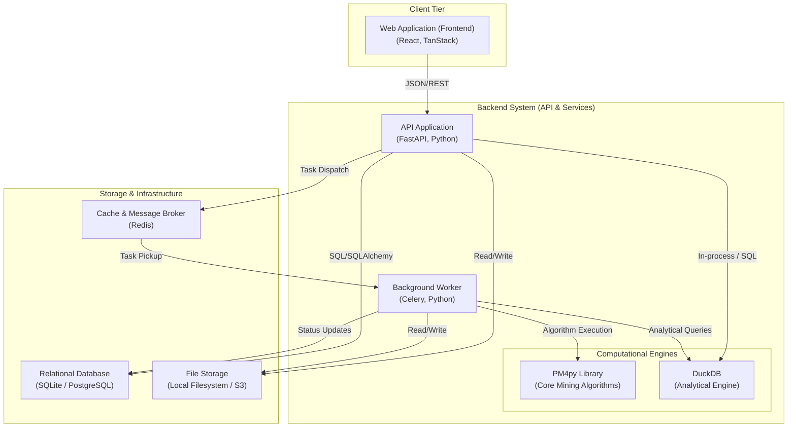

# Backend System Context (C4 Level 2 - Container Diagram)

This document provides a detailed architectural overview of the Process Mining Backend using the C4 model's Container level. It describes the high-level technical building blocks and how they interact to provide process mining capabilities.

## Container Diagram

## Container Descriptions

### 1. Web Application (Frontend)

- **Technology**: React, TanStack (Query, Table, Router), Tailwind CSS.
- **Responsibility**: Provides the user interface for process exploration, dashboarding, and administrative tasks.
- **Interactions**: Communicates with the API Application via RESTful JSON over HTTPS.

### 2. API Application (Backend)

- **Technology**: FastAPI, Pydantic, SQLAlchemy.
- **Responsibility**:
  - Exposes REST endpoints for the frontend.
  - Handles authentication and authorization (via JWT).
  - Manages project and workspace metadata.
  - Orchestrates short-lived process mining operations (e.g., getting a process map).
  - Dispatches long-running tasks to the background worker.
- **Interactions**:
  - **Relational DB**: Stores metadata, configurations, and user data.
  - **Redis**: Used for session caching and as a broker for Celery.
  - **File Storage**: Handles uploads of event logs (CSV, XES, OCEL).
  - **DuckDB**: Executes high-performance analytical queries for real-time filtering and statistics.

### 3. Background Worker (Celery)

- **Technology**: Celery, Python.
- **Responsibility**: Handles computationally expensive or long-running tasks such as log ingestion, large-scale mining, conformance checking, and predictive modeling.
- **Interactions**:
  - **Redis**: Fetches task definitions from the queue.
  - **PM4py**: Leverages specialized algorithms for log processing and model generation.
  - **File Storage**: Reads raw logs and writes processed artifacts (models, filtered logs).
  - **Relational DB**: Updates task status and stores final results.

### 4. Relational Database

- **Technology**: SQLite (Development) / PostgreSQL (Production).
- **Responsibility**: Durable storage for application state, including:
  - User accounts and permissions.
  - Workspace and Project configurations.
  - Metadata for uploaded logs.
  - Saved analysis views and dashboards.

### 5. DuckDB Engine

- **Technology**: DuckDB (Embedded).
- **Responsibility**: Serves as the high-speed analytical backend. It processes event logs in a columnar format (Parquet/Memory) to provide instant feedback on filters, KPIs, and aggregations.
- **Interactions**: Queried by both the API Application (for real-time UI updates) and the Worker (during ingestion/analysis).

### 6. PM4py Engine

- **Technology**: PM4py (Python Library).
- **Responsibility**: The core library implementing official process mining standards. Used for discovery (Inductive Miner, Heuristics Miner), conformance checking (Alignments, Token Replaying), and social network analysis.
- **Interactions**: Embedded within the API and Worker processes.

### 7. File Storage

- **Technology**: Local Filesystem (Dev) / Cloud Storage (Production - e.g., AWS S3).
- **Responsibility**: Stores large binary or flat files:
  - Raw event logs (CSV, XES).
  - Deserialized process models (Petri Nets, BPMN).
  - Large intermediate datasets.

### 8. Message Broker (Redis)

- **Technology**: Redis.
- **Responsibility**:
  - **Task Broker**: Acts as the queue for Celery.
  - **Result Backend**: Stores temporary task results.
  - **Distributed Cache**: Speeds up repeated API requests.
