# Architecture Diagrams

This document contains detailed Mermaid diagrams illustrating the Process Mining SaaS Platform architecture.

## Table of Contents

1. [System Architecture Overview](#1-system-architecture-overview)
2. [Backend Layered Architecture](#2-backend-layered-architecture)
3. [Backend Domain Structure](#3-backend-domain-structure)
4. [Database Entity Relationships](#4-database-entity-relationships)
5. [API Request Flow](#5-api-request-flow)
6. [Frontend Architecture](#6-frontend-architecture)
7. [Data Ingestion Pipeline](#7-data-ingestion-pipeline)
8. [Process Discovery Flow](#8-process-discovery-flow)
9. [Authentication Flow](#9-authentication-flow)
10. [Multi-Tenancy Hierarchy](#10-multi-tenancy-hierarchy)

---

## 1. System Architecture Overview

High-level view of the entire platform stack.

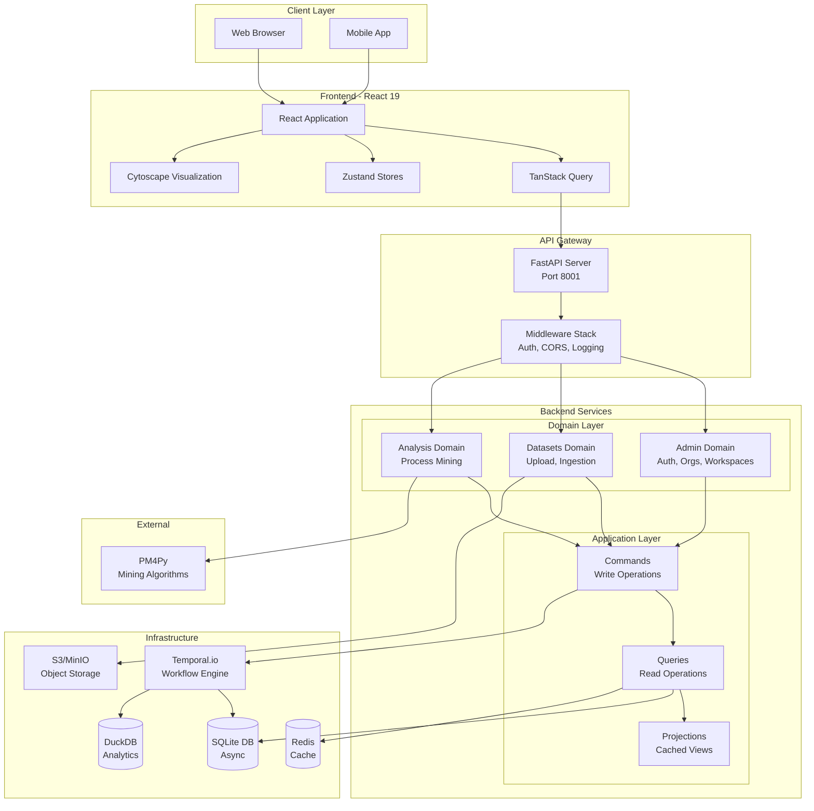

---

## 2. Backend Layered Architecture

Dependency flow enforced by import-linter.

```mermaid
graph TB
    subgraph "API Layer"
        direction LR
        MainApp[api/main.py<br/>App Factory]
        Routers[api/routers/<br/>Route Registry]
        Dependencies[api/dependencies.py<br/>DI Container]
    end

    subgraph "Features Layer"
        direction LR
        ProcessMining[features/process_mining/]
        Discovery[discovery/]
        Analytics[analytics/]
        Conformance[conformance/]
        Visualization[visualization/]
        Predictions[predictions/]
        OCPM[ocpm/]
    end

    subgraph "Application Layer"
        direction LR
        AppCommands[application/commands/]
        AppQueries[application/queries/]
        AppProjections[application/projections/]
    end

    subgraph "Infrastructure Layer"
        direction LR
        Core[infra/core/<br/>Config, Security, Exceptions]
        Infra[infra/infrastructure/<br/>DB, Cache, Storage]
        Users[infra/users/<br/>Auth, RBAC]
        TemporalInfra[infra/temporal/<br/>Workflows, Activities]
    end

    subgraph "Shared Layer"
        direction LR
        SharedDB[shared/database.py]
        SharedSchemas[shared/schemas.py]
        SharedUtils[shared/utils/]
    end

    API Layer -->|imports| Features Layer
    API Layer -->|imports| Application Layer
    API Layer -->|imports| Infrastructure Layer

    Features Layer -->|imports| Application Layer
    Features Layer -->|imports| Infrastructure Layer
    Features Layer -->|imports| Shared Layer

    Application Layer -->|imports| Infrastructure Layer
    Application Layer -->|imports| Shared Layer

    Infrastructure Layer -->|imports| Shared Layer

    style API Layer fill:#e1f5fe
    style Features Layer fill:#fff3e0
    style Application Layer fill:#f3e5f5
    style Infrastructure Layer fill:#e8f5e9
    style Shared Layer fill:#fce4ec
```

---

## 3. Backend Domain Structure

Detailed view of the process mining feature modules.

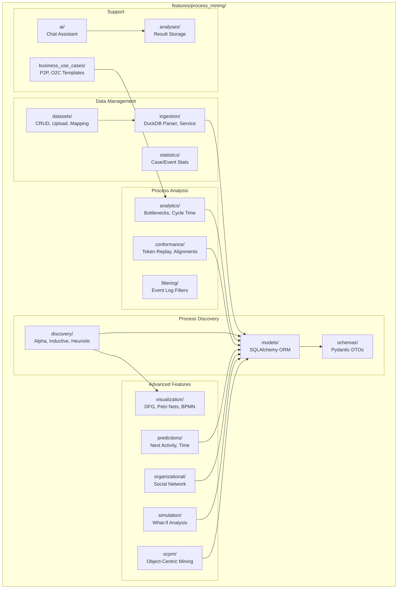

---

## 4. Database Entity Relationships

SQLAlchemy models and their relationships.

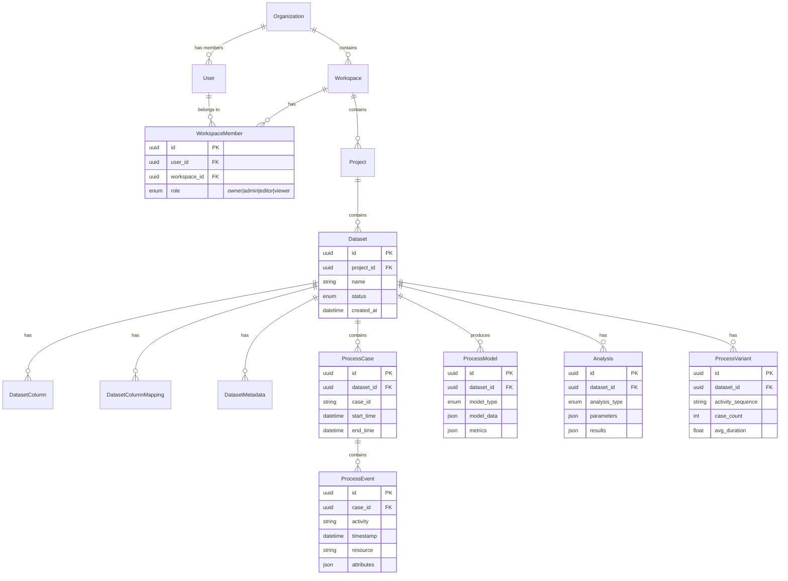

---

## 5. API Request Flow

Typical request lifecycle through the backend.

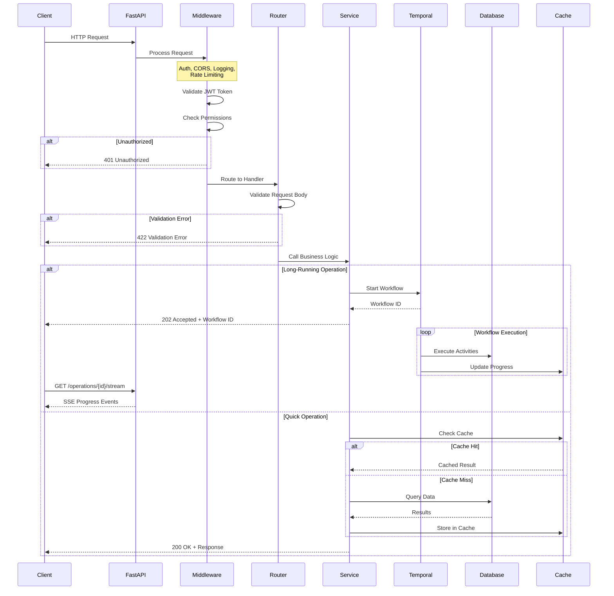

---

## 6. Frontend Architecture

React application structure and data flow.

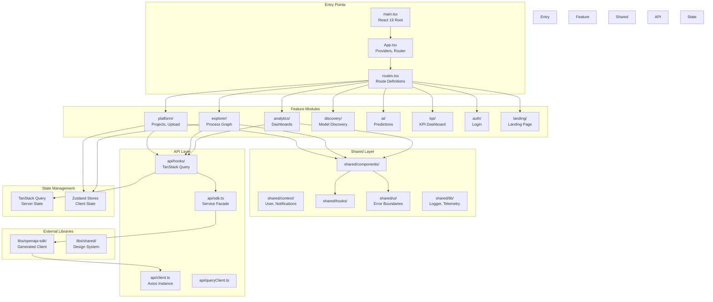

---

## 7. Data Ingestion Pipeline

Dataset upload and processing workflow.

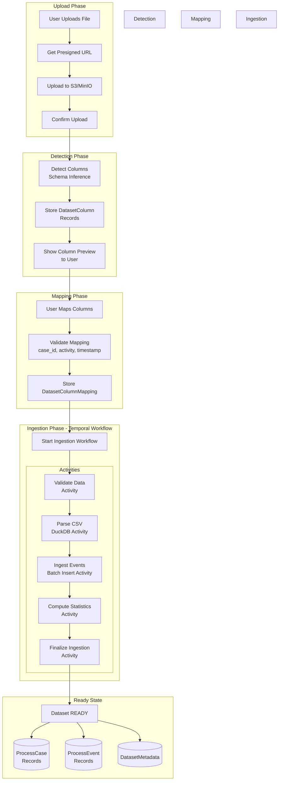

---

## 8. Process Discovery Flow

From dataset to process model visualization.

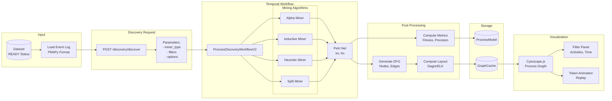

---

## 9. Authentication Flow

JWT-based authentication with refresh tokens.

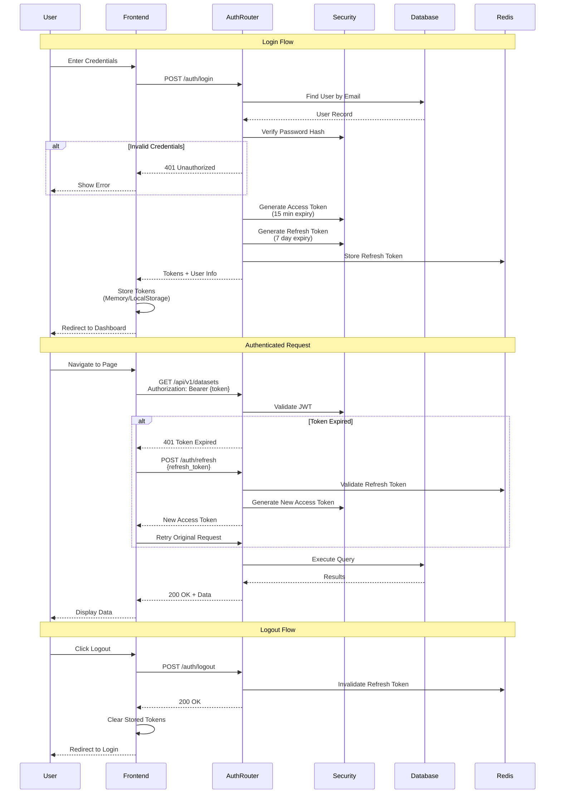

---

## 10. Multi-Tenancy Hierarchy

Organization, Workspace, and Project relationships with RBAC.

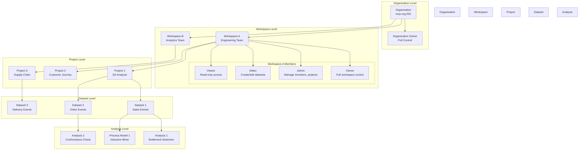

---

## 11. Temporal Workflow Architecture

Workflow and activity organization for async operations.

```mermaid
graph TB
    subgraph "Workflow Starters"
        APIRoutes[API Route Handlers]
        Scheduler[Scheduled Tasks]
    end

    subgraph "Temporal Server"
        Server[Temporal Server<br/>Workflow Orchestration]
        TaskQueues[Task Queues]
    end

    subgraph "Workflows V2"
        IngestionWF[DatasetIngestionWorkflowV2<br/>Parse & Store Events]
        ValidationWF[DatasetValidationWorkflowV2<br/>Schema Detection]
        DiscoveryWF[ProcessDiscoveryWorkflowV2<br/>Mining Algorithms]
        ConformanceWF[ConformanceCheckWorkflowV2<br/>Token Replay]
    end

    subgraph "Activities V2"
        subgraph "Ingestion Activities"
            ValidateAct[validate_dataset]
            ParseAct[parse_csv_duckdb]
            IngestAct[ingest_events_batch]
            StatsAct[compute_statistics]
            FinalizeAct[finalize_ingestion]
        end

        subgraph "Analysis Activities"
            LoadLogAct[load_event_log]
            MineAct[execute_mining]
            MetricsAct[compute_metrics]
            StoreAct[store_results]
        end
    end

    subgraph "Workers"
        IngestionWorker[Ingestion Worker<br/>ingestion-queue]
        AnalysisWorker[Analysis Worker<br/>analysis-queue]
    end

    subgraph "Progress Tracking"
        QueryHandler[Workflow Query Handler]
        SSEEndpoint[SSE Endpoint<br/>/operations/{id}/stream]
        Frontend[Frontend<br/>Real-time Updates]
    end

    APIRoutes --> Server
    Scheduler --> Server
    Server --> TaskQueues

    TaskQueues --> IngestionWF
    TaskQueues --> ValidationWF
    TaskQueues --> DiscoveryWF
    TaskQueues --> ConformanceWF

    IngestionWF --> ValidateAct
    IngestionWF --> ParseAct
    IngestionWF --> IngestAct
    IngestionWF --> StatsAct
    IngestionWF --> FinalizeAct

    DiscoveryWF --> LoadLogAct
    DiscoveryWF --> MineAct
    DiscoveryWF --> MetricsAct
    DiscoveryWF --> StoreAct

    IngestionWorker --> Ingestion Activities
    AnalysisWorker --> Analysis Activities

    IngestionWF --> QueryHandler
    DiscoveryWF --> QueryHandler
    QueryHandler --> SSEEndpoint
    SSEEndpoint --> Frontend
```

---

## 12. Frontend State Management

TanStack Query and Zustand integration.

```mermaid
graph TB
    subgraph "Components"
        Page[Page Component]
        Feature[Feature Component]
        UI[UI Component]
    end

    subgraph "TanStack Query - Server State"
        QueryClient[QueryClient]

        subgraph "Queries"
            UseDatasets[useDatasets()]
            UseAnalytics[useAnalytics()]
            UseDiscovery[useDiscovery()]
        end

        subgraph "Mutations"
            UseUpload[useUploadDataset()]
            UseDiscover[useDiscoverModel()]
            UseDelete[useDeleteDataset()]
        end

        Cache[(Query Cache)]
    end

    subgraph "Zustand - Client State"
        subgraph "Stores"
            UserStore[userStore<br/>Auth State]
            FilterStore[filterStore<br/>Filter State]
            UIStore[uiStore<br/>UI Preferences]
            WizardStore[wizardStore<br/>Upload Wizard]
            SelectionStore[selectionStore<br/>Selected Items]
        end
    end

    subgraph "React Context"
        UserContext[UserContext<br/>Current User]
        NotifContext[NotificationContext<br/>Toasts]
        HealthContext[BackendHealthContext<br/>System Status]
    end

    subgraph "API Layer"
        SDK[SDK Facade]
        Axios[Axios Client]
        Backend[Backend API]
    end

    Page --> UseDatasets
    Page --> UseAnalytics
    Feature --> UseDiscovery
    Feature --> UseUpload

    UseDatasets --> QueryClient
    UseAnalytics --> QueryClient
    UseDiscovery --> QueryClient
    UseUpload --> QueryClient
    UseDiscover --> QueryClient
    UseDelete --> QueryClient

    QueryClient --> Cache
    QueryClient --> SDK
    SDK --> Axios
    Axios --> Backend

    Page --> FilterStore
    Page --> UIStore
    Feature --> WizardStore
    UI --> SelectionStore

    Page --> UserContext
    Page --> NotifContext
    Feature --> HealthContext

    UserContext --> UserStore

    style Components fill:#e3f2fd
    style TanStack Query - Server State fill:#c8e6c9
    style Zustand - Client State fill:#fff9c4
    style React Context fill:#f3e5f5
```

---

## 13. Error Handling Architecture

Multi-layer error handling strategy.

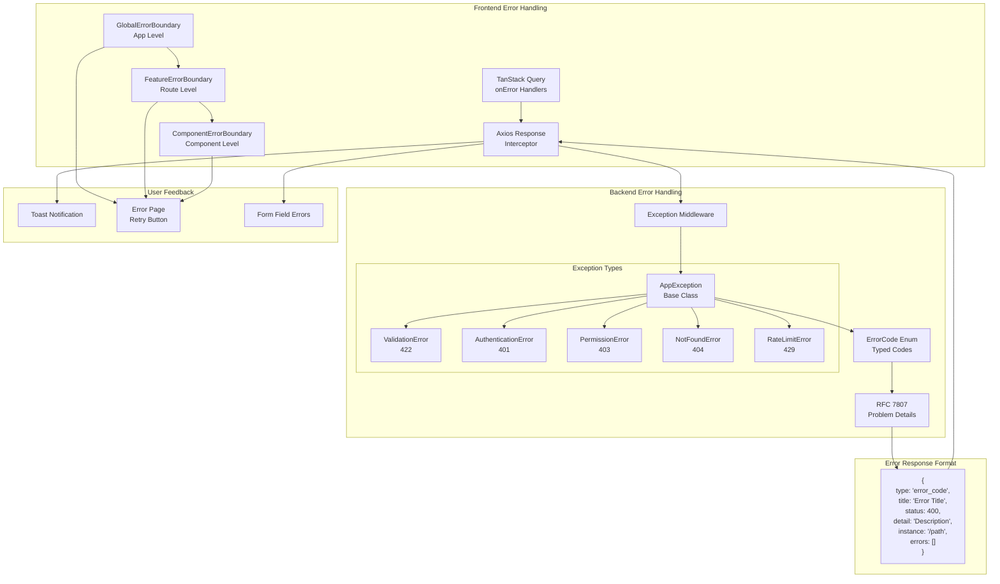

---

## 14. Process Mining Algorithm Pipeline

Available algorithms and their relationships.

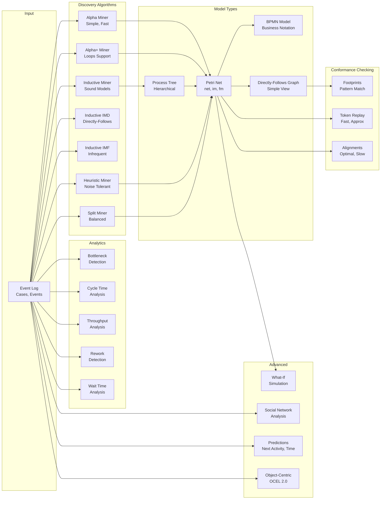

---

## 15. Deployment Architecture

Production deployment topology.

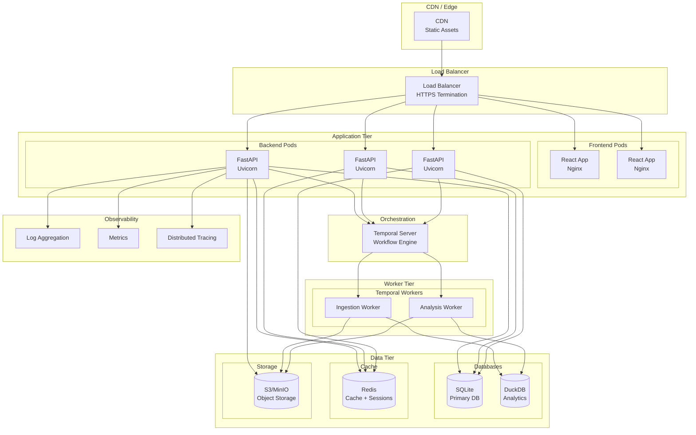

---

## Summary

These diagrams provide a comprehensive view of the Process Mining SaaS Platform:

| Diagram | Purpose |
|---------|---------|
| System Architecture | High-level component overview |
| Backend Layers | Dependency flow and import rules |
| Domain Structure | Process mining feature organization |
| Database ERD | Entity relationships |
| API Request Flow | Request lifecycle |
| Frontend Architecture | React app structure |
| Data Ingestion | Upload to ready pipeline |
| Process Discovery | Mining algorithm flow |
| Authentication | JWT token flow |
| Multi-Tenancy | Organization hierarchy |
| Temporal Workflows | Async operation architecture |
| State Management | Frontend data flow |
| Error Handling | Multi-layer error strategy |
| Algorithm Pipeline | Available mining algorithms |
| Deployment | Production topology |
