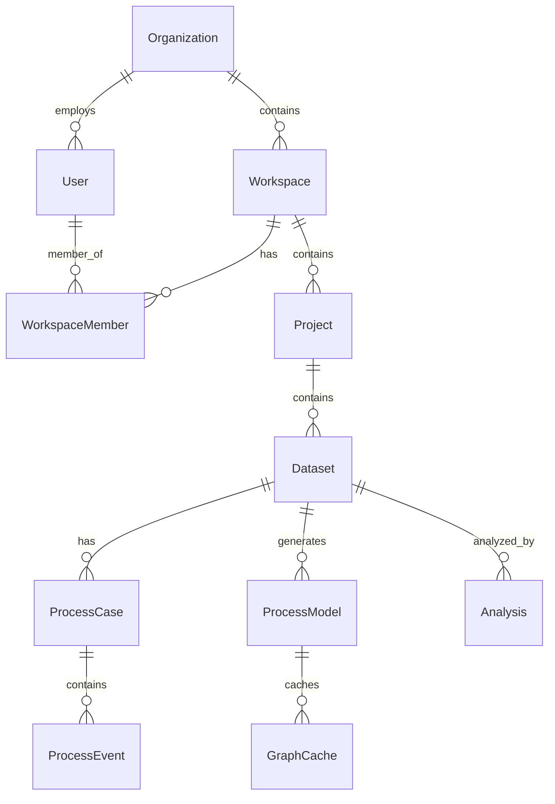

# Database Schema Reference

> **Process Mining SaaS Platform - Complete Database Schema**
> Last Updated: 2026-01-08

## Entity Relationship Overview

---

## Admin Domain

### organizations
Root multi-tenant entity.

| Column | Type | Constraints | Description |
|--------|------|-------------|-------------|
| id | VARCHAR(36) | PK | UUID |
| name | VARCHAR(255) | NOT NULL | Organization name |
| slug | VARCHAR(100) | NOT NULL, UNIQUE | URL-safe identifier |
| plan | VARCHAR(50) | DEFAULT 'free' | free/pro/enterprise |
| created_at | DATETIME | NOT NULL | Creation timestamp |
| updated_at | DATETIME | | Last modification |

### users
Authenticated platform users.

| Column | Type | Constraints | Description |
|--------|------|-------------|-------------|
| id | VARCHAR(36) | PK | UUID |
| org_id | VARCHAR(36) | FK → organizations | User's organization |
| email | VARCHAR(255) | NOT NULL, UNIQUE | Login email |
| name | VARCHAR(255) | | Display name |
| auth_provider | VARCHAR(50) | DEFAULT 'local' | local/google/github |
| auth_provider_id | VARCHAR(255) | | OAuth provider ID |
| role | VARCHAR(50) | DEFAULT 'member' | admin/member |
| password_hash | VARCHAR(255) | | Bcrypt hash |
| created_at | DATETIME | NOT NULL | Registration time |
| last_login_at | DATETIME | | Last login |

### workspaces
Collaborative containers with RBAC.

| Column | Type | Constraints | Description |
|--------|------|-------------|-------------|
| id | VARCHAR(36) | PK | UUID |
| org_id | VARCHAR(36) | FK → organizations, NOT NULL | Parent organization |
| name | VARCHAR(255) | NOT NULL | Workspace name |
| description | TEXT | | Optional description |
| created_at | DATETIME | NOT NULL | Creation timestamp |
| updated_at | DATETIME | | Last modification |

### workspace_members
Many-to-many user ↔ workspace with roles.

| Column | Type | Constraints | Description |
|--------|------|-------------|-------------|
| id | VARCHAR(36) | PK | UUID |
| workspace_id | VARCHAR(36) | FK → workspaces, NOT NULL | Parent workspace |
| user_id | VARCHAR(36) | FK → users, NOT NULL | Member user |
| role | VARCHAR(20) | DEFAULT 'member' | owner/admin/editor/analyst/viewer |
| joined_at | DATETIME | NOT NULL | Membership start |

**Unique Constraint**: (workspace_id, user_id)

### projects
Organizational containers for datasets.

| Column | Type | Constraints | Description |
|--------|------|-------------|-------------|
| id | VARCHAR(36) | PK | UUID |
| workspace_id | VARCHAR(36) | FK → workspaces | Parent workspace |
| name | VARCHAR(255) | NOT NULL | Project name |
| description | TEXT | | Optional description |
| tags_json | TEXT | | JSON array of tags |
| total_files | INT | DEFAULT 0 | Dataset count |
| total_analyses | INT | DEFAULT 0 | Analysis count |
| created_at | DATETIME | NOT NULL | Creation timestamp |
| updated_at | DATETIME | | Last modification |

---

## Datasets Domain

### datasets
Event log metadata and lifecycle tracking.

| Column | Type | Constraints | Description |
|--------|------|-------------|-------------|
| id | VARCHAR(36) | PK | UUID |
| name | VARCHAR(255) | NOT NULL | Dataset name |
| project_id | VARCHAR(36) | FK → projects | Parent project |
| source_file | VARCHAR(500) | | Original filename |
| source_format | VARCHAR(20) | DEFAULT 'csv' | csv/xes |
| status | VARCHAR(20) | DEFAULT 'pending' | Lifecycle state |
| total_cases | INT | DEFAULT 0 | Case count |
| total_events | INT | DEFAULT 0 | Event count |
| total_activities | INT | DEFAULT 0 | Unique activities |
| activities_json | TEXT | | Activity list JSON |
| statistics_json | TEXT | | Computed statistics |
| mapping_json | TEXT | | Column mapping |
| column_suggestions_json | TEXT | | Auto-detected columns |
| detected_columns_json | TEXT | | Raw column info |
| file_size_bytes | INT | | File size |
| storage_key | VARCHAR(500) | | S3 object key |
| error_message | TEXT | | Error details |
| validation_job_id | VARCHAR(36) | FK → async_jobs | Validation job |
| ingestion_job_id | VARCHAR(36) | FK → async_jobs | Ingestion job |
| source_dataset_id | VARCHAR(36) | FK → datasets | For filtered datasets |
| filter_config_json | TEXT | | Filter settings |
| is_filtered | BOOL | DEFAULT false | Is derived dataset |
| created_at | DATETIME | NOT NULL | Creation timestamp |
| updated_at | DATETIME | | Last modification |

**Status Values**: pending, validating, awaiting_mapping, ingesting, ready, error

### dataset_columns
Detected columns with statistics for mapping UI.

| Column | Type | Constraints | Description |
|--------|------|-------------|-------------|
| id | VARCHAR(36) | PK | UUID |
| dataset_id | VARCHAR(36) | FK → datasets, NOT NULL | Parent dataset |
| name | VARCHAR(255) | NOT NULL | Column name |
| dtype | VARCHAR(50) | NOT NULL | STRING/INTEGER/DATETIME/FLOAT |
| position | INT | NOT NULL | Column order |
| sample_values_json | TEXT | | Sample data |
| null_count | INT | DEFAULT 0 | Null value count |
| null_percentage | FLOAT | DEFAULT 0.0 | Null percentage |
| unique_count | INT | DEFAULT 0 | Distinct values |
| suggested_role | VARCHAR(50) | | case_id/activity/timestamp/resource |
| suggestion_confidence | FLOAT | | 0.0-1.0 confidence |
| created_at | DATETIME | NOT NULL | Detection timestamp |

### dataset_column_mappings
User-defined semantic column mappings.

| Column | Type | Constraints | Description |
|--------|------|-------------|-------------|
| id | VARCHAR(36) | PK | UUID |
| dataset_id | VARCHAR(36) | FK → datasets, UNIQUE | Parent dataset |
| case_id_column | VARCHAR(255) | NOT NULL | Case ID column name |
| activity_column | VARCHAR(255) | NOT NULL | Activity column name |
| timestamp_column | VARCHAR(255) | NOT NULL | Timestamp column name |
| timestamp_format | VARCHAR(100) | | Custom date format |
| resource_column | VARCHAR(255) | | Optional resource column |
| additional_columns_json | TEXT | | Extra attribute columns |
| confidence_scores_json | TEXT | | ML confidence per column |
| auto_mapped | BOOL | DEFAULT false | Auto vs manual mapping |
| created_at | DATETIME | NOT NULL | Creation timestamp |
| updated_at | DATETIME | | Last modification |

### uploaded_files
Original file metadata.

| Column | Type | Constraints | Description |
|--------|------|-------------|-------------|
| id | VARCHAR(36) | PK | UUID |
| dataset_id | VARCHAR(36) | FK → datasets, UNIQUE | Parent dataset |
| filename | VARCHAR(500) | NOT NULL | Original filename |
| storage_path | VARCHAR(1000) | NOT NULL | S3 path |
| size_bytes | INT | | File size |
| mime_type | VARCHAR(100) | | Content type |
| checksum | VARCHAR(64) | | SHA-256 hash |
| created_at | DATETIME | NOT NULL | Upload timestamp |

---

## Analysis Domain

### process_cases
Individual traces/cases in a dataset.

| Column | Type | Constraints | Description |
|--------|------|-------------|-------------|
| id | VARCHAR(36) | PK | UUID |
| dataset_id | VARCHAR(36) | FK → datasets, NOT NULL | Parent dataset |
| case_id | VARCHAR(255) | NOT NULL | Business case ID |
| variant_key | TEXT | | Activity sequence signature |
| start_time | DATETIME | | First event timestamp |
| end_time | DATETIME | | Last event timestamp |

**Indexes**: dataset_id, case_id, variant_key

### process_events
Individual events in traces.

| Column | Type | Constraints | Description |
|--------|------|-------------|-------------|
| id | VARCHAR(36) | PK | UUID |
| case_ref_id | VARCHAR(36) | FK → process_cases, NOT NULL | Parent case |
| activity_id | INT | FK → lookup_activities | Normalized activity |
| resource_id | INT | FK → lookup_resources | Normalized resource |
| activity | VARCHAR(255) | NOT NULL | Activity name (denormalized) |
| resource | VARCHAR(255) | | Resource name (denormalized) |
| timestamp | DATETIME | NOT NULL | Event timestamp |
| attributes_json | TEXT | | Additional attributes |

**Indexes**: case_ref_id, activity_id, (case_ref_id, timestamp), (activity_id, timestamp)

### lookup_activities
Normalized activity strings for storage efficiency.

| Column | Type | Constraints | Description |
|--------|------|-------------|-------------|
| id | INT | PK, AUTO_INCREMENT | Integer ID |
| dataset_id | VARCHAR(36) | FK → datasets, NOT NULL | Parent dataset |
| name | VARCHAR(255) | NOT NULL | Activity name |

**Unique Constraint**: (dataset_id, name)

### lookup_resources
Normalized resource strings for storage efficiency.

| Column | Type | Constraints | Description |
|--------|------|-------------|-------------|
| id | INT | PK, AUTO_INCREMENT | Integer ID |
| dataset_id | VARCHAR(36) | FK → datasets, NOT NULL | Parent dataset |
| name | VARCHAR(255) | NOT NULL | Resource name |

**Unique Constraint**: (dataset_id, name)

### process_models
Discovered process models (Petri nets, BPMN).

| Column | Type | Constraints | Description |
|--------|------|-------------|-------------|
| id | VARCHAR(36) | PK | UUID |
| name | VARCHAR(255) | NOT NULL | Model name |
| dataset_id | VARCHAR(36) | FK → datasets | Source dataset |
| miner_type | VARCHAR(50) | NOT NULL | alpha/inductive/heuristic/split |
| model_format | VARCHAR(50) | NOT NULL | pnml/bpmn/petri_net |
| serialized_model | BLOB | DEFERRED | Binary model data |
| standard_content_path | VARCHAR(500) | | File path to PNML/BPMN |
| graph_structure_json | TEXT | | Cytoscape.js format |
| metadata_json | TEXT | | Model metadata |
| fitness | FLOAT | | Fitness score |
| precision | FLOAT | | Precision score |
| created_at | DATETIME | NOT NULL | Discovery timestamp |

### analyses
Stored analysis results.

| Column | Type | Constraints | Description |
|--------|------|-------------|-------------|
| id | VARCHAR(36) | PK | UUID |
| dataset_id | VARCHAR(36) | FK → datasets, NOT NULL | Source dataset |
| name | VARCHAR(255) | NOT NULL | Analysis name |
| analysis_type | VARCHAR(50) | NOT NULL | discovery/conformance/analytics |
| config_json | TEXT | | Analysis configuration |
| status | VARCHAR(20) | DEFAULT 'pending' | pending/running/completed/failed |
| error_message | TEXT | | Error details |
| result_summary_json | TEXT | | Summary results |
| result_json | TEXT | DEFERRED | Full results |
| model_id | VARCHAR(36) | FK → process_models | Generated model |
| created_at | DATETIME | NOT NULL | Creation timestamp |
| completed_at | DATETIME | | Completion timestamp |

### conformance_results
Conformance checking results.

| Column | Type | Constraints | Description |
|--------|------|-------------|-------------|
| id | VARCHAR(36) | PK | UUID |
| dataset_id | VARCHAR(36) | FK → datasets, NOT NULL | Event log |
| model_id | VARCHAR(36) | FK → process_models, NOT NULL | Reference model |
| fitness | FLOAT | NOT NULL | Fitness score (0-1) |
| precision | FLOAT | | Precision score (0-1) |
| method | VARCHAR(50) | DEFAULT 'token_replay' | token_replay/alignments |
| generalization | FLOAT | | Generalization score |
| simplicity | FLOAT | | Simplicity score |
| f_score | FLOAT | | F-measure |
| non_fitting_traces | INT | | Count of deviating traces |
| average_alignment_cost | FLOAT | | Alignment cost |
| diagnostics_json | TEXT | | Detailed diagnostics |
| created_at | DATETIME | NOT NULL | Computation timestamp |

### graph_cache
Cached graph layouts for visualization.

| Column | Type | Constraints | Description |
|--------|------|-------------|-------------|
| id | VARCHAR(36) | PK | UUID |
| model_id | VARCHAR(36) | FK → process_models, NOT NULL | Parent model |
| abstraction_level | INT | DEFAULT 0 | Zoom level |
| layout_algorithm | VARCHAR(50) | DEFAULT 'dagre' | dagre/elk/cola |
| cached_layout_json | TEXT | | Positioned nodes/edges |
| expires_at | DATETIME | | Cache expiration |
| created_at | DATETIME | NOT NULL | Cache timestamp |
| updated_at | DATETIME | NOT NULL | Last refresh |

---

## Platform Infrastructure

### async_jobs
Background job tracking.

| Column | Type | Constraints | Description |
|--------|------|-------------|-------------|
| id | VARCHAR(36) | PK | UUID |
| task_id | VARCHAR(255) | UNIQUE | Celery task ID |
| user_id | VARCHAR(36) | | Triggering user |
| job_type | VARCHAR(50) | NOT NULL | ingestion/discovery/analysis |
| status | VARCHAR(20) | DEFAULT 'pending' | pending/running/completed/failed/cancelled |
| progress | INT | DEFAULT 0 | 0-100 percentage |
| stage | VARCHAR(100) | | Current stage description |
| entity_type | VARCHAR(50) | | project/dataset/analysis |
| entity_id | VARCHAR(36) | | Related entity ID |
| parent_job_id | VARCHAR(36) | FK → async_jobs | Parent job (for sub-jobs) |
| parameters_json | TEXT | | Job parameters |
| result_json | TEXT | | Job results |
| error | TEXT | | Error traceback |
| error_message | TEXT | | User-friendly error |
| created_at | DATETIME | NOT NULL | Creation timestamp |
| started_at | DATETIME | | Execution start |
| completed_at | DATETIME | | Completion timestamp |
| updated_at | DATETIME | | Last update |

**Indexes**: task_id, user_id, job_type, status, entity_type, entity_id

### error_logs
Application error tracking.

| Column | Type | Constraints | Description |
|--------|------|-------------|-------------|
| id | VARCHAR(36) | PK | UUID |
| timestamp | DATETIME | NOT NULL | Error time |
| level | VARCHAR(20) | NOT NULL | error/warning/info |
| exception_type | VARCHAR(255) | NOT NULL | Exception class |
| exception_message | TEXT | NOT NULL | Error message |
| stack_trace | TEXT | | Full traceback |
| request_id | VARCHAR(36) | | Correlation ID |
| user_id | VARCHAR(36) | | Triggering user |
| endpoint | VARCHAR(255) | | API endpoint |
| method | VARCHAR(10) | | HTTP method |
| context_json | TEXT | | Additional context |
| resolved | BOOL | DEFAULT false | Resolution status |
| resolved_at | DATETIME | | Resolution timestamp |
| resolved_by | VARCHAR(36) | | Resolver user ID |
| notes | TEXT | | Resolution notes |

---

## OCEL 2.0 (Object-Centric Process Mining)

### ocel2_event_types
Event type definitions.

| Column | Type | Constraints | Description |
|--------|------|-------------|-------------|
| id | VARCHAR(36) | PK | UUID |
| name | VARCHAR(255) | NOT NULL, UNIQUE | Event type name |
| attributes_schema | JSON | | Attribute schema definition |

### ocel2_object_types
Object type definitions.

| Column | Type | Constraints | Description |
|--------|------|-------------|-------------|
| id | VARCHAR(36) | PK | UUID |
| name | VARCHAR(255) | NOT NULL, UNIQUE | Object type name |
| attributes_schema | JSON | | Attribute schema definition |

### ocel2_events
Object-centric events.

| Column | Type | Constraints | Description |
|--------|------|-------------|-------------|
| id | VARCHAR(36) | PK | UUID |
| event_type_id | VARCHAR(36) | FK → ocel2_event_types, NOT NULL | Event type |
| activity | VARCHAR(255) | NOT NULL | Activity name |
| timestamp | DATETIME | NOT NULL | Event timestamp |
| attributes | JSON | | Event attributes |
| source_dataset_id | VARCHAR(36) | FK → datasets | Source dataset |
| created_at | DATETIME | NOT NULL | Creation timestamp |

### ocel2_objects
Object instances.

| Column | Type | Constraints | Description |
|--------|------|-------------|-------------|
| id | VARCHAR(36) | PK | UUID |
| object_type_id | VARCHAR(36) | FK → ocel2_object_types, NOT NULL | Object type |
| object_id | VARCHAR(255) | NOT NULL | Business object ID |
| attributes | JSON | | Object attributes |
| created_at | DATETIME | NOT NULL | Creation timestamp |

### ocel2_e2o_relations
Event-to-object relationships (many-to-many).

| Column | Type | Constraints | Description |
|--------|------|-------------|-------------|
| id | VARCHAR(36) | PK | UUID |
| event_id | VARCHAR(36) | FK → ocel2_events, NOT NULL | Event |
| object_id | VARCHAR(36) | FK → ocel2_objects, NOT NULL | Object |
| qualifier | VARCHAR(50) | DEFAULT 'involved' | Relationship type |

### ocel2_o2o_relations
Object-to-object relationships (graph structure).

| Column | Type | Constraints | Description |
|--------|------|-------------|-------------|
| id | VARCHAR(36) | PK | UUID |
| source_object_id | VARCHAR(36) | FK → ocel2_objects, NOT NULL | Source object |
| target_object_id | VARCHAR(36) | FK → ocel2_objects, NOT NULL | Target object |
| qualifier | VARCHAR(50) | NOT NULL | Relationship type |
| attributes | JSON | | Relationship attributes |
| created_at | DATETIME | NOT NULL | Creation timestamp |

---

## Design Patterns

### 1. UUID Primary Keys
All domain entities use `VARCHAR(36)` UUIDs for distributed ID generation without coordination.

### 2. Soft Deletes via CASCADE
Foreign keys use `ON DELETE CASCADE` or `ON DELETE SET NULL` for referential integrity.

### 3. JSON Columns
Flexible metadata stored as JSON text for semi-structured data that varies per entity.

### 4. Normalized Lookups
`lookup_activities` and `lookup_resources` normalize high-cardinality strings:
- Storage: 4-byte int vs 255-byte varchar = 9x smaller indexes
- Query perf: Integer JOIN > String comparison

### 5. Deferred Loading
Large BLOB columns (`serialized_model`, `result_json`) marked as DEFERRED to prevent OOM.

### 6. Status Tracking
All async operations use:
- `status` field (pending, running, completed, failed)
- `error_message` for failures
- FK to `async_jobs` table

---

## Statistics

| Category | Table Count |
|----------|-------------|
| Admin Domain | 5 |
| Datasets Domain | 4 |
| Analysis Domain | 8 |
| Platform Infrastructure | 2 |
| OCEL 2.0 | 6 |
| **Total** | **25** |

**Foreign Keys**: 40+ relationships
**Indexes**: 30+ for query optimization
