# API Entity Relationship Diagrams (ERD)

This document provides a comprehensive overview of the data models and relationships handled by the various API endpoints.

## Global Overview

The following diagram shows the core entities and their high-level relationships across the Platform and Feature (Process Mining) layers.

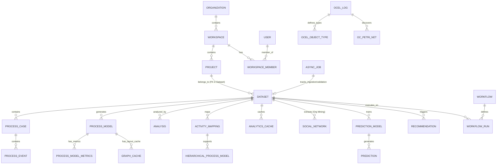

---

## 1. Platform APIs

### Projects API (`/api/v1/projects`)
Handles project lifecycle within a workspace.

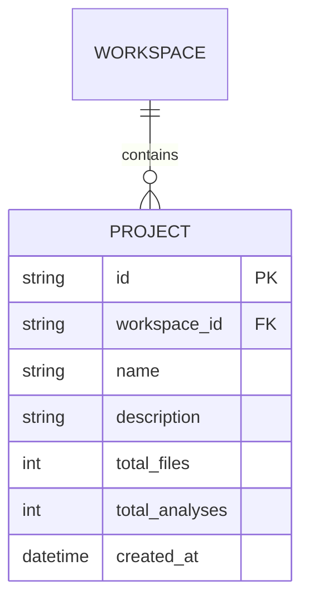

### Workspaces API (`/api/v1/workspaces`)
Manages workspaces and memberships.

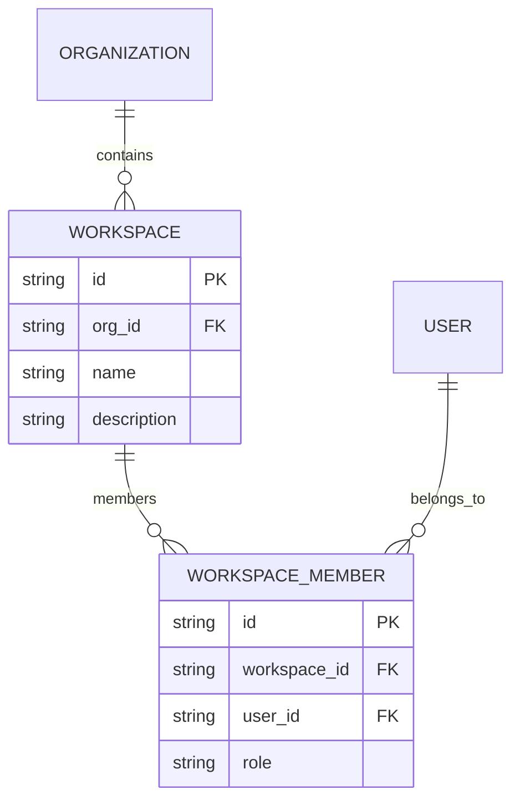

---

## 2. Process Mining APIs

### Datasets API (`/api/v1/datasets`)
Management of event logs, ingestion, and basic statistics.

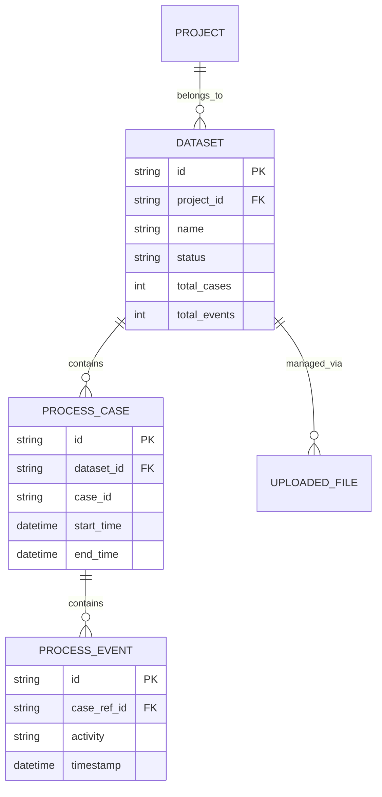

### Analyses API (`/api/v1/analyses`)
Execution and storage of process mining analyses.

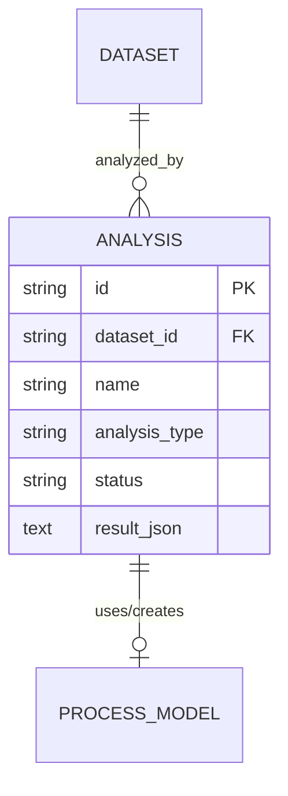

### Visualization API (`/api/v1/visualization`)
DFG and Petri Net visualization data.

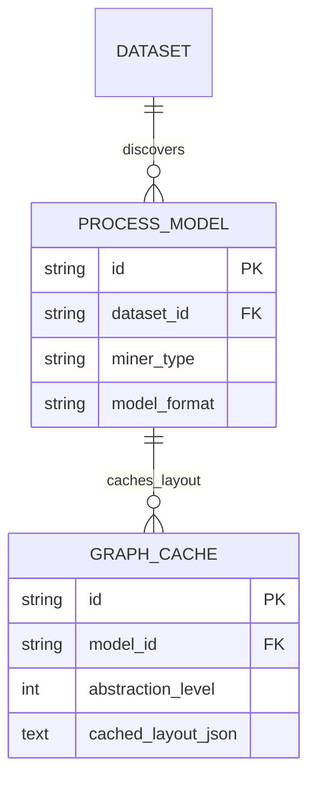

### Analytics API (`/api/v1/analytics`)
Bottlenecks, rework, and performance metrics.

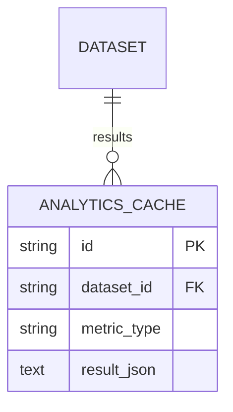

### Predictions API (`/api/v1/predictions`)
Machine Learning models and predictions for process cases.

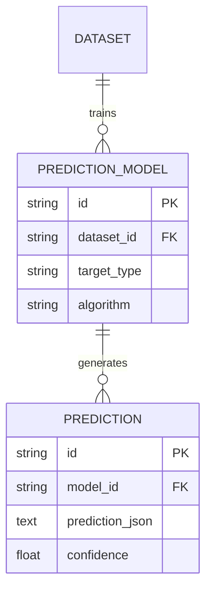

### Simulation & Recommendations API (`/api/v1/simulation`)
Process simulation and prescriptive recommendations.

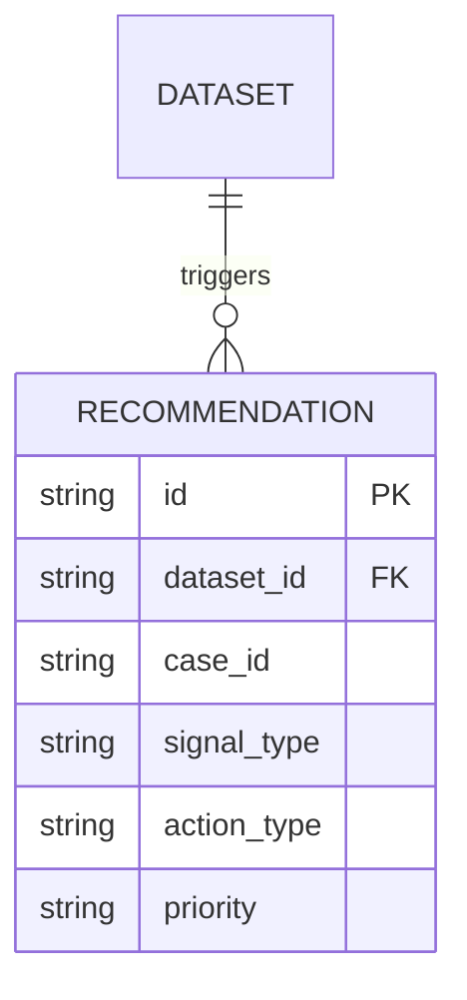

### Object-Centric Process Mining (OCPM) API (`/api/v1/ocpm`)
Handling of OCEL (Object-Centric Event Logs).

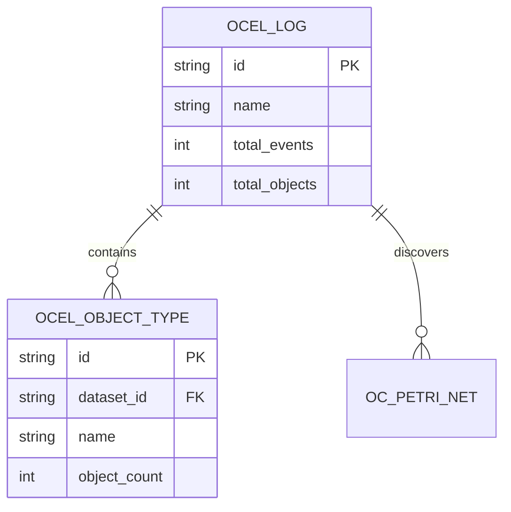

### Workflows API (`/api/v1/workflows`)
Automated processing pipelines.

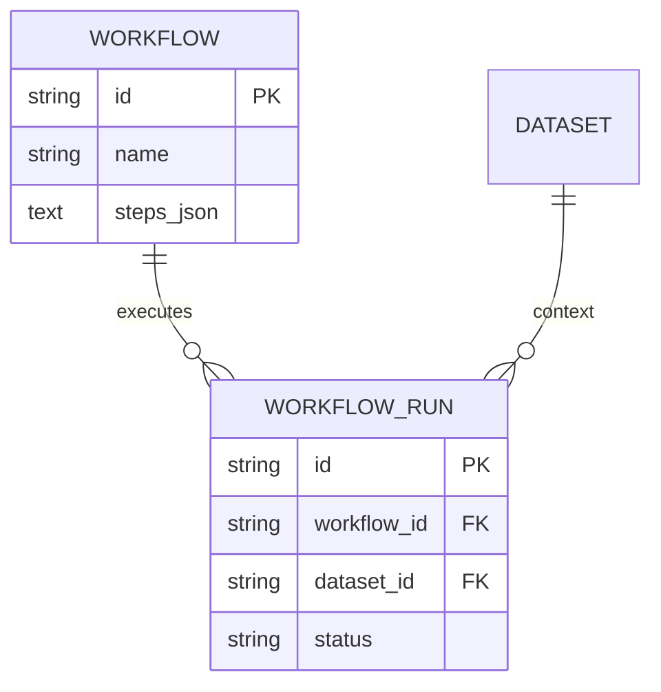

---

## Endpoint to Entity Mapping (Key Examples)

| Router | Endpoint | Primary Entity | Secondary Entities |
| :--- | :--- | :--- | :--- |
| Datasets | `POST /datasets/upload` | `Dataset` | `UploadedFile`, `Project` |
| Datasets | `GET /datasets/{id}/cases` | `ProcessCase` | `Dataset` |
| Analyses | `POST /analyses` | `Analysis` | `Dataset`, `ProcessModel` |
| Visualization | `GET /datasets/{id}/dfg` | `Dataset` | `ProcessEvent` (calculated) |
| Predictions | `POST /predictions/train` | `PredictionModel` | `Dataset` |
| Simulation | `GET /recommendations` | `Recommendation` | `Dataset` |
| OCPM | `GET /ocpm/logs` | `OCELLog` | - |
| Workflows | `POST /workflows` | `Workflow` | - |
| Workflows | `POST /workflows/{id}/run` | `WorkflowRun` | `Workflow`, `Dataset` |
