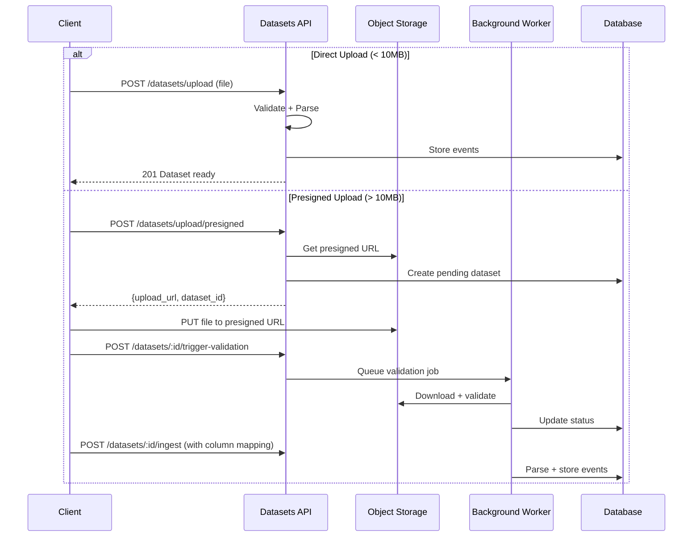

# System Architecture

> **Process Mining SaaS Platform - Technical Architecture Reference**
> Last Updated: 2026-01-08

## Overview

A full-stack Process Mining SaaS platform with:
- **Backend**: FastAPI + PM4Py + DuckDB
- **Frontend**: React 19 + Nx + TanStack Query
- **Storage**: SQLite (async) + S3/MinIO
- **Jobs**: Celery + Redis

---

## 1. Domain Architecture

The system is organized around five core user Jobs-To-Be-Done (JTBDs):

```
                    +-----------------------+
                    |     Admin Domain      |
                    |  (Multi-tenant Auth)  |
                    +-----------+-----------+
                                |
            +-------------------+-------------------+
            |                   |                   |
+-----------v-----------+   +---v---+   +-----------v-----------+
|   Datasets Domain     |   |  AI   |   |   Analysis Domain     |
|  (Upload, Ingest)     |   | (LLM) |   | (Discovery, Analytics)|
+-----------------------+   +-------+   +-----------------------+
            |                               |
            +---------------+---------------+
                            |
                +-----------v-----------+
                |  Platform Infrastructure |
                |  (DB, Storage, Jobs)     |
                +-------------------------+
```

### Domain Responsibilities

| Domain | User Job | Key Services |
|--------|----------|--------------|
| **Admin** | "Manage my organization and team" | Auth, RBAC, Workspaces, Projects |
| **Datasets** | "Get my data into the system" | Upload, Column Detection, Ingestion |
| **Analysis** | "Discover and analyze my process" | Mining, Conformance, Analytics |
| **AI** | "Query data with natural language" | LLM Integration, RAG |
| **Platform** | Infrastructure foundation | Database, Storage, Jobs, Health |

---

## 2. Platform Layer Architecture

```mermaid
graph TB
    subgraph "API Gateway"
        Gateway[FastAPI App]
        Auth[JWT Middleware]
        CORS[CORS Handler]
        RateLimit[Rate Limiter]
    end

    subgraph "Platform APIs"
        HealthAPI[/health/*]
        AuthAPI[/auth/*]
        WorkspaceAPI[/workspaces/*]
        ProjectAPI[/projects/*]
        JobsAPI[/jobs/*]
    end

    subgraph "Authorization"
        AuthZ[Authorization Service]
        RBAC[Role-Based Access]
    end

    subgraph "Data Layer"
        DB[(SQLite/PostgreSQL)]
        Cache[(Redis Cache)]
        S3[S3/MinIO Storage]
    end

    Gateway --> Auth --> CORS --> RateLimit
    RateLimit --> HealthAPI & AuthAPI & WorkspaceAPI & ProjectAPI & JobsAPI
    AuthAPI & WorkspaceAPI & ProjectAPI & JobsAPI --> AuthZ
    AuthZ --> RBAC
    HealthAPI & AuthAPI & WorkspaceAPI & ProjectAPI --> DB
    AuthAPI --> Cache
    WorkspaceAPI & ProjectAPI --> S3
```

### Multi-Tenant Hierarchy

```
Organization (root tenant)
  |
  +-- Workspace (collaboration context, RBAC)
        |
        +-- Project (container for datasets)
              |
              +-- Dataset (event log)
                    |
                    +-- Analysis/Model
```

### RBAC Roles

| Role | Permissions |
|------|-------------|
| **owner** | Full control, delete workspace |
| **admin** | Manage members, update settings |
| **editor** | Create/update projects and datasets |
| **analyst** | Read data, run analyses |
| **viewer** | Read-only access |

---

## 3. Datasets Module Architecture

### Upload Flows



### Dataset Lifecycle States

```
PENDING --> VALIDATING --> AWAITING_MAPPING --> INGESTING --> READY
                 |               |                  |
                 v               v                  v
               ERROR          ERROR              ERROR
```

### DuckDB Ingestion Pipeline

```
CSV Upload --> DuckDB read_csv_auto() --> Type Inference
                                              |
                                              v
                               Arrow Tables (zero-copy)
                                              |
                                              v
                               PostgreSQL COPY (bulk insert)
                                              |
                                              v
                               Statistics Computation
```

**Performance**: 100MB/s CSV parsing, 10K+ rows/sec insertion

---

## 4. Analysis Module Architecture

### Process Mining Capabilities

| Category | Algorithms |
|----------|------------|
| **Discovery** | Alpha Miner, Inductive Miner, Heuristics Miner, Split Miner |
| **Conformance** | Token Replay, Alignments, Footprint Comparison |
| **Analytics** | Bottlenecks, Cycle Times, Throughput, Rework Detection |
| **Prediction** | Next Activity, Remaining Time (ML-based) |
| **Organizational** | Social Networks, Resource Handovers |
| **OCPM** | Object-Centric Process Mining (OCEL 2.0) |

### Analytics Data Flow

```
Dataset --> EventLogLoader --> PM4Py/DuckDB
                                   |
               +-------------------+-------------------+
               |                   |                   |
        MiningService      AnalyticsService    ConformanceService
               |                   |                   |
               v                   v                   v
         ProcessModel         Bottlenecks        FitnessReport
```

---

## 5. Background Jobs Architecture

### Job Lifecycle

```
[*] --> pending (Job created)
         |
         v
      running (Worker picks up)
         |
    +----+----+
    |    |    |
    v    v    v
completed failed cancelled
```

### SSE Progress Streaming

```
Client --> GET /jobs/:id/stream --> Server-Sent Events
                                         |
                                         v
                           {status, progress, stage}
                                         |
                                         v
                           Connection closes on completion
```

---

## 6. API Endpoint Summary

### Platform APIs

| Endpoint | Method | Purpose |
|----------|--------|---------|
| `/health/live` | GET | Kubernetes liveness probe |
| `/health/ready` | GET | Kubernetes readiness probe |
| `/auth/register` | POST | User registration |
| `/auth/login` | POST | JWT authentication |
| `/auth/refresh` | POST | Token refresh |
| `/auth/me` | GET | Current user context |
| `/workspaces` | CRUD | Workspace management |
| `/projects` | CRUD | Project management |
| `/jobs/:id` | GET | Job status |
| `/jobs/:id/stream` | GET | SSE progress stream |

### Process Mining APIs

| Endpoint | Method | Purpose |
|----------|--------|---------|
| `/datasets/upload` | POST | Direct file upload |
| `/datasets/upload/presigned` | POST | Get presigned S3 URL |
| `/datasets/:id/ingest` | POST | Start ingestion with mapping |
| `/datasets/:id/statistics` | GET | Dataset statistics |
| `/datasets/:id/variants` | GET | Process variants |
| `/discovery/discover` | POST | Run process discovery |
| `/analytics/bottlenecks` | GET | Bottleneck analysis |
| `/conformance/check` | POST | Conformance checking |

---

## 7. Security Model

### Authentication
- JWT with RS256 signing
- Access tokens: 30 min expiry
- Refresh tokens: 7 day expiry
- Bcrypt password hashing (cost factor 12)

### Authorization
- Workspace-scoped RBAC
- Row-level security via ORM
- Permission checks on every mutation
- Organization boundary enforcement

### API Security
- CORS configuration
- Rate limiting (100 req/min standard, 10 req/min uploads)
- Input validation (Pydantic)
- SQL injection prevention (SQLAlchemy parameterized queries)

---

## 8. Performance Optimizations

### Database
- Indexed foreign keys
- Composite indexes for common queries
- Eager loading with `selectin` strategy
- Connection pooling (async engine)

### Data Processing
- DuckDB vectorized processing for large files
- Lookup tables for string normalization (Activity, Resource)
- Deferred BLOB loading for large columns
- Apache Arrow for zero-copy data transfer

### Caching
- In-memory cache for JWT validation
- DuckDB temp tables for analytics
- Graph layout cache (24h TTL)
- Statistics cache (invalidate on update)

---

## 9. Deployment Architecture

```
Load Balancer (Nginx/ALB)
        |
    +---+---+
    |       |
FastAPI   FastAPI   (Application tier, horizontal scaling)
    |       |
    +---+---+
        |
    Celery Workers  (Background job processing)
        |
    +---+---+---+
    |   |       |
  SQLite Redis   S3
  (Data) (Cache) (Files)
```

### Health Checks
- `/health/live` - Basic liveness (restart if fails)
- `/health/ready` - Database connectivity (route traffic)
- `/health/detailed` - All component status

---

## 10. Code Organization

```
backend/src/
├── api/                    # FastAPI routes, middleware
├── domains/
│   ├── admin/              # Auth, orgs, workspaces
│   ├── datasets/           # Upload, ingestion
│   └── analysis/           # Mining, analytics
├── platform/
│   ├── core/               # Config, exceptions, security
│   └── infrastructure/     # DB, storage, jobs, cache
└── shared/                 # Utilities, types

frontend-new/src/
├── features/
│   ├── analytics/          # Dashboards
│   ├── discovery/          # Process visualization
│   ├── platform/           # Settings, projects
│   └── ai/                 # Natural language interface
└── shared/
    ├── core/               # API client, state
    └── components/         # Reusable UI
```

---

## Quick Reference

### Start Development
```bash
# Backend (port 8001)
cd backend/src && ../.venv/bin/python -m uvicorn api.main:app --reload --port 8001

# Frontend (port 4200)
cd frontend-new && npm run start
```

### API Documentation
- Swagger UI: http://localhost:8001/docs
- OpenAPI Spec: http://localhost:8001/openapi.json

### MVP Seed Data
- Organization: `mvp-org-001`
- Workspace: `mvp-ws-001`
- User: `analyst@company.local`
