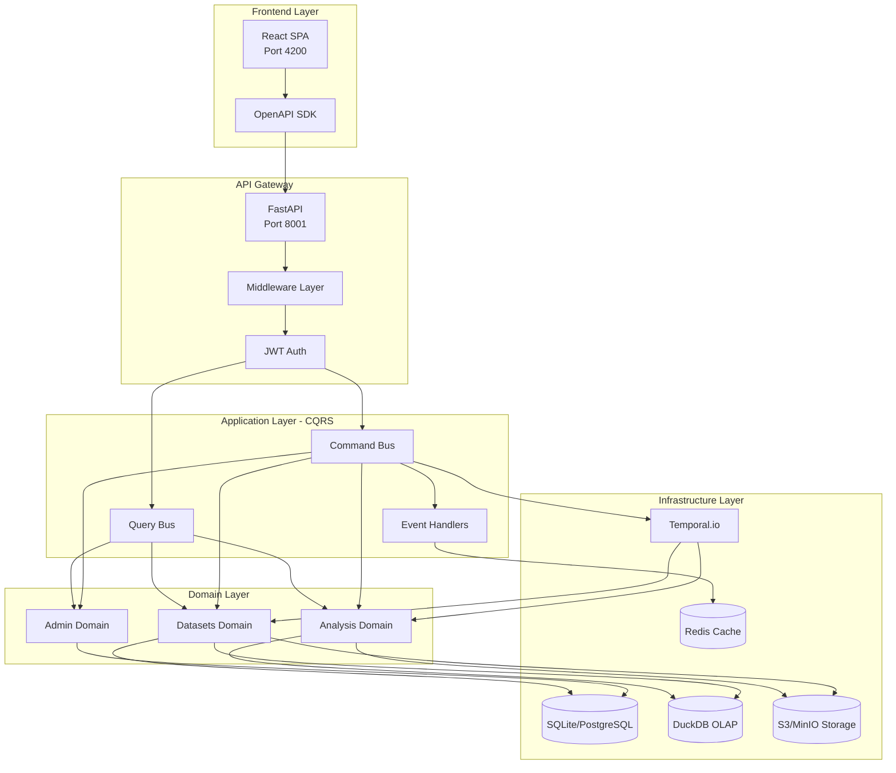
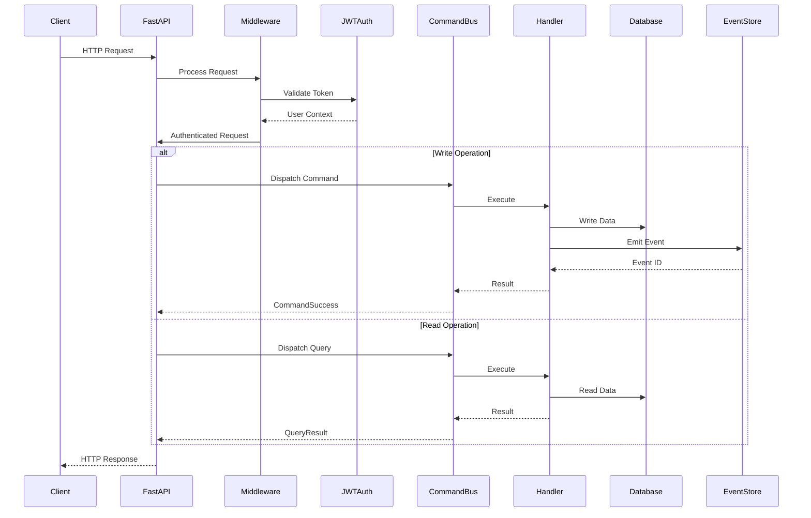
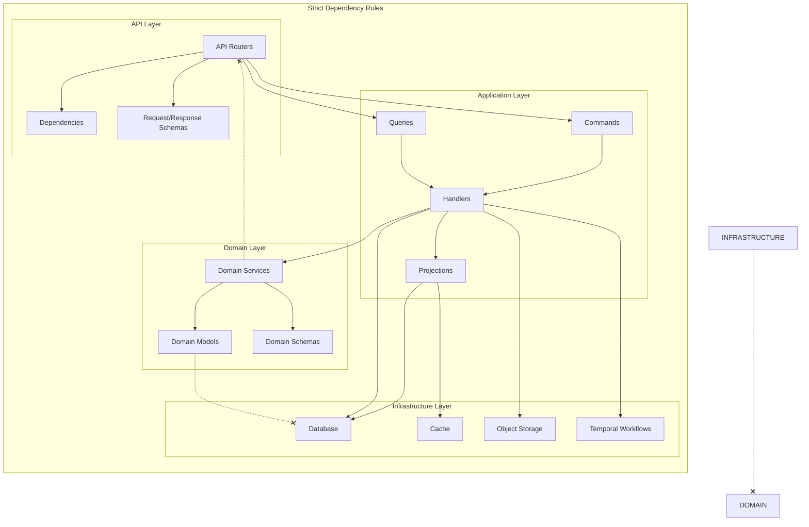
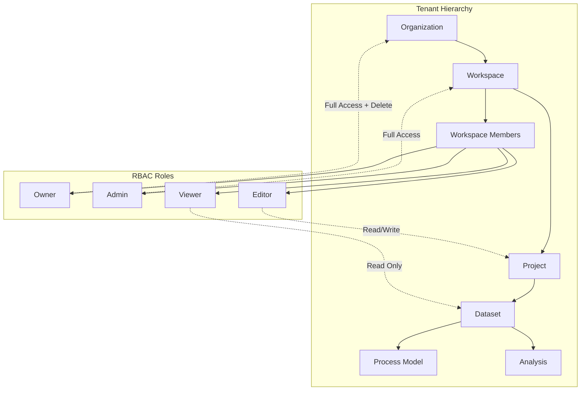
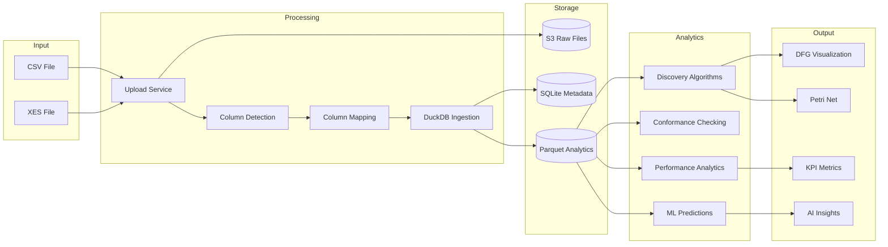
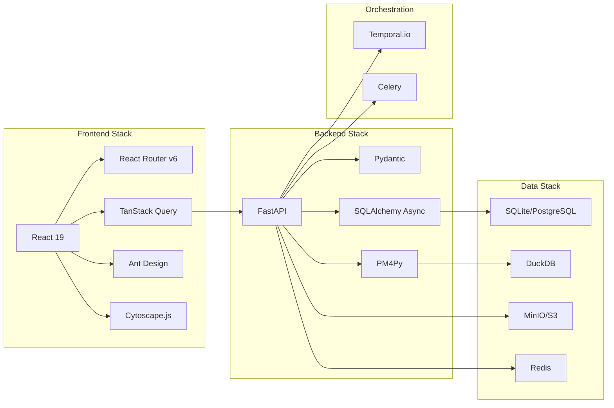

# System Architecture - Computation Graph

## High-Level System Overview

## Request Flow Architecture

## Dependency Graph

## Multi-Tenant Authorization Hierarchy

## Data Flow Overview

## Technology Stack Mapping

