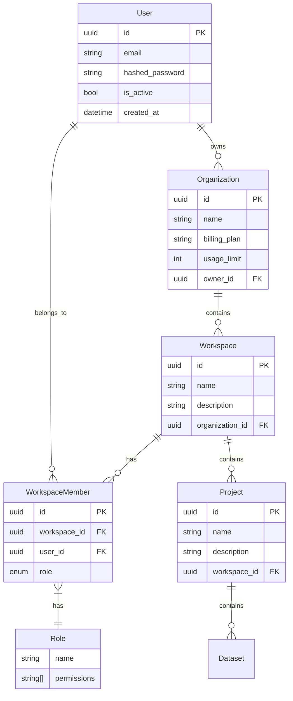
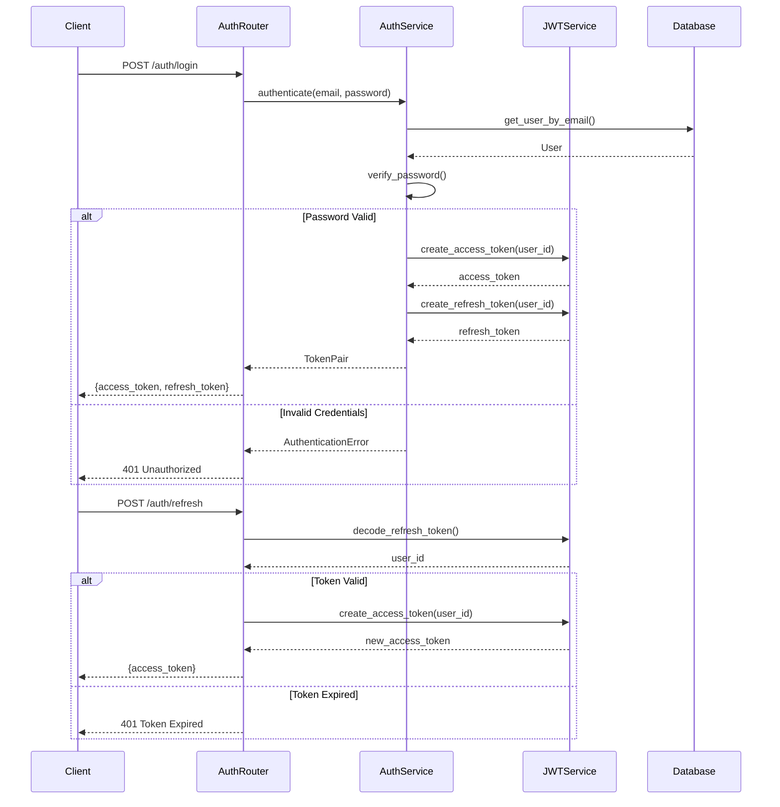
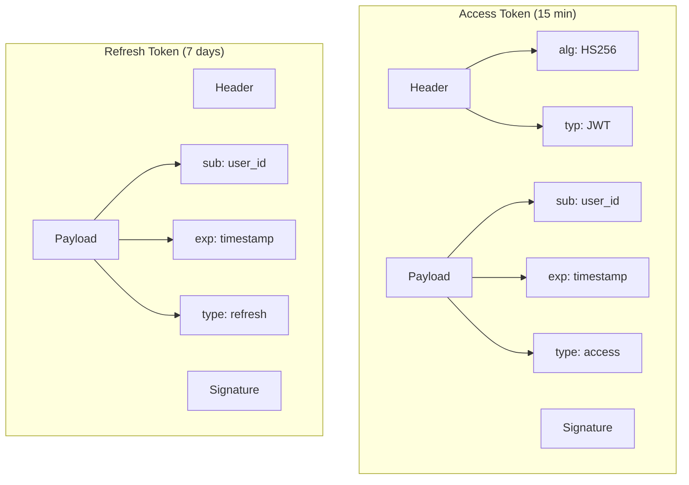
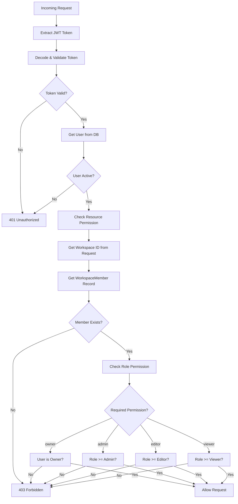
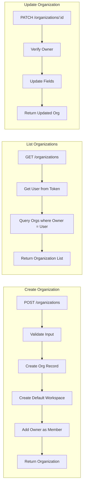
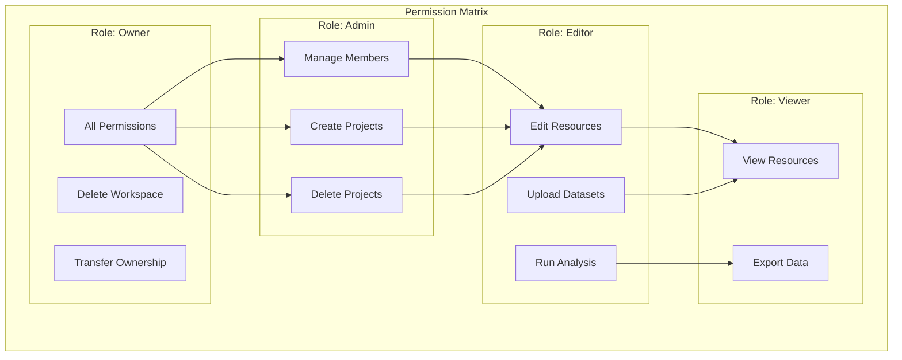
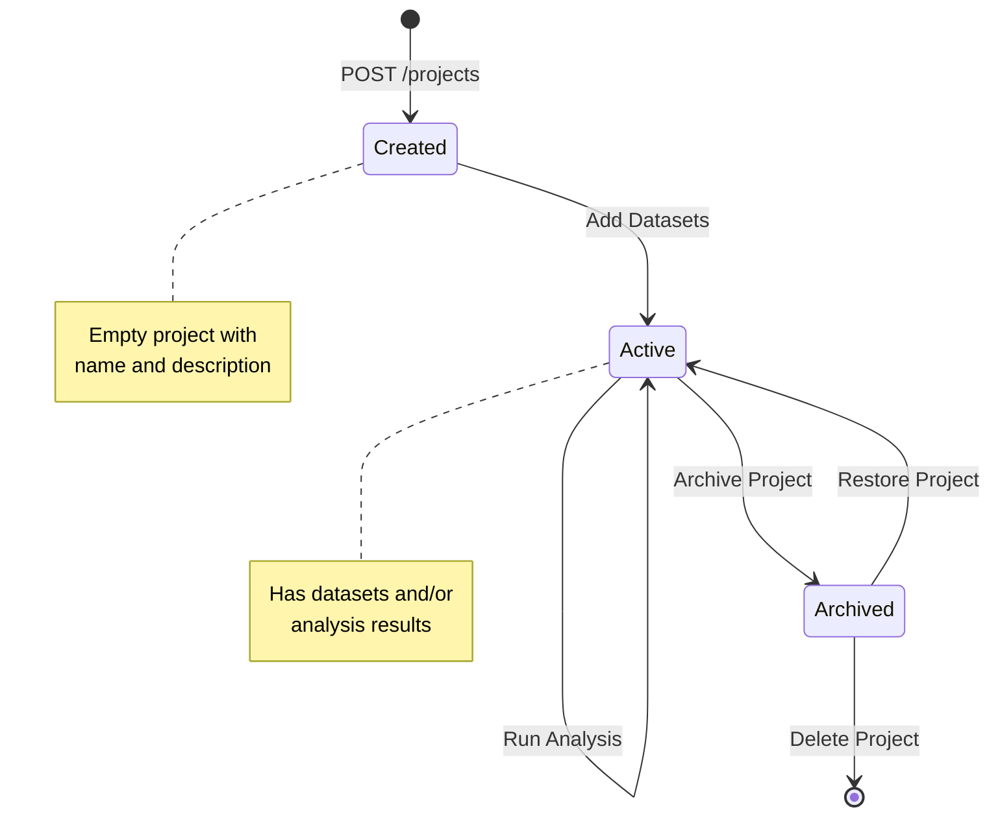
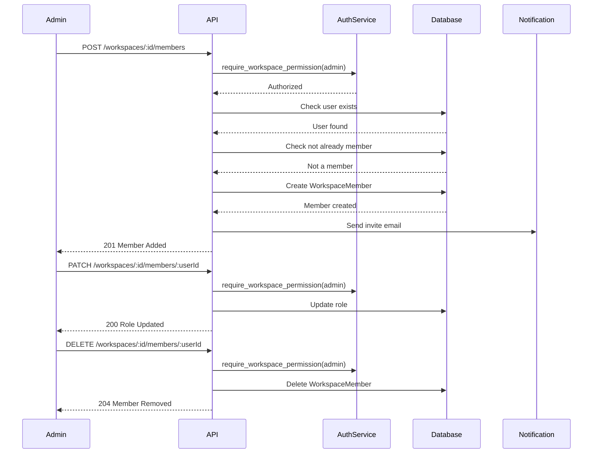
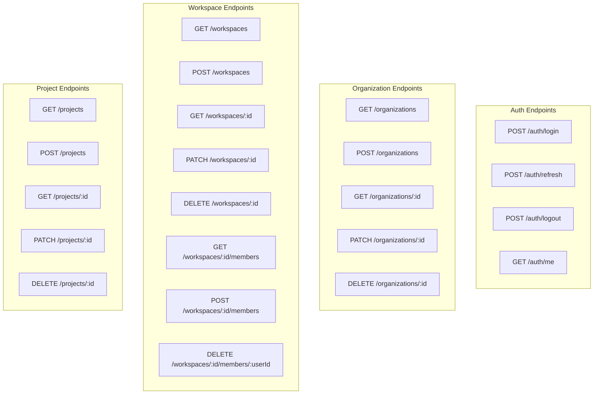

# Admin Domain - Computation Graph

## Domain Overview

The Admin domain handles multi-tenant authentication, organizations, workspaces, and projects.

## Entity Relationship

## Authentication Flow

## JWT Token Structure

## Authorization Check Flow

## Organization Management

## Workspace RBAC Model

## Project Lifecycle

## Workspace Member Operations

## API Endpoints Structure

## Key Files Reference

| Component | Path |
|-----------|------|
| User Models | `src/infra/users/models.py` |
| Auth Service | `src/infra/users/auth_service.py` |
| JWT Utilities | `src/infra/core/security.py` |
| Organization Models | `src/infra/organizations/models.py` |
| Workspace Models | `src/infra/workspaces/models.py` |
| Project Models | `src/infra/projects/models.py` |
| Permission Checks | `src/infra/core/permissions.py` |
| Auth Router | `src/api/routers/auth.py` |
| Organizations Router | `src/api/routers/organizations.py` |
| Workspaces Router | `src/api/routers/workspaces.py` |
| Projects Router | `src/api/routers/projects.py` |
