# Datasets Domain - Computation Graph

## Domain Overview

The Datasets domain handles the complete data lifecycle for event logs: upload, validation, column mapping, and ingestion.

## Dataset Status State Machine

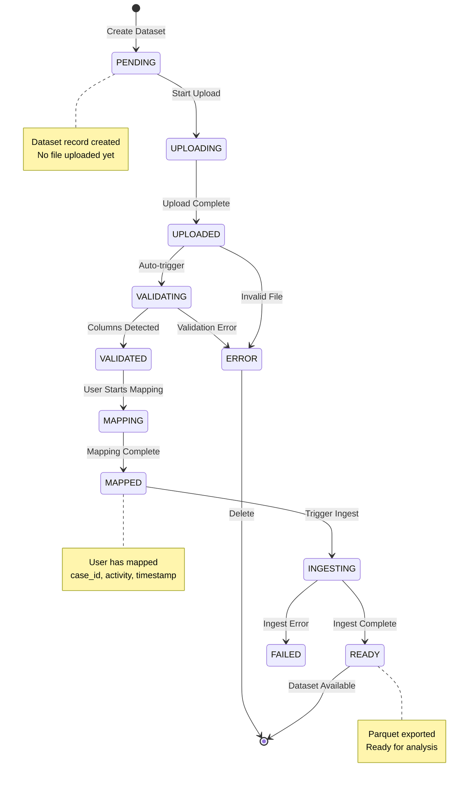

## Complete Upload & Ingestion Pipeline

```mermaid
flowchart TB
    subgraph "Phase 1: Upload"
        START[Client Request] --> UPLOAD_TYPE{Upload Type?}
        UPLOAD_TYPE -->|Multipart| DIRECT[Direct Upload]
        UPLOAD_TYPE -->|Large File| PRESIGNED[Presigned URL]

        DIRECT --> VALIDATE_FILE[Validate File Extension]
        PRESIGNED --> GET_URL[Generate S3 Presigned URL]
        GET_URL --> CLIENT_UPLOAD[Client Uploads to S3]
        CLIENT_UPLOAD --> CONFIRM[Confirm Upload]

        VALIDATE_FILE --> CREATE_DS[Create Dataset Record]
        CONFIRM --> CREATE_DS
        CREATE_DS --> STORE_S3[Store in S3]
        STORE_S3 --> STATUS_UPLOADED[Status: UPLOADED]
    end

    subgraph "Phase 2: Validation"
        STATUS_UPLOADED --> TRIGGER_VAL[Trigger Validation]
        TRIGGER_VAL --> READ_SAMPLE[Read Sample Rows]
        READ_SAMPLE --> DETECT_COLS[Detect Columns]
        DETECT_COLS --> INFER_TYPES[Infer Column Types]
        INFER_TYPES --> SUGGEST_MAP[Suggest Mappings]
        SUGGEST_MAP --> STORE_COLS[Store DatasetColumn Records]
        STORE_COLS --> STATUS_VALIDATED[Status: VALIDATED]
    end

    subgraph "Phase 3: Mapping"
        STATUS_VALIDATED --> GET_COLS[GET /columns]
        GET_COLS --> USER_MAPS[User Selects Mappings]
        USER_MAPS --> VALIDATE_MAP[Validate Mapping]
        VALIDATE_MAP --> STORE_MAP[Store ColumnMapping]
        STORE_MAP --> STATUS_MAPPED[Status: MAPPED]
    end

    subgraph "Phase 4: Ingestion"
        STATUS_MAPPED --> START_INGEST[POST /ingest]
        START_INGEST --> TEMPORAL_WF[Temporal Workflow]
        TEMPORAL_WF --> CHUNK_LIST[Get Chunk List]
        CHUNK_LIST --> PROCESS_CHUNKS[Process Chunks in Parallel]
        PROCESS_CHUNKS --> AGGREGATE[Aggregate Cases]
        AGGREGATE --> COMPUTE_STATS[Compute Statistics]
        COMPUTE_STATS --> EXPORT_PARQUET[Export to Parquet]
        EXPORT_PARQUET --> STATUS_READY[Status: READY]
    end
```

## Column Detection Algorithm

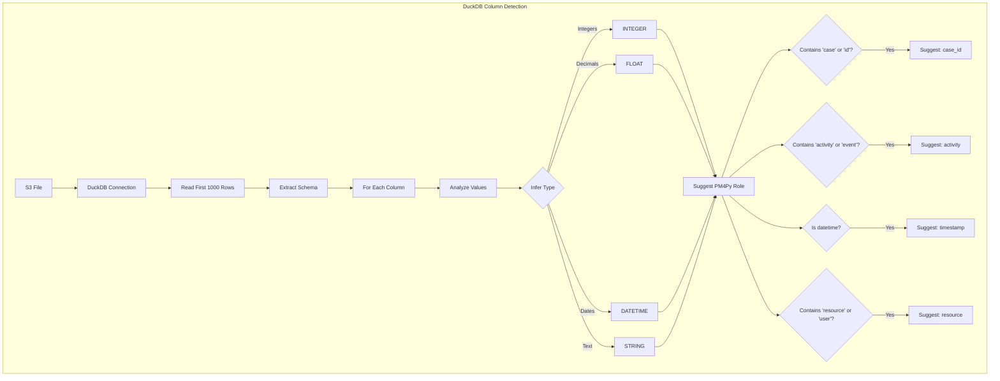

## Column Mapping Schema

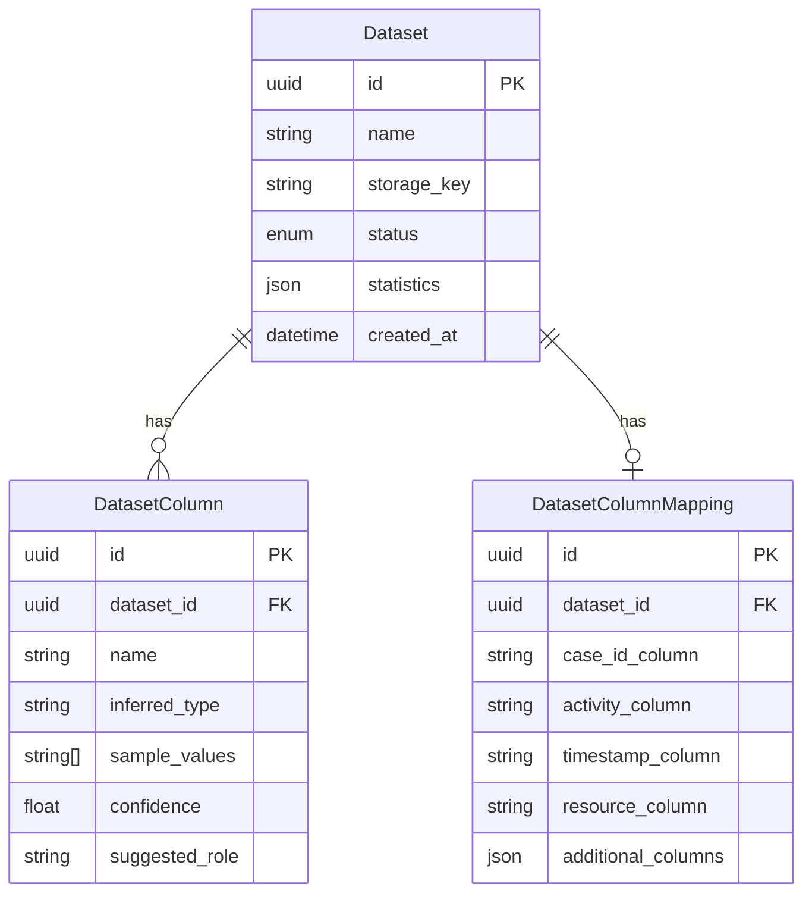

## Temporal Ingestion Workflow

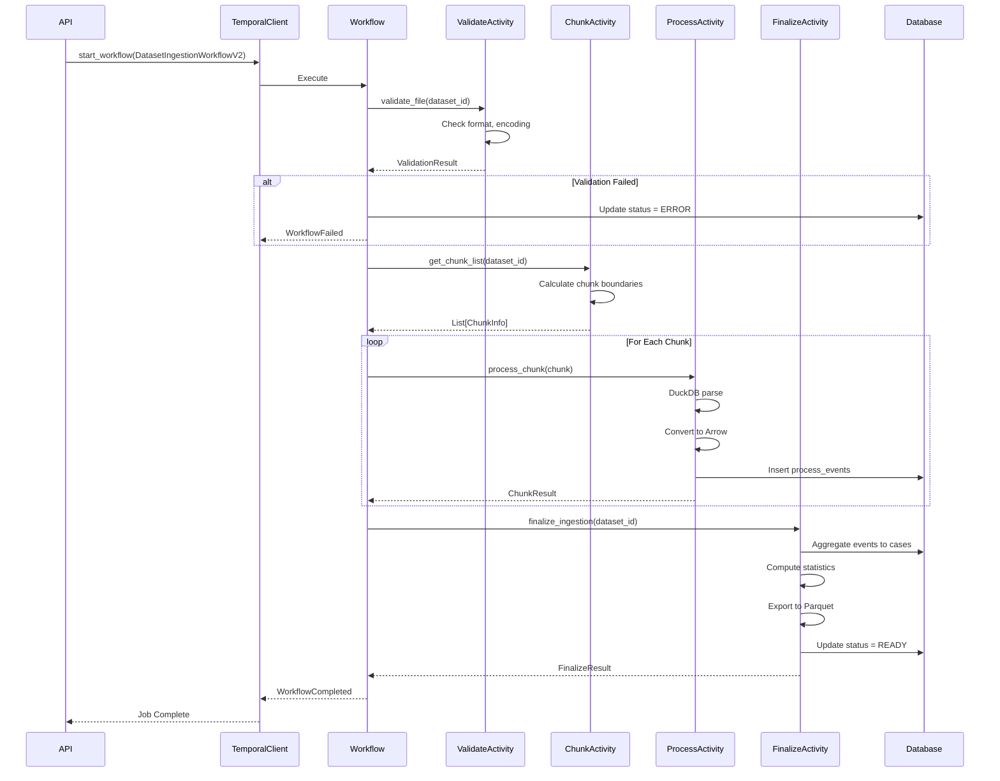

## DuckDB Ingestion Pipeline

```mermaid
flowchart LR
    subgraph "Input"
        CSV[CSV File in S3]
        XES[XES File in S3]
    end

    subgraph "DuckDB Processing"
        CONN[Isolated Connection]
        READ[read_csv / read_parquet]
        TRANSFORM[Apply Column Mapping]
        VALIDATE[Validate Timestamps]
        CONVERT[Convert to Arrow]
    end

    subgraph "Database Insert"
        ARROW[Arrow Table]
        BATCH[Batch Insert]
        EVENTS[(process_events)]
    end

    subgraph "Post-Processing"
        AGGREGATE[Aggregate by case_id]
        CASES[(process_cases)]
        STATS[Compute Statistics]
        PARQUET[Export Parquet]
        S3[(S3 parquet_key)]
    end

    CSV --> CONN
    XES --> CONN
    CONN --> READ
    READ --> TRANSFORM
    TRANSFORM --> VALIDATE
    VALIDATE --> CONVERT
    CONVERT --> ARROW
    ARROW --> BATCH
    BATCH --> EVENTS

    EVENTS --> AGGREGATE
    AGGREGATE --> CASES
    EVENTS --> STATS
    STATS --> PARQUET
    PARQUET --> S3
```

## Chunk Processing Architecture

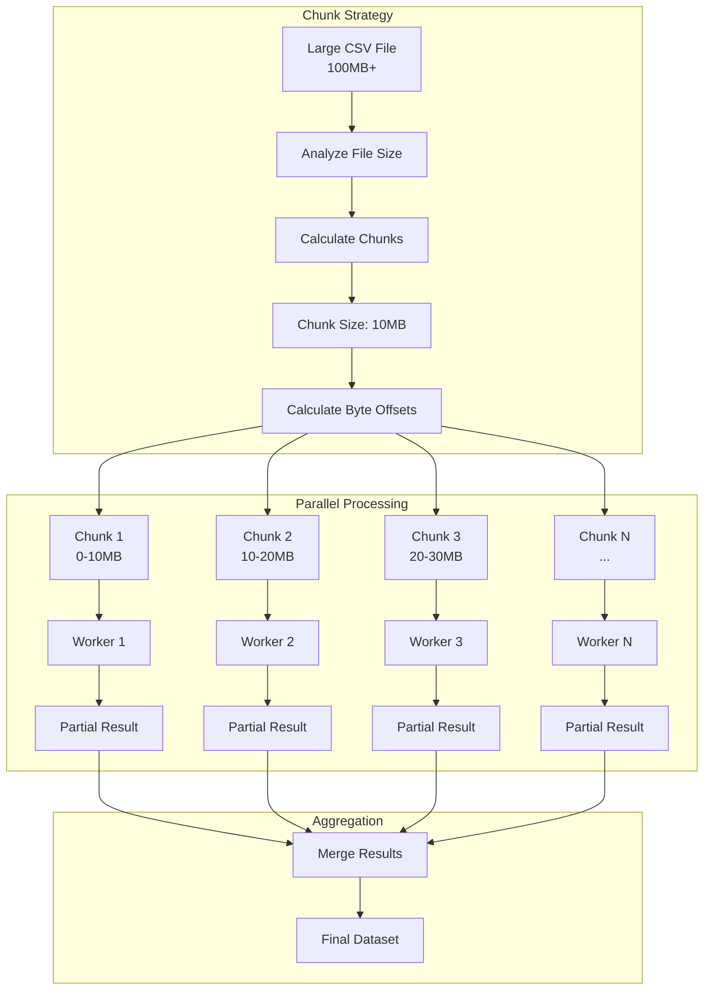

## Event Log Data Model

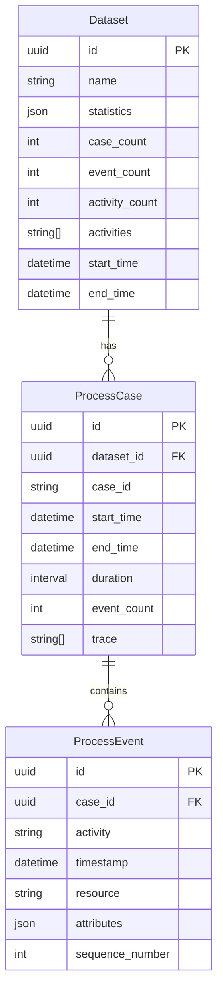

## Statistics Computation

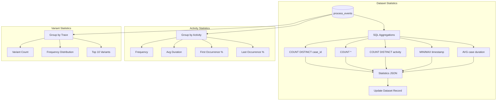

## API Endpoints Flow

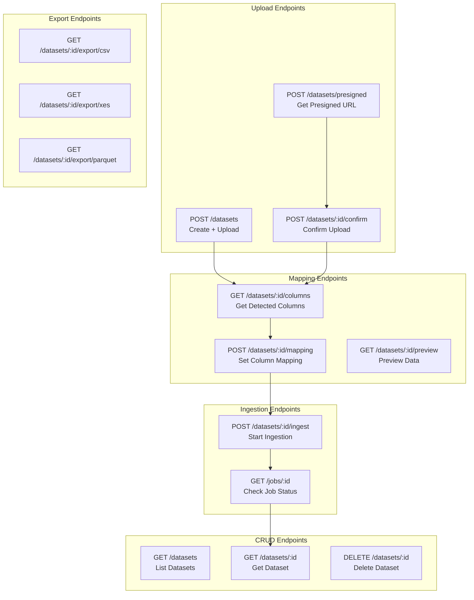

## Error Handling & Recovery

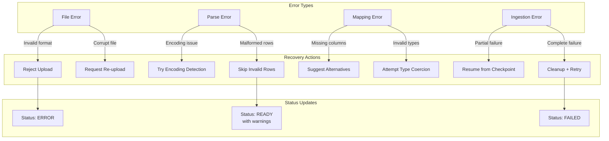

## Key Files Reference

| Component | Path |
|-----------|------|
| Dataset Models | `src/features/process_mining/datasets/models.py` |
| Upload Router | `src/features/process_mining/datasets/api/upload.py` |
| Mapping Router | `src/features/process_mining/datasets/api/mapping.py` |
| Ingest Router | `src/features/process_mining/datasets/api/ingest.py` |
| DuckDB Parser | `src/features/process_mining/ingestion/duckdb_parser.py` |
| Ingestion Service | `src/features/process_mining/ingestion/service.py` |
| Temporal Workflow | `src/infra/temporal/workflows_v2/ingestion.py` |
| Temporal Activities | `src/infra/temporal/activities_v2/ingestion.py` |
| Object Storage | `src/infra/infrastructure/object_storage.py` |
| DuckDB Manager | `src/infra/infrastructure/duckdb.py` |
