# Analysis Domain - Computation Graph

## Domain Overview

The Analysis domain encompasses all process mining and analytics capabilities: discovery, conformance, analytics, predictions, and organizational analysis.

## Discovery Algorithm Categories

```mermaid
graph TB
    subgraph "Discovery Algorithms"
        direction TB

        subgraph "Procedural Discovery"
            ALPHA[Alpha Miner<br/>Classic, simple]
            INDUCTIVE[Inductive Miner<br/>Sound, recommended]
            HEURISTICS[Heuristics Miner<br/>Frequency-based]
            ILP[ILP Miner<br/>Precise, slow]
        end

        subgraph "Declarative Discovery"
            DECLARE[Declare Miner<br/>Constraint-based]
            LOG_SKEL[Log Skeleton<br/>Relationships]
        end

        subgraph "Graph-Based"
            DFG[DFG Miner<br/>Directly-Follows]
            PERF_DFG[Performance DFG<br/>With metrics]
            PREFIX[Prefix Tree<br/>Full traces]
        end

        subgraph "Other"
            TEMP_PROF[Temporal Profile<br/>Time patterns]
            BATCHES[Batch Discovery<br/>Batch patterns]
            TRANS[Transition System<br/>State machine]
        end
    end

    subgraph "Output Formats"
        PETRI[Petri Net]
        BPMN[BPMN Model]
        TREE[Process Tree]
        GRAPH[Graph JSON]
        JSON[JSON Data]
    end

    ALPHA --> PETRI
    INDUCTIVE --> TREE
    INDUCTIVE --> PETRI
    HEURISTICS --> PETRI
    ILP --> PETRI
    DFG --> GRAPH
    PERF_DFG --> GRAPH
    DECLARE --> JSON
    LOG_SKEL --> JSON
    TEMP_PROF --> JSON
```

## Discovery Request Flow

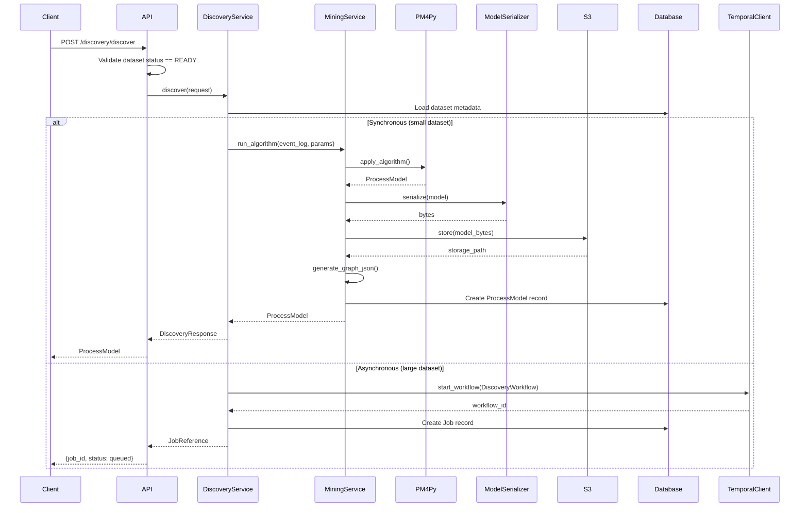

## Event Log Loading Pipeline

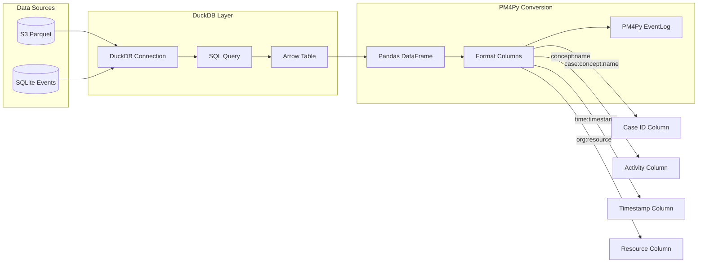

## Algorithm Selection Logic

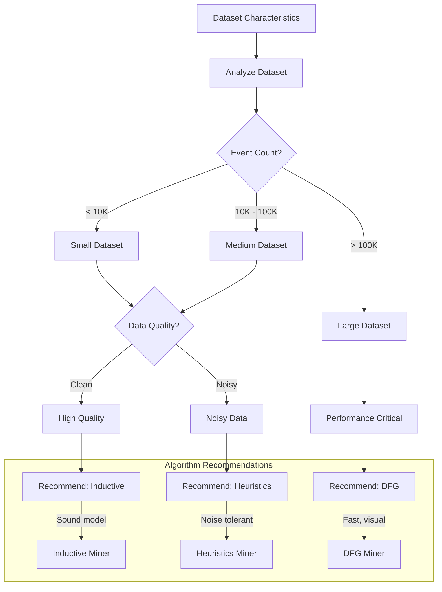

## Process Model Serialization

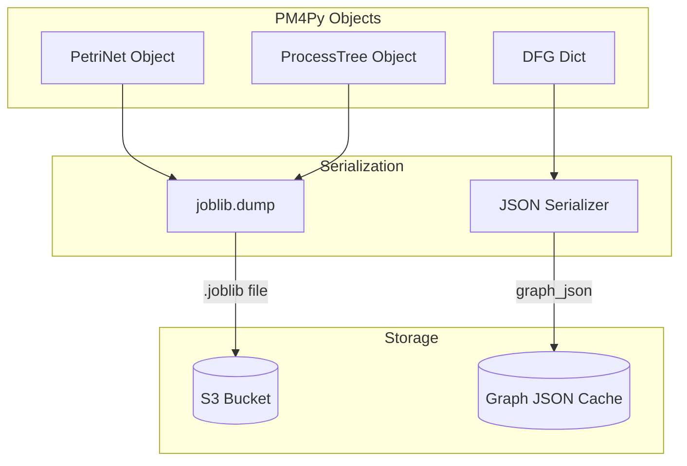

## Conformance Checking Flow

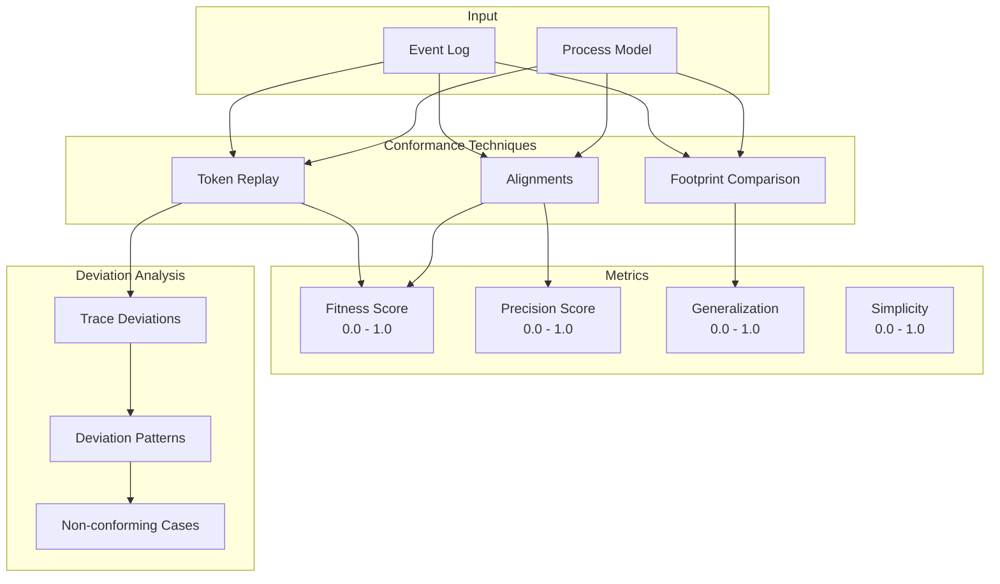

## Analytics Query Architecture (CQRS)

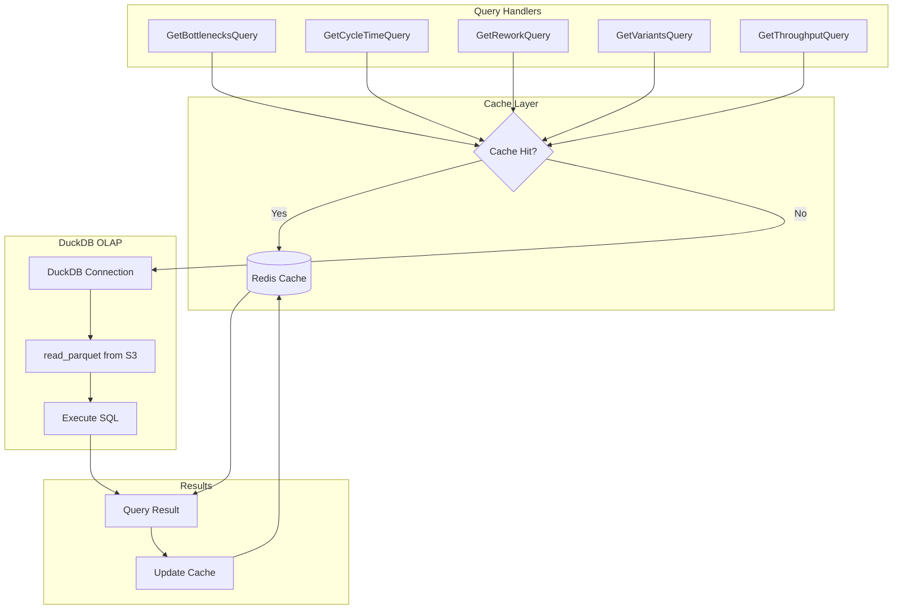

## Bottleneck Analysis

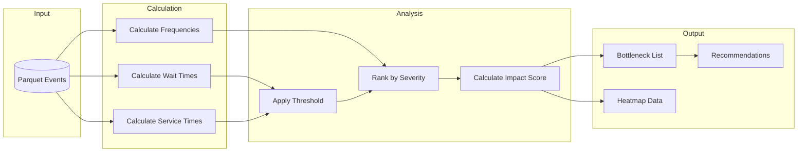

## Rework Detection

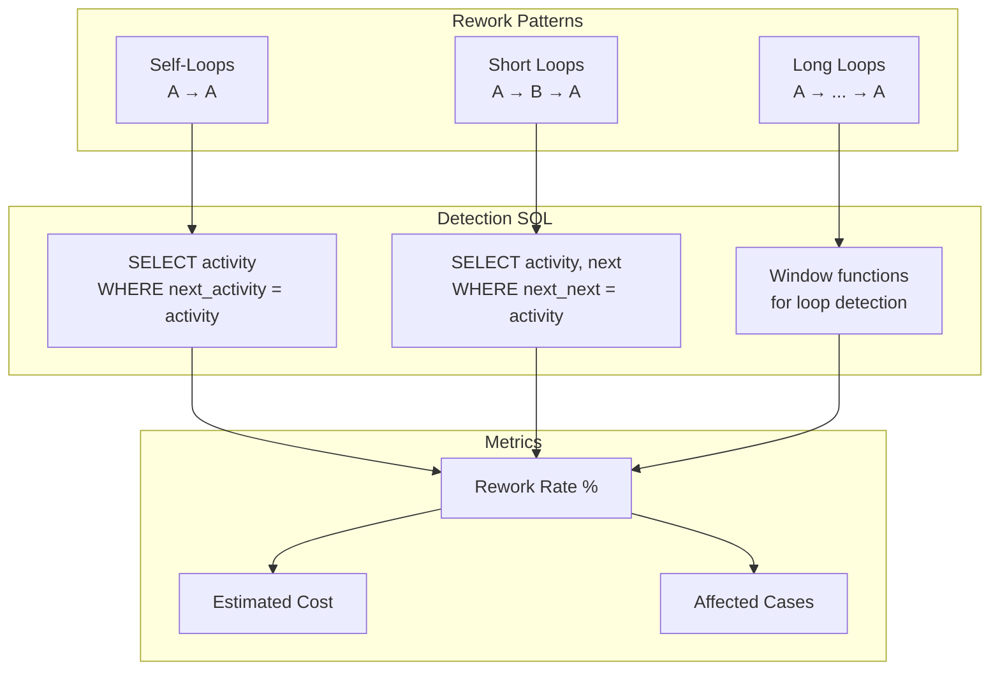

## Prediction Models

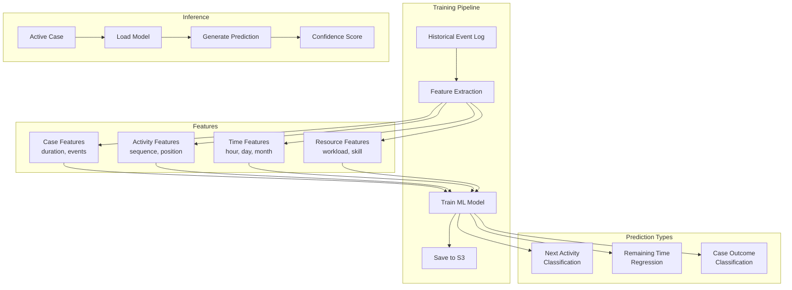

## Organizational Analysis

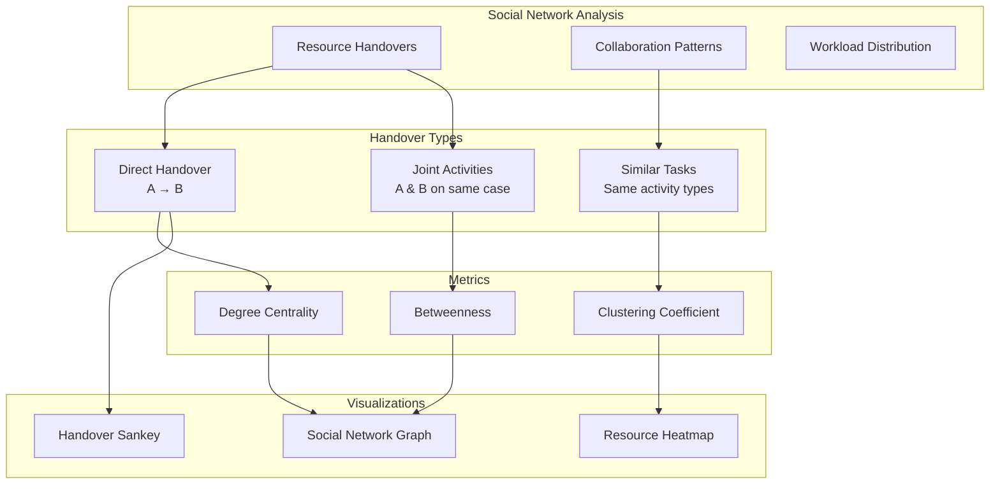

## Simulation (What-If Analysis)

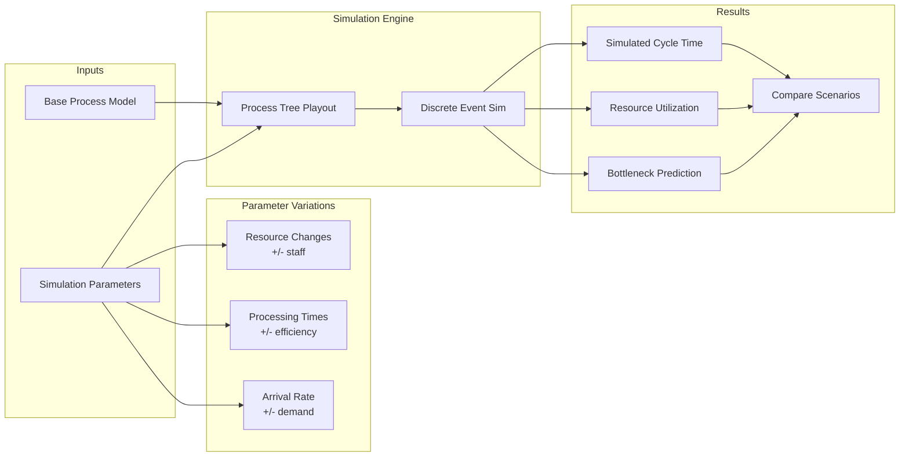

## API Endpoints Structure

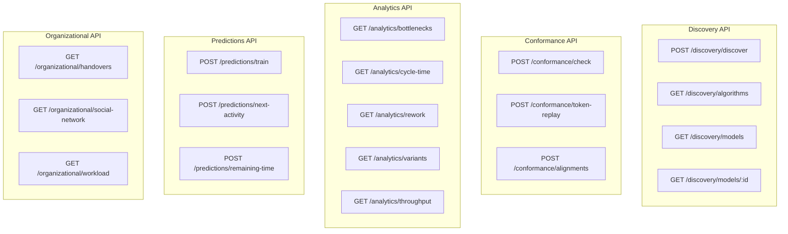

## Temporal Workflow for Discovery

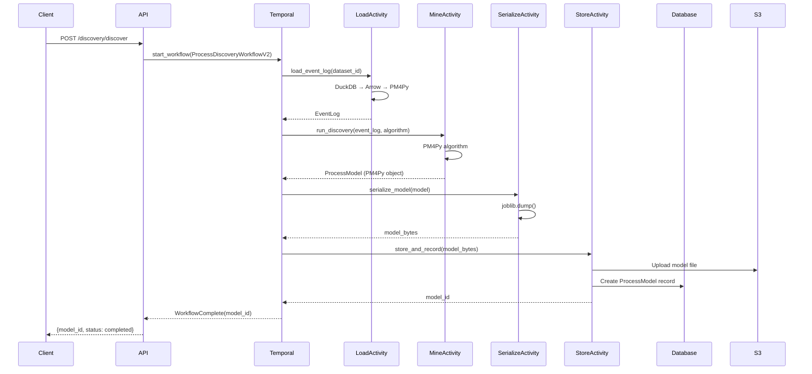

## Key Files Reference

| Component | Path |
|-----------|------|
| Discovery Router | `src/features/process_mining/discovery/router.py` |
| Mining Service | `src/features/process_mining/discovery/mining_service.py` |
| Algorithm Registry | `src/features/process_mining/discovery/algorithms.py` |
| Analytics Router | `src/features/process_mining/analytics/router.py` |
| Analytics Queries | `src/application/queries/analytics_queries.py` |
| Analytics Cache | `src/application/projections/analytics_cache.py` |
| Conformance Router | `src/features/process_mining/conformance/router.py` |
| Predictions Router | `src/features/process_mining/predictions/router.py` |
| Organizational Router | `src/features/process_mining/organizational/router.py` |
| Discovery Workflow | `src/infra/temporal/workflows_v2/discovery.py` |
| Process Model Schema | `src/features/process_mining/schemas/analysis.py` |
