# Process Mining Features - Computation Graph

## Feature Overview

This document covers the specialized process mining features: filtering, visualization, OCPM, and AI integration.

## Event Log Filtering

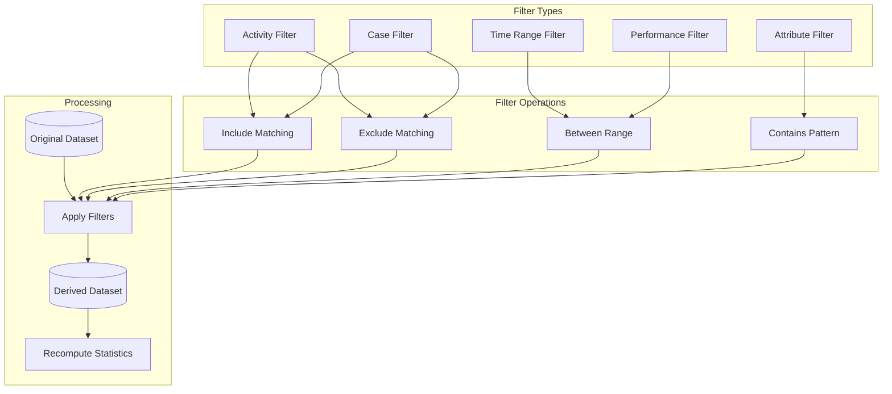

## Filter Application Pipeline

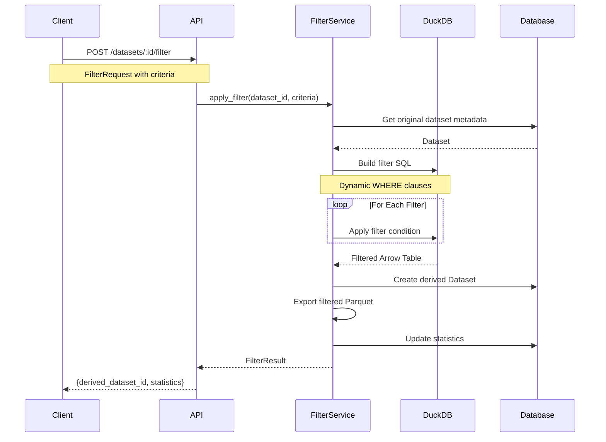

## Filter SQL Generation

```mermaid
flowchart LR
    subgraph "Filter Input"
        ACT_IN[activities: [A, B, C]]
        TIME_IN[start: 2024-01-01<br/>end: 2024-12-31]
        PERF_IN[min_duration: 1h<br/>max_duration: 24h]
    end

    subgraph "SQL Builder"
        BASE[SELECT * FROM events]
        WHERE[WHERE clause builder]
    end

    subgraph "Generated SQL"
        SQL[SELECT * FROM events<br/>WHERE activity IN ('A','B','C')<br/>AND timestamp BETWEEN ...<br/>AND duration BETWEEN ...]
    end

    ACT_IN --> WHERE
    TIME_IN --> WHERE
    PERF_IN --> WHERE

    BASE --> WHERE
    WHERE --> SQL
```

## Visualization Pipeline

```mermaid
flowchart TB
    subgraph "Model Types"
        DFG_MODEL[DFG Model]
        PETRI_MODEL[Petri Net]
        BPMN_MODEL[BPMN Model]
        TREE_MODEL[Process Tree]
    end

    subgraph "Graph Generation"
        PARSE[Parse Model]
        NODES[Extract Nodes]
        EDGES[Extract Edges]
        LAYOUT[Apply Layout Algorithm]
    end

    subgraph "Layout Algorithms"
        DAGRE[Dagre (hierarchical)]
        FORCE[Force-directed]
        GRID[Grid layout]
    end

    subgraph "Output Formats"
        CYTO_JSON[Cytoscape JSON]
        DOT[DOT/GraphViz]
        SVG[SVG Image]
    end

    DFG_MODEL --> PARSE
    PETRI_MODEL --> PARSE
    BPMN_MODEL --> PARSE
    TREE_MODEL --> PARSE

    PARSE --> NODES
    PARSE --> EDGES
    NODES --> LAYOUT
    EDGES --> LAYOUT

    LAYOUT --> DAGRE
    LAYOUT --> FORCE
    LAYOUT --> GRID

    DAGRE --> CYTO_JSON
    FORCE --> CYTO_JSON
    GRID --> DOT
    DOT --> SVG
```

## DFG Visualization Data Structure

```mermaid
graph TD
    subgraph "DFG Response"
        NODES_ARR[nodes: Array]
        EDGES_ARR[edges: Array]
        STATS_OBJ[stats: Object]
    end

    subgraph "Node Structure"
        N_ID[id: string]
        N_LABEL[label: activity name]
        N_FREQ[frequency: number]
        N_PERF[performance: metrics]
        N_POS[position: x, y]
    end

    subgraph "Edge Structure"
        E_SOURCE[source: node_id]
        E_TARGET[target: node_id]
        E_WEIGHT[weight: frequency]
        E_TIME[avg_time: duration]
    end

    subgraph "Stats"
        S_CASES[total_cases]
        S_EVENTS[total_events]
        S_ACTS[activities_count]
        S_VARIANTS[variants_count]
    end

    NODES_ARR --> N_ID
    NODES_ARR --> N_LABEL
    NODES_ARR --> N_FREQ
    NODES_ARR --> N_PERF
    NODES_ARR --> N_POS

    EDGES_ARR --> E_SOURCE
    EDGES_ARR --> E_TARGET
    EDGES_ARR --> E_WEIGHT
    EDGES_ARR --> E_TIME

    STATS_OBJ --> S_CASES
    STATS_OBJ --> S_EVENTS
    STATS_OBJ --> S_ACTS
    STATS_OBJ --> S_VARIANTS
```

## Object-Centric Process Mining (OCPM)

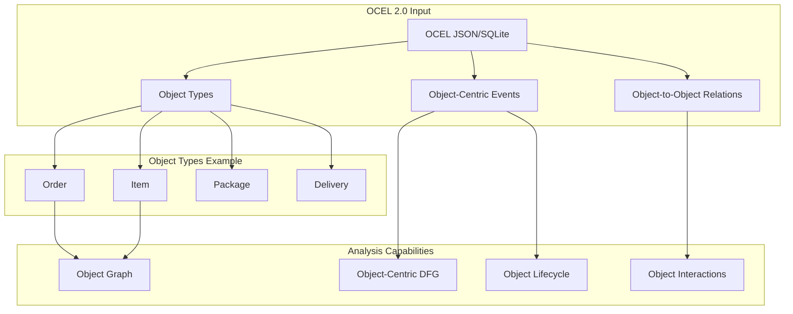

## OCEL Data Model

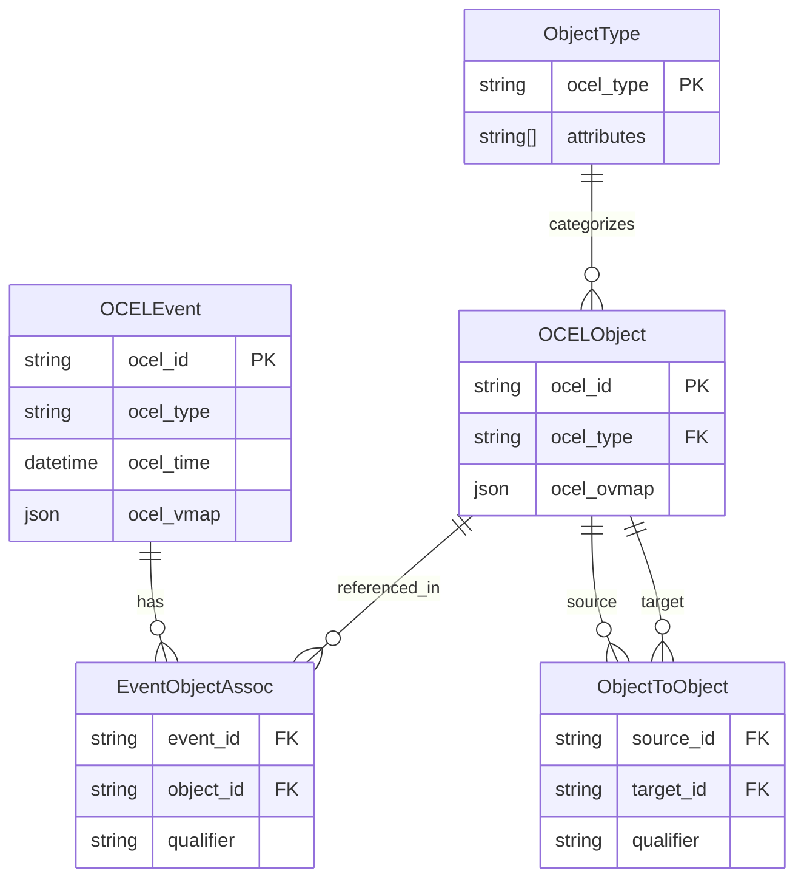

## AI Integration Architecture

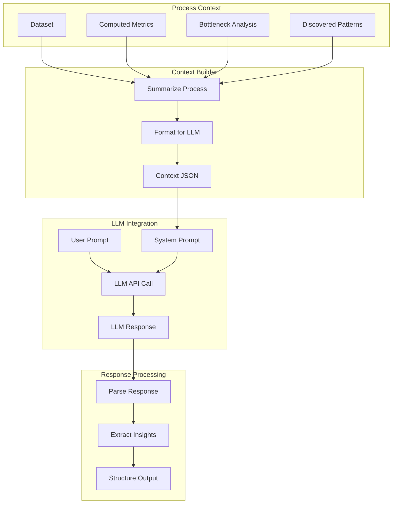

## AI Chat Flow

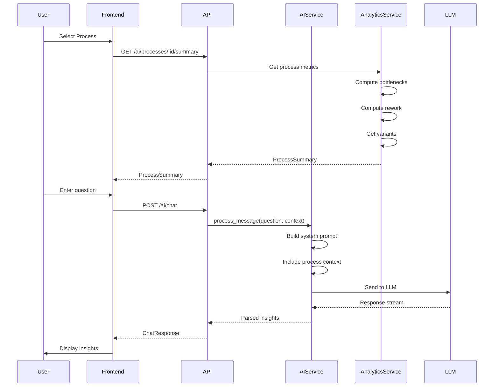

## AI Insight Types

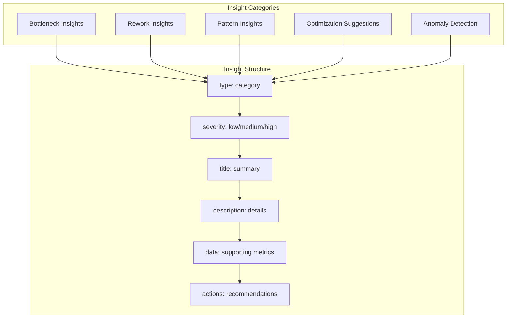

## Variant Analysis

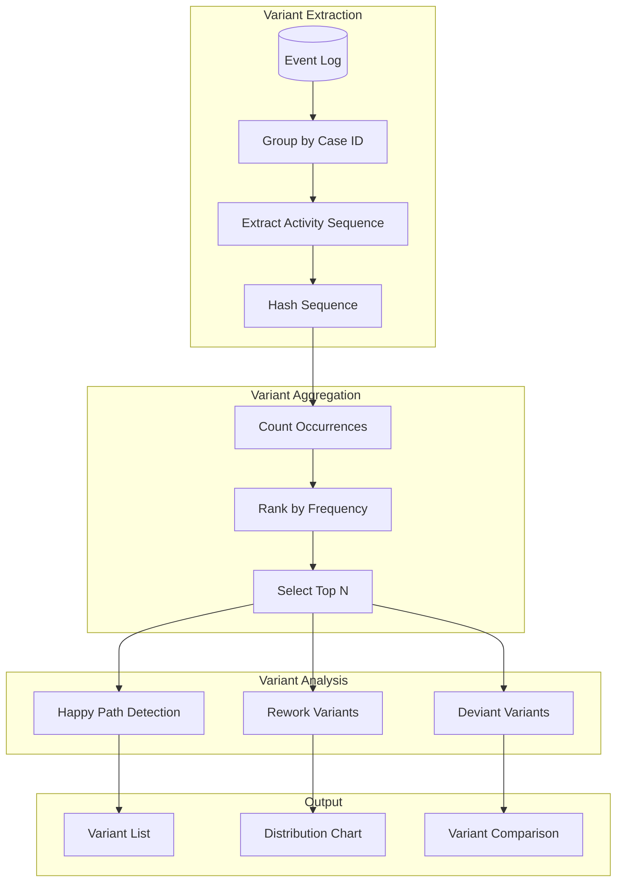

## Workflow Definition & Execution

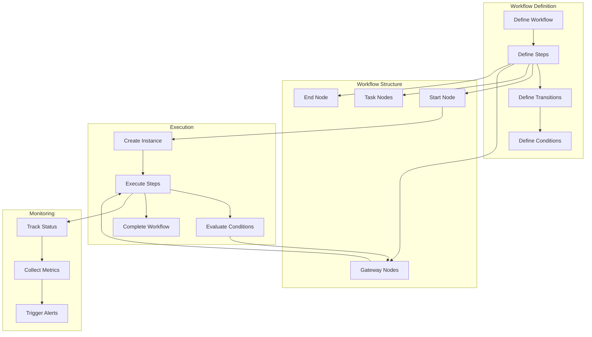

## Export Functionality

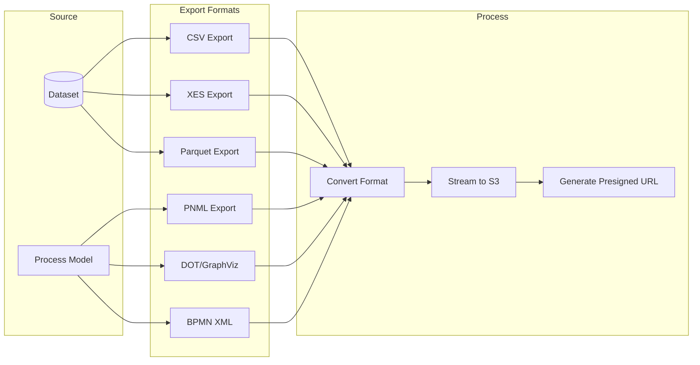

## Feature Dependencies

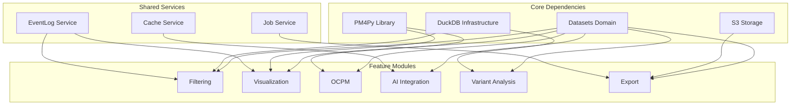

## API Endpoints

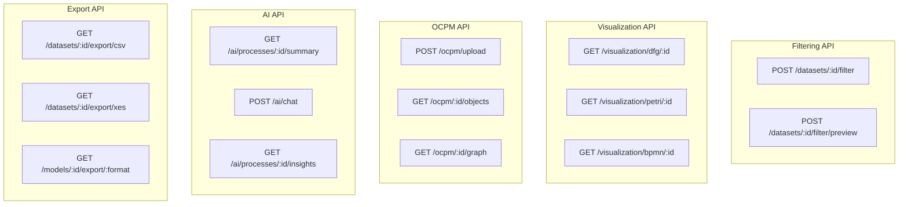

## Key Files Reference

| Component | Path |
|-----------|------|
| Filtering Router | `src/features/process_mining/filtering/router.py` |
| Filter Service | `src/features/process_mining/filtering/service.py` |
| Visualization Router | `src/features/process_mining/visualization/router.py` |
| Graph Generator | `src/features/process_mining/visualization/graph.py` |
| OCPM Router | `src/features/process_mining/ocpm/router.py` |
| OCEL Parser | `src/features/process_mining/ocpm/ocel_parser.py` |
| AI Router | `src/features/process_mining/ai/router.py` |
| AI Service | `src/features/process_mining/ai/service.py` |
| Export Router | `src/features/process_mining/export/router.py` |
| Variant Service | `src/features/process_mining/analytics/variants.py` |
