# Frontend Features - Computation Graph

## Frontend Architecture Overview

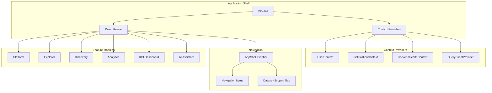

## Routing Structure

```mermaid
graph TD
    subgraph "Root Routes"
        LANDING[/ Landing Page]
        WORKSPACE[/workspace]
    end

    subgraph "Workspace Routes"
        PROJECTS[/workspace Projects List]
        PROJECT[/workspace/:projectId]
        UPLOAD[/workspace/:projectId/upload]
    end

    subgraph "Dataset-Scoped Routes"
        EXPLORE_DS[/workspace/:projectId/data/:datasetId/explorer]
        DISCOVER_DS[/workspace/:projectId/data/:datasetId/discovery]
        KPI_DS[/workspace/:projectId/data/:datasetId/kpi]
        QUESTIONS[/workspace/:projectId/data/:datasetId/questions]
    end

    subgraph "Standalone Routes"
        EXPLORE_STAND[/explore]
        ANALYTICS_STAND[/analytics]
        AI_STAND[/ai]
        SETTINGS[/settings/*]
    end

    LANDING --> WORKSPACE
    WORKSPACE --> PROJECTS
    PROJECTS --> PROJECT
    PROJECT --> UPLOAD
    PROJECT --> EXPLORE_DS
    PROJECT --> DISCOVER_DS
    PROJECT --> KPI_DS
    PROJECT --> QUESTIONS

    WORKSPACE --> EXPLORE_STAND
    WORKSPACE --> ANALYTICS_STAND
    WORKSPACE --> AI_STAND
    WORKSPACE --> SETTINGS
```

## Platform Feature - Projects

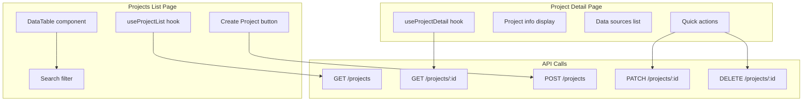

## Upload Wizard Flow

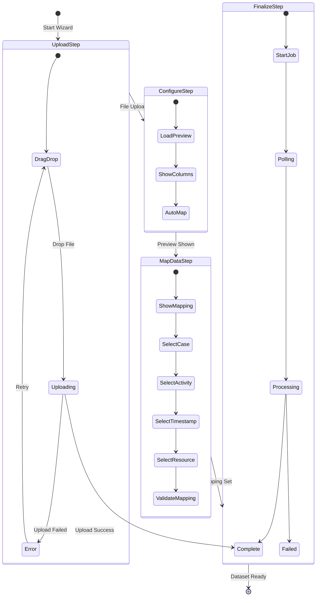

## Upload Wizard State Management

```mermaid
flowchart TB
    subgraph "Wizard State"
        STATE[useUploadWizard Hook]
        STEP[currentStep: 1-4]
        DS_ID[datasetId: string]
        FILENAME[filename: string]
        PREVIEW[preview: DataPreview]
        MAPPING[mapping: ColumnMapping]
        JOB_ID[jobId: string]
    end

    subgraph "Actions"
        GO_STEP[goToStep(n)]
        SET_UPLOAD[setUploadResult()]
        SET_MAP[setMapping()]
        START[startAnalysis()]
    end

    subgraph "Resume Logic"
        CHECK_URL[Check URL params]
        GET_DS[Fetch existing dataset]
        RESUME_STEP[Determine resume step]
    end

    STATE --> STEP
    STATE --> DS_ID
    STATE --> FILENAME
    STATE --> PREVIEW
    STATE --> MAPPING
    STATE --> JOB_ID

    GO_STEP --> STEP
    SET_UPLOAD --> DS_ID
    SET_UPLOAD --> FILENAME
    SET_MAP --> MAPPING
    START --> JOB_ID

    CHECK_URL --> GET_DS
    GET_DS --> RESUME_STEP
    RESUME_STEP --> STEP
```

## Explorer Feature

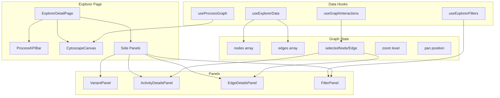

## Explorer Data Flow

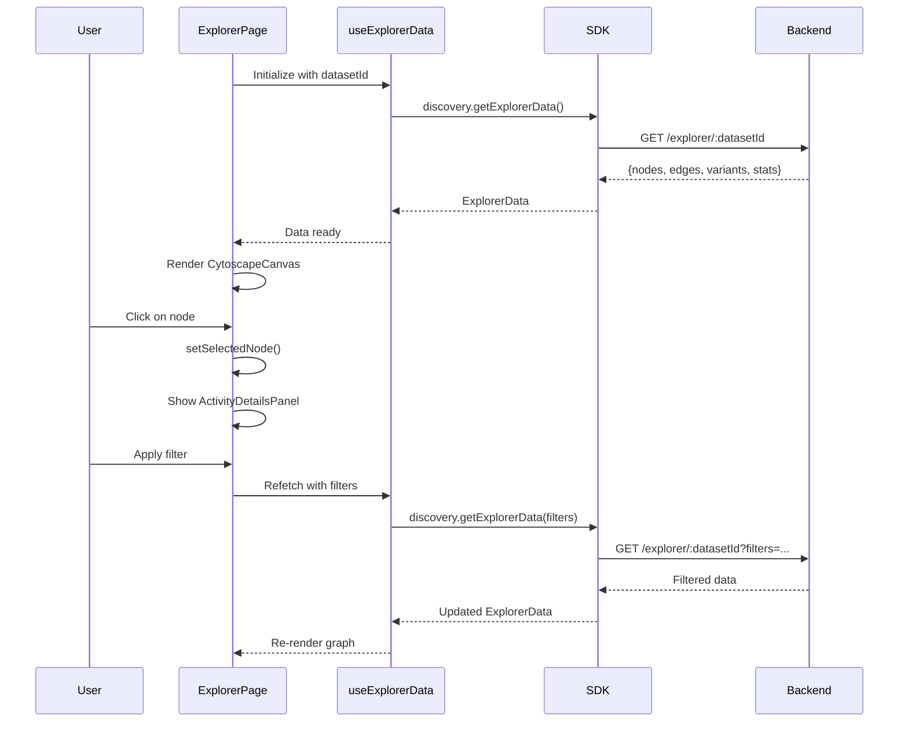

## Filter Panel Architecture

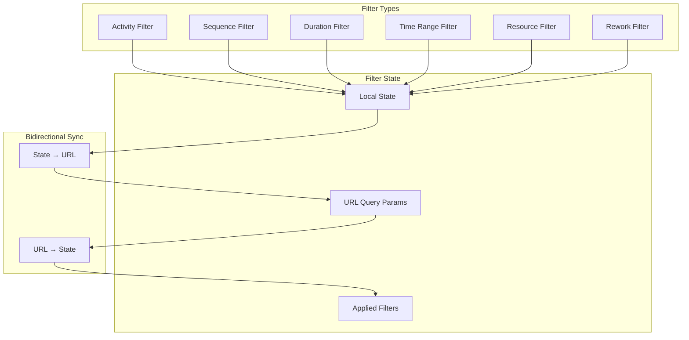

## Discovery Feature

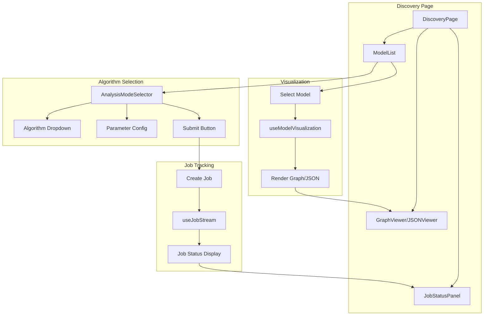

## Discovery Job Flow

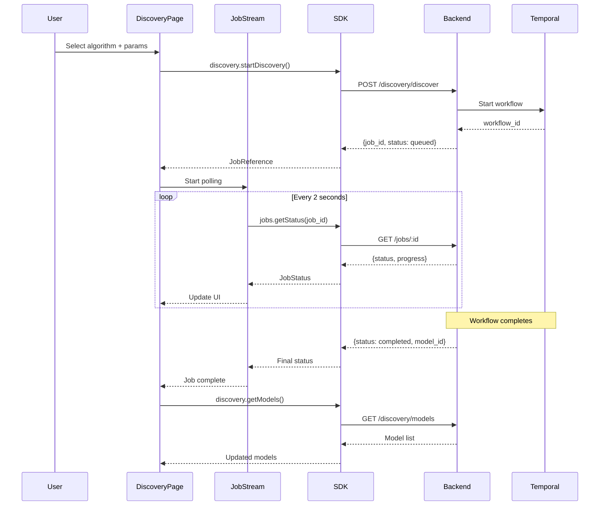

## Analytics Feature

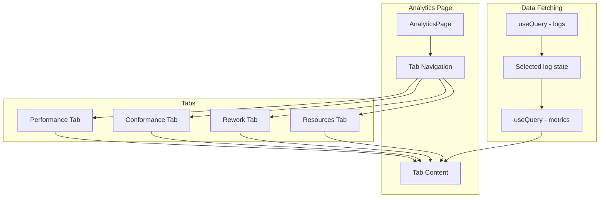

## KPI Dashboard Feature

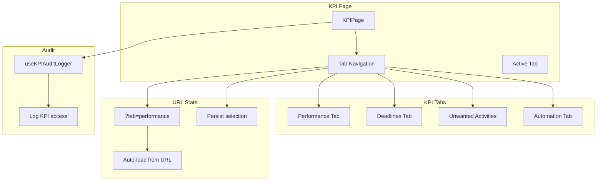

## AI Assistant Feature

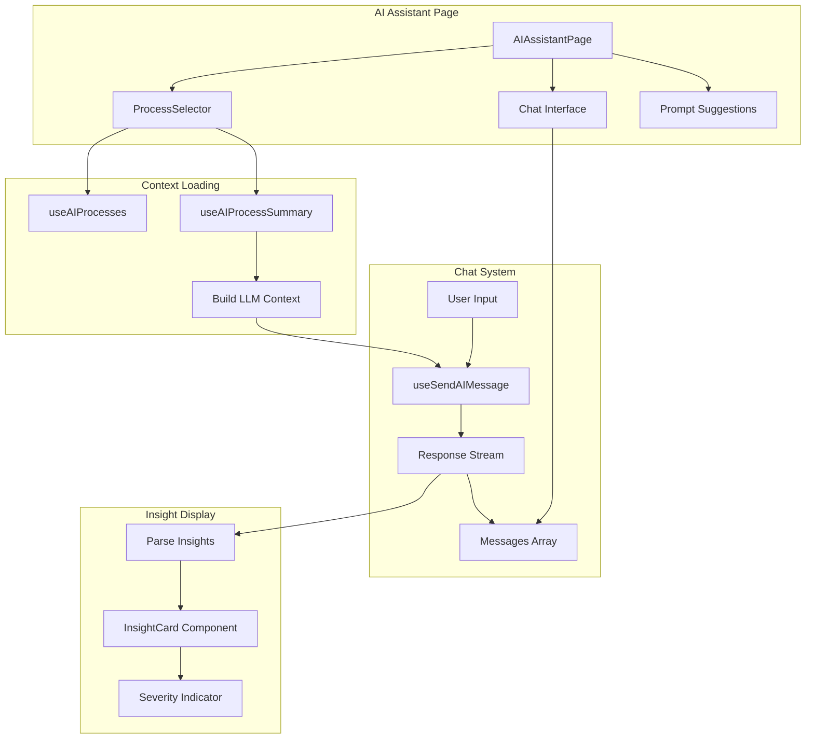

## AI Chat Data Flow

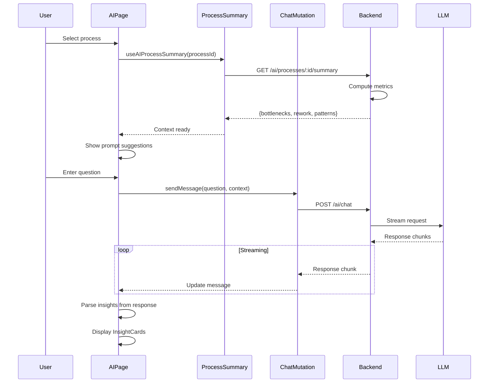

## Shared Hooks Architecture

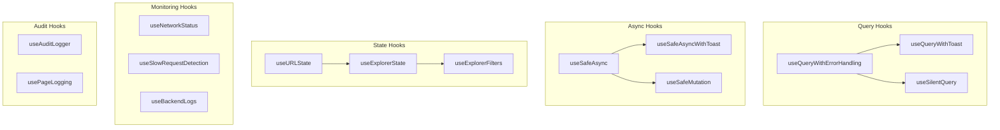

## API Integration Pattern

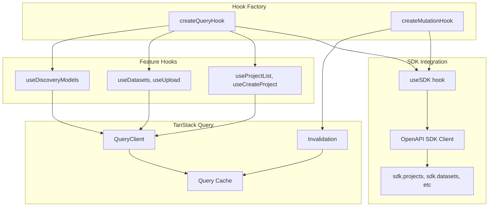

## Error Boundary Strategy

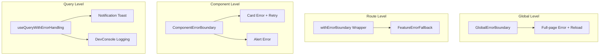

## Component Hierarchy

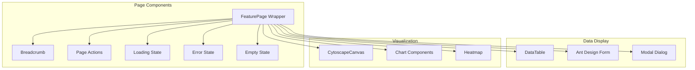

## State Management Overview

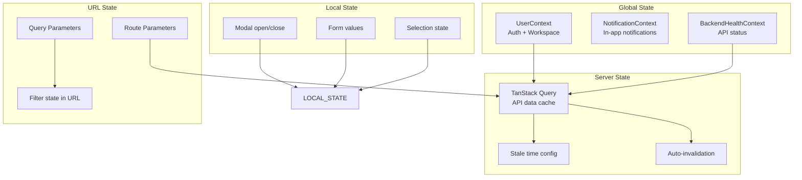

## Key Files Reference

| Component | Path |
|-----------|------|
| App Entry | `src/App.tsx` |
| Routes | `src/routes.tsx` |
| Navigation Config | `src/navigation.ts` |
| User Context | `src/shared/context/UserContext.tsx` |
| Notification Context | `src/shared/context/NotificationContext.tsx` |
| Projects Pages | `src/features/platform/projects/pages/` |
| Upload Wizard | `src/features/platform/upload-wizard/pages/UploadWizardPage.tsx` |
| Explorer Page | `src/features/explorer/pages/ExplorerDetailPage.tsx` |
| Discovery Page | `src/features/discovery/pages/DiscoveryPage.tsx` |
| Analytics Page | `src/features/analytics/pages/AnalyticsPage.tsx` |
| KPI Page | `src/features/kpi/pages/KPIPage.tsx` |
| AI Assistant | `src/features/ai/pages/AIAssistantPage.tsx` |
| Query Hooks | `src/shared/hooks/useQueryWithErrorHandling.ts` |
| Safe Async | `src/shared/hooks/useSafeAsync.ts` |
