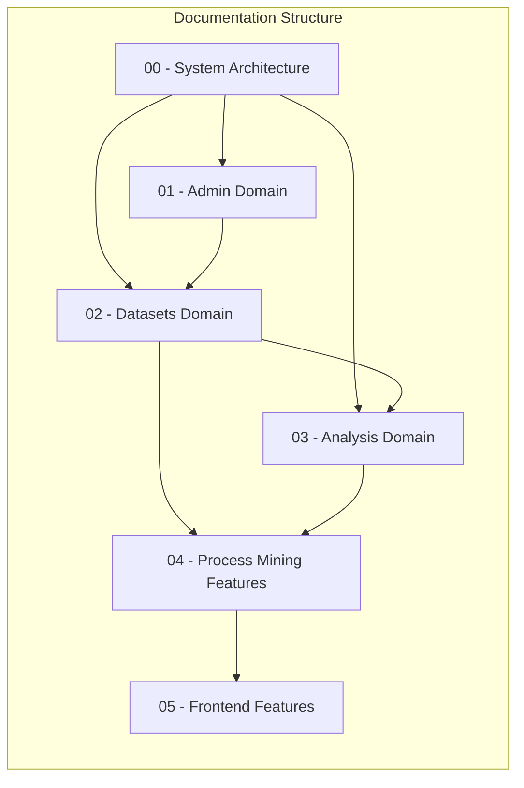
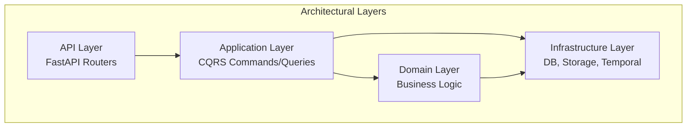
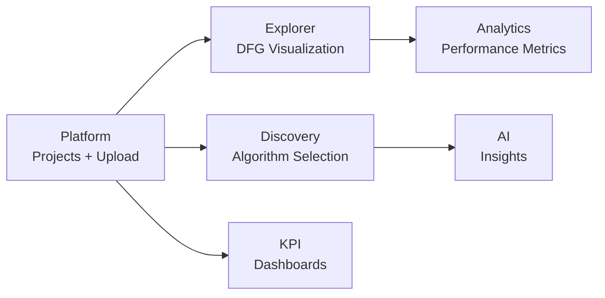

# Computation Graphs - Process Mining Platform

This directory contains detailed Mermaid computation graphs documenting the architecture and data flows of the Process Mining SaaS Platform.

## Overview

## Document Index

| File | Description | Key Topics |
|------|-------------|------------|
| [00-SYSTEM-ARCHITECTURE.md](./00-SYSTEM-ARCHITECTURE.md) | High-level system overview | Architecture layers, request flow, technology stack |
| [01-ADMIN-DOMAIN.md](./01-ADMIN-DOMAIN.md) | Authentication & multi-tenancy | JWT auth, RBAC, organizations, workspaces, projects |
| [02-DATASETS-DOMAIN.md](./02-DATASETS-DOMAIN.md) | Data ingestion pipeline | Upload, column detection, mapping, DuckDB ingestion |
| [03-ANALYSIS-DOMAIN.md](./03-ANALYSIS-DOMAIN.md) | Process mining algorithms | Discovery, conformance, analytics (CQRS), predictions |
| [04-PROCESS-MINING-FEATURES.md](./04-PROCESS-MINING-FEATURES.md) | Specialized PM capabilities | Filtering, visualization, OCPM, AI integration |
| [05-FRONTEND-FEATURES.md](./05-FRONTEND-FEATURES.md) | React frontend architecture | Routing, state management, feature modules |

## Quick Navigation

### Backend Architecture

### Key Data Flows

1. **Dataset Upload → Ready**
   - File upload → S3 storage
   - Column detection → Mapping
   - DuckDB ingestion → Parquet export

2. **Discovery Request → Model**
   - Select algorithm → Temporal workflow
   - PM4Py processing → Model serialization
   - S3 storage → Graph JSON cache

3. **Analytics Query → Results**
   - CQRS query dispatch → Cache check
   - DuckDB on Parquet → SQL execution
   - Cache update → Response

### Frontend Feature Map

## Technology Reference

| Layer | Technologies |
|-------|--------------|
| Frontend | React 19, React Router, TanStack Query, Ant Design, Cytoscape.js |
| API | FastAPI, Pydantic, JWT Auth |
| Application | CQRS pattern, Command/Query buses |
| Domain | PM4Py, DuckDB, SQLAlchemy |
| Infrastructure | SQLite/PostgreSQL, S3/MinIO, Redis, Temporal.io |

## How to Use These Diagrams

1. **Viewing**: Mermaid diagrams render in GitHub, GitLab, and VS Code with Mermaid extensions
2. **Editing**: Modify the Mermaid code blocks to update diagrams
3. **Exporting**: Use Mermaid CLI (`mmdc`) to export to PNG/SVG

## Diagram Types Used

| Type | Purpose |
|------|---------|
| `graph` | Architecture and dependency flows |
| `flowchart` | Process and data flows |
| `sequenceDiagram` | API request/response flows |
| `stateDiagram` | State machines and lifecycle |
| `erDiagram` | Entity relationships |

## Contributing

When adding new features:

1. Update the relevant domain/feature document
2. Add new diagrams following existing patterns
3. Update this README if adding new documents
4. Ensure Mermaid syntax is valid (test in live editor)

## Mermaid Live Editor

For testing and editing diagrams: [mermaid.live](https://mermaid.live)
