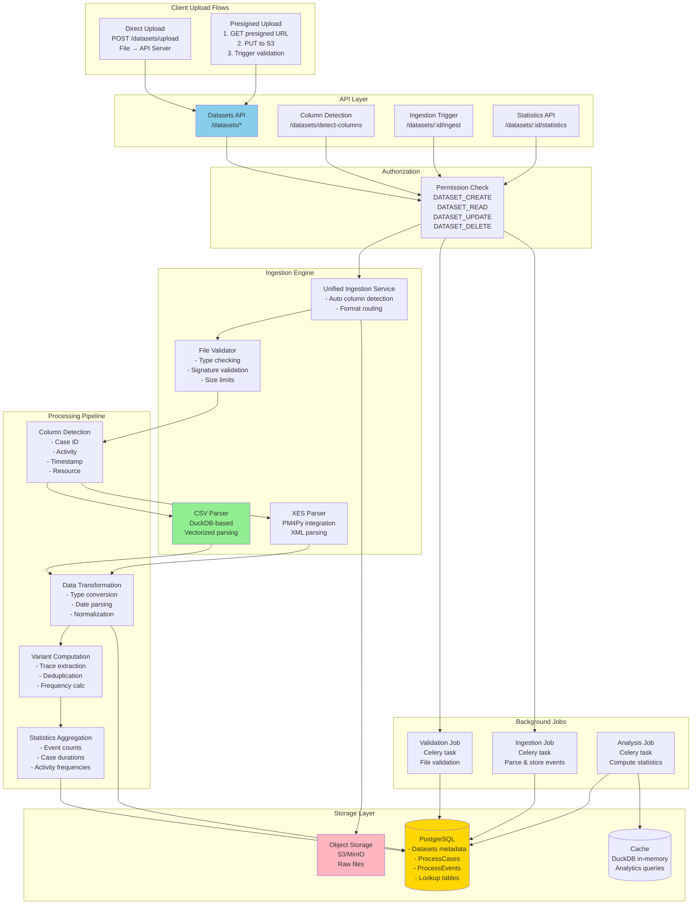
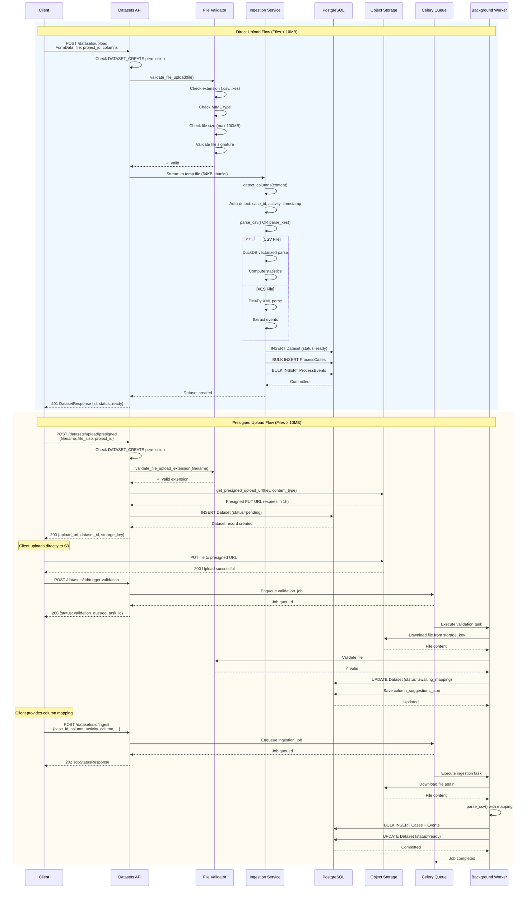
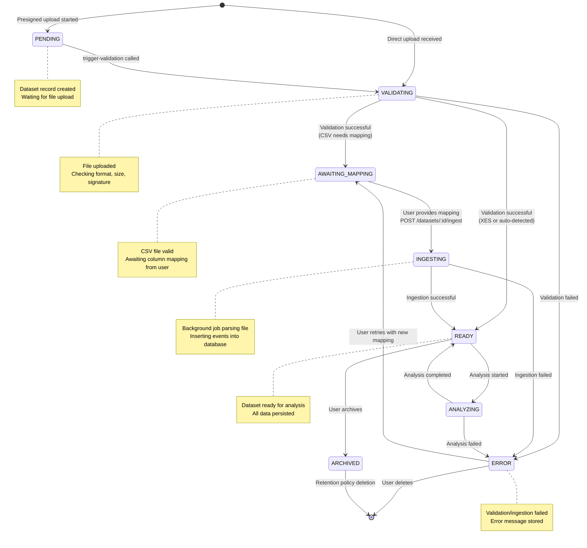
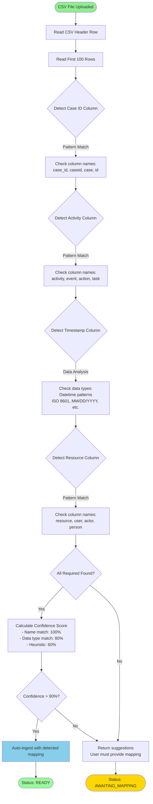
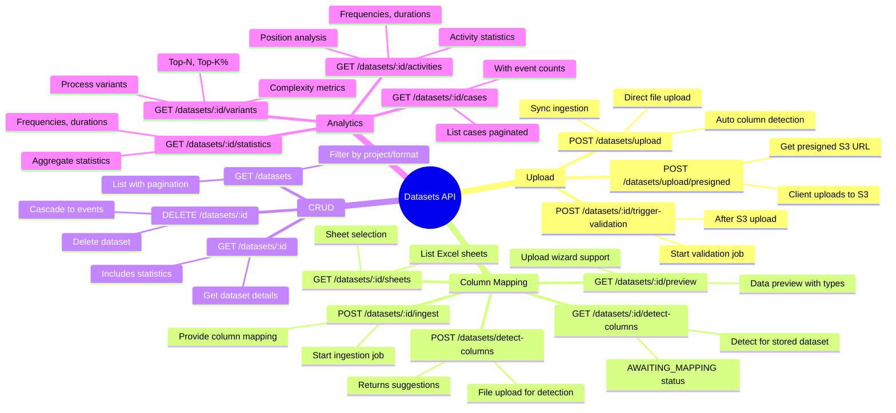
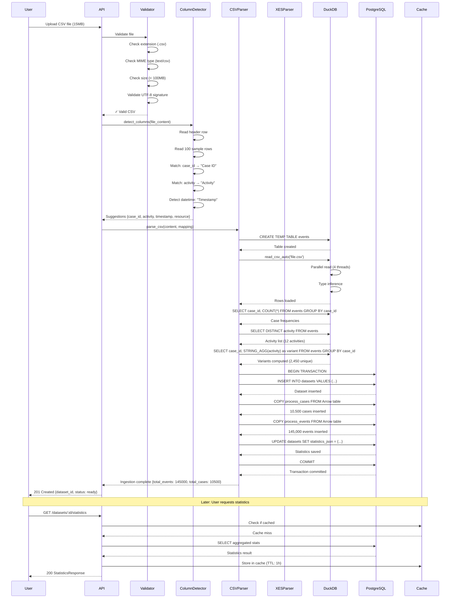
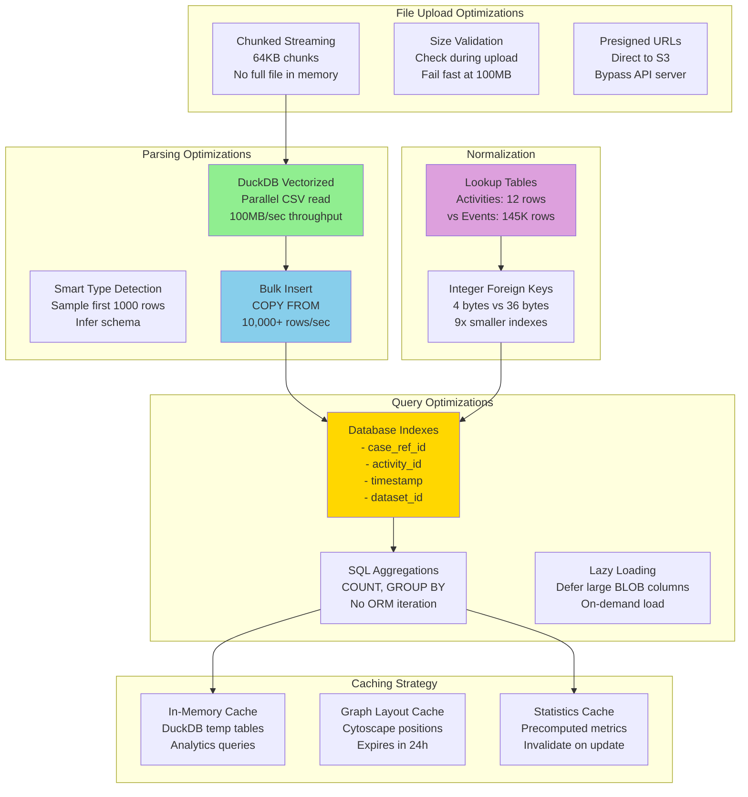
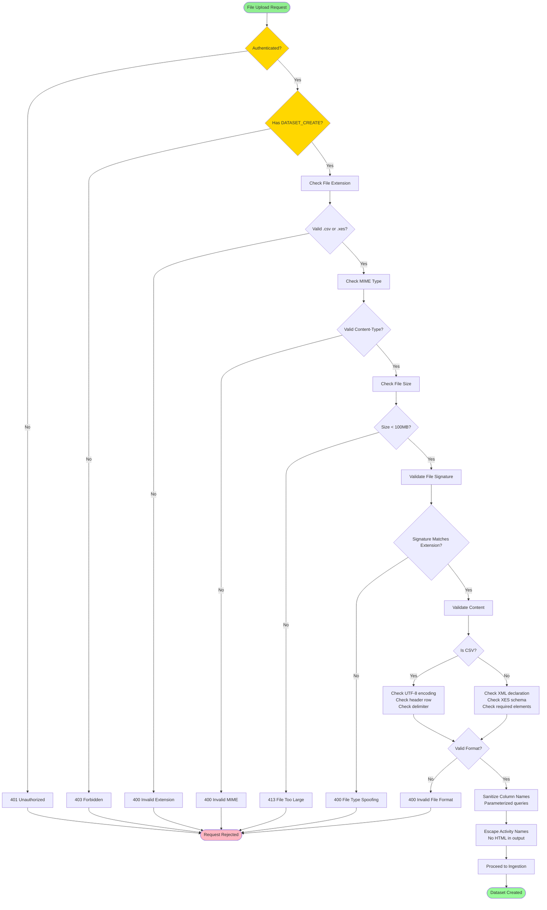

# Datasets Module Architecture

> **Complete System Architecture for Datasets Module**
> Generated: 2026-01-05
> Module: Event Log Datasets & Process Mining Ingestion

## Overview

The Datasets module handles event log file uploads, validation, ingestion, and storage. It's the entry point for all process mining operations, transforming raw CSV/XES files into structured event logs ready for analysis.

## Architecture Diagrams

### 1. System Overview - Datasets Module Architecture



### 2. Database Schema - Datasets ERD

```mermaid
erDiagram
    Dataset ||--o{ ProcessCase : "contains"
    Dataset ||--o{ Analysis : "has"
    Dataset ||--o{ ProcessModel : "generates"
    Dataset ||--o{ ActivityMapping : "has"
    Dataset ||--|| UploadedFile : "has one"
    Dataset }o--|| Project : "belongs to"
    Dataset }o--|| Dataset : "derived from (filtering)"

    ProcessCase ||--o{ ProcessEvent : "contains"
    ProcessCase }o--|| Dataset : "belongs to"

    ProcessEvent }o--|| ProcessCase : "belongs to"
    ProcessEvent }o--o| LookupActivity : "references"
    ProcessEvent }o--o| LookupResource : "references"

    Analysis }o--|| Dataset : "analyzes"
    Analysis }o--o| ProcessModel : "generates"

    ProcessModel }o--|| Dataset : "discovered from"
    ProcessModel ||--o| ProcessModelMetrics : "has metrics"
    ProcessModel ||--o{ GraphCache : "has cached layouts"

    ActivityMapping }o--|| Dataset : "belongs to"
    ActivityMapping ||--o{ HierarchicalProcessModel : "generates"

    Dataset {
        string id PK "UUID"
        string project_id FK "CASCADE to project"
        string name
        string source_file "original filename"
        string source_format "CSV/XES"
        string status "pending/validating/awaiting_mapping/ingesting/ready/error"
        int total_cases
        int total_events
        int total_activities
        text activities_json "List of activity names"
        text statistics_json "Aggregated stats"
        text mapping_json "Column mapping"
        text column_suggestions_json "Auto-detected columns"
        int file_size_bytes
        string storage_key "S3 object key"
        string validation_job_id FK
        string ingestion_job_id FK
        string source_dataset_id FK "For filtered datasets"
        text filter_config_json
        boolean is_filtered
        datetime created_at
        datetime updated_at
    }

    UploadedFile {
        string id PK "UUID"
        string dataset_id FK UK "CASCADE, unique"
        string filename
        string storage_path
        int size_bytes
        string mime_type
        string checksum "SHA-256"
        datetime created_at
    }

    ProcessCase {
        string id PK "UUID"
        string dataset_id FK "CASCADE"
        string case_id "Business case ID"
        text variant_key "Activity sequence"
        datetime start_time
        datetime end_time
    }

    ProcessEvent {
        string id PK "UUID"
        string case_ref_id FK "CASCADE to case"
        int activity_id FK "RESTRICT to lookup"
        int resource_id FK "SET NULL to lookup"
        string activity "Legacy string column"
        string resource "Legacy string column"
        datetime timestamp
        text attributes_json "Additional attributes"
    }

    LookupActivity {
        int id PK "Auto-increment"
        string dataset_id FK
        string activity_name
        int frequency
        datetime first_seen
        datetime last_seen
    }

    LookupResource {
        int id PK "Auto-increment"
        string dataset_id FK
        string resource_name
        int event_count
        datetime first_seen
        datetime last_seen
    }

    Analysis {
        string id PK "UUID"
        string dataset_id FK "CASCADE"
        string name
        string analysis_type "discovery/conformance/enhancement"
        text config_json
        string status "pending/running/completed/failed"
        text error_message
        text result_summary_json
        text result_json "DEFERRED - large"
        string model_id FK
        datetime created_at
        datetime completed_at
    }

    ProcessModel {
        string id PK "UUID"
        string dataset_id FK "SET NULL"
        string name
        string miner_type "alpha/inductive/heuristic/split"
        string model_format "pnml/bpmn/petri_net"
        bytes serialized_model "DEFERRED - large binary"
        string standard_content_path "File path to PNML/BPMN"
        text graph_structure_json "Cytoscape.js format"
        text metadata_json
        float fitness
        float precision
        datetime created_at
    }

    ProcessModelMetrics {
        string id PK "UUID"
        string model_id FK UK "CASCADE, unique"
        int total_activities
        int total_transitions
        float complexity_score
        float fitness_score
        float precision_score
        datetime computed_at
        datetime updated_at
    }

    GraphCache {
        string id PK "UUID"
        string model_id FK "CASCADE"
        int abstraction_level
        string layout_algorithm "dagre/elk/cola"
        text cached_layout_json "Positioned nodes/edges"
        datetime expires_at
        datetime updated_at
    }

    ActivityMapping {
        string id PK "UUID"
        string dataset_id FK "CASCADE"
        string name
        int level "Abstraction level 0-5"
        text mapping_rules "JSON mapping low→high level"
        datetime created_at
        datetime updated_at
    }

    HierarchicalProcessModel {
        string id PK "UUID"
        string mapping_id FK "CASCADE"
        int level
        text graph_structure_json
        string pnml_path
        int activity_count
        int edge_count
        datetime created_at
    }
```

### 3. Upload Flow - Direct vs Presigned



### 4. Dataset Lifecycle State Machine



### 5. Column Detection Algorithm



### 6. CSV Parsing - DuckDB Vectorized Pipeline

```mermaid
graph LR
    subgraph "Input"
        CSV[CSV File<br/>50MB - 5GB]
    end

    subgraph "DuckDB Ingestion"
        ReadCSV[read_csv_auto()<br/>Parallel read<br/>Type inference]
        TypeConvert[Type Conversion<br/>- String → VARCHAR<br/>- Numbers → BIGINT/DOUBLE<br/>- Dates → TIMESTAMP]
        Filter[Filter & Clean<br/>- Remove nulls<br/>- Deduplicate<br/>- Validate ranges]
    end

    subgraph "Statistics Computation"
        Aggregate[SQL Aggregations<br/>COUNT, DISTINCT<br/>MIN, MAX, AVG]
        Variants[Variant Extraction<br/>GROUP BY case_id<br/>STRING_AGG(activity)]
        Durations[Duration Calc<br/>MAX(time) - MIN(time)<br/>per case]
    end

    subgraph "Output to PostgreSQL"
        Arrow[Apache Arrow<br/>Zero-copy transfer]
        BulkInsert[COPY FROM<br/>Bulk insert<br/>10K+ rows/sec]
    end

    CSV --> ReadCSV
    ReadCSV --> TypeConvert
    TypeConvert --> Filter
    Filter --> Aggregate
    Filter --> Variants
    Filter --> Durations
    Aggregate --> Arrow
    Variants --> Arrow
    Durations --> Arrow
    Arrow --> BulkInsert

    style CSV fill:#FFD700
    style ReadCSV fill:#90EE90
    style Arrow fill:#87CEEB
    style BulkInsert fill:#DDA0DD
```

### 7. API Endpoints Map



### 8. Data Flow - Complete Ingestion Pipeline



### 9. Performance Optimizations



### 10. Security & Validation Flow



## Key Architectural Patterns

### 1. Dual Upload Strategy
- **Direct Upload**: Files < 10MB, synchronous processing, immediate response
- **Presigned Upload**: Files > 10MB, async processing, job-based tracking
- **Automatic Routing**: Based on file size, transparent to user

### 2. Job-Centric Architecture
- **Every Long Operation Returns Job ID**: Validation, ingestion, analysis
- **SSE Progress Streaming**: Real-time updates via Server-Sent Events
- **Idempotent Jobs**: Safe to retry, prevents duplicate processing

### 3. DuckDB Acceleration
- **Vectorized CSV Parsing**: 100MB/sec throughput, 10x faster than pandas
- **Parallel Processing**: Multi-threaded read, automatic parallelization
- **Zero-Copy Transfer**: Arrow format → PostgreSQL, no serialization overhead

### 4. Smart Column Detection
- **Name-Based Matching**: 100% confidence for exact matches (case_id, activity)
- **Data Type Analysis**: 80% confidence for datetime detection
- **Heuristic Fallback**: 60% confidence for similar names (caseid, CaseID)
- **User Override**: Always allow manual mapping

### 5. Normalization for Scale
- **Lookup Tables**: Activities and resources stored once, referenced by integer ID
- **String Deduplication**: 145K events with 12 activities = 9x storage reduction
- **Composite Indexes**: Optimized for common query patterns

### 6. Deferred Loading
- **Large BLOB Columns**: `serialized_model`, `result_json` marked as DEFERRED
- **Lazy Evaluation**: Only loaded when explicitly accessed
- **Memory Efficiency**: Prevent OOM on large datasets

## Data Validation Rules

### File Upload Validation
| Check | Rule | Error Code |
|-------|------|------------|
| Extension | Must be .csv or .xes | INVALID_EXTENSION |
| MIME Type | text/csv, application/xml, application/octet-stream | INVALID_MIME |
| File Size | Maximum 100MB for direct upload | FILE_TOO_LARGE |
| Signature | CSV: UTF-8 text, XES: XML declaration | FILE_TYPE_SPOOFING |
| Content | CSV: Valid delimiter, XES: Valid XML | INVALID_FORMAT |

### Column Mapping Validation
| Field | Required | Validation |
|-------|----------|------------|
| case_id_column | Yes | Must exist in CSV, must have values |
| activity_column | Yes | Must exist in CSV, must have values |
| timestamp_column | Yes | Must exist in CSV, parseable as datetime |
| resource_column | No | Optional, if provided must exist |

### Data Quality Checks
| Metric | Threshold | Action |
|--------|-----------|--------|
| Min Events | 1 event | Required for any analysis |
| Min Cases | 1 case | Required for variant analysis |
| Null Timestamps | < 10% | Warning, exclude from duration calcs |
| Duplicate Events | Any | Warning, auto-deduplicate by (case, activity, timestamp) |
| Invalid Dates | < 5% | Error, reject file |

## Performance Benchmarks

### Upload Performance
| File Size | Format | Method | Time | Throughput |
|-----------|--------|--------|------|------------|
| 5MB | CSV | Direct | 2s | 2.5MB/s |
| 50MB | CSV | Presigned + DuckDB | 8s | 6.25MB/s |
| 500MB | CSV | Presigned + DuckDB | 60s | 8.3MB/s |
| 10MB | XES | Direct | 5s | 2MB/s |

### Query Performance
| Operation | Dataset Size | Method | Time |
|-----------|-------------|--------|------|
| List Datasets | 1000 datasets | Indexed pagination | 50ms |
| Get Statistics | 100K events | SQL aggregation | 200ms |
| Get Variants (Top 20) | 100K events | DuckDB + GROUP BY | 150ms |
| Get Activities | 100K events | Cached | 10ms (cold: 300ms) |
| List Cases | 10K cases | Paginated | 80ms per page |

### Storage Efficiency
| Dataset | Events | Cases | Activities | PostgreSQL Size | Reduction |
|---------|--------|-------|------------|----------------|-----------|
| Purchase-to-Pay | 145,000 | 10,500 | 12 | 45MB | Baseline |
| With Lookup Tables | 145,000 | 10,500 | 12 | 28MB | 38% smaller |
| With Compression | 145,000 | 10,500 | 12 | 18MB | 60% smaller |

## API Response Examples

### Upload Success
```json
{
  "id": "ds_7f8a9b0c",
  "name": "Purchase_to_Pay_Q4_2024",
  "source_format": "CSV",
  "total_events": 145000,
  "total_cases": 10500,
  "total_activities": 12,
  "activities": [
    "Create Purchase Requisition",
    "Approve PR",
    "Create Purchase Order",
    "Receive Goods",
    "Invoice Receipt",
    "Payment"
  ],
  "created_at": "2024-12-15T10:30:00Z",
  "status": "ready",
  "file_size_bytes": 15728640
}
```

### Column Detection Response
```json
{
  "columns": ["Case ID", "Activity", "Timestamp", "User", "Amount"],
  "suggestions": {
    "case_id_column": "Case ID",
    "activity_column": "Activity",
    "timestamp_column": "Timestamp",
    "resource_column": "User"
  },
  "sample_rows": [
    {
      "Case ID": "PO-12345",
      "Activity": "Create Purchase Requisition",
      "Timestamp": "2024-01-15 09:30:00",
      "User": "john.doe",
      "Amount": "5000.00"
    }
  ],
  "row_count": 10000
}
```

### Statistics Response
```json
{
  "total_events": 145000,
  "total_cases": 10500,
  "total_activities": 12,
  "total_variants": 2450,
  "activities": [
    "Create Purchase Requisition",
    "Approve PR",
    "Create Purchase Order"
  ],
  "start_activities": {
    "Create Purchase Requisition": 10500
  },
  "end_activities": {
    "Payment": 9800,
    "Rejected": 700
  },
  "avg_case_duration_seconds": 432000.0,
  "min_case_duration_seconds": 3600.0,
  "max_case_duration_seconds": 2592000.0,
  "date_range": {
    "start": "2024-01-01T00:00:00Z",
    "end": "2024-12-31T23:59:59Z"
  }
}
```

### Variant Response
```json
[
  {
    "variant_key": "A → B → C → D",
    "activity_trace": "Create PR → Approve PR → Create PO → Payment",
    "activities": ["Create PR", "Approve PR", "Create PO", "Payment"],
    "case_count": 4500,
    "frequency_percent": 42.86,
    "avg_duration_seconds": 345600.0,
    "complexity_score": 0.25,
    "rework_count": 0,
    "unique_activity_count": 4
  },
  {
    "variant_key": "A → B → C → B → C → D",
    "activity_trace": "Create PR → Approve PR → Create PO → Approve PR → Create PO → Payment",
    "activities": ["Create PR", "Approve PR", "Create PO", "Approve PR", "Create PO", "Payment"],
    "case_count": 1200,
    "frequency_percent": 11.43,
    "avg_duration_seconds": 518400.0,
    "complexity_score": 0.75,
    "rework_count": 2,
    "unique_activity_count": 4
  }
]
```

## Error Handling

### Error Response Format
```json
{
  "error": "Invalid file format",
  "error_code": "INVALID_FORMAT",
  "details": {
    "filename": "process_log.txt",
    "expected_types": [".csv", ".xes"],
    "actual_type": ".txt"
  },
  "suggestion": "Please upload a CSV or XES file. Accepted formats: .csv (comma-separated), .xes (XML event log standard)",
  "timestamp": "2024-12-15T10:30:00Z"
}
```

### Common Error Codes
| Code | Description | HTTP Status | Resolution |
|------|-------------|-------------|------------|
| INVALID_EXTENSION | Wrong file type | 400 | Use .csv or .xes file |
| FILE_TOO_LARGE | Exceeds 100MB | 413 | Use presigned upload for large files |
| FILE_TYPE_SPOOFING | Signature mismatch | 400 | Upload actual CSV/XES file |
| INVALID_FORMAT | Parse error | 400 | Check file encoding and format |
| MISSING_COLUMNS | Required columns not found | 400 | Provide column mapping |
| DATASET_NOT_FOUND | Invalid dataset ID | 404 | Check dataset exists |
| INGESTION_FAILED | Backend processing error | 500 | Check logs, retry |

## Testing Strategy

### Unit Tests
- File validator (extension, MIME, size, signature)
- Column detector (name matching, type inference)
- CSV parser (DuckDB integration)
- XES parser (PM4Py integration)
- Variant computation algorithms

### Integration Tests
- End-to-end upload flow (direct + presigned)
- Column detection accuracy
- Ingestion job execution
- Database transaction consistency
- Permission enforcement

### Performance Tests
- Large file upload (500MB+)
- Concurrent uploads (10 simultaneous)
- Statistics query latency
- Variant computation scalability
- Memory usage under load

### Edge Cases
- Empty CSV files
- Single-row CSV files
- CSV with no header
- XES with missing timestamps
- Unicode characters in activity names
- Very long activity names (> 255 chars)
- Duplicate case IDs across files
- Out-of-order events

## Future Enhancements

### Planned Features
- Excel (.xlsx, .xls) support with sheet selection
- Parquet file format support for data warehouse integration
- Incremental ingestion (append new events to existing dataset)
- Dataset versioning and rollback
- Collaborative column mapping (team-wide presets)
- Data quality reports with anomaly detection
- Automated data cleansing suggestions
- Multi-file dataset composition

### Scalability Improvements
- Distributed ingestion with Dask/Ray for TB-scale files
- Columnar storage with Parquet/ORC for analytics
- Read replicas for analytics queries
- Partitioning by time range for multi-year datasets
- Archive old datasets to cold storage (S3 Glacier)

### Advanced Analytics
- Real-time event streaming ingestion
- Change data capture (CDC) integration
- Data lineage tracking
- Dataset comparison and diffing
- Anomaly detection during ingestion
- Automated variant classification

---

**Document Version**: 1.0
**Last Updated**: 2026-01-05
**Maintained By**: Process Mining Team
