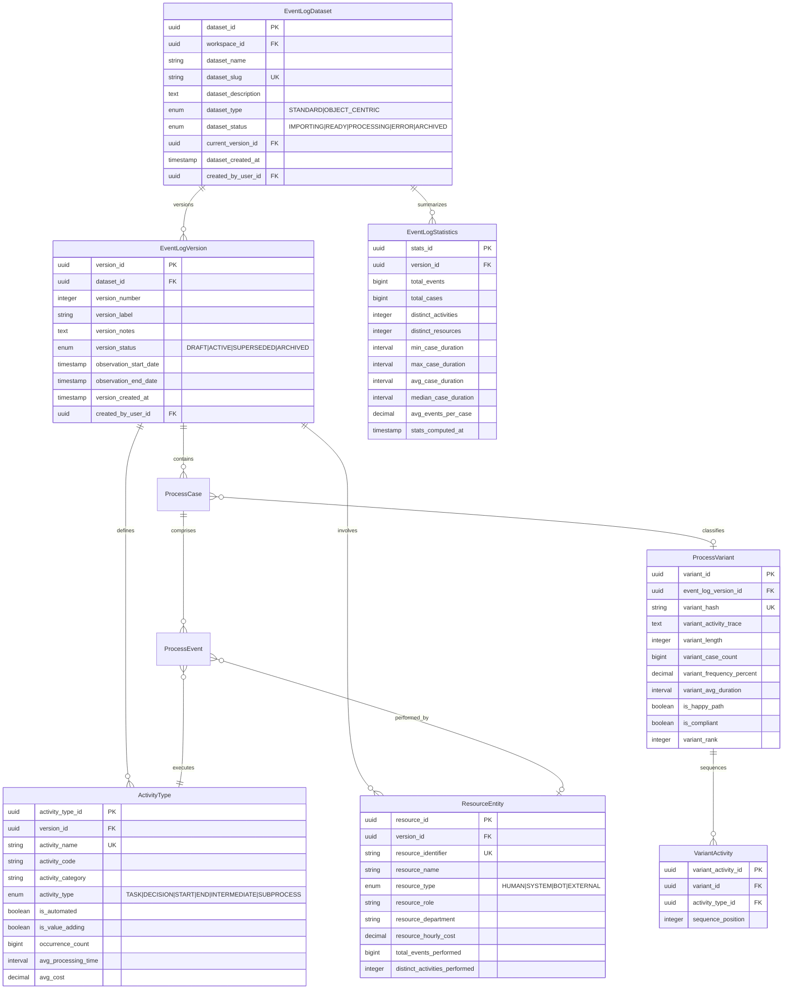
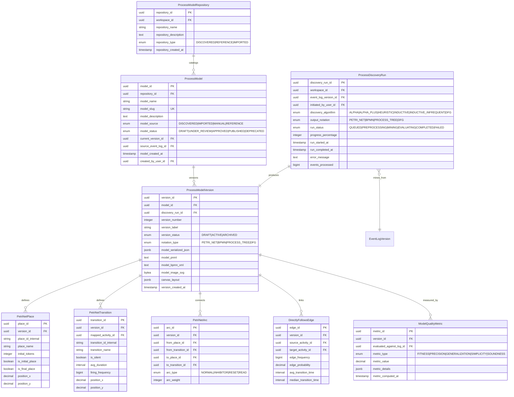
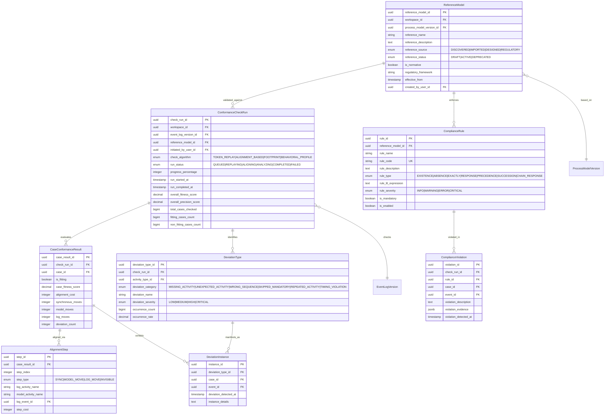
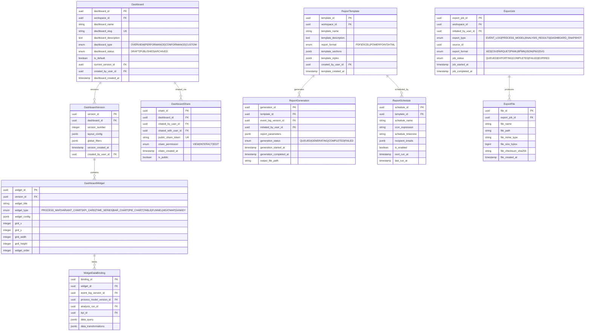

# Extracted ERD for Process Mining Platform

Based on your current implementation and the comprehensive ERD provided, here is a **focused extraction** of entities relevant for your next development phases.

## TL;DR - Current State (v0.4.0)

| Layer           | Tables                                                                             | Status    |
| --------------- | ---------------------------------------------------------------------------------- | --------- |
| **Core**        | `event_logs`, `process_cases`, `process_events`, `variants`, `activity_types`      | ✅ Done   |
| **Discovery**   | `process_models`, `model_versions`, `discovery_runs`, `petri_net_*`, `dfg_edges`   | ✅ Done   |
| **Conformance** | `reference_models`, `conformance_runs`, `alignments`, `deviations`, `compliance_*` | ✅ Done   |
| **Performance** | `analysis_runs`, `*_metrics`, `bottlenecks`, `kpis`, `alerts`                      | ✅ Done   |
| **Dashboards**  | `dashboards`, `widgets`, `reports`                                                 | 🔮 Future |

**Total: 41 tables implemented**

---

## Implementation History

| Version  | What Changed                            |
| -------- | --------------------------------------- |
| **v0.1** | Core domain entities                    |
| **v0.2** | Value objects, state machines           |
| **v0.3** | Transitions, resources, SLAs            |
| **v0.4** | Full ERD (25 new models for phases 2-4) |

---

## Phase 1: Core Process Mining (Recommended Next)

These entities extend your existing foundation with versioning, variants, and activities:

---

## Phase 2: Process Discovery & Model Management

Extends your existing `ProcessModel` with versioning, Petri net, and BPMN support:

---

## Phase 3: Conformance & Compliance

Extends your existing `ConformanceResult` with detailed deviations and compliance rules:

---

## Phase 4: Performance Analytics & KPIs

Extends your existing SLA models with bottleneck detection and KPIs:

```mermaid
erDiagram
    PerformanceAnalysisRun ||--o{ ActivityPerformanceMetric : "measures"
    PerformanceAnalysisRun ||--o{ TransitionPerformanceMetric : "measures"
    PerformanceAnalysisRun ||--o{ ResourcePerformanceMetric : "measures"
    PerformanceAnalysisRun ||--o{ BottleneckFinding : "identifies"
    PerformanceAnalysisRun }o--|| EventLogVersion : "analyzes"

    ProcessKPI ||--o{ KPIMeasurement : "tracked_by"
    ProcessKPI ||--o{ KPITarget : "targets"
    ProcessKPI ||--o{ KPIAlert : "triggers"

    PerformanceAnalysisRun {
        uuid analysis_run_id PK
        uuid workspace_id FK
        uuid event_log_version_id FK
        uuid initiated_by_user_id FK
        string analysis_name
        enum analysis_type "DURATION|FREQUENCY|BOTTLENECK|THROUGHPUT|WORKLOAD"
        enum run_status "QUEUED|PROCESSING|COMPLETED|FAILED"
        timestamp run_started_at
        timestamp run_completed_at
        jsonb summary_statistics
    }

    ActivityPerformanceMetric {
        uuid metric_id PK
        uuid analysis_run_id FK
        uuid activity_type_id FK
        bigint execution_count
        bigint distinct_cases
        interval min_duration
        interval max_duration
        interval avg_duration
        interval median_duration
        interval p95_duration
        interval total_processing_time
        interval total_waiting_time
        decimal avg_cost
    }

    TransitionPerformanceMetric {
        uuid metric_id PK
        uuid analysis_run_id FK
        uuid from_activity_id FK
        uuid to_activity_id FK
        bigint transition_count
        interval min_time
        interval max_time
        interval avg_time
        interval median_time
        decimal transition_probability
    }

    ResourcePerformanceMetric {
        uuid metric_id PK
        uuid analysis_run_id FK
        uuid resource_id FK
        bigint events_handled
        bigint cases_touched
        integer distinct_activities
        interval total_active_time
        interval avg_handling_time
        decimal utilization_rate
        bigint handoff_count_out
        bigint handoff_count_in
    }

    BottleneckFinding {
        uuid finding_id PK
        uuid analysis_run_id FK
        uuid activity_type_id FK
        uuid from_activity_id FK
        uuid to_activity_id FK
        enum bottleneck_location "ACTIVITY|TRANSITION|RESOURCE|BATCH_POINT"
        enum bottleneck_type "PROCESSING_TIME|WAITING_TIME|RESOURCE_CONTENTION|BATCHING"
        decimal severity_score
        interval avg_delay_introduced
        interval total_time_impact
        bigint cases_affected
        text bottleneck_description
        text recommended_action
    }

    ProcessKPI {
        uuid kpi_id PK
        uuid workspace_id FK
        string kpi_name
        string kpi_code UK
        text kpi_description
        enum kpi_category "TIME|COST|QUALITY|THROUGHPUT|COMPLIANCE|CUSTOM"
        text kpi_formula
        string kpi_unit
        enum kpi_direction "HIGHER_IS_BETTER|LOWER_IS_BETTER"
        boolean is_enabled
        uuid created_by_user_id FK
    }

    KPIMeasurement {
        uuid measurement_id PK
        uuid kpi_id FK
        uuid event_log_version_id FK
        timestamp measurement_period_start
        timestamp measurement_period_end
        decimal measurement_value
        decimal previous_period_value
        decimal change_percent
        bigint sample_size
        timestamp measured_at
    }

    KPITarget {
        uuid target_id PK
        uuid kpi_id FK
        string target_name
        decimal target_value
        enum target_type "MINIMUM|MAXIMUM|EXACT|RANGE"
        decimal target_range_low
        decimal target_range_high
        timestamp target_effective_from
        uuid set_by_user_id FK
    }

    KPIAlert {
        uuid kpi_alert_id PK
        uuid kpi_id FK
        uuid target_id FK
        uuid measurement_id FK
        enum alert_type "TARGET_BREACH|TREND_DECLINE|ANOMALY"
        decimal actual_value
        decimal target_value
        decimal deviation_percent
        text alert_message
        timestamp alert_triggered_at
        boolean is_acknowledged
    }
```

---

## Phase 5: Dashboards & Reporting (Future)

---

## Recommended Implementation Order

| Phase | Entities                                                                  | Priority   | Extends                         |
| ----- | ------------------------------------------------------------------------- | ---------- | ------------------------------- |
| **1** | EventLogVersion, ActivityType, ResourceEntity, ProcessVariant             | **HIGH**   | Your existing EventLog          |
| **2** | ProcessModelVersion, PetriNet\*, DirectlyFollowsEdge, ModelQualityMetric  | **HIGH**   | Your existing ProcessModel      |
| **3** | ConformanceCheckRun, CaseConformanceResult, DeviationType, ComplianceRule | **MEDIUM** | Your existing ConformanceResult |
| **4** | PerformanceAnalysisRun, BottleneckFinding, ProcessKPI, KPIMeasurement     | **MEDIUM** | Your existing SLA models        |
| **5** | Dashboard, Widget, ReportTemplate                                         | **FUTURE** | New capability                  |

---

## Skipped Sections (Lower Priority for MVP)

The following sections from the full ERD are **NOT recommended** for your next phases:

- **Section 1**: Tenant, Workspace, User, Role, Permission (Multi-tenancy) — Only needed at scale
- **Section 6**: Social Network Analysis, Role Mining — Advanced organizational features
- **Section 7**: Predictive Models, Anomaly Detection — ML/AI features
- **Section 9**: Automation Workflows, Triggers — Workflow automation
- **Section 10**: Alerting, Notifications — Production monitoring
- **Section 11**: Integration Providers, OAuth — Third-party connections
- **Section 12**: Audit, GDPR, Data Retention — Compliance (enterprise)

These can be added later when your core process mining functionality is mature.
