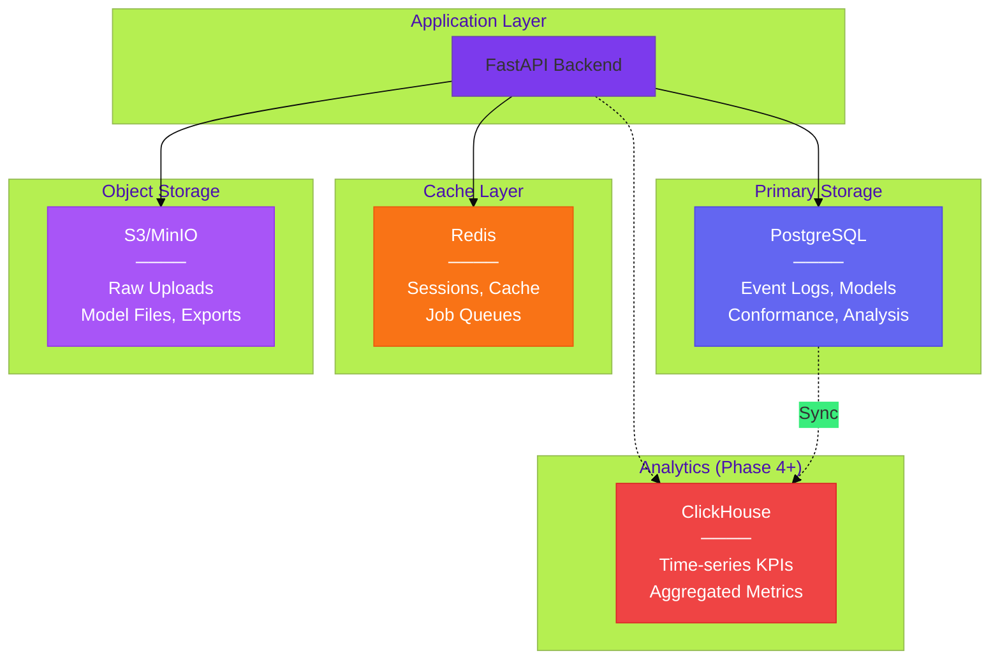

# Phased Development Roadmap

## Development Phases Overview


---

## Phase Summary

| Phase | Focus                                      | Storage                        | Status      |
| ----- | ------------------------------------------ | ------------------------------ | ----------- |
| **1** | Event Log, Cases, Variants, Activities     | PostgreSQL `eventlog` schema   | ✅ Complete |
| **2** | Process Models, Discovery, DFG, Petri Nets | PostgreSQL `model` schema + S3 | ✅ Complete |
| **3** | Conformance, Deviations, Compliance Rules  | PostgreSQL `analysis` schema   | ✅ Complete |
| **4** | Performance, Bottlenecks, KPIs, SLAs       | PostgreSQL + ClickHouse        | ✅ Complete |
| **5** | Dashboards, Reports, Visualizations        | PostgreSQL + S3                | 🔮 Future   |

---

## Storage Architecture (Simplified)



---

## Changelog

| Date       | Version | Changes                                                                                      |
| ---------- | ------- | -------------------------------------------------------------------------------------------- |
| 2024-12-28 | 0.5.0   | **API Layer Complete**: 14 new endpoints for all 3 flows (ingestion, discovery, conformance) |
| 2024-12-28 | 0.4.0   | **Phase 2-4 ERD Complete**: Added 25 ORM models (8 discovery, 8 conformance, 9 performance)  |
| 2024-12-28 | 0.3.0   | Phase 2 partial: `Transition`, `ResourceProfile`, model versioning                           |
| 2024-12-28 | 0.2.0   | Value objects: `LogStatistics`, `QualityReport`, `FilterConfig`                              |
| 2024-12-28 | 0.1.0   | Core: `EventLog`, `ProcessCase`, `ProcessEvent`, `ProcessModel`                              |

---

## Current State (v0.5.0)

### ✅ Backend Ready

| Component                | Status | Details                                              |
| ------------------------ | ------ | ---------------------------------------------------- |
| **Event Log Ingestion**  | ✅     | CSV/XES upload, preview, statistics, quality reports |
| **Process Discovery**    | ✅     | Alpha, Inductive, Heuristics, DFG miners via PM4Py   |
| **Conformance Checking** | ✅     | Token Replay, Alignments, deviation patterns         |
| **API Layer**            | ✅     | 27 endpoints across 3 routers                        |
| **Domain Model**         | ✅     | DDD with entities, value objects, aggregates         |
| **ORM Models**           | ✅     | 25 SQLAlchemy models                                 |

### 🔜 Frontend Pending

| Component          | Status | Next Step                        |
| ------------------ | ------ | -------------------------------- |
| **Dashboard UI**   | 🔜     | Build React/Next.js frontend     |
| **Visualizations** | 🔜     | D3/React Flow for process graphs |
| **Reports**        | 🔜     | PDF/CSV export functionality     |

### API Endpoints Summary

```
/api/v1/logs        → 11 routes (upload, preview, stats, quality, variants)
/api/v1/discovery   →  8 routes (miners, discover, DFG, Petri net, model quality)
/api/v1/conformance →  8 routes (check, alignments, patterns, quality metrics)
```

See [routers/README.md](../backend/src/presentation/api/routers/README.md) for endpoint details.

---

## Deferred for Scale

The following capabilities are intentionally deferred:

- **Multi-tenancy** (tenant isolation, workspaces) → Enterprise phase
- **Predictive Analytics** (ML models, anomaly detection) → AI phase
- **Automation Workflows** (triggers, orchestration) → Automation phase
- **Advanced Search** (Elasticsearch integration) → Scale phase

---

_See [extracted_erd.md](./extracted_erd.md) for detailed entity definitions._
