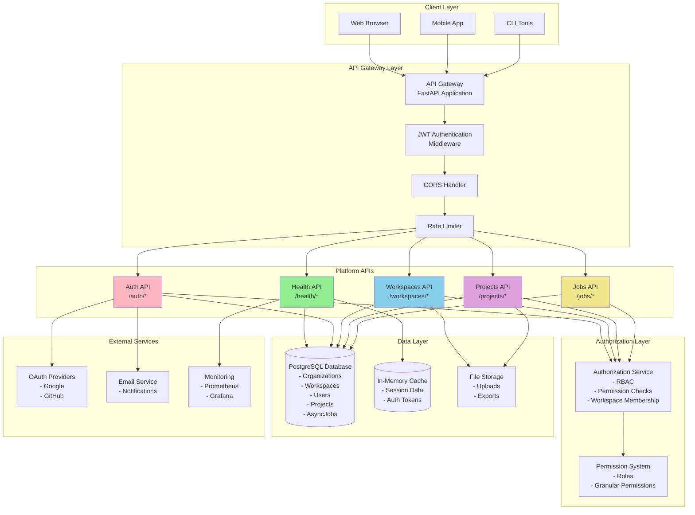
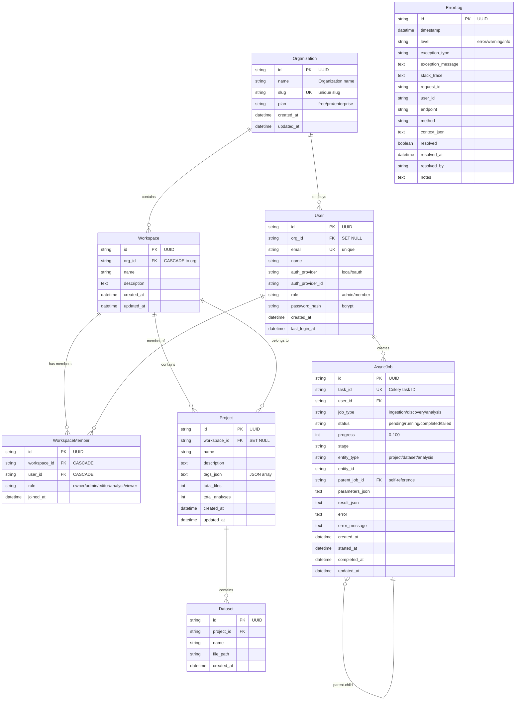
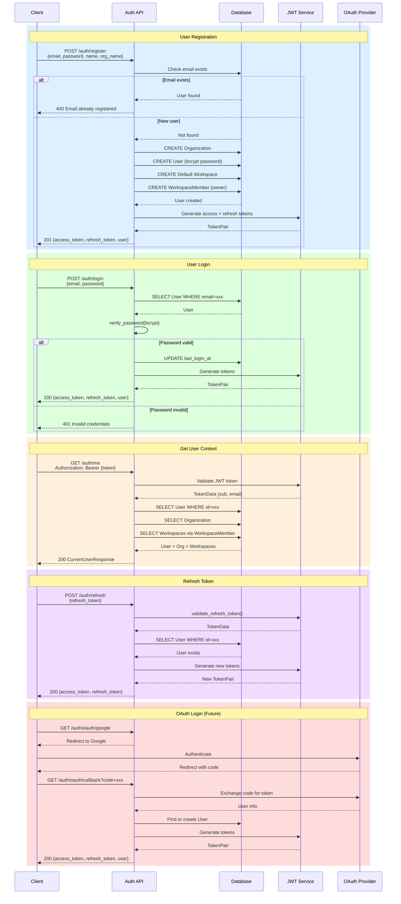
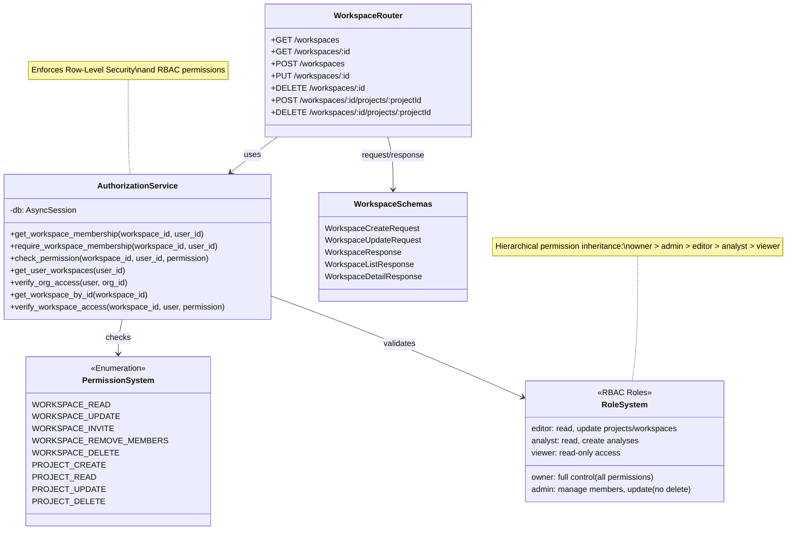
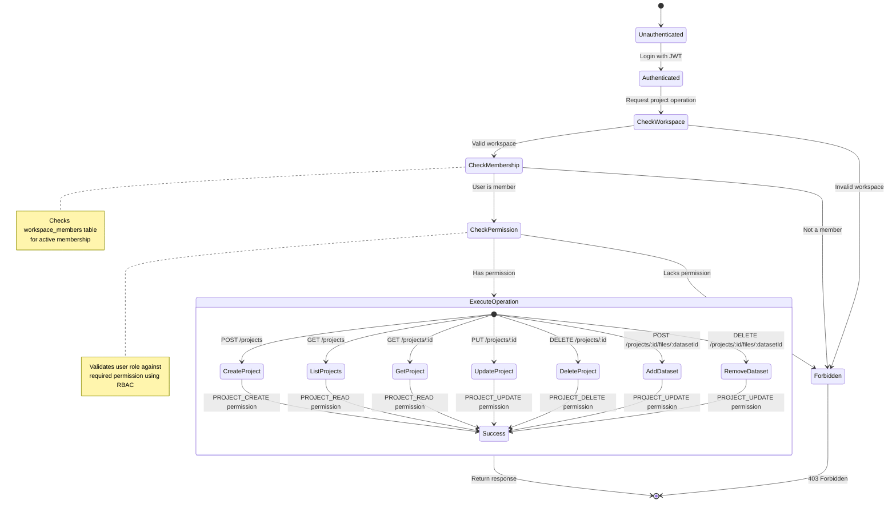
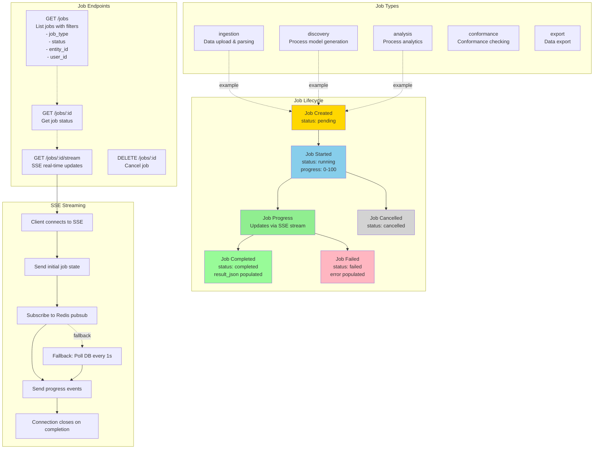
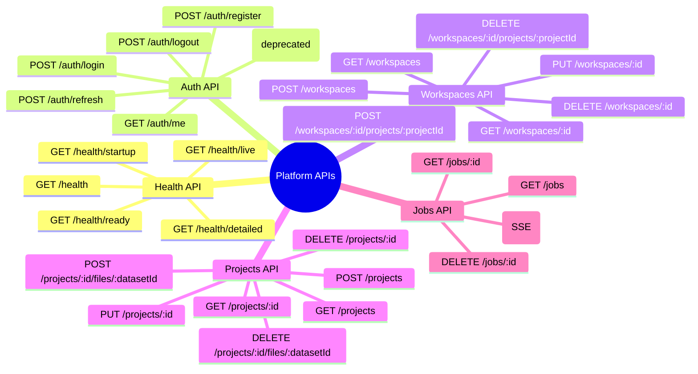
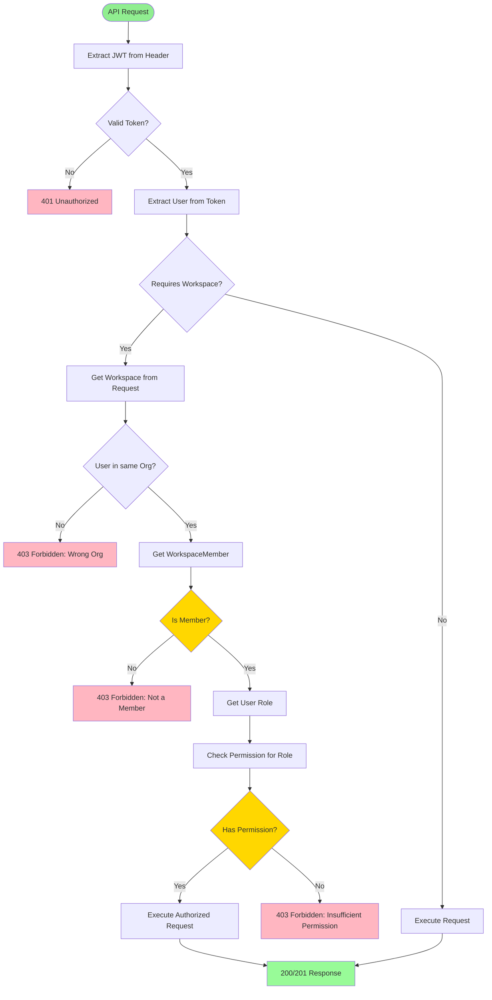
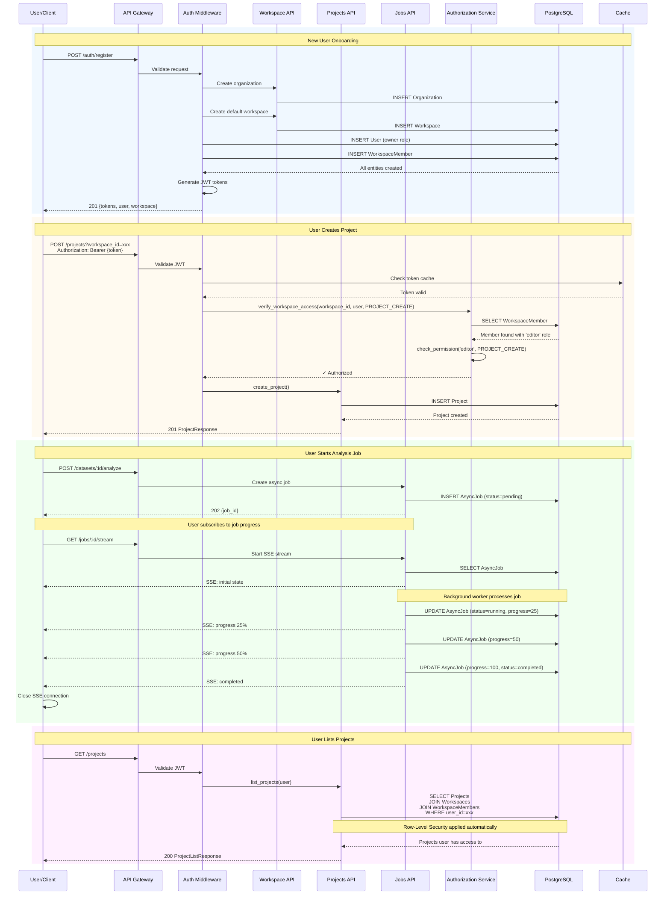
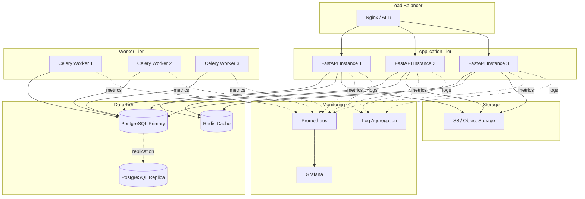

# Platform System Architecture

> **Complete System Architecture for Platform APIs**
> Generated: 2026-01-05
> Modules: Health, Jobs, Auth, Workspaces, Projects

## Overview

The Platform layer provides core SaaS infrastructure components that are independent of domain-specific features. It follows a modular monolith architecture with clear separation of concerns.

## Architecture Diagrams

### 1. System Overview - Platform Layer Architecture



### 2. Database Schema - Complete Platform ERD



### 3. Health API - Endpoints & Architecture

```mermaid
graph TB
    subgraph "Health Check Endpoints"
        Live[GET /health/live<br/>Liveness Probe<br/>Returns 200 if alive]
        Ready[GET /health/ready<br/>Readiness Probe<br/>Checks DB connectivity]
        Startup[GET /health/startup<br/>Startup Probe<br/>Checks initialization]
        Detailed[GET /health/detailed<br/>Detailed Status<br/>All components]
        Basic[GET /health<br/>Basic Check<br/>Quick response]
    end

    subgraph "Health Checkers"
        DBCheck[Database Checker<br/>- Connection test<br/>- Latency measurement]
        CacheCheck[Cache Checker<br/>- In-memory cache<br/>- Optional component]
        PM4PyCheck[PM4Py Checker<br/>- Library availability<br/>- Version check]
        CircuitCheck[Circuit Breaker<br/>- Check circuit states<br/>- Degraded if open]
        DiskCheck[Disk Space<br/>- Check free space<br/>- Warn at 80%<br/>- Critical at 90%]
    end

    subgraph "Response Models"
        HealthStatus[HealthStatus<br/>- status: healthy/degraded/unhealthy<br/>- timestamp]
        ComponentHealth[ComponentHealth<br/>- name<br/>- status<br/>- latency_ms<br/>- message<br/>- details]
        DetailedResponse[DetailedHealthResponse<br/>- status<br/>- version<br/>- uptime_seconds<br/>- components[]]
    end

    subgraph "K8s Integration"
        K8s[Kubernetes<br/>- Liveness probe → restart pod<br/>- Readiness probe → route traffic<br/>- Startup probe → wait for init]
    end

    Live --> HealthStatus
    Ready --> DBCheck
    Ready --> HealthStatus
    Startup --> HealthStatus
    Basic --> HealthStatus

    Detailed --> DBCheck
    Detailed --> CacheCheck
    Detailed --> PM4PyCheck
    Detailed --> CircuitCheck
    Detailed --> DiskCheck
    Detailed --> DetailedResponse

    DBCheck --> ComponentHealth
    CacheCheck --> ComponentHealth
    PM4PyCheck --> ComponentHealth
    CircuitCheck --> ComponentHealth
    DiskCheck --> ComponentHealth

    Ready -.-> K8s
    Live -.-> K8s
    Startup -.-> K8s

    style Live fill:#90EE90
    style Ready fill:#FFD700
    style Startup fill:#87CEEB
    style Detailed fill:#DDA0DD
```

### 4. Auth API - Authentication & Authorization Flow



### 5. Workspaces API - Complete CRUD Operations



### 6. Projects API - CRUD with Authorization



### 7. Jobs API - Async Job Management



### 8. Complete API Endpoint Map



### 9. Authorization & Permission Flow



### 10. Data Flow - Complete Platform Operations



## Key Architectural Patterns

### 1. Multi-Tenancy Hierarchy
- **Organization** (root): Top-level tenant
- **Workspace**: Collaboration context within org
- **Projects**: Containers for work items
- **Row-Level Security**: Automatic filtering by workspace membership

### 2. Role-Based Access Control (RBAC)
- **Roles**: owner, admin, editor, analyst, viewer
- **Permissions**: Granular (e.g., `project:create`, `dataset:read`)
- **Hierarchy**: Roles inherit permissions from lower roles

### 3. Authentication & Authorization
- **JWT Tokens**: Stateless authentication with access + refresh tokens
- **Token Expiry**: Access tokens expire in 30 minutes, refresh in 7 days
- **Workspace Membership**: Checked on every workspace-scoped request
- **Permission Validation**: Role → Permission mapping enforced

### 4. Async Job Pattern
- **Job-Centric**: Long-running operations return job IDs
- **Progress Tracking**: Real-time updates via SSE streams
- **Status Enum**: pending → running → completed/failed/cancelled
- **Parent-Child**: Jobs can spawn sub-jobs for complex workflows

### 5. Health Monitoring
- **Kubernetes Probes**: liveness, readiness, startup
- **Component Health**: Database, cache, dependencies, disk
- **Circuit Breakers**: Graceful degradation when services fail
- **Monitoring Integration**: Prometheus metrics, Grafana dashboards

## Security Considerations

### Authentication
- ✅ Bcrypt password hashing (cost factor 12)
- ✅ JWT with RS256 (asymmetric signing)
- ✅ Refresh token rotation
- ✅ Token expiration enforcement
- 🔄 OAuth 2.0 integration (planned)
- 🔄 Multi-factor authentication (planned)

### Authorization
- ✅ Workspace-scoped RBAC
- ✅ Row-level security via ORM
- ✅ Permission checks on every mutation
- ✅ Organization boundary enforcement
- 🔄 Audit logging for all access (planned)

### API Security
- ✅ CORS configuration
- ✅ Rate limiting
- ✅ Input validation with Pydantic
- ✅ SQL injection prevention (SQLAlchemy)
- ✅ XSS prevention (no raw HTML)
- 🔄 API key authentication (planned)
- 🔄 IP whitelisting (planned)

## Performance Optimizations

### Database
- Indexed foreign keys on all relationships
- Composite indexes on frequently queried columns
- Eager loading with `selectin` strategy
- Connection pooling with async engine

### Caching
- In-memory cache for JWT token validation
- Query result caching for frequently accessed data
- Cache invalidation on mutations

### API Optimization
- Pagination on all list endpoints (max 100 items)
- Sparse fieldsets for large responses
- Async/await throughout for I/O operations
- Background job processing for heavy operations

## Deployment Architecture



## API Response Codes

| Code | Meaning | Usage |
|------|---------|-------|
| 200 | OK | Successful GET, PUT, DELETE |
| 201 | Created | Successful POST creating resource |
| 202 | Accepted | Async job started |
| 204 | No Content | Successful DELETE with no response body |
| 400 | Bad Request | Invalid input, validation errors |
| 401 | Unauthorized | Missing or invalid authentication |
| 403 | Forbidden | Valid auth but insufficient permissions |
| 404 | Not Found | Resource doesn't exist |
| 409 | Conflict | Resource already exists |
| 422 | Unprocessable Entity | Pydantic validation errors |
| 429 | Too Many Requests | Rate limit exceeded |
| 500 | Internal Server Error | Unexpected server error |
| 503 | Service Unavailable | Dependency failure (DB down) |

## Testing Strategy

### Unit Tests
- Service layer logic
- Permission checking
- JWT token generation/validation
- Password hashing/verification

### Integration Tests
- API endpoint responses
- Database transactions
- Authorization flows
- Job lifecycle

### End-to-End Tests
- User registration → workspace creation → project creation
- Complete auth flow with token refresh
- Async job submission and completion
- Multi-user workspace collaboration

## Future Enhancements

### Planned Features
- 🔄 OAuth 2.0 integration (Google, GitHub, Microsoft)
- 🔄 Multi-factor authentication (TOTP, SMS)
- 🔄 API key management for programmatic access
- 🔄 Webhook notifications for job completion
- 🔄 Enhanced audit logging with event sourcing
- 🔄 Team management UI
- 🔄 Usage analytics and billing integration

### Scalability Improvements
- 🔄 Distributed caching with Redis Cluster
- 🔄 Database sharding by organization
- 🔄 Read replicas for reporting queries
- 🔄 CDN integration for static assets
- 🔄 GraphQL API alongside REST

---

**Document Version**: 1.0
**Last Updated**: 2026-01-05
**Maintained By**: Platform Team
