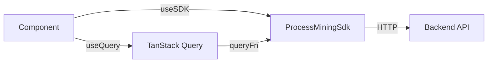

# SDK_INTEGRATION.md — How FE Talks to BE

> [!IMPORTANT]
> The frontend uses a unified `ProcessMiningSdk` interface exposed via `SDKContext`. All data fetching is managed by TanStack Query v5 for robust caching and state management.

---

## 1. SDK Architecture

**Location:** [libs/shared/design-system/src/context/SDKContext.tsx](file:///Users/namanagarwal/system/frontend-new/libs/shared/design-system/src/context/SDKContext.tsx)



### Provider Setup

```tsx
// App.tsx
<SDKProvider baseUrl="http://localhost:8001">
  <QueryClientProvider client={queryClient}>{children}</QueryClientProvider>
</SDKProvider>
```

---

## 2. SDK Modules

### logs Module

| Method    | Signature                                    | Returns                                         | Used By                                          |
| --------- | -------------------------------------------- | ----------------------------------------------- | ------------------------------------------------ |
| `list`    | `list(options?: ListOptions)`                | `Promise<{ items: EventLog[], total: number }>` | `HomePage`, `EventLogsPage`, `ExplorerIndexPage` |
| `get`     | `get(id: string)`                            | `Promise<EventLog>`                             | `LogDetailPage`                                  |
| `ingest`  | `ingest(file: File, metadata?: LogMetadata)` | `Promise<{ id: string }>`                       | `UploadWizardPage`                               |
| `analyze` | `analyze(logId: string)`                     | `Promise<LogAnalysis>`                          | `LogDetailPage`                                  |
| `delete`  | `delete(id: string)`                         | `Promise<void>`                                 | `EventLogsPage`                                  |

### discovery Module

| Method     | Signature                                                  | Returns                                           | Used By               |
| ---------- | ---------------------------------------------------------- | ------------------------------------------------- | --------------------- |
| `discover` | `discover(options: { logId: string, minerType?: string })` | `Promise<{ modelId: string }>`                    | `ProcessExplorerPage` |
| `buildDFG` | `buildDFG(logId: string, options?: DFGOptions)`            | `Promise<{ nodes: DFGNode[], edges: DFGEdge[] }>` | `ProcessExplorerPage` |

### visualization Module

| Method   | Signature               | Returns                             | Used By         |
| -------- | ----------------------- | ----------------------------------- | --------------- |
| `getDFG` | `getDFG(logId: string)` | `Promise<{ nodes: [], edges: [] }>` | `ProcessCanvas` |

### analytics Module (Planned)

| Method           | Signature                       | Returns                    | Used By          |
| ---------------- | ------------------------------- | -------------------------- | ---------------- |
| `getPerformance` | `getPerformance(logId: string)` | `Promise<PerformanceData>` | `PerformanceTab` |
| `getConformance` | `getConformance(logId: string)` | `Promise<ConformanceData>` | `ConformanceTab` |
| `getRework`      | `getRework(logId: string)`      | `Promise<ReworkData>`      | `ReworkTab`      |

### ai Module (Planned)

| Method               | Signature                        | Returns                    | Used By               |
| -------------------- | -------------------------------- | -------------------------- | --------------------- |
| `getInsights`        | `getInsights(logId: string)`     | `Promise<Insight[]>`       | `AIInsightsPage`      |
| `listPredictors`     | `listPredictors()`               | `Promise<Predictor[]>`     | `PredictionsPage`     |
| `getPredictorDetail` | `getPredictorDetail(id: string)` | `Promise<PredictorDetail>` | `PredictorDetailPage` |

---

## 3. Accessing the SDK

```tsx
import { useSDK } from '@lumina/design-system';

function MyComponent() {
  const sdk = useSDK();

  // Direct call (inside useQuery)
  const data = await sdk.logs.list();
}
```

---

## 4. TanStack Query Patterns

### Query Key Strategy

| Data Type  | Key Pattern                  | Invalidation Trigger                     |
| ---------- | ---------------------------- | ---------------------------------------- |
| Logs List  | `['logs', filters]`          | `sdk.logs.ingest()`, `sdk.logs.delete()` |
| Log Detail | `['logs', logId]`            | Log metadata update                      |
| DFG Map    | `['dfg', logId, options]`    | Filter change                            |
| Variants   | `['variants', logId]`        | Filter change                            |
| Analytics  | `['analytics', type, logId]` | Log re-analysis                          |

### Custom Hook Pattern

```tsx
import { useQuery } from '@tanstack/react-query';
import { useSDK } from '@lumina/design-system';

export function useEventLogs(filters?: LogFilters) {
  const sdk = useSDK();

  return useQuery({
    queryKey: ['logs', filters],
    queryFn: () => sdk.logs.list(filters),
    staleTime: 5 * 60 * 1000, // 5 minutes
  });
}
```

### Mutation with Invalidation

```tsx
import { useMutation, useQueryClient } from '@tanstack/react-query';
import { useSDK } from '@lumina/design-system';

export function useDeleteLog() {
  const sdk = useSDK();
  const queryClient = useQueryClient();

  return useMutation({
    mutationFn: (id: string) => sdk.logs.delete(id),
    onSuccess: () => {
      // Invalidate logs list to refetch
      queryClient.invalidateQueries({ queryKey: ['logs'] });
    },
    onError: (err) => {
      toast.error(`Delete failed: ${err.message}`);
    },
  });
}
```

---

## 5. Error Handling

### Levels

| Level     | Mechanism                            | Example                |
| --------- | ------------------------------------ | ---------------------- |
| Global    | `queryClient.defaultOptions.onError` | Log to monitoring      |
| Component | `useQuery({ onError })`              | Show inline error      |
| UI        | `EmptyState` with error variant      | "Something went wrong" |
| Toast     | `toast.error()`                      | Mutation failures      |

### Error Boundary Pattern

```tsx
const { data, error, isLoading } = useQuery({...});

if (error) {
  return (
    <EmptyState
      icon={<WarningOutlined />}
      title="Failed to load data"
      description={error.message}
      actionLabel="Retry"
      onAction={() => queryClient.refetchQueries(['logs'])}
    />
  );
}
```

### Mutation Error Handling

```tsx
const mutation = useMutation({
  mutationFn: (file) => sdk.logs.ingest(file),
  onError: (err) => toast.error(`Upload failed: ${err.message}`),
});
```

---

## 6. Caching Configuration

**Location:** [SDKContext.tsx](file:///Users/namanagarwal/system/frontend-new/libs/shared/design-system/src/context/SDKContext.tsx)

```tsx
export const queryClient = new QueryClient({
  defaultOptions: {
    queries: {
      staleTime: 5 * 60 * 1000, // 5 minutes
      gcTime: 10 * 60 * 1000, // 10 minutes (garbage collection)
      retry: 2,
      refetchOnWindowFocus: false, // Avoid DFG re-renders
    },
    mutations: {
      retry: 1,
    },
  },
});
```

| Setting                | Value                      | Rationale                        |
| ---------------------- | -------------------------- | -------------------------------- |
| `staleTime`            | 5 min                      | Reduce API calls for stable data |
| `gcTime`               | 10 min                     | Keep cache for back navigation   |
| `retry`                | 2 (queries), 1 (mutations) | Handle transient failures        |
| `refetchOnWindowFocus` | `false`                    | Avoid expensive re-renders       |

---

## 7. Type Definitions

### Core Types

```typescript
interface EventLog {
  id: string;
  name: string;
  totalCases: number;
  totalEvents: number;
  createdAt: string;
  sourceFile?: string;
}

interface DFGNode {
  id: string;
  label: string;
  frequency: number;
}

interface DFGEdge {
  source: string;
  target: string;
  frequency: number;
  performance?: number; // seconds
}
```

> [!NOTE]
> Full type definitions are in `libs/shared/design-system/src/context/SDKContext.tsx`. Types will be generated from OpenAPI spec when backend is finalized.
