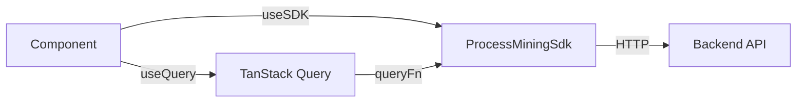

# SDK_INTEGRATION.md — How FE Talks to BE

> [!IMPORTANT]
> The frontend uses a unified `ProcessMiningSdk` interface exposed via `SDKContext`. All data fetching is managed by TanStack Query v5 for robust caching and state management.

---

## 1. SDK Architecture

**Location:** [libs/shared/design-system/src/context/SDKContext.tsx](file:///Users/namanagarwal/system/frontend-new/libs/shared/design-system/src/context/SDKContext.tsx)



### Provider Setup

```tsx
// App.tsx
<SDKProvider baseUrl="http://localhost:8001">
  <QueryClientProvider client={queryClient}>{children}</QueryClientProvider>
</SDKProvider>
```

---

## 2. SDK Modules

### processes Module

| Method               | Signature                                        | Returns                                         | Used By                                          |
| -------------------- | ------------------------------------------------ | ----------------------------------------------- | ------------------------------------------------ |
| `list`               | `list(options?: ListProcessesOptions)`           | `Promise<{ items: EventLog[], total: number }>` | `HomePage`, `EventLogsPage`, `ExplorerIndexPage` |
| `get`                | `get(id: string)`                                | `Promise<EventLog>`                             | `LogDetailPage`                                  |
| `ingest`             | `ingest(file: File, metadata?: ProcessMetadata)` | `Promise<{ id: string }>`                       | `UploadWizardPage`                               |
| `ingestWithProgress` | `ingestWithProgress(file, metadata, onProgress)` | `Promise<{ id: string }>`                       | `UploadWizardPage`                               |
| `delete`             | `delete(id: string)`                             | `Promise<void>`                                 | `EventLogsPage`                                  |
| `detectColumns`      | `detectColumns(file: File)`                      | `Promise<ColumnDetection>`                      | `UploadWizardPage`                               |
| `analyze`            | `analyze(logId: string)`                         | `Promise<Record<string, unknown>>`              | `LogDetailPage`                                  |

---

### discovery Module

| Method          | Signature                                              | Returns                        | Used By               |
| --------------- | ------------------------------------------------------ | ------------------------------ | --------------------- |
| `buildDFG`      | `buildDFG(logId: string, options?: DFGOptions)`        | `Promise<DFGData>`             | `ProcessExplorerPage` |
| `getVariants`   | `getVariants(logId: string, options?: VariantOptions)` | `Promise<Variant[]>`           | `ProcessExplorerPage` |
| `getActivities` | `getActivities(logId: string, sortBy?: string)`        | `Promise<ActivityDetail[]>`    | `ProcessExplorerPage` |
| `discover`      | `discover({ logId, minerType?, modelName? })`          | `Promise<{ modelId: string }>` | `ProcessExplorerPage` |

---

### analytics Module

| Method              | Signature                                         | Returns                                  | Used By           |
| ------------------- | ------------------------------------------------- | ---------------------------------------- | ----------------- |
| `getPerformance`    | `getPerformance(logId: string)`                   | `Promise<PerformanceData>`               | `PerformanceTab`  |
| `getRework`         | `getRework(logId: string)`                        | `Promise<ReworkData>`                    | `ReworkTab`       |
| `getBottlenecks`    | `getBottlenecks(logId: string)`                   | `Promise<{ bottlenecks: Bottleneck[] }>` | `PerformanceTab`  |
| `getCycleTime`      | `getCycleTime(logId: string)`                     | `Promise<CycleTimeResponse>`             | `PerformanceTab`  |
| `getThroughput`     | `getThroughput(logId: string)`                    | `Promise<ThroughputResponse>`            | `PerformanceTab`  |
| `getPatterns`       | `getPatterns(logId: string, minSupport?: number)` | `Promise<PatternResponse[]>`             | `AnalyticsPage`   |
| `getProcessSummary` | `getProcessSummary(logId: string)`                | `Promise<ProcessSummaryData>`            | `AIAssistantPage` |

---

### conformance Module

| Method  | Signature                                                 | Returns                      | Used By          |
| ------- | --------------------------------------------------------- | ---------------------------- | ---------------- |
| `check` | `check(logId: string, options?: ConformanceCheckOptions)` | `Promise<ConformanceResult>` | `ConformanceTab` |

---

### organizational Module 🆕

| Method                    | Signature                                             | Returns                         | Used By        |
| ------------------------- | ----------------------------------------------------- | ------------------------------- | -------------- |
| `getHandoverNetwork`      | `getHandoverNetwork(logId: string)`                   | `Promise<SocialNetwork>`        | `ResourcesTab` |
| `getCollaborationNetwork` | `getCollaborationNetwork(logId: string)`              | `Promise<SocialNetwork>`        | `ResourcesTab` |
| `getResourceSimilarity`   | `getResourceSimilarity(logId: string)`                | `Promise<SocialNetwork>`        | `ResourcesTab` |
| `getRoles`                | `getRoles(logId: string)`                             | `Promise<ResourceRole[]>`       | `ResourcesTab` |
| `getResourceProfile`      | `getResourceProfile(logId: string, resource: string)` | `Promise<ResourceProfile>`      | `ResourcesTab` |
| `getWorkload`             | `getWorkload(logId: string)`                          | `Promise<WorkloadDistribution>` | `ResourcesTab` |

---

### simulation Module 🆕

| Method             | Signature                                                          | Returns                     | Used By          |
| ------------------ | ------------------------------------------------------------------ | --------------------------- | ---------------- |
| `playOut`          | `playOut(modelId: string, options: PlayOutOptions)`                | `Promise<PlayOutResult>`    | `SimulationPage` |
| `simulate`         | `simulate(logId: string, modifications: SimulationModification[])` | `Promise<SimulationResult>` | `SimulationPage` |
| `estimateCapacity` | `estimateCapacity(logId: string, targetThroughput: number)`        | `Promise<CapacityEstimate>` | `SimulationPage` |

---

### predictions Module 🆕

| Method                | Signature                                         | Returns                       | Used By               |
| --------------------- | ------------------------------------------------- | ----------------------------- | --------------------- |
| `train`               | `train(logId: string, options: TrainOptions)`     | `Promise<Predictor>`          | `PredictionsPage`     |
| `getResults`          | `getResults(predictorId: string, caseId: string)` | `Promise<PredictionResult>`   | `PredictorDetailPage` |
| `getPredictorHistory` | `getPredictorHistory(predictorId: string)`        | `Promise<PredictionResult[]>` | `PredictorDetailPage` |

---

### ai Module

| Method               | Signature                        | Returns                              | Used By               |
| -------------------- | -------------------------------- | ------------------------------------ | --------------------- |
| `listPredictors`     | `listPredictors()`               | `Promise<Predictor[]>`               | `PredictionsPage`     |
| `getInsights`        | `getInsights(logId: string)`     | `Promise<{ predictions, insights }>` | `AIInsightsPage`      |
| `getPredictorDetail` | `getPredictorDetail(id: string)` | `Promise<Predictor>`                 | `PredictorDetailPage` |

---

### projects Module 🆕

| Method          | Signature                                             | Returns                  | Used By       |
| --------------- | ----------------------------------------------------- | ------------------------ | ------------- |
| `list`          | `list()`                                              | `Promise<Project[]>`     | `HomePage`    |
| `get`           | `get(id: string)`                                     | `Promise<ProjectDetail>` | `ProjectPage` |
| `create`        | `create(data: CreateProjectData)`                     | `Promise<Project>`       | `HomePage`    |
| `update`        | `update(id: string, data: UpdateProjectData)`         | `Promise<Project>`       | `ProjectPage` |
| `delete`        | `delete(id: string)`                                  | `Promise<void>`          | `ProjectPage` |
| `addProcess`    | `addProcess(projectId: string, processId: string)`    | `Promise<void>`          | `ProjectPage` |
| `removeProcess` | `removeProcess(projectId: string, processId: string)` | `Promise<void>`          | `ProjectPage` |

---

## 3. Accessing the SDK

```tsx
import { useSDK } from '@lumina/design-system';

function MyComponent() {
  const sdk = useSDK();

  // Direct call (inside useQuery)
  const data = await sdk.processes.list();
}
```

---

## 4. TanStack Query Patterns

### Query Key Strategy

| Data Type      | Key Pattern                           | Invalidation Trigger                               |
| -------------- | ------------------------------------- | -------------------------------------------------- |
| Processes List | `['processes', filters]`              | `sdk.processes.ingest()`, `sdk.processes.delete()` |
| Process Detail | `['processes', processId]`            | Metadata update                                    |
| DFG Map        | `['dfg', processId, options]`         | Filter change                                      |
| Variants       | `['variants', processId]`             | Filter change                                      |
| Analytics      | `['analytics', type, processId]`      | Re-analysis                                        |
| Organizational | `['organizational', type, processId]` | Re-analysis                                        |

### Custom Hook Pattern

```tsx
import { useQuery } from '@tanstack/react-query';
import { useSDK } from '@lumina/design-system';

export function useProcesses(filters?: ListProcessesOptions) {
  const sdk = useSDK();

  return useQuery({
    queryKey: ['processes', filters],
    queryFn: () => sdk.processes.list(filters),
    staleTime: 5 * 60 * 1000, // 5 minutes
  });
}
```

### Mutation with Invalidation

```tsx
import { useMutation, useQueryClient } from '@tanstack/react-query';
import { useSDK } from '@lumina/design-system';

export function useDeleteProcess() {
  const sdk = useSDK();
  const queryClient = useQueryClient();

  return useMutation({
    mutationFn: (id: string) => sdk.processes.delete(id),
    onSuccess: () => {
      queryClient.invalidateQueries({ queryKey: ['processes'] });
    },
    onError: (err) => {
      toast.error(`Delete failed: ${err.message}`);
    },
  });
}
```

---

## 5. Error Handling

| Level     | Mechanism                            | Example                |
| --------- | ------------------------------------ | ---------------------- |
| Global    | `queryClient.defaultOptions.onError` | Log to monitoring      |
| Component | `useQuery({ onError })`              | Show inline error      |
| UI        | `EmptyState` with error variant      | "Something went wrong" |
| Toast     | `toast.error()`                      | Mutation failures      |

### Error Boundary Pattern

```tsx
const { data, error, isLoading } = useQuery({...});

if (error) {
  return (
    <EmptyState
      icon={<WarningOutlined />}
      title="Failed to load data"
      description={error.message}
      actionLabel="Retry"
      onAction={() => queryClient.refetchQueries(['processes'])}
    />
  );
}
```

---

## 6. Caching Configuration

**Location:** [SDKContext.tsx](file:///Users/namanagarwal/system/frontend-new/libs/shared/design-system/src/context/SDKContext.tsx)

```tsx
export const queryClient = new QueryClient({
  defaultOptions: {
    queries: {
      staleTime: 5 * 60 * 1000, // 5 minutes
      gcTime: 10 * 60 * 1000, // 10 minutes
      retry: 2,
      refetchOnWindowFocus: false,
    },
    mutations: {
      retry: 1,
    },
  },
});
```

| Setting                | Value                      | Rationale                        |
| ---------------------- | -------------------------- | -------------------------------- |
| `staleTime`            | 5 min                      | Reduce API calls for stable data |
| `gcTime`               | 10 min                     | Keep cache for back navigation   |
| `retry`                | 2 (queries), 1 (mutations) | Handle transient failures        |
| `refetchOnWindowFocus` | `false`                    | Avoid expensive re-renders       |

---

## 7. Type Definitions

### Core Types

```typescript
interface EventLog {
  id: string;
  name: string;
  totalCases: number;
  totalEvents: number;
  createdAt: string;
  sourceFile?: string;
}

interface DFGNode {
  id: string;
  label: string;
  frequency: number;
}

interface DFGEdge {
  source: string;
  target: string;
  frequency: number;
  performance?: number; // seconds
}

interface SocialNetwork {
  logId: string;
  networkType: 'handover' | 'collaboration' | 'similarity';
  nodes: NetworkNode[];
  edges: NetworkEdge[];
  metrics: { density: number; avgCentrality: number };
}
```

> [!NOTE]
> Full type definitions are in `libs/shared/design-system/src/api/modules/*.ts` and `libs/shared/design-system/src/api/types.ts`.
