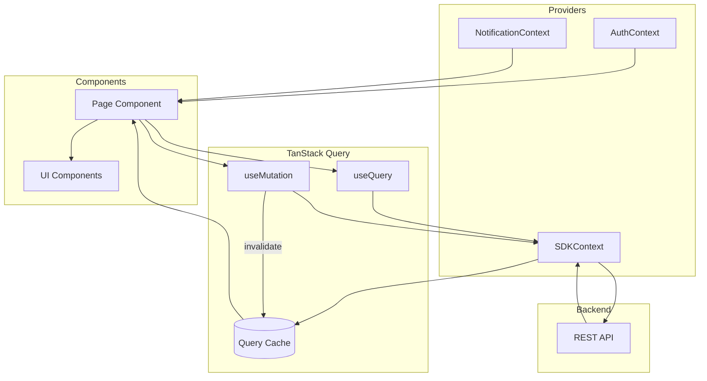

# STATE_ARCHITECTURE.md — Data Flow Map

> [!NOTE]
> The platform follows a "Server-First" state philosophy. 90% of data lives in TanStack Query cache, while local state is reserved for UI transients.

---

## 1. State Categories

### Global State (Context)

Stored in React Context providers, accessible app-wide.

| Context               | Purpose              | Key Values                                       |
| --------------------- | -------------------- | ------------------------------------------------ |
| `AuthContext`         | User session         | `user`, `isAuthenticated`, `login()`, `logout()` |
| `NotificationContext` | Real-time alerts     | `notifications`, `unreadCount`, `markAsRead()`   |
| `SDKContext`          | API client singleton | `sdk` (ProcessMiningSdk instance)                |

### Server State (TanStack Query)

Primary source of truth for all business data.

| Data              | Query Key                    | Stale Time | Invalidated By  |
| ----------------- | ---------------------------- | ---------- | --------------- |
| Event logs list   | `['logs', filters]`          | 5 min      | Upload, delete  |
| Single log        | `['logs', logId]`            | 5 min      | Metadata update |
| DFG visualization | `['dfg', logId, options]`    | 5 min      | Filter change   |
| Variants          | `['variants', logId]`        | 5 min      | Filter change   |
| Analytics         | `['analytics', type, logId]` | 5 min      | Re-analysis     |

### Local State (`useState`)

Scoped to individual components.

| Use Case         | Example                |
| ---------------- | ---------------------- |
| Form inputs      | Text before submission |
| Modal visibility | `isModalOpen`          |
| Tab selection    | Active tab key         |
| Transient UI     | Dropdown open state    |

### URL State

Persisted in URL for shareability and bookmarks.

| Data          | Storage       | Example                      |
| ------------- | ------------- | ---------------------------- |
| Filters       | Query params  | `?variant=4&min_duration=1d` |
| Navigation    | Path params   | `/explorer/:logId`           |
| Tab selection | Nested routes | `/analytics/performance`     |

---

## 2. Data Flow Diagram



---

## 3. Component → SDK → API Mapping

| Component             | SDK Method                       | API Endpoint                 | Cache Key                      |
| --------------------- | -------------------------------- | ---------------------------- | ------------------------------ |
| `HomePage`            | `sdk.logs.list()`                | `GET /logs`                  | `['logs']`                     |
| `EventLogsPage`       | `sdk.logs.list()`                | `GET /logs`                  | `['logs', filters]`            |
| `LogDetailPage`       | `sdk.logs.get(id)`               | `GET /logs/:id`              | `['logs', id]`                 |
| `UploadWizardPage`    | `sdk.logs.ingest()`              | `POST /logs/ingest`          | — (mutation)                   |
| `ProcessExplorerPage` | `sdk.discovery.buildDFG()`       | `GET /discovery/dfg/:logId`  | `['dfg', logId]`               |
| `AnalyticsPage`       | `sdk.analytics.getPerformance()` | `GET /analytics/performance` | `['analytics', 'perf', logId]` |
| `AIInsightsPage`      | `sdk.ai.getInsights()`           | `GET /ai/insights/:logId`    | `['insights', logId]`          |

---

## 4. Query Key Strategy

```tsx
// Hierarchical pattern
const queryKey = ['domain', entityId, options];

// Examples
['logs'][('logs', { status: 'active' })][('logs', 'abc123')][ // All logs // Filtered logs // Single log
  ('dfg', 'abc123', { threshold: 80 })
]; // Filtered DFG
```

### Invalidation Patterns

```tsx
// Invalidate specific log
queryClient.invalidateQueries({ queryKey: ['logs', logId] });

// Invalidate all logs (list + details)
queryClient.invalidateQueries({ queryKey: ['logs'] });

// Invalidate all discovery data for a log
queryClient.invalidateQueries({
  queryKey: ['dfg', logId],
  exact: false,
});
```

---

## 5. When to Use Each State Type

| Scenario           | State Type       | Reason                  |
| ------------------ | ---------------- | ----------------------- |
| Event log list     | Server (Query)   | Shared across pages     |
| Selected table row | Local            | UI transient            |
| Active filter      | URL              | Shareable, bookmarkable |
| User session       | Global (Context) | App-wide access         |
| Form draft         | Local            | Pre-submission only     |
| Notification count | Global (Context) | Shown in AppShell       |

> [!TIP]
> Prefer URL state over `useState` for anything the user might want to bookmark or share (e.g., a filtered process map view).
