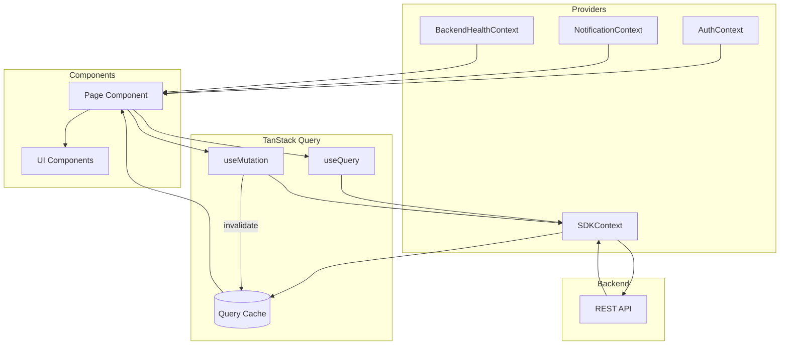

# STATE_ARCHITECTURE.md — Data Flow Map

> [!NOTE]
> The platform follows a "Server-First" state philosophy. 90% of data lives in TanStack Query cache, while local state is reserved for UI transients.

---

## 1. State Categories

### Global State (Context)

Stored in React Context providers, accessible app-wide.

| Context                | Purpose              | Key Values                                       |
| ---------------------- | -------------------- | ------------------------------------------------ |
| `AuthContext`          | User session         | `user`, `isAuthenticated`, `login()`, `logout()` |
| `NotificationContext`  | Real-time alerts     | `notifications`, `unreadCount`, `markAsRead()`   |
| `SDKContext`           | API client singleton | `sdk` (ProcessMiningSdk instance)                |
| `BackendHealthContext` | Connection status    | `isHealthy`, `checkHealth()`                     |

### Server State (TanStack Query)

Primary source of truth for all business data.

| Data              | Query Key                             | Stale Time | Invalidated By  |
| ----------------- | ------------------------------------- | ---------- | --------------- |
| Processes list    | `['processes', filters]`              | 5 min      | Upload, delete  |
| Single process    | `['processes', processId]`            | 5 min      | Metadata update |
| DFG visualization | `['dfg', processId, options]`         | 5 min      | Filter change   |
| Variants          | `['variants', processId]`             | 5 min      | Filter change   |
| Analytics         | `['analytics', type, processId]`      | 5 min      | Re-analysis     |
| Organizational    | `['organizational', type, processId]` | 5 min      | Re-analysis     |
| Projects          | `['projects']`                        | 5 min      | Create, delete  |

### Local State (`useState`)

Scoped to individual components.

| Use Case         | Example                   |
| ---------------- | ------------------------- |
| Form inputs      | Text before submission    |
| Modal visibility | `isModalOpen`             |
| Tab selection    | Active tab key            |
| Transient UI     | Dropdown open state       |
| Chat messages    | AI assistant conversation |

### URL State

Persisted in URL for shareability and bookmarks.

| Data          | Storage       | Example                      |
| ------------- | ------------- | ---------------------------- |
| Filters       | Query params  | `?variant=4&min_duration=1d` |
| Navigation    | Path params   | `/explorer/:logId`           |
| Tab selection | Nested routes | `/analytics/performance`     |

---

## 2. Data Flow Diagram



---

## 3. Component → SDK → API Mapping

| Component             | SDK Method                          | API Endpoint                            | Cache Key                                   |
| --------------------- | ----------------------------------- | --------------------------------------- | ------------------------------------------- |
| `HomePage`            | `sdk.processes.list()`              | `GET /processes`                        | `['processes']`                             |
| `EventLogsPage`       | `sdk.processes.list()`              | `GET /processes`                        | `['processes', filters]`                    |
| `LogDetailPage`       | `sdk.processes.get(id)`             | `GET /processes/:id`                    | `['processes', id]`                         |
| `UploadWizardPage`    | `sdk.processes.ingest()`            | `POST /processes/upload`                | — (mutation)                                |
| `ProcessExplorerPage` | `sdk.discovery.buildDFG()`          | `GET /visualization/:id/dfg`            | `['dfg', processId]`                        |
| `AnalyticsPage`       | `sdk.analytics.getPerformance()`    | `GET /analytics/logs/:id/performance`   | `['analytics', 'perf', processId]`          |
| `ResourcesTab`        | `sdk.organizational.getWorkload()`  | `GET /organizational/logs/:id/workload` | `['organizational', 'workload', processId]` |
| `AIAssistantPage`     | `sdk.analytics.getProcessSummary()` | Multiple endpoints                      | `['processSummary', processId]`             |
| `AIInsightsPage`      | `sdk.ai.getInsights()`              | `GET /predictions/logs/:id/predictions` | `['insights', processId]`                   |

---

## 4. Query Key Strategy

```tsx
// Hierarchical pattern
const queryKey = ['domain', entityId, options];

// Examples
['processes'][('processes', { status: 'active' })][('processes', 'abc123')][ // All processes // Filtered processes // Single process
  ('dfg', 'abc123', { threshold: 80 })
][('organizational', 'workload', 'abc123')]; // Filtered DFG // Workload data
```

### Invalidation Patterns

```tsx
// Invalidate specific process
queryClient.invalidateQueries({ queryKey: ['processes', processId] });

// Invalidate all processes (list + details)
queryClient.invalidateQueries({ queryKey: ['processes'] });

// Invalidate all discovery data for a process
queryClient.invalidateQueries({
  queryKey: ['dfg', processId],
  exact: false,
});
```

---

## 5. When to Use Each State Type

| Scenario           | State Type       | Reason                  |
| ------------------ | ---------------- | ----------------------- |
| Process list       | Server (Query)   | Shared across pages     |
| Selected table row | Local            | UI transient            |
| Active filter      | URL              | Shareable, bookmarkable |
| User session       | Global (Context) | App-wide access         |
| Form draft         | Local            | Pre-submission only     |
| Notification count | Global (Context) | Shown in AppShell       |
| Chat messages      | Local            | Component-specific      |

> [!TIP]
> Prefer URL state over `useState` for anything the user might want to bookmark or share (e.g., a filtered process map view).
