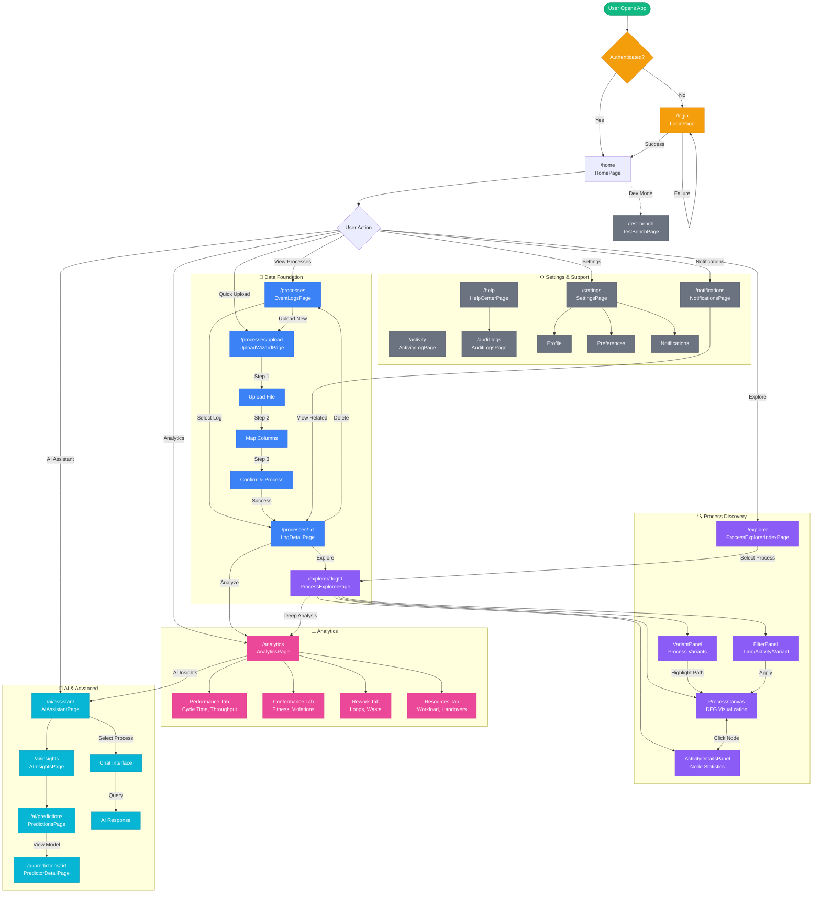

# UI_FLOW_DIAGRAM.md — Complete User Journey Map

> [!NOTE]
> This diagram shows the complete frontend UI/UX flow of the Process Mining Platform, including all user journeys from authentication through analysis.

---

## Complete Application Flow



---

## Legend

| Color     | Phase     | Description                           |
| --------- | --------- | ------------------------------------- |
| 🟢 Green  | Entry     | Application entry point               |
| 🟠 Orange | Auth      | Authentication flow                   |
| 🔵 Blue   | Data      | Process upload and management         |
| 🟣 Purple | Discovery | Process visualization and exploration |
| 🩷 Pink   | Analytics | Performance and conformance analysis  |
| 🩵 Cyan   | AI        | AI assistant and predictions          |
| ⬜ Gray   | Support   | Settings, help, and admin features    |

---

## Key User Journeys

### 1. First-Time User Flow

```
Login → Home → Upload → Map Columns → Confirm → Process Detail → Explorer
```

### 2. Analyst Flow

```
Home → Processes → Select Log → Explorer → Filter Variants → Analytics
```

### 3. AI-Assisted Analysis

```
Home → AI Assistant → Select Process → Ask Questions → View Insights
```

### 4. Admin Flow

```
Home → Settings → Audit Logs → Activity Log
```
