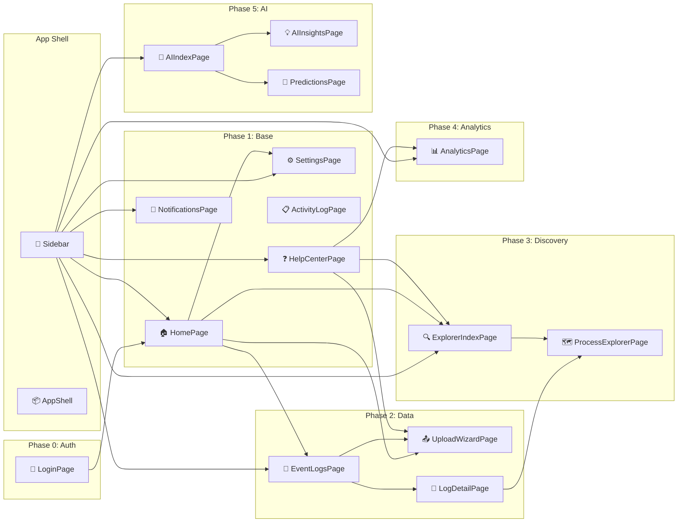

# Frontend QA Report: Process Mining Platform

**Generated:** 2025-12-30T14:46:05+05:30  
**Codebase:** `/Users/namanagarwal/system/frontend-new`

---

## Executive Summary

| Metric               | Count                                   |
| -------------------- | --------------------------------------- |
| **Total Pages**      | 18                                      |
| **Total Components** | 34 (8 shared, 26 page-specific)         |
| **Data Sources**     | 0 real, 15+ mock                        |
| **Critical Paths**   | Login → Home → Logs → Upload → Explorer |

### Key Findings

- ⚠️ **100% Mock Data**: All data is hardcoded; no real API integration yet
- ✅ **Proper Route Guards**: All protected routes use `ProtectedRoute` wrapper
- ✅ **Comprehensive Logging**: All pages have `createLogger()` integration
- ⚠️ **SDK Configured but Not Used**: `SDKContext` has mock implementations

---

## Page Inventory

| Page                     | Route                        | Composed Of                                                            | Data Source                              | Entry Points                   |
| ------------------------ | ---------------------------- | ---------------------------------------------------------------------- | ---------------------------------------- | ------------------------------ |
| LoginPage                | `/login`                     | Card, Form, Auth Context                                               | Mock (localStorage)                      | Direct URL                     |
| HomePage                 | `/home`                      | PageHeader, MetricCard, List                                           | Mock (`mockRecentLogs`)                  | Post-login, Sidebar            |
| EventLogsPage            | `/logs`                      | PageHeader, Table, EmptyState, Modal                                   | Mock (`mockEventLogs`)                   | Sidebar, HomePage              |
| UploadWizardPage         | `/logs/upload`               | Steps, Upload, Table, Form, Progress                                   | Mock (`mockPreviewData`)                 | EventLogsPage button, HomePage |
| LogDetailPage            | `/logs/:id/*`                | Tabs, Table, MetricCard, Descriptions                                  | Mock (`mockLogDetail`, `mockSampleData`) | EventLogsPage row click        |
| ProcessExplorerIndexPage | `/explorer`                  | PageHeader, Card Grid, EmptyState                                      | Mock (`mockEventLogs`)                   | Sidebar                        |
| ProcessExplorerPage      | `/explorer/:logId/*`         | ProcessCanvas, VariantPanel, ActivityDetailsPanel, FilterPanel, Drawer | Mock (`mockExplorerData.ts`)             | ProcessExplorerIndexPage card  |
| AnalyticsPage            | `/analytics`, `/analytics/*` | Tabs, MetricCard, PerformanceTab, ConformanceTab, ReworkTab            | Mock (`mockLogs`, `mockSummaryStats`)    | Sidebar                        |
| AIIndexPage              | `/ai`                        | PageHeader, Card, Statistic                                            | Mock (hardcoded stats)                   | Sidebar                        |
| AIInsightsPage           | `/ai/insights`               | PageHeader, Select, MetricCard, Collapse, InsightCard                  | Mock (`mockInsights`)                    | Sidebar, AIIndexPage           |
| PredictionsPage          | `/ai/predictions`            | PageHeader, Table, Modal, Form, Progress                               | Mock (`mockPredictors`)                  | Sidebar, AIIndexPage           |
| PredictorDetailPage      | `/ai/predictions/:id`        | TBD (referenced but not fully implemented)                             | Mock                                     | PredictionsPage row            |
| SettingsPage             | `/settings/*`                | Tabs, ProfileTab, PreferencesTab, NotificationsTab                     | Context + localStorage                   | Sidebar                        |
| NotificationsPage        | `/notifications`             | PageHeader, Tabs, List                                                 | Context (`NotificationContext`)          | Sidebar, AppShell bell         |
| ActivityLogPage          | `/activity`                  | PageHeader, Table, Select                                              | Mock (`mockActivities`)                  | Sidebar                        |
| HelpCenterPage           | `/help`                      | PageHeader, Card Grid, Collapse (FAQ), Input                           | Hardcoded content                        | Sidebar                        |

---

## Component Hierarchy

```
📦 App Root
├── 🔐 AuthProvider (context)
├── 🔔 NotificationProvider (context)
├── 📊 SDKProvider (context + TanStack Query)
└── 🛤️ BrowserRouter
    ├── 📄 LoginPage (standalone)
    └── 🛡️ ProtectedRoute
        └── 🏠 AppLayout
            └── 📦 AppShell (shared)
                ├── 🧭 Sidebar Navigation
                ├── 👤 User Profile Section
                └── 📄 Page Content

📦 Pages
├── HomePage
│   ├── 🧩 PageHeader (shared)
│   ├── 🧩 MetricCard (shared, x3)
│   ├── 🧩 Card + List (recent logs)
│   └── 🧩 EmptyState (shared, conditional)
│
├── EventLogsPage
│   ├── 🧩 PageHeader (shared)
│   ├── 🧩 Table (with Dropdown actions)
│   ├── 🧩 Modal (delete confirmation)
│   └── 🧩 EmptyState (shared, conditional)
│
├── UploadWizardPage
│   ├── 🧩 PageHeader (shared)
│   ├── 🧩 Steps (4-step wizard)
│   ├── 🧩 Dragger (file upload)
│   ├── 🧩 Table (preview)
│   ├── 🧩 Form (column mapping)
│   ├── 🧩 Progress (processing)
│   └── 🧩 Result (completion)
│
├── LogDetailPage
│   ├── 🧩 PageHeader (shared)
│   └── 🧩 Tabs
│       ├── OverviewTab (MetricCard, Descriptions)
│       ├── PreviewTab (Table)
│       └── StatisticsTab (Tables)
│
├── ProcessExplorerPage
│   ├── 🧩 Toolbar (custom layout)
│   ├── 🧩 ProcessCanvas (page-specific, ReactFlow)
│   ├── 🧩 Right Panel Tabs
│   │   ├── 🧩 VariantPanel (page-specific)
│   │   └── 🧩 ActivityDetailsPanel (page-specific)
│   └── 🧩 Drawer → FilterPanel (page-specific)
│
├── AnalyticsPage
│   ├── 🧩 PageHeader (shared)
│   ├── 🧩 MetricCard (shared, x4)
│   └── 🧩 Tabs
│       ├── 🧩 PerformanceTab (page-specific)
│       ├── 🧩 ConformanceTab (page-specific)
│       └── 🧩 ReworkTab (page-specific)
│
├── AIInsightsPage
│   ├── 🧩 PageHeader (shared)
│   ├── 🧩 MetricCard (shared, x4)
│   ├── 🧩 Natural Language Query Input
│   ├── 🧩 Collapse → InsightCard (page-specific, nested)
│
├── PredictionsPage
│   ├── 🧩 PageHeader (shared)
│   ├── 🧩 Table (predictors list)
│   ├── 🧩 Modal (train predictor form)
│   └── 🧩 EmptyState (shared, conditional)
│
├── SettingsPage
│   ├── 🧩 PageHeader (shared)
│   └── 🧩 Tabs
│       ├── 🧩 ProfileTab
│       ├── 🧩 PreferencesTab
│       └── 🧩 NotificationsTab
│
├── NotificationsPage
│   ├── 🧩 PageHeader (shared)
│   ├── 🧩 Tabs (All/Unread)
│   ├── 🧩 List
│   └── 🧩 EmptyState (shared, conditional)
│
├── ActivityLogPage
│   ├── 🧩 PageHeader (shared)
│   ├── 🧩 Filters (Select x2)
│   └── 🧩 Table
│
└── HelpCenterPage
    ├── 🧩 PageHeader (shared)
    ├── 🧩 Card Grid (getting started)
    ├── 🧩 Collapse (FAQ)
    └── 🧩 Card (contact support)
```

---

## User Flows (Arrow Notation)

### Primary Flow (Process Analysis)

```
Login → Home → Event Logs → Upload Wizard → Column Mapping → Processing → Log Detail → Explorer → Filter/Analyze
                    ↓
              View Existing Log → Log Detail → Statistics Tab
                                      ↓
                              Open in Explorer
```

### Analytics Flow

```
Home/Sidebar → Analytics → Performance Tab
                   ↓
              Conformance Tab
                   ↓
              Rework Tab
```

### AI Features Flow

```
Sidebar → AI Index → AI Insights → View Bottlenecks/Patterns/Anomalies
              ↓
         Predictions → Train New Model → Model Detail → Make Predictions
```

### Settings/Account Flow

```
Sidebar → Settings → Profile Tab → Edit Profile
              ↓
         Preferences Tab → Theme/Language
              ↓
         Notifications Tab → Configure Alerts
```

### Notifications Flow

```
AppShell Bell Icon → Notifications Page → Mark as Read
                         ↓
                    Filter Unread → Mark All Read
```

---

## Data Source Audit

| Component/Page      | Data Type   | Source                                              | Shape/Interface                                  | Notes                                       |
| ------------------- | ----------- | --------------------------------------------------- | ------------------------------------------------ | ------------------------------------------- |
| HomePage            | **Mock**    | `mockRecentLogs[]`                                  | `{ id, name, cases, events, uploaded }`          | Hardcoded array                             |
| EventLogsPage       | **Mock**    | `mockEventLogs[]`                                   | `EventLog` interface                             | Local state                                 |
| UploadWizardPage    | **Mock**    | `mockPreviewData`                                   | `{ columns, suggestions, sampleRows, rowCount }` | Column detection simulated                  |
| LogDetailPage       | **Mock**    | `mockLogDetail`, `mockSampleData`, `mockStatistics` | Multiple interfaces                              | File only pretends to exist                 |
| ProcessExplorerPage | **Mock**    | `mockExplorerData.ts`                               | `DFGNode[]`, `DFGEdge[]`, `MockVariant[]`        | Full DFG mock                               |
| AnalyticsPage       | **Mock**    | `mockLogs`, `mockSummaryStats`                      | Inline objects                                   | Uses `setTimeout` for loading simulation    |
| AIInsightsPage      | **Mock**    | `mockInsights`                                      | `{ performance[], patterns[], anomalies[] }`     | Hardcoded insights                          |
| PredictionsPage     | **Mock**    | `mockPredictors[]`                                  | `{ id, name, type, logId, accuracy, status }`    | Training progress simulated                 |
| NotificationsPage   | **Context** | `NotificationContext`                               | `Notification[]`                                 | Mock initial data, real add/read operations |
| ActivityLogPage     | **Mock**    | `mockActivities[]`                                  | `ActivityItem`                                   | Date filtering works on mock                |
| AuthContext         | **Mock**    | `localStorage`                                      | `User`                                           | Any email/password accepted                 |
| SDKContext          | **Mock**    | Inline object                                       | `ProcessMiningSdk` interface                     | All methods return empty/stub data          |

> [!CAUTION]
>
> ### ⚠️ Mock Data Warning
>
> **All components use mock data.** Before production:
>
> - Replace all `mock*` arrays with SDK/API calls
> - Integrate `useSDK()` hook with TanStack Query
> - Connect to actual backend at `http://localhost:8001`

---

## Input Requirements

### UploadWizardPage

```
UploadWizard
├── Step 1 (File Selection)
│   └── Required: file (CSV/XES, max 100MB)
│
├── Step 2 (Validation)
│   └── Required: file passes extension + size validation
│
├── Step 3 (Configuration)
│   ├── Required: caseId column mapping
│   ├── Required: activity column mapping
│   ├── Required: timestamp column mapping
│   └── Optional: resource column mapping
│
└── Triggers: startProcessing() → Progress simulation → Navigate to /logs/:id
```

### FilterPanel (Process Explorer)

```
FilterPanel
├── Time Range Section
│   ├── Optional: dateRange (start, end)
│   └── Triggers: onApplyFilter({ type: 'timeRange', ... })
│
├── Activities Section
│   ├── Optional: selectedActivities[]
│   └── Triggers: onApplyFilter({ type: 'activity', ... })
│
├── Top Variants Section
│   ├── Optional: topK (10-100%, default 80%)
│   └── Triggers: onApplyFilter({ type: 'topK', ... })
│
└── All filters → Update parent ProcessExplorerPage state
```

### PredictionsPage (Train Modal)

```
Train Predictor Form
├── Required: name (string)
├── Required: logId (select from available logs)
├── Required: type ('next_activity' | 'remaining_time' | 'outcome')
└── Triggers: handleTrain() → Progress simulation → Add to list → toast.success()
```

### LoginPage

```
Login Form
├── Optional: email (any value accepted)
├── Optional: password (not validated)
└── Triggers: login() → localStorage → redirect to /home

OR

Continue as Guest Button
└── Triggers: loginAsGuest() → localStorage → redirect to /home
```

---

## Interconnection Map



---

## QA Flags

### 🔴 Critical Issues

| Issue                          | Location              | Details                                                |
| ------------------------------ | --------------------- | ------------------------------------------------------ |
| No Real API Integration        | All pages             | 100% mock data; SDK methods return stubs               |
| SDK Not Actually Used          | All data pages        | Components use local mock arrays instead of `useSDK()` |
| No Error Boundaries            | App-wide              | No React Error Boundary wrapping routes                |
| PredictorDetailPage Incomplete | `/ai/predictions/:id` | Route exists but page implementation minimal           |

### 🟡 Warnings

| Issue                               | Location                             | Details                                           |
| ----------------------------------- | ------------------------------------ | ------------------------------------------------- |
| No Loading States for Initial Lists | HomePage, EventLogsPage              | Lists render immediately without skeleton/spinner |
| Download Feature Not Implemented    | EventLogsPage, LogDetailPage         | `handleDownload()` shows toast only               |
| Export Feature Not Implemented      | ActivityLogPage, ProcessExplorerPage | `handleExport()` shows toast only                 |
| Search Disabled                     | HelpCenterPage                       | Search input is `disabled`                        |
| Natural Language Query Preview      | AIInsightsPage                       | Shows "coming soon" message, input does nothing   |
| No Pagination for Long Lists        | HomePage (`mockRecentLogs`)          | Shows all items without pagination                |

### 🟢 Good Practices

| Practice                 | Details                                                               |
| ------------------------ | --------------------------------------------------------------------- |
| ✅ Comprehensive Logging | All pages use `createLogger()` with DEBUG/INFO levels                 |
| ✅ Route Protection      | `ProtectedRoute` wrapper guards all authenticated routes              |
| ✅ Empty States          | All list pages have proper `EmptyState` components                    |
| ✅ Form Validation       | UploadWizard has client-side file type/size validation                |
| ✅ Confirmation Dialogs  | Delete actions require modal confirmation                             |
| ✅ Toast Notifications   | User feedback via `toast.success/info/error` throughout               |
| ✅ URL-Based State       | Settings tabs, Analytics sub-pages sync with URL                      |
| ✅ Breadcrumbs           | LogDetailPage, UploadWizardPage, ProcessExplorerPage have breadcrumbs |
| ✅ Design Tokens         | Consistent use of `@lumina/design-system` tokens                      |

---

## Component Classification

### Shared Components (`libs/shared/design-system/src/`)

| Component     | Export | Used By                                                |
| ------------- | ------ | ------------------------------------------------------ |
| `AppShell`    | Yes    | App.tsx (wraps all pages)                              |
| `PageHeader`  | Yes    | All pages                                              |
| `MetricCard`  | Yes    | HomePage, LogDetailPage, AnalyticsPage, AIInsightsPage |
| `EmptyState`  | Yes    | All list pages                                         |
| `tokens`      | Yes    | All styling throughout app                             |
| `toast`       | Yes    | User feedback across app                               |
| `SDKProvider` | Yes    | App.tsx (context)                                      |

### Page-Specific Components

| Component              | Location                      | Used By             |
| ---------------------- | ----------------------------- | ------------------- |
| `ProcessCanvas`        | `pages/explorer/components/`  | ProcessExplorerPage |
| `VariantPanel`         | `pages/explorer/components/`  | ProcessExplorerPage |
| `ActivityDetailsPanel` | `pages/explorer/components/`  | ProcessExplorerPage |
| `FilterPanel`          | `pages/explorer/components/`  | ProcessExplorerPage |
| `InsightCard`          | `pages/ai/AIInsightsPage.tsx` | AIInsightsPage      |
| `ProfileTab`           | `pages/settings/`             | SettingsPage        |
| `PreferencesTab`       | `pages/settings/`             | SettingsPage        |
| `NotificationsTab`     | `pages/settings/`             | SettingsPage        |
| `PerformanceTab`       | `pages/analytics/`            | AnalyticsPage       |
| `ConformanceTab`       | `pages/analytics/`            | AnalyticsPage       |
| `ReworkTab`            | `pages/analytics/`            | AnalyticsPage       |

---

## Recommendations

### Immediate (Pre-Production)

1. **Integrate Real SDK**

   - Replace all `mock*` arrays with `useSDK()` + TanStack Query hooks
   - Implement proper loading, error, and empty states for async data
   - Connect `SDKContext` to actual backend endpoints

2. **Add Error Boundaries**

   - Wrap route content with React Error Boundary
   - Provide fallback UI for component crashes
   - Log errors to monitoring service

3. **Complete PredictorDetailPage**
   - Route exists but page needs implementation
   - Should show model details, accuracy metrics, prediction interface

### Short-Term Improvements

4. **Implement Download/Export Features**

   - EventLogsPage: Download original CSV/XES
   - ProcessExplorerPage: Export SVG/PNG of process map
   - ActivityLogPage: Export activity history as CSV

5. **Add Pagination to All Lists**

   - HomePage recent logs (currently shows all)
   - Use consistent `Table` pagination pattern

6. **Enable Help Center Search**
   - Remove `disabled` prop from search input
   - Implement local filtering of FAQ items

### Long-Term Enhancements

7. **Add Unit Tests**

   - Test shared components (PageHeader, MetricCard, EmptyState)
   - Test form validation (UploadWizard)
   - Test context providers (AuthContext, NotificationContext)

8. **Implement Natural Language Queries**

   - AIInsightsPage has UI but no functionality
   - Connect to backend NL processing endpoint

9. **Add Real-Time Updates**
   - WebSocket for notification delivery
   - Long-running job status updates (file processing, model training)

---

## TypeScript Interface Summary

### Key Data Types

```typescript
// Auth
interface User {
  id: string;
  name: string;
  email: string;
  avatar?: string;
}

// Logs
interface EventLog {
  id: string;
  name: string;
  totalCases: number;
  totalEvents: number;
  createdAt: string;
  sourceFile?: string;
}

// Process Explorer
interface DFGNode {
  id: string;
  label: string;
  frequency: number;
}

interface DFGEdge {
  source: string;
  target: string;
  frequency: number;
  performance?: number;
}

// Notifications
interface Notification {
  id: string;
  title: string;
  description: string;
  type: "info" | "success" | "warning" | "error";
  isRead: boolean;
  createdAt: Date;
}

// Predictors
interface Predictor {
  id: string;
  name: string;
  type: "next_activity" | "remaining_time" | "outcome";
  logId: string;
  logName: string;
  accuracy: number;
  status: "ready" | "training" | "failed";
  createdAt: string;
  predictions: number;
}
```

---

## File Statistics

| Category          | Count | Notes                                        |
| ----------------- | ----- | -------------------------------------------- |
| TSX Files         | 44    | Including node_modules refs in search        |
| Pages             | 18    | Across 5 implementation phases               |
| Contexts          | 2     | AuthContext, NotificationContext             |
| Mock Data Files   | 1     | `mockExplorerData.ts` (others inline)        |
| Shared Components | 4     | AppShell, PageHeader, MetricCard, EmptyState |
| Design Tokens     | ✓     | Full token system in `theme.ts`              |
| Routes            | 19+   | Defined in `App.tsx`                         |

---

_Report generated by Frontend QA Agent_
