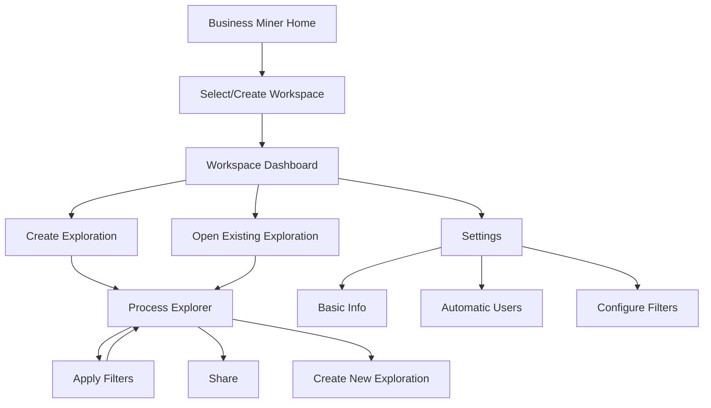
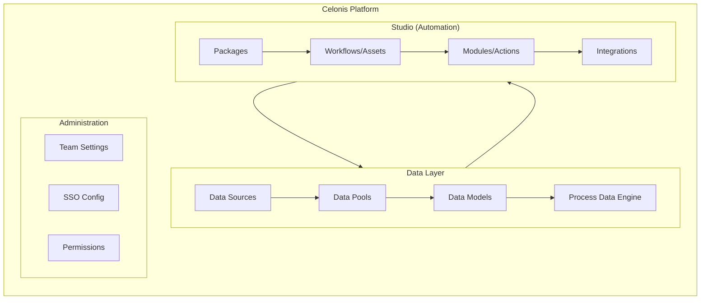
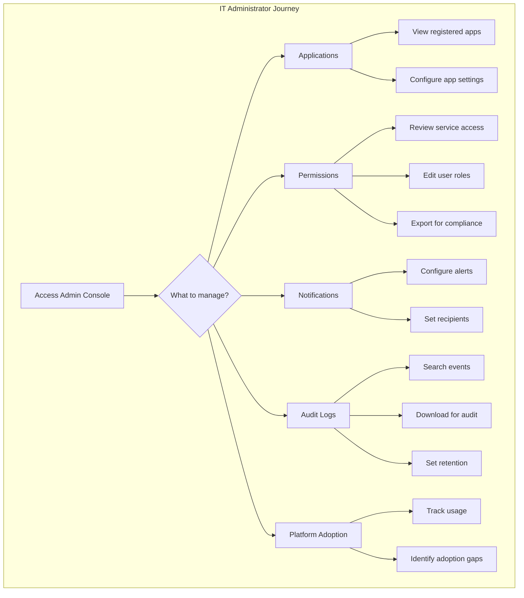
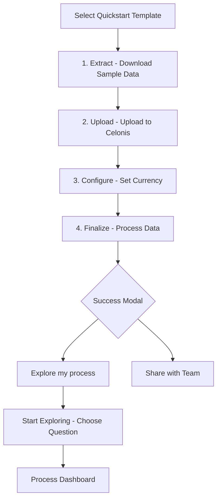

# Product Research Report: Celonis Business Miner

## Executive Summary

This is a **Process Mining SaaS platform** (Celonis Business Miner) designed for enterprise process analysts and operations teams. The application enables users to upload event log data, explore process flows visually, configure automation mappings, and share insights across teams. The target persona is a **mid-to-senior Process Analyst** with familiarity in process mining concepts, working in large organizations with complex operational workflows.

---

## Screenshots Overview

```carousel

<!-- slide -->

<!-- slide -->

<!-- slide -->

<!-- slide -->

```

---

## Component Catalog

### Screen 1: Process Explorer (Main Visualization)

| Element                                                    | Type                 | Location         | Purpose Hypothesis                                                                    | Priority |
| ---------------------------------------------------------- | -------------------- | ---------------- | ------------------------------------------------------------------------------------- | -------- |
| Breadcrumb Navigation                                      | Nav                  | Header           | Contextual wayfinding - shows full path from Business Miner → Workspace → Exploration | Critical |
| Back Arrow (←)                                             | Button               | Header-left      | Quick return to parent workspace                                                      | High     |
| Process IDs (UUIDs)                                        | Data Display         | Header-sub       | Shows case IDs being analyzed; transparency for debugging/tracing                     | Medium   |
| Share Button                                               | Action               | Header-right     | Collaboration - enables sharing exploration with team                                 | High     |
| Create new Exploration                                     | Button/CTA           | Header-right     | Primary action - spawn new analysis from current state                                | Critical |
| Help Icon (?)                                              | Button               | Header-far-right | Contextual help/documentation access                                                  | Medium   |
| Process Explorer Panel                                     | Container            | Main-center      | Core visualization area for process flow                                              | Critical |
| Process Flow Diagram                                       | Visualization        | Main-center      | **PRIMARY**: Visual representation of discovered process model                        | Critical |
| Activity Nodes (Claim Decision, Set Reserve, Payment Sent) | Interactive Elements | Main-center      | Clickable activities showing step names and case counts (30K)                         | Critical |
| Duration Indicators (⏱ 5d)                                 | Data Badge           | Between nodes    | Shows median duration between steps - key performance insight                         | High     |
| Clock/Timestamp Icon                                       | Interactive          | Node-adjacent    | Likely shows timing details on hover/click                                            | Medium   |
| Filter Panel                                               | Sidebar              | Right            | Data filtering controls for drilling down                                             | High     |
| "100% of cases" Indicator                                  | Metric               | Filter panel     | Shows current filter scope - 30K of 30K cases                                         | High     |
| KPI Definitions                                            | Button               | Filter panel     | Access to business KPI configuration                                                  | High     |
| Activities Counter (6 of 6)                                | Chip                 | Main-top-right   | Shows activity scope in current view                                                  | Medium   |
| Playback Controls                                          | Control Bar          | Bottom           | Animation/timeline playback for process replay                                        | Medium   |
| "How useful was this?"                                     | Feedback             | Bottom-center    | Star rating for feature feedback collection                                           | Low      |
| "Explore more questions..."                                | CTA                  | Bottom           | Guided discovery prompts - reduces blank slate problem                                | High     |
| Zoom Controls (+/-)                                        | Button               | Right-edge       | Map zoom for process diagram                                                          | Medium   |
| Left Sidebar Nav                                           | Navigation           | Far-left         | Global app navigation with icons                                                      | Critical |

### Screen 2: Settings - Configure Filters

| Element                                                           | Type   | Location     | Purpose Hypothesis                                | Priority |
| ----------------------------------------------------------------- | ------ | ------------ | ------------------------------------------------- | -------- |
| Tab Navigation (Basic Info / Automatic users / Configure filters) | Tabs   | Top          | Settings organization into logical sections       | High     |
| "Configure filters" Active Tab                                    | Tab    | Top          | Currently active section indicator                | Medium   |
| Section Title & Description                                       | Text   | Content      | Clear explanation of filter configuration purpose | High     |
| "+ Add filters" Button                                            | Action | Content      | Primary action to add filter presets              | Critical |
| Discard changes                                                   | Button | Bottom-right | Cancel/revert functionality                       | High     |
| Update ✓                                                          | Button | Bottom-right | Save/commit changes                               | Critical |

### Screen 3: Settings - Automatic Users

| Element                         | Type       | Location    | Purpose Hypothesis                                        | Priority |
| ------------------------------- | ---------- | ----------- | --------------------------------------------------------- | -------- |
| Section Title                   | Text       | Top         | "Define user types mapped to automatic system users"      | High     |
| Explanation Text                | Help Text  | Below title | Explains automation rate calculation context              | High     |
| User type column Dropdown       | Form Input | Content     | First step - select column containing user type data      | Critical |
| Automatic system users Dropdown | Form Input | Content     | Second step - map which values represent system/bot users | Critical |
| Discard changes / Update        | Buttons    | Bottom      | Standard save/cancel pattern                              | High     |

### Screen 4: Settings - Basic Info

| Element                      | Type       | Location | Purpose Hypothesis                                                       | Priority |
| ---------------------------- | ---------- | -------- | ------------------------------------------------------------------------ | -------- |
| Process Workspace name Field | Text Input | Content  | Editable workspace name                                                  | High     |
| Pre-filled Value             | Default    | Input    | Shows current name: "[Quickstarts] CSV/XLSX (1) - File Upload Workspace" | Medium   |
| Discard changes / Update     | Buttons    | Bottom   | Standard save/cancel pattern                                             | High     |

### Screen 5: Workspace Dashboard

| Element                                 | Type       | Location       | Purpose Hypothesis                                          | Priority |
| --------------------------------------- | ---------- | -------------- | ----------------------------------------------------------- | -------- |
| Workspace Header                        | Container  | Top            | Shows workspace name and parent context                     | Critical |
| Share Button                            | Action     | Top-right      | Workspace-level sharing                                     | High     |
| Data Model Indicator                    | Status     | Top-right      | Shows "Data available" with green badge + last refresh date | Critical |
| Options Menu (•••)                      | Dropdown   | Top-right      | Contextual actions menu                                     | High     |
| → Share Process Workspace               | Menu Item  | Dropdown       | Share entire workspace                                      | High     |
| → Process Workspace Settings            | Menu Item  | Dropdown       | Access settings (links to screens 2-4)                      | High     |
| → Delete Process Workspace              | Menu Item  | Dropdown       | Destructive action - workspace deletion                     | Medium   |
| → Manage Permissions                    | Menu Item  | Dropdown       | Access control management                                   | High     |
| Process Explorations Section            | Container  | Main           | List of analyses within workspace                           | Critical |
| Tabs (Created by me / All Explorations) | Tab Filter | Section-header | Filter explorations by ownership                            | High     |
| Create Exploration Card                 | CTA Card   | Grid           | Primary action to start new exploration                     | Critical |
| Exploration Card                        | Card       | Grid           | Individual exploration entry with title, author, date       | High     |
| Create Process Workspace Button         | Button     | Global header  | Top-level action to create new workspace                    | Critical |

---

## Information Architecture Analysis

### Primary User Tasks by Screen

1. **Process Explorer**: Analyze and understand process flow, identify bottlenecks (duration), filter cases
2. **Workspace Dashboard**: Navigate between explorations, manage workspace, collaborate
3. **Settings**: Configure workspace metadata, automation mapping, and filter presets

### Mental Model Assumptions

The design assumes users understand:

- Process mining terminology (cases, activities, events, variants)
- Event log structure (columns, attributes)
- Automation vs. human work distinction

### Deliberately Hidden/De-emphasized

- Raw data tables (process diagram emphasized over tabular data)
- Technical configuration (abstracted behind simple dropdowns)
- Advanced filtering (hidden behind "+ Add filter" action)

---

## User Journey Context



---

## User Stories

### Feature: Process Workspace Management

**Epic**: Workspace Organization & Collaboration

---

**User Story 1**: Rename Process Workspace

> As a **Process Analyst**,
> I want to **rename my workspace to reflect the project or department it represents**,
> So that **my team can easily identify the correct workspace when collaborating**.

**Acceptance Criteria**:

- [ ] Given I am in workspace settings, when I modify the name field and click Update, then the workspace name is persisted
- [ ] Given I modify the name, when I click Discard changes, then my edits are reverted
- [ ] Edge case: Empty name → Show validation error, prevent save

**Inferred Priority**: High

**Reasoning**: Workspace naming is fundamental to multi-project organization in enterprise contexts where teams manage dozens of workspaces.

**UI Elements Involved**:

- Process Workspace name input: Primary editing target
- Update button: Commit action
- Discard changes button: Cancel/revert action

**Dependencies**: User must have edit permissions on workspace

---

**User Story 2**: Define Automation User Mapping

> As a **Process Analyst**,
> I want to **map which user types in my data represent automated/system users**,
> So that **the platform can calculate accurate automation rates and identify manual work**.

**Acceptance Criteria**:

- [ ] Given I have uploaded event data with a user type column, when I open Automatic Users settings, then I can select the relevant column
- [ ] Given I select a user type column, when I choose specific values as "automatic", then those are marked as system users
- [ ] Given I save automation mapping, when I view process metrics, then automation rate reflects this configuration
- [ ] Edge case: No user type column exists → Show helpful message guiding user to add attribute

**Inferred Priority**: Critical

**Reasoning**: Automation rate is a key executive metric in process mining. Accurate calculation requires understanding which activities were performed by bots vs. humans.

**UI Elements Involved**:

- User type column dropdown: Column selector
- Automatic system users dropdown: Value mapper
- Update button: Save configuration

**Dependencies**: Data model must contain user-related attributes

**Open Questions**:

- Can multiple columns be used for user type identification?
- Is there a preview of how many cases/activities will be marked as automated?

---

**User Story 3**: Configure Default Exploration Filters

> As a **Workspace Administrator**,
> I want to **preset commonly-used filters for all users in this workspace**,
> So that **analysts can quickly apply standard views without recreating filters manually**.

**Acceptance Criteria**:

- [ ] Given I am in Configure Filters settings, when I add a filter, then it appears as a quick-access option in explorations
- [ ] Given filters are configured, when any user opens an exploration, then they see these filters in the filter panel
- [ ] Given a user doesn't want the preset filter, they can still access additional filters via the filter menu
- [ ] Edge case: No filters configured → Users see empty preset list but can still add custom filters

**Inferred Priority**: High

**Reasoning**: Enterprise users often have standard segmentations (by region, product line, time period). Presets reduce onboarding friction and ensure consistency.

**UI Elements Involved**:

- "+ Add filters" button: Primary action to add presets
- Filter list (empty state shown): Container for configured filters
- Update/Discard buttons: Save/cancel actions

**Dependencies**: Workspace must have a valid data model with filterable attributes

---

### Feature: Process Exploration

**Epic**: Process Discovery & Analysis

---

**User Story 4**: Visualize Process Flow

> As a **Process Analyst**,
> I want to **see my process as a visual flow diagram showing activities and their sequence**,
> So that **I can understand the actual process behavior from the data**.

**Acceptance Criteria**:

- [ ] Given I create/open an exploration, when it loads, then I see a process flow diagram with nodes representing activities
- [ ] Given the diagram renders, then each node shows activity name and case count
- [ ] Given there are transitions between activities, then edges connect nodes with duration indicators
- [ ] Edge case: Very complex process (100+ activities) → Provide aggregation/simplification controls

**Inferred Priority**: Critical

**Reasoning**: This is the **core value proposition** of the product. The process map is the primary mechanism for understanding "what is actually happening".

**UI Elements Involved**:

- Process Explorer panel: Container
- Activity nodes: Interactive elements showing name + count
- Duration badges: Show time between steps
- Zoom controls: Navigate complex diagrams

**Dependencies**: Valid event log with Case ID, Activity, Timestamp columns

---

**User Story 5**: Filter Cases for Analysis

> As a **Process Analyst**,
> I want to **filter cases by various attributes (time, outcome, duration, etc.)**,
> So that **I can isolate specific cohorts and compare behaviors**.

**Acceptance Criteria**:

- [ ] Given I am in Process Explorer, when I open the Filter panel, then I see available filter options
- [ ] Given I apply a filter, when the view updates, then the case count and process diagram reflect the filtered subset
- [ ] Given I apply multiple filters, they combine with AND logic
- [ ] Given I want to clear filters, I can reset to full dataset
- [ ] Edge case: Filter results in 0 cases → Show empty state with suggestion to broaden criteria

**Inferred Priority**: Critical

**Reasoning**: Filtering is essential for root cause analysis. Analysts need to compare "happy path" vs. "problem cases" to identify improvement opportunities.

**UI Elements Involved**:

- Filter panel (right sidebar): Filter container
- "+ Add filter" button: Expand filter options
- "100% of cases" indicator: Shows current filter scope
- "30K of 30K" badge: Shows case count impact

**Dependencies**: User Story 4 (Process visualization must exist to filter)

---

**User Story 6**: Share Exploration with Team

> As a **Process Analyst**,
> I want to **share my exploration with colleagues**,
> So that **we can collaborate on findings and align on improvement actions**.

**Acceptance Criteria**:

- [ ] Given I have an exploration, when I click Share, then I can select users/groups to share with
- [ ] Given I share an exploration, recipients can view it (at minimum)
- [ ] Given I am the owner, I can control sharing permissions (view/edit)
- [ ] Edge case: User tries to share with external email → Show warning about org boundaries

**Inferred Priority**: High

**Reasoning**: Process mining is inherently collaborative. Insights must be shared with operations teams, executives, and improvement project leads.

**UI Elements Involved**:

- Share button (header): Trigger sharing modal
- Share modal (inferred): User/group selection UI

**Dependencies**: User authentication and authorization system

**Open Questions**:

- Can explorations be made publicly viewable (read-only link)?
- Is there version control for shared explorations?

---

**User Story 7**: Create New Exploration from Current State

> As a **Process Analyst**,
> I want to **spawn a new exploration that preserves my current filters and view**,
> So that **I can branch my analysis without losing my current work**.

**Acceptance Criteria**:

- [ ] Given I am in Process Explorer with filters applied, when I click "Create new Exploration", then a new exploration is created
- [ ] Given I create from current state, the new exploration inherits my current filters
- [ ] Given the new exploration is created, it appears in my workspace dashboard

**Inferred Priority**: Medium

**Reasoning**: Analysts often want to explore "what if" scenarios while preserving their main analysis. Branching supports iterative discovery.

**UI Elements Involved**:

- "+ Create new Exploration" button: Trigger action
- New exploration (result): Appears in workspace

**Dependencies**: User Story 5 (Filtering capability to have meaningful "current state")

---

**User Story 8**: View Activity Duration Metrics

> As a **Process Analyst**,
> I want to **see the time taken between process steps**,
> So that **I can identify bottlenecks and delays**.

**Acceptance Criteria**:

- [ ] Given the process diagram is rendered, when I look at edges between nodes, then I see duration metrics
- [ ] Given duration is shown, it displays in human-readable format (e.g., "5d" for 5 days)
- [ ] Given I want details, when I click/hover the duration badge, then I see min/max/avg breakdown
- [ ] Edge case: No timestamp data → Hide duration metrics, show warning

**Inferred Priority**: High

**Reasoning**: Duration analysis is a primary use case for process mining. Time is money; delays are the enemy of efficiency.

**UI Elements Involved**:

- Duration badges (⏱ 5d): Primary metric display
- Clock icon: Interactive for detailed view

**Dependencies**: Event log must contain reliable timestamp data

---

**User Story 9**: Provide Feature Feedback

> As a **User**,
> I want to **rate the usefulness of features I'm using**,
> So that **the product team knows what's working and what needs improvement**.

**Acceptance Criteria**:

- [ ] Given I have used Process Explorer, when I see "How useful was this?", then I can click a star rating
- [ ] Given I submit feedback, the rating is recorded
- [ ] Given I dismiss feedback prompt, I should not be shown it again for this session

**Inferred Priority**: Low

**Reasoning**: In-app feedback is a lightweight mechanism for product teams to gauge satisfaction. Positioned unobtrusively.

**UI Elements Involved**:

- "How useful was this?" prompt: Feedback trigger
- Star rating (5 stars): Input mechanism

**Dependencies**: Analytics/feedback collection backend

---

### Feature: Workspace Dashboard

**Epic**: Navigation & Organization

---

**User Story 10**: View All Explorations in Workspace

> As a **Process Analyst**,
> I want to **see all explorations within my workspace**,
> So that **I can navigate to any analysis quickly**.

**Acceptance Criteria**:

- [ ] Given I open a workspace, when the dashboard loads, then I see exploration cards in a grid
- [ ] Given explorations exist, each card shows title, creator, and creation date
- [ ] Given I click an exploration card, I navigate to Process Explorer for that analysis
- [ ] Edge case: No explorations exist → Show empty state with "Create Exploration" CTA

**Inferred Priority**: High

**Reasoning**: The dashboard is the organizational hub. Users need quick access to past work.

**UI Elements Involved**:

- Exploration cards: Clickable navigation elements
- "Created by me" / "All Explorations" tabs: Filter by ownership
- Create Exploration card: Empty state / quick create

**Dependencies**: Workspace must exist

---

**User Story 11**: Delete Process Workspace

> As a **Workspace Owner**,
> I want to **delete a workspace I no longer need**,
> So that **I can declutter my organization's workspace list**.

**Acceptance Criteria**:

- [ ] Given I own a workspace, when I open the options menu, then I see "Delete Process Workspace"
- [ ] Given I click delete, then I am shown a confirmation dialog
- [ ] Given I confirm deletion, the workspace and all its explorations are permanently removed
- [ ] Edge case: Workspace is shared with others → Warn that this affects other users

**Inferred Priority**: Medium

**Reasoning**: Lifecycle management is important for hygiene. Old/test workspaces should be removable.

**UI Elements Involved**:

- Options menu (•••): Trigger for contextual actions
- "Delete Process Workspace": Destructive action item
- Confirmation dialog (inferred): Safety mechanism

**Dependencies**: User must have owner/admin permissions

**Open Questions**:

- Is there a soft-delete/trash mechanism?
- Can deleted workspaces be recovered?

---

**User Story 12**: Manage Workspace Permissions

> As a **Workspace Owner**,
> I want to **control who can access and edit my workspace**,
> So that **I can protect sensitive process data and ensure appropriate access**.

**Acceptance Criteria**:

- [ ] Given I own a workspace, when I click "Manage Permissions", then I see a permissions management UI
- [ ] Given I am in permissions, I can add/remove users or groups
- [ ] Given I add a user, I can specify role (viewer, editor, admin)
- [ ] Edge case: Remove all admins → Prevent action, ensure at least one admin remains

**Inferred Priority**: High

**Reasoning**: Enterprise applications require granular access control. Process data often contains sensitive operational information.

**UI Elements Involved**:

- "Manage Permissions" menu item: Entry point
- Permissions modal/page (inferred): Management interface

**Dependencies**: User directory / identity provider integration

---

**User Story 13**: View Data Model Status

> As a **Process Analyst**,
> I want to **know if my data is current and when it was last updated**,
> So that **I trust the accuracy of my analysis**.

**Acceptance Criteria**:

- [ ] Given I am on workspace dashboard, when I look at header, then I see data model name and status
- [ ] Given data is available, I see green "Data available" badge
- [ ] Given data exists, I see "Last loaded: [date]" timestamp
- [ ] Edge case: Data load failed → Show red badge with error indicator

**Inferred Priority**: High

**Reasoning**: Data freshness is critical for operational process mining. Stale data leads to wrong decisions.

**UI Elements Involved**:

- Data Model indicator: Status badge
- "Data available" label: Current status
- Last loaded date: Freshness indicator

**Dependencies**: Data pipeline / ETL integration

---

## Strategic Observations

### Target Persona Signals

- **Enterprise-focused**: UUID visibility, workspace permissions, multi-user sharing indicate B2B orientation
- **Technical user assumed**: No hand-holding on process mining concepts; assumes familiarity with activities, cases, timestamps
- **Collaboration-heavy**: Multiple sharing touchpoints (exploration-level, workspace-level) suggest team-based usage

### Competitive Positioning

- **Celonis heritage**: This is clearly Celonis Business Miner, a flagship process mining product
- **Simplified entry point**: "Quickstarts" and "File Upload Workspace" suggest low-friction onboarding vs. enterprise data integration
- **Guided discovery**: "Explore more questions..." suggests AI/guided analysis differentiation

### Maturity Indicators

- **Mature product**: Polished UI, comprehensive settings, nuanced permissions
- **Feature-rich**: Multiple configuration options (filters, automation mapping, KPIs)
- **Feedback collection**: In-app rating suggests active product iteration

### Monetization Signals

- No visible pricing/upsell in screenshots (likely enterprise licensing model)
- "KPI Definitions" suggests premium/advanced analytics capabilities
- Permissions management hints at seat-based or role-based licensing

---

## Gaps & Opportunities

### Missing Capabilities

1. **Export functionality**: No visible way to export process diagram as image/PDF for presentations
2. **Annotations/Comments**: No way to add notes to specific process steps for documentation
3. **Comparison view**: No apparent way to compare two explorations side-by-side
4. **Alerts/Monitoring**: No visible mechanism for setting up alerts on process deviations

### UX Improvement Opportunities

1. **Empty state for filters**: "Configure filters" shows no existing filters - could show examples/templates
2. **Duration drill-down**: Duration badges are small; could expand on click for histogram/distribution
3. **Activity details panel**: Clicking an activity node should show case list, attributes, variants

### Feature Extension Possibilities

1. **Slack/Teams integration**: Share explorations directly to communication tools
2. **Scheduled reports**: Auto-generate and email process snapshots
3. **Variant comparison**: Compare "ideal" process to "as-is" discovered process
4. **Simulation mode**: "What if we removed this step?" impact analysis

---

## Open Questions for Stakeholders

1. **Data refresh frequency**: How often is process data updated? Is there real-time streaming support?
2. **User capacity**: Is there a limit on users per workspace or explorations per workspace?
3. **API access**: Can users programmatically access explorations or metrics via API?
4. **Localization**: Is the product available in languages other than English?
5. **Mobile experience**: Is there a mobile app or responsive design for on-the-go access?
6. **Integration depth**: What ERP/CRM systems are natively supported beyond file upload?

---

## Technical Implementation Notes

> For building a similar Process Mining frontend, key components include:

### Core Components Needed

1. **Process Flow Visualization**: ReactFlow, D3.js, or custom Canvas/SVG renderer
2. **Filtering Engine**: TanStack Table with virtual scrolling for large datasets
3. **State Management**: Zustand or Redux for exploration state
4. **Real-time Updates**: WebSocket for data refresh notifications
5. **Permissions System**: RBAC with workspace/exploration-level granularity

### Design System Tokens (Inferred from Screenshots)

- **Primary Color**: Blue (#0066CC or similar)
- **Background**: Light gray (#F5F7FA)
- **Card Background**: White (#FFFFFF)
- **Border Radius**: 4-8px (subtle rounding)
- **Typography**: Sans-serif (likely Inter or Roboto)
- **Spacing Scale**: 8px base unit

---

_Report generated: December 30, 2025_
_Analyst: Antigravity Product Research Agent_


---


# Product Research Report: Celonis Studio, Data Integration & Team Settings

## Executive Summary

This analysis covers **Celonis Studio** (workflow automation builder), **Data Pools** (data integration architecture), and **Team Settings** (administration). These screens represent the **automation and infrastructure layer** of the Celonis platform, targeting **developers, integration specialists, and IT administrators** who build and maintain process automation solutions.

---

## Screenshots Overview

```carousel

<!-- slide -->

<!-- slide -->

<!-- slide -->

<!-- slide -->

```

---

## Component Catalog

### Screen 1: Studio - Workflow Builder with Module Picker

| Element                                                 | Type        | Location     | Purpose Hypothesis                              | Priority |
| ------------------------------------------------------- | ----------- | ------------ | ----------------------------------------------- | -------- |
| Breadcrumb (Studio > Celonis - Default > First Package) | Nav         | Header       | Hierarchical navigation showing package context | High     |
| Search Bar                                              | Input       | Header-left  | Global search across Studio assets              | Medium   |
| "New asset" Button                                      | Action      | Sidebar      | Create new workflow/asset                       | Critical |
| Asset Tree ("ada")                                      | Tree View   | Left Sidebar | File/asset navigation within package            | High     |
| Play Button (▶)                                         | Action      | Toolbar      | Execute/run the workflow                        | Critical |
| "ada" Title + Edit Icon                                 | Editable    | Toolbar      | Workflow name editing                           | Medium   |
| Save Button                                             | Action      | Toolbar      | Persist workflow changes                        | Critical |
| Version Control                                         | Button      | Toolbar      | Git-like version management                     | High     |
| Inputs                                                  | Button      | Toolbar      | Configure workflow input parameters             | High     |
| Explain Flow                                            | Button      | Toolbar      | AI-powered flow documentation                   | Medium   |
| Auto-Align                                              | Button      | Toolbar      | Auto-layout for visual organization             | Low      |
| Help                                                    | Button      | Toolbar      | Contextual documentation                        | Medium   |
| Settings                                                | Dropdown    | Toolbar      | Workflow configuration                          | High     |
| Blueprint                                               | Dropdown    | Toolbar      | Template/blueprint management                   | Medium   |
| Publish Button                                          | CTA         | Header-right | Deploy workflow to production                   | Critical |
| Canvas Area                                             | Workspace   | Center       | Visual workflow builder                         | Critical |
| Add Node (+)                                            | Interactive | Canvas       | Entry point for adding modules                  | Critical |
| **Module Picker Panel**                                 | Popover     | Right        | Categorized list of available modules           | Critical |
| "← BACK"                                                | Button      | Panel-header | Return to previous panel view                   | Medium   |
| "Celonis" Brand                                         | Label       | Panel-header | Indicates native Celonis modules                | Medium   |
| **AI TOOLS Section**                                    | Category    | Panel        | AI/ML capabilities                              | High     |
| Create AI Prompt (Celonis AI Integration)               | Module      | Panel        | Generate AI prompts for automation              | High     |
| **TRIGGERS Section**                                    | Category    | Panel        | Event-based workflow starts                     | Critical |
| Custom Webhook                                          | Module      | Panel        | HTTP webhook trigger                            | Critical |
| Watch Trigger                                           | Module      | Panel        | EMS-based event watching                        | High     |
| **ACTIONS Section**                                     | Category    | Panel        | Executable operations                           | Critical |
| Update Augmented Attribute                              | Module      | Panel        | Write back to Data Model                        | Critical |
| Update Augmented Attribute (legacy)                     | Module      | Panel        | Backward compatibility                          | Low      |
| Search modules                                          | Input       | Panel-bottom | Filter available modules                        | High     |
| Tools Section                                           | Container   | Footer-left  | Quick-access tool icons                         | Medium   |
| Favorites Section                                       | Container   | Footer       | Bookmarked modules                              | Medium   |

### Screen 2: Studio - Webhook Configuration Modal

| Element                       | Type           | Location     | Purpose Hypothesis               | Priority |
| ----------------------------- | -------------- | ------------ | -------------------------------- | -------- |
| "Celonis" Modal Header        | Title          | Modal-top    | Context identification           | Medium   |
| Link Icon                     | Action         | Header-right | Copy/share functionality         | Medium   |
| Help Icon (?)                 | Action         | Header-right | Contextual help                  | Medium   |
| Close (×)                     | Button         | Header-right | Dismiss modal                    | High     |
| Webhook Label                 | Label          | Form         | Field identification             | Medium   |
| Connection Dropdown           | Select         | Form         | Choose webhook connection        | Critical |
| "My Celonis Trigger webho..." | Selected Value | Dropdown     | Current webhook selection        | High     |
| Edit Link                     | Action         | Inline       | Modify connection settings       | High     |
| Add Link                      | Action         | Inline       | Create new connection            | High     |
| Webhook URL                   | Display        | Form         | Full webhook endpoint URL        | Critical |
| "Copy address to clipboard"   | Button         | URL-right    | One-click URL copy               | High     |
| Help Link                     | Text Link      | Form-bottom  | Documentation reference          | Medium   |
| Cancel Button                 | Action         | Footer       | Abort configuration              | High     |
| Save Button                   | CTA            | Footer       | Commit webhook settings          | Critical |
| Celonis Node (Canvas)         | Visual         | Background   | Shows configured trigger in flow | High     |
| Red Badge (1)                 | Indicator      | Node         | Configuration status/error count | High     |

### Screen 3: Studio - App Integration Catalog

| Element                | Type       | Location     | Purpose Hypothesis             | Priority |
| ---------------------- | ---------- | ------------ | ------------------------------ | -------- |
| "ALL APPS" Header      | Title      | Panel-top    | Section label                  | Medium   |
| App List               | Scrollable | Panel        | Available integrations         | Critical |
| HTTP (On-Prem)         | App        | List         | On-premise HTTP connector      | High     |
| Google Slides          | App        | List         | Google Workspace integration   | Medium   |
| Google Forms           | App        | List         | Form data collection           | Medium   |
| **HTTP2**              | App        | List         | Selected/highlighted connector | High     |
| OneDrive for Business  | App        | List         | Microsoft 365 integration      | Medium   |
| ServiceNow             | App        | List         | ITSM integration               | High     |
| Google Calendar        | App        | List         | Calendar integration           | Medium   |
| Coupa                  | App        | List         | Procurement platform           | High     |
| Search apps or modules | Input      | Panel-bottom | Filter integrations            | High     |
| Colored App Icons      | Visual     | List-left    | Brand recognition for apps     | Medium   |
| Quick-access Icons     | Toolbar    | Right-edge   | Favorites/recent apps          | Medium   |

### Screen 4: Data Pools - Architecture View

| Element                        | Type          | Location        | Purpose Hypothesis               | Priority |
| ------------------------------ | ------------- | --------------- | -------------------------------- | -------- |
| Breadcrumb (Data Pools > test) | Nav           | Header          | Data Pool identification         | High     |
| **Three-Column Layout**        | Architecture  | Main            | Source → Integration → Consumers | Critical |
| "Your System - Data Sources"   | Section       | Left            | Source systems representation    | Critical |
| "Celonis - Data Integration"   | Section       | Center          | Processing pipeline              | Critical |
| "Celonis - Data Consumers"     | Section       | Right           | Output destinations              | Critical |
| "test" Pool Name               | Title         | Center-top      | Current Data Pool name           | High     |
| **Connect to Data Source**     | CTA Button    | Left            | Primary entry action             | Critical |
| **Input Section**              | Container     | Pipeline        | Data ingestion stage             | High     |
| **Data Processing Section**    | Container     | Pipeline        | Transformation logic             | Critical |
| Schedules                      | Sub-component | Processing      | Scheduled job management         | High     |
| Data Jobs                      | Sub-component | Processing      | Job execution tracking           | High     |
| **Data Storage**               | Component     | Pipeline-bottom | Intermediate storage layer       | High     |
| "0 Extractions"                | Metric        | Storage         | Extraction count                 | Medium   |
| "0 Transformations"            | Metric        | Storage         | Transformation count             | Medium   |
| "0 Data Model Loads"           | Metric        | Storage         | Load job count                   | Medium   |
| Process Data Engine            | Component     | Center          | Core computation engine          | Critical |
| Query Engine                   | Component     | Center-right    | Query processing layer           | High     |
| **Output Section**             | Container     | Pipeline        | Data output stage                | High     |
| Data Models                    | Output        | Right           | Semantic layer                   | Critical |
| **Studio**                     | Consumer      | Far-right       | Workflow consumption             | High     |
| Dotted Connection Lines        | Visual        | Throughout      | Data flow representation         | Medium   |

### Screen 5: Settings - Team Privacy & Management

| Element                                | Type          | Location       | Purpose Hypothesis            | Priority |
| -------------------------------------- | ------------- | -------------- | ----------------------------- | -------- |
| Settings Header                        | Title         | Top            | Page identification           | High     |
| Single Sign-On Tab                     | Nav           | Sidebar        | SSO configuration             | High     |
| Left Navigation (Icons)                | Vertical Nav  | Far-left       | Settings categories           | High     |
| **General Section**                    | Container     | Main           | Basic team settings           | High     |
| Team name Input                        | Text Field    | Form           | Editable team name            | High     |
| Logo Upload Area                       | Dropzone      | Left           | Team branding upload          | Medium   |
| Format Guidance                        | Help Text     | Below dropzone | Image format instructions     | Low      |
| Cancel/Save Buttons                    | Actions       | Form           | Team name actions             | High     |
| **Team Privacy Section**               | Container     | Main           | Access control settings       | Critical |
| Explanation Text                       | Help          | Section-top    | Privacy options context       | Medium   |
| Public Radio                           | Option        | Form           | Open invitation               | Medium   |
| **Private Radio**                      | Option        | Form           | Selected - Admin-only invites | High     |
| Domain restricted Radio                | Option        | Form           | Email domain filtering        | High     |
| Cancel/Save Buttons                    | Actions       | Section-bottom | Privacy actions               | High     |
| **Celonis Process Management Section** | Container     | Main           | Feature toggles               | High     |
| Enable navigation links                | Toggle + Text | Form           | CPM access control            | High     |
| "Enable access" Toggle                 | Switch        | Form           | Currently OFF                 | High     |

---

## Information Architecture Analysis

### Product Modules Identified



### Mental Models Assumed

- **Studio**: Users understand visual programming paradigms (similar to Zapier, Make, n8n)
- **Data Pools**: Users understand ETL concepts (Extract, Transform, Load)
- **Settings**: Standard SaaS admin mental model

---

## User Stories

### Feature: Workflow Automation Builder

**Epic**: Process Automation Development

---

**User Story 1**: Add Module to Workflow

> As a **Citizen Developer**,
> I want to **browse and add pre-built modules to my workflow canvas**,
> So that **I can build automations without writing code**.

**Acceptance Criteria**:

- [ ] Given I am on the workflow canvas, when I click the (+) add node, then I see the module picker
- [ ] Given the module picker is open, I can browse by category (AI Tools, Triggers, Actions)
- [ ] Given I click a module, it is added to my canvas at the insertion point
- [ ] Given I add a module, it shows as unconfigured until I provide required settings
- [ ] Edge case: Module requires missing connection → Prompt to create connection first

**Inferred Priority**: Critical

**Reasoning**: The module picker is the primary mechanism for building workflows. It's the "LEGO brick" metaphor made real.

**UI Elements Involved**:

- Add Node (+) button: Trigger for picker
- Module Picker panel: Selection interface
- Category sections: Organization
- Search input: Discovery

**Dependencies**: Package/workflow must exist

---

**User Story 2**: Configure Webhook Trigger

> As an **Integration Developer**,
> I want to **set up a webhook URL that triggers my workflow when called**,
> So that **external systems can initiate my automation**.

**Acceptance Criteria**:

- [ ] Given I add a Custom Webhook trigger, when I click configure, then I see the webhook modal
- [ ] Given the modal opens, I can select an existing webhook connection or create new
- [ ] Given a connection is selected, I see the full webhook URL to share with external systems
- [ ] Given I need the URL, I can copy it to clipboard with one click
- [ ] Given I save the configuration, the trigger node shows as configured (no error badge)
- [ ] Edge case: Invalid connection → Show error state with guidance

**Inferred Priority**: Critical

**Reasoning**: Webhooks are the universal integration pattern. This enables Celonis to receive data from any system capable of HTTP calls.

**UI Elements Involved**:

- Custom Webhook module: Trigger selection
- Webhook modal: Configuration interface
- Connection dropdown: Authentication context
- URL display + copy button: Sharing mechanism

**Dependencies**: Network/firewall must allow inbound webhooks

**Open Questions**:

- Is there webhook authentication (API keys, signatures)?
- Are webhook payloads validated/transformed?

---

**User Story 3**: Connect Third-Party Applications

> As an **Integration Developer**,
> I want to **connect my workflow to third-party apps like ServiceNow, Google, and Coupa**,
> So that **my automations can read/write data across my enterprise systems**.

**Acceptance Criteria**:

- [ ] Given I open the module picker, I can browse available app integrations
- [ ] Given I search for an app, the list filters to matching results
- [ ] Given I select an app, I see available actions/triggers for that app
- [ ] Given an app requires authentication, I can configure OAuth or API credentials
- [ ] Edge case: App not available → Show request/contact support option

**Inferred Priority**: High

**Reasoning**: Integration breadth is a key competitive differentiator. Each connector expands the platform's utility.

**UI Elements Involved**:

- ALL APPS section: Integration catalog
- App icons: Visual recognition
- Search input: Discovery
- HTTP2 (highlighted): Currently selected

**Dependencies**: Credentials for target systems

---

**User Story 4**: Publish Workflow to Production

> As a **Workflow Developer**,
> I want to **publish my tested workflow so it runs in production**,
> So that **my automation delivers business value**.

**Acceptance Criteria**:

- [ ] Given my workflow is complete, when I click Publish, then I see publishing options
- [ ] Given I publish, the workflow becomes active and responds to triggers
- [ ] Given I need to roll back, I can access previous versions via Version Control
- [ ] Edge case: Workflow has errors → Block publish with error list

**Inferred Priority**: Critical

**Reasoning**: Publish is the culmination of development. Without it, workflows are just documentation.

**UI Elements Involved**:

- Publish button (orange): Primary CTA
- Version Control: Change management

**Dependencies**: All modules must be configured

---

### Feature: Data Pool Management

**Epic**: Data Integration Infrastructure

---

**User Story 5**: Connect Data Source to Pool

> As a **Data Engineer**,
> I want to **connect an external data source to my Data Pool**,
> So that **I can extract event log data for process mining**.

**Acceptance Criteria**:

- [ ] Given I am in a Data Pool, when I click "Connect to Data Source", then I see source options
- [ ] Given I select a source type (SAP, database, file), I can configure connection parameters
- [ ] Given connection is valid, data extraction jobs can be scheduled
- [ ] Edge case: Connection fails → Show error with troubleshooting guidance

**Inferred Priority**: Critical

**Reasoning**: Data ingestion is the foundation. Without connected sources, there's nothing to analyze.

**UI Elements Involved**:

- "Connect to Data Source" button: Primary entry action
- Data Sources section: Visual representation
- Input section: Ingestion stage

**Dependencies**: Network access to source systems

---

**User Story 6**: Monitor Data Pipeline Health

> As a **Data Engineer**,
> I want to **see the status of my data extractions, transformations, and loads**,
> So that **I can ensure data freshness and troubleshoot failures**.

**Acceptance Criteria**:

- [ ] Given I am in Data Pool view, I see metrics for Extractions, Transformations, and Data Model Loads
- [ ] Given jobs have run, counts reflect actual job status
- [ ] Given I click a metric, I navigate to job history with details
- [ ] Edge case: Job failed → Metric shows error indicator

**Inferred Priority**: High

**Reasoning**: Data operations require observability. Stale or failed data = wrong decisions.

**UI Elements Involved**:

- "0 Extractions" metric: Pipeline stage counter
- "0 Transformations" metric: Processing stage counter
- "0 Data Model Loads" metric: Load stage counter
- Data Storage component: Aggregate view

**Dependencies**: Data jobs must be configured

---

**User Story 7**: Create Data Model from Pool

> As a **Process Analyst**,
> I want to **create a Data Model that exposes process-relevant tables and relationships**,
> So that **Business Miner and Studio can query my process data**.

**Acceptance Criteria**:

- [ ] Given my Data Pool has extracted data, I can create a Data Model
- [ ] Given I define the Data Model, I specify process tables and activity/timestamp mappings
- [ ] Given the Data Model is published, it appears under "Data Models" in the Output section
- [ ] Given consumers need data, Studio and other apps can query the Data Model

**Inferred Priority**: Critical

**Reasoning**: The Data Model is the semantic layer that makes raw data usable for process mining.

**UI Elements Involved**:

- Output section: Shows Data Models
- Data Models component: Created models
- Studio consumer: Downstream usage

**Dependencies**: User Story 5 (Data source must be connected)

---

### Feature: Team Administration

**Epic**: Platform Governance

---

**User Story 8**: Configure Team Privacy Settings

> As a **Team Admin**,
> I want to **control how new members can join my team**,
> So that **I maintain security and compliance requirements**.

**Acceptance Criteria**:

- [ ] Given I am in Team Settings, I see Team Privacy options
- [ ] Given I select "Public", all users can invite new members
- [ ] Given I select "Private" (default), only team admins can invite
- [ ] Given I select "Domain restricted", users with specified email domains can self-join
- [ ] Given I save changes, the policy takes effect immediately

**Inferred Priority**: High

**Reasoning**: Access control is table stakes for enterprise. Different organizations have different security postures.

**UI Elements Involved**:

- Team Privacy section: Configuration area
- Radio button options: Policy selection
- Save/Cancel buttons: Actions

**Dependencies**: Team admin permissions

---

**User Story 9**: Upload Team Branding

> As a **Team Admin**,
> I want to **upload my company logo for the team**,
> So that **users recognize our branded workspace**.

**Acceptance Criteria**:

- [ ] Given I am in Team Settings, I see a logo upload area
- [ ] Given I drop/select an image, it previews in the upload area
- [ ] Given the image meets format requirements, it saves successfully
- [ ] Edge case: Wrong format → Show error with accepted formats

**Inferred Priority**: Low

**Reasoning**: Branding is nice-to-have. Cosmetic but signals enterprise readiness.

**UI Elements Involved**:

- Logo upload dropzone: File target
- Format guidance text: Requirements
- Upload icon: Visual affordance

**Dependencies**: None

---

**User Story 10**: Enable/Disable Celonis Process Management Access

> As a **Team Admin**,
> I want to **control whether users can access Celonis Process Management from the navigation**,
> So that **I can manage which features are available to my team**.

**Acceptance Criteria**:

- [ ] Given I am in Team Settings, I see the Celonis Process Management section
- [ ] Given I toggle "Enable access" ON, navigation links to CPM appear for users
- [ ] Given I toggle OFF, CPM links are hidden from navigation
- [ ] Given I enter a valid CPM URL, access is auto-enabled

**Inferred Priority**: Medium

**Reasoning**: Feature gating allows phased rollouts and license management across team members.

**UI Elements Involved**:

- "Enable access" toggle: Feature switch
- Enable navigation links checkbox: Secondary control
- Explanation text: Context

**Dependencies**: CPM license/entitlement

---

## Strategic Observations

### Target Persona Differentiation

| Screen     | Primary Persona                           | Key Signals                                          |
| ---------- | ----------------------------------------- | ---------------------------------------------------- |
| Studio     | Citizen Developer / Integration Developer | Visual builder, module abstraction, no-code/low-code |
| Data Pools | Data Engineer                             | ETL terminology, pipeline architecture, job metrics  |
| Settings   | IT Admin / Team Lead                      | Access control, SSO, feature toggles                 |

### Competitive Positioning

- **Studio**: Competes with Zapier, Make (Integromat), Power Automate, n8n
- **Data Pools**: Competes with Fivetran, Airbyte, traditional ETL tools
- **Unique Position**: Celonis uniquely combines workflow automation with process mining context

### Integration Strategy

Rich connector catalog (ServiceNow, Coupa, Google, HTTP) signals:

- **Breadth over depth**: Many integrations at basic level
- **Enterprise focus**: ServiceNow, Coupa, OneDrive for Business
- **Flexibility**: HTTP/HTTP2 for custom integrations

### Maturity Signals

- **Legacy modules present**: "Update Augmented Attribute (legacy)" indicates product evolution
- **On-Prem support**: "HTTP (On-Prem)" shows hybrid deployment support
- **Version Control**: Git-like management indicates developer-grade tooling

---

## Gaps & Opportunities

### Identified Gaps

1. **Testing/Debug mode**: No visible way to test workflows with sample data before publish
2. **Error handling**: No visible try/catch or error handling patterns in workflow
3. **Logging/Audit**: No visible execution logs or audit trail in these screens
4. **Collaboration**: No visible comments, mentions, or shared editing indicators

### UX Improvements

1. **Module picker search**: Should be auto-focused when opened
2. **Data Pool metrics**: "0" values could show empty state guidance
3. **Webhook URL**: Very long - could show shortened version with expand option

### Feature Extensions

1. **AI Flow Generation**: "Explain Flow" could be extended to "Generate Flow from description"
2. **Template Gallery**: Package blueprints for common automation patterns
3. **Health Dashboard**: Aggregate view of all Data Pool and workflow health

---

## Technical Implementation Notes

### Key Architectural Patterns

1. **Module Registry**: Extensible plugin architecture for connectors
2. **Canvas Engine**: Visual workflow builder (likely ReactFlow or similar)
3. **Connection Management**: OAuth/credential vault for third-party auth
4. **Pipeline Orchestration**: DAG-based job scheduling for data flows

### Design System Observations

| Token              | Value (Inferred)    |
| ------------------ | ------------------- |
| Primary CTA        | Blue (#0066CC)      |
| Warning/Publish    | Orange (#FF6B00)    |
| Success/Status     | Green (#00CC66)     |
| Sidebar Background | Dark blue (#1A1F36) |
| Modal Background   | White (#FFFFFF)     |
| Border Radius      | 4-8px               |
| Icon Style         | Outlined, 24px      |

---

_Report generated: December 30, 2025_
_Analyst: Antigravity Product Research Agent_


---


# Product Research Report: Celonis Administration & Governance

## Executive Summary

This report covers the **administration and governance layer** of the Celonis platform: Applications registry, Permissions management, Platform Adoption analytics, Notifications configuration, and Audit Logs. These screens serve **IT Administrators, Security Officers, and Compliance Teams** who manage platform security, monitor usage, and ensure regulatory compliance.

---

## Screenshots Overview

```carousel

<!-- slide -->

<!-- slide -->

<!-- slide -->

<!-- slide -->

```

---

## Component Catalog

### Screen 1: Applications Registry

| Element                               | Type   | Location      | Purpose                         | Priority |
| ------------------------------------- | ------ | ------------- | ------------------------------- | -------- |
| Tab: Customer-configured applications | Tab    | Header        | Customer-created apps           | High     |
| Tab: Celonis-configured applications  | Tab    | Header        | Platform-provided apps (active) | High     |
| Explanation text                      | Help   | Below tabs    | Context for registry            | Medium   |
| Search input                          | Filter | Top-right     | Find applications               | High     |
| **Data Table**                        | Table  | Main          | Application listing             | Critical |
| Name column (sortable ↕)              | Column | Table         | App display name                | High     |
| ID column (sortable)                  | Column | Table         | Technical identifier            | Medium   |
| Source column (sortable)              | Column | Table         | Origin tracking                 | High     |
| Row: Machine Learning Workbench       | Data   | Table         | ML capabilities                 | High     |
| Row: Team to Team Copy                | Data   | Table         | Asset migration tool            | Medium   |
| Row: Action Flows Celonis App         | Data   | Table         | Automation app                  | High     |
| Row: On-prem clients                  | Data   | Table         | Hybrid deployment               | High     |
| Row: Embed Views                      | Data   | Table         | Embedding capability            | Medium   |
| Row: Content CLI                      | Data   | Table         | Developer tooling               | Medium   |
| Options menu (⋮)                      | Action | Row-end       | Per-app actions                 | Medium   |
| Pagination controls                   | Nav    | Bottom-center | Page navigation                 | Medium   |

### Screen 2: Permissions Management

| Element                       | Type            | Location      | Purpose                  | Priority |
| ----------------------------- | --------------- | ------------- | ------------------------ | -------- |
| "Export as CSV"               | Button          | Top-right     | Data export for auditing | High     |
| **Users in the team** Card    | Summary         | Top           | Team-wide metrics        | High     |
| Total users: 1                | Metric          | Card          | User count               | High     |
| Admins & Analysts: 1          | Metric          | Card          | Privileged user count    | High     |
| "Services" Section            | Header          | Below summary | Per-service permissions  | Critical |
| **File Storage Manager** Card | Permission Card | Grid          | Storage service access   | High     |
| Edit link                     | Action          | Card          | Modify permissions       | High     |
| **On-Prem Automation** Card   | Permission Card | Grid          | On-prem service access   | High     |
| **Studio** Card               | Permission Card | Grid          | Studio access            | Critical |
| **Task Mining** Card          | Permission Card | Grid          | Task Mining access       | High     |
| **Team** Card                 | Permission Card | Grid          | Team management access   | High     |
| **User Provisioning** Card    | Permission Card | Grid          | User management access   | Critical |
| Total users / Admins per card | Metrics         | Cards         | Service-level counts     | High     |

### Screen 3: Platform Adoption Analytics

| Element                      | Type          | Location       | Purpose                          | Priority |
| ---------------------------- | ------------- | -------------- | -------------------------------- | -------- |
| Tab: Login History           | Tab           | Header         | Authentication tracking          | High     |
| Tab: Studio (active)         | Tab           | Header         | Studio usage analytics           | High     |
| **User activities** Section  | Container     | Top            | Activity metrics                 | Critical |
| "Show Metrics for" dropdown  | Filter        | Top-right      | App/Studio selector              | High     |
| "Set as tracking service"    | Button        | Top-right      | Configure tracking               | Medium   |
| Total number of users: 0     | Metric Card   | Row            | User count                       | High     |
| Total number of views: 0     | Metric Card   | Row            | View count                       | High     |
| Average users per package: 0 | Metric Card   | Row            | Engagement metric                | High     |
| **Most used packages** Chart | Visualization | Center         | Package popularity (empty state) | High     |
| "All spaces" filter          | Dropdown      | Chart-header   | Space filter                     | Medium   |
| "Select frequency" dropdown  | Filter        | Chart-header   | Monthly/Weekly                   | Medium   |
| Date range picker            | Filter        | Chart-header   | Time window                      | High     |
| "No data available"          | Empty State   | Chart-center   | Guidance needed                  | Medium   |
| **Asset usage** Section      | Container     | Bottom         | Asset-level analytics            | High     |
| "All packages" filter        | Dropdown      | Section-header | Package filter                   | Medium   |

### Screen 4: Notifications Configuration

| Element                                    | Type              | Location    | Purpose              | Priority |
| ------------------------------------------ | ----------------- | ----------- | -------------------- | -------- |
| Tab: Event notifications (active)          | Tab               | Header      | Event-based alerts   | Critical |
| Tab: Banner notifications                  | Tab               | Header      | In-app banners       | Medium   |
| "Events list" Section                      | Container         | Main        | Notification rules   | Critical |
| Explanation text                           | Help              | Section-top | Context for events   | Medium   |
| **New admin in the team**                  | Notification Rule | List        | Admin role changes   | High     |
| Toggle (ON)                                | Switch            | Row-left    | Enable/disable       | High     |
| "Edit recipients" link                     | Action            | Row-right   | Recipient management | High     |
| **New application key created**            | Notification Rule | List        | API key alerts       | Critical |
| **Admin/Analyst personal api key changed** | Notification Rule | List        | Security alert       | Critical |
| **Team privacy**                           | Notification Rule | List        | Privacy changes      | High     |
| **User removal**                           | Notification Rule | List        | Offboarding alert    | High     |
| **SSO change**                             | Notification Rule | List        | Auth config changes  | Critical |
| **Sharing invitation approval**            | Notification Rule | List        | External sharing     | High     |
| All toggles ON                             | State             | List        | Default enabled      | Medium   |

### Screen 5: Audit Logs

| Element                                                                                                                     | Type        | Location      | Purpose                | Priority |
| --------------------------------------------------------------------------------------------------------------------------- | ----------- | ------------- | ---------------------- | -------- |
| "Enable IP Address Tracking" toggle                                                                                         | Switch      | Header        | IP logging control     | High     |
| "Delete Audit Logs older than" dropdown                                                                                     | Retention   | Header        | Data retention config  | High     |
| **Total count of Audit Logs: 65**                                                                                           | Metric      | Summary card  | Log volume             | High     |
| "Define Period" filter                                                                                                      | Date picker | Toolbar       | Time range             | High     |
| Search input                                                                                                                | Filter      | Toolbar       | Text search            | High     |
| "Download" button                                                                                                           | CTA         | Toolbar-right | Export logs            | Critical |
| **Warning banner**                                                                                                          | Alert       | Below toolbar | 500 entry limit notice | High     |
| **Audit Log Table**                                                                                                         | Table       | Main          | Event log listing      | Critical |
| User ID column                                                                                                              | Column      | Table         | Actor identification   | Critical |
| Event column                                                                                                                | Column      | Table         | Action type            | Critical |
| User Role column                                                                                                            | Column      | Table         | Permission context     | High     |
| Date column                                                                                                                 | Column      | Table         | Timestamp              | Critical |
| Message column                                                                                                              | Column      | Table         | Event details (JSON)   | Critical |
| IP Address column                                                                                                           | Column      | Table         | Source tracking        | High     |
| Change Details column                                                                                                       | Column      | Table         | Diff/delta             | High     |
| "See Change Details" link                                                                                                   | Action      | Row           | Expand view            | Medium   |
| Event types: STUDIO_NODE_CREATED, PERMISSIONS_UPDATE, ACTIONFLOW_CREATED, DATA_POOL_CREATED, PROCESS_WORKSPACE_NODE_UPDATED | Data        | Table         | Tracked actions        | High     |
| Pagination (1-5, First/Last)                                                                                                | Nav         | Bottom        | Page navigation        | Medium   |

---

## User Journey Context



---

## User Stories

### Feature: Applications Management

**Epic**: Platform Configuration

---

**User Story 1**: View Registered Applications

> As an **IT Administrator**,
> I want to **see all applications integrated with my Celonis instance**,
> So that **I can inventory our platform capabilities and manage configurations**.

**Acceptance Criteria**:

- [ ] Given I navigate to Applications, I see two tabs: Customer-configured and Celonis-configured
- [ ] Given I view the table, I see Name, ID, and Source for each application
- [ ] Given I search, applications are filtered by name or ID
- [ ] Edge case: No applications → Show empty state with guidance

**Inferred Priority**: High

**UI Elements**: Application table, tabs, search input, pagination

---

**User Story 2**: Manage Application Configuration

> As an **IT Administrator**,
> I want to **access settings for a specific application**,
> So that **I can modify its behavior or permissions**.

**Acceptance Criteria**:

- [ ] Given I see an application row, when I click the menu (⋮), then I see configuration options
- [ ] Given I select an option, I navigate to that app's settings
- [ ] Edge case: Celonis-managed app → Some settings may be read-only

**Inferred Priority**: Medium

**UI Elements**: Options menu (⋮), application row

---

### Feature: Permissions Management

**Epic**: Access Control & Security

---

**User Story 3**: Review Service-Level Permissions

> As an **IT Administrator**,
> I want to **see which users have access to each platform service**,
> So that **I can ensure appropriate access controls**.

**Acceptance Criteria**:

- [ ] Given I open Permissions, I see a summary card with total users and admin count
- [ ] Given services are listed, each shows Total users and Admins & Analysts counts
- [ ] Given I click "Edit" on a service, I can modify user assignments
- [ ] Edge case: No users assigned → Show 0 with "Add users" prompt

**Inferred Priority**: Critical

**UI Elements**: Service cards (File Storage, Studio, Task Mining, etc.), user/admin counts, Edit links

---

**User Story 4**: Export Permissions for Audit

> As a **Compliance Officer**,
> I want to **export the current permissions state as CSV**,
> So that **I can provide evidence for security audits**.

**Acceptance Criteria**:

- [ ] Given I am on Permissions page, I can click "Export as CSV"
- [ ] Given I export, the file includes all services, users, and roles
- [ ] Edge case: Large dataset → Show progress indicator during export

**Inferred Priority**: High

**UI Elements**: "Export as CSV" button

---

### Feature: Platform Adoption Analytics

**Epic**: Usage Monitoring & Optimization

---

**User Story 5**: Track User Engagement Metrics

> As a **Platform Owner**,
> I want to **see how many users are actively using Studio and packages**,
> So that **I can measure ROI and identify adoption opportunities**.

**Acceptance Criteria**:

- [ ] Given I open Platform Adoption → Studio, I see Total users, Total views, Average users per package
- [ ] Given I select a time period, metrics reflect that range
- [ ] Given there's activity, the "Most used packages" chart shows rankings
- [ ] Edge case: No activity → Show "No data available" with suggestion to enable tracking

**Inferred Priority**: High

**UI Elements**: Metric cards, date range picker, frequency selector, package usage chart

**Open Questions**:

- What defines an "active user"? Login? View? Edit?
- How is "view" counted - page load or meaningful engagement?

---

**User Story 6**: Configure Usage Tracking

> As a **Platform Owner**,
> I want to **set which service is tracked for adoption metrics**,
> So that **I can focus on the most important usage data**.

**Acceptance Criteria**:

- [ ] Given I am on Platform Adoption, I can select which app to track via dropdown
- [ ] Given I click "Set as tracking service", that app becomes the primary metric source

**Inferred Priority**: Medium

**UI Elements**: "Show Metrics for" dropdown, "Set as tracking service" button

---

### Feature: Notification Management

**Epic**: Alerting & Communication

---

**User Story 7**: Configure Security Event Notifications

> As an **IT Administrator**,
> I want to **receive email alerts when critical security events occur**,
> So that **I can respond quickly to potential issues**.

**Acceptance Criteria**:

- [ ] Given I open Notifications, I see a list of configurable event types
- [ ] Given an event type has a toggle, I can enable/disable notifications for it
- [ ] Given I click "Edit recipients", I can specify who receives alerts
- [ ] Given an event occurs and is enabled, recipients receive email

**Inferred Priority**: Critical

**UI Elements**: Event toggle switches, "Edit recipients" links, event descriptions

**Events Available**:

- New admin in the team
- New application key created
- Admin/Analyst personal API key changed
- Team privacy modified
- User removal
- SSO change
- Sharing invitation approval

---

### Feature: Audit Logging

**Epic**: Compliance & Security Monitoring

---

**User Story 8**: Search and Review Audit Events

> As a **Security Analyst**,
> I want to **search audit logs by user, event type, or date range**,
> So that **I can investigate security incidents**.

**Acceptance Criteria**:

- [ ] Given I open Audit Logs, I see a table of recent events
- [ ] Given I use the search field, logs are filtered by text match
- [ ] Given I use "Define Period", logs filter to that date range
- [ ] Given I click "See Change Details", I see the full event payload
- [ ] Edge case: >500 results → Show warning about limit, suggest download

**Inferred Priority**: Critical

**UI Elements**: Search input, "Define Period" date picker, audit log table, "See Change Details" link

---

**User Story 9**: Export Audit Logs for Compliance

> As a **Compliance Officer**,
> I want to **download audit logs for a specific period**,
> So that **I can provide evidence for regulatory audits (SOC2, GDPR, etc.)**.

**Acceptance Criteria**:

- [ ] Given I set a date range, when I click Download, logs are exported
- [ ] Given the export runs, I receive a file with all events in the period
- [ ] Given the file format, it includes User ID, Event, Role, Date, Message, IP (if enabled)

**Inferred Priority**: Critical

**UI Elements**: "Download" button, "Define Period" filter

---

**User Story 10**: Configure Audit Log Retention

> As an **IT Administrator**,
> I want to **set how long audit logs are retained**,
> So that **I balance compliance requirements with storage costs**.

**Acceptance Criteria**:

- [ ] Given I open Audit Logs, I see a retention dropdown ("Delete Audit Logs older than")
- [ ] Given I select a retention period, logs older than that are automatically deleted
- [ ] Given I need indefinite retention, I can select "no deletion"
- [ ] Edge case: Changing to shorter retention → Warn about data loss

**Inferred Priority**: High

**UI Elements**: "Delete Audit Logs older than" dropdown (showing "no deletion")

---

## Strategic Observations

### Compliance-First Design

| Feature                     | Compliance Signal               |
| --------------------------- | ------------------------------- |
| Audit Logs with IP tracking | SOC 2, GDPR, HIPAA requirements |
| Export as CSV               | Audit evidence generation       |
| Retention controls          | Data governance compliance      |
| Event notifications         | Incident response requirements  |
| Role-based permissions      | Access control mandates         |

### Enterprise Maturity Indicators

- **65 audit log entries** visible suggests active usage
- **JSON message format** in logs shows API-driven architecture
- **Multiple event types** (STUDIO_NODE_CREATED, PERMISSIONS_UPDATE, etc.) shows comprehensive coverage
- **IP address tracking toggle** addresses privacy regulations

### Competitive Positioning

- Similar to: Salesforce Shield, Microsoft 365 Compliance Center, ServiceNow Admin Console
- Differentiator: Process-mining-aware audit events (PROCESS_WORKSPACE_NODE_UPDATED)

---

## Gaps & Opportunities

### Identified Gaps

1. **No role visualization**: Permissions shows counts but not role hierarchy/RBAC diagram
2. **No alert testing**: No "Send test notification" for verifying setup
3. **No log correlation**: Can't link related events (e.g., all actions by one user)
4. **No saved searches**: Must re-create filters each time

### UX Improvements

1. **Adoption empty state**: "No data available" should suggest next steps
2. **Log message format**: JSON in table is hard to read - show key fields
3. **Bulk operations**: No visible way to bulk-edit permissions

### Feature Extensions

1. **SIEM integration**: Forward logs to Splunk, Datadog, etc.
2. **Anomaly detection**: Alert on unusual patterns (off-hours access, bulk exports)
3. **Permission templates**: Pre-built role configurations for common personas
4. **Adoption benchmarks**: Compare against industry averages

---

## Technical Implementation Notes

### Key Components for Similar Admin Dashboard

1. **Data Grid**: Paginated, sortable table with search/filter
2. **Metric Cards**: Summary statistics with drill-down
3. **Toggle Switches**: Feature flags and notification controls
4. **Date Range Picker**: Period selection for analytics/logs
5. **CSV Export**: Client-side or server-side file generation
6. **Permission Matrix**: Service × Role mapping UI

### Audit Log Schema (Inferred)

```typescript
interface AuditLogEntry {
  userId: string; // UUID format
  userEmail: string;
  event: AuditEventType; // STUDIO_NODE_CREATED, etc.
  userRole: "ADMIN" | "ANALYST" | "MEMBER" | "UNKNOWN";
  date: ISO8601DateTime;
  message: JSONObject; // Event-specific payload
  ipAddress?: string; // Optional, requires toggle
  changeDetails?: object; // Before/after diff
}

type AuditEventType =
  | "STUDIO_NODE_CREATED"
  | "PERMISSIONS_UPDATE"
  | "ACTIONFLOW_CREATED"
  | "DATA_POOL_CREATED"
  | "PROCESS_WORKSPACE_NODE_UPDATED";
```

---

_Report generated: December 30, 2025_
_Analyst: Antigravity Product Research Agent_


---


# Product Research Report: Oracle AP Quickstart & Guided Analytics

## Executive Summary

This report covers the **Celonis Quickstart onboarding flow** for Oracle EBS Accounts Payable data. The flow demonstrates a **wizard-based data upload** experience that takes users from raw data to actionable process insights in minutes. Target persona: **Finance/AP Analysts** exploring process mining for the first time.

---

## Screenshots Overview

| Screen            | Description                                        |
| ----------------- | -------------------------------------------------- |
| Finalize Step     | Data processing pipeline with progress indicators  |
| Start Exploring   | Guided analytics with pre-built questions          |
| Success Modal     | Workspace ready confirmation with sharing          |
| Configure Step    | Currency and locale configuration                  |
| Process Dashboard | Analytics view with 146K cases, activity frequency |

---

## Component Catalog

### Screen 1: Finalize Step (Data Processing)

| Element                         | Type     | Purpose                                 | Priority |
| ------------------------------- | -------- | --------------------------------------- | -------- |
| Step Indicator (1-4)            | Progress | Shows Extract→Upload→Configure→Finalize | Critical |
| Green checkmarks (✓)            | Status   | Completed steps                         | High     |
| Progress bar                    | Visual   | Processing progress                     | High     |
| "Transforming your data" ✓      | Step     | ETL transformation complete             | High     |
| "Creating Data Model" (spinner) | Step     | Currently processing                    | High     |
| "Loading Process Data Model"    | Step     | Pending                                 | High     |
| "Finishing up"                  | Step     | Final step                              | High     |
| Back button                     | Action   | Return to previous step                 | Medium   |

### Screen 2: Start Exploring (Guided Analytics)

| Element                             | Type        | Purpose                                      | Priority |
| ----------------------------------- | ----------- | -------------------------------------------- | -------- |
| Breadcrumb                          | Nav         | Business Miner > Workspace > Start Exploring | High     |
| Section title                       | Text        | "Start exploring" with guidance              | High     |
| **Question cards**                  | Interactive | Pre-built analytics queries                  | Critical |
| "What does your process look like?" | Card        | Process overview                             | Critical |
| "How long does your process take?"  | Card        | Duration analysis                            | Critical |
| "Are you meeting your deadlines?"   | Card        | SLA compliance                               | High     |
| "How many unwanted activities?"     | Card        | Rework analysis                              | High     |
| "How automated is your process?"    | Card        | Automation rate                              | High     |
| Suggestion input                    | Form        | User feedback for new questions              | Medium   |
| Send button                         | Action      | Submit suggestion                            | Low      |

### Screen 3: Success Modal

| Element                | Type   | Purpose                                      | Priority |
| ---------------------- | ------ | -------------------------------------------- | -------- |
| Success illustration   | Visual | Celebration/completion                       | Medium   |
| "Congratulations!"     | Title  | Success confirmation                         | High     |
| Workspace name         | Info   | "[Quickstarts] Oracle AP - Accounts Payable" | High     |
| "Explore my process →" | CTA    | Primary action to start                      | Critical |
| Share button           | Action | Invite colleagues                            | High     |
| Close (×)              | Button | Dismiss modal                                | Medium   |

### Screen 4: Configure Step

| Element                          | Type       | Purpose               | Priority |
| -------------------------------- | ---------- | --------------------- | -------- |
| Step indicator (3 of 4)          | Progress   | Configure step active | High     |
| "Select your preferred currency" | Dropdown   | Localization setting  | High     |
| INR selected                     | Value      | Indian Rupee          | Medium   |
| Back/Next buttons                | Navigation | Wizard controls       | High     |

### Screen 5: Process Analytics Dashboard

| Element                                                                                       | Type          | Purpose                      | Priority |
| --------------------------------------------------------------------------------------------- | ------------- | ---------------------------- | -------- |
| **Number of cases: 146K**                                                                     | Metric        | Case volume                  | Critical |
| Date range (Jan 1998 - Nov 2016)                                                              | Info          | Data coverage                | High     |
| **Cases over time** chart                                                                     | Visualization | Trend analysis               | High     |
| **Distinct activities: 11**                                                                   | Metric        | Process complexity           | High     |
| "Average of 4 activities per case"                                                            | Insight       | Process length               | High     |
| **Activity frequency** bar chart                                                              | Visualization | Activity distribution        | Critical |
| Activities: Due Date Passed, Invoice Created, Invoice Entered in Oracle, Create Payment, etc. | Data          | AP-specific activities       | High     |
| **Cases table**                                                                               | Data Grid     | Case listing with drill-down | High     |
| Case ID, # of Activities, Throughput                                                          | Columns       | Case attributes              | High     |
| Case details panel                                                                            | Side panel    | Single case inspection       | High     |
| Filter panel                                                                                  | Sidebar       | 100% of cases filter         | High     |
| KPI Definitions                                                                               | Button        | Business metric config       | High     |

---

## User Journey: Data Onboarding



---

## User Stories

### Feature: Quickstart Onboarding

**User Story 1**: Upload Sample Data via Wizard

> As a **New User**,  
> I want to **upload sample Oracle AP data through a step-by-step wizard**,  
> So that **I can quickly see what Celonis can do without complex setup**.

**Acceptance Criteria**:

- [ ] 4-step wizard guides user through Extract → Upload → Configure → Finalize
- [ ] Progress indicator shows current step and completion status
- [ ] Back button allows returning to previous steps
- [ ] Processing shows real-time progress with status for each sub-task

---

**User Story 2**: Configure Data Locale Settings

> As a **Finance Analyst**,  
> I want to **set my preferred currency during data setup**,  
> So that **monetary values display in my local currency**.

**Acceptance Criteria**:

- [ ] Currency dropdown appears in Configure step
- [ ] Multiple currency options available (INR, USD, EUR, etc.)
- [ ] Selected currency persists to all monetary displays

---

**User Story 3**: Explore Process via Guided Questions

> As a **Process Analyst**,  
> I want to **choose from pre-built analytics questions**,  
> So that **I can get insights without knowing the query language**.

**Acceptance Criteria**:

- [ ] "Start Exploring" page shows 5 question cards
- [ ] Each card describes the insight it provides
- [ ] Clicking a card navigates to relevant analysis view

**Pre-built Questions**:

1. What does your process look like?
2. How long does your process take?
3. Are you meeting your deadlines?
4. How many unwanted activities are in your process?
5. How automated is your process?

---

**User Story 4**: View Process Overview Dashboard

> As a **Finance Analyst**,  
> I want to **see a comprehensive overview of my AP process**,  
> So that **I understand volume, activities, and trends**.

**Acceptance Criteria**:

- [ ] Dashboard shows total case count (146K)
- [ ] Cases over time chart shows volume trends
- [ ] Distinct activities count with average per case
- [ ] Activity frequency bar chart ranks activities

---

**User Story 5**: Drill Down to Case Details

> As a **Process Analyst**,  
> I want to **click on a specific case to see its details**,  
> So that **I can investigate individual process instances**.

**Acceptance Criteria**:

- [ ] Cases table lists Case ID, Activity count, Throughput
- [ ] Clicking a case opens details panel
- [ ] Details panel shows all events for that case

---

**User Story 6**: Share Workspace on Success

> As a **Team Lead**,  
> I want to **share my new workspace immediately after setup**,  
> So that **my team can explore the data together**.

**Acceptance Criteria**:

- [ ] Success modal includes Share button
- [ ] Share action opens collaboration dialog

---

## Strategic Observations

### Onboarding Excellence

- **Wizard pattern**: 4-step linear flow reduces cognitive load
- **Progress visibility**: Clear indication of current step and remaining work
- **Real-time feedback**: Processing steps show individual status
- **Celebration moment**: Success modal creates positive emotional response

### Guided Analytics = Lower Barrier

- Pre-built questions eliminate need to know PQL (Process Query Language)
- Natural language questions map to complex analytics
- Suggestion input shows product team is listening

### Oracle AP Domain Knowledge

Activities visible show deep domain understanding:

- Due Date Passed (SLA monitoring)
- Invoice Created/Entered (process start)
- Create Payment (process end)
- Workflow Invoice Approved/Parked/Cancelled (exception paths)

### Key Metrics for AP Process

- **146K cases**: Good sample size for patterns
- **11 distinct activities**: Moderate complexity
- **4 activities per case average**: Relatively streamlined

---

## Technical Notes

### Quickstart Template Pattern

```typescript
interface QuickstartTemplate {
  name: string; // "Oracle EBS | Accounts Payable"
  steps: WizardStep[]; // Extract, Upload, Configure, Finalize
  sampleDataUrl: string; // Download link for sample data
  dataModelSchema: DataModelDefinition;
  guidedQuestions: AnalyticsQuestion[];
}
```

### Activity Frequency Data (from screenshot)

| Activity                     | Relative Frequency |
| ---------------------------- | ------------------ |
| Due Date Passed              | ~100%              |
| Invoice Created              | ~95%               |
| Invoice Entered in Oracle    | ~90%               |
| Create Payment               | ~80%               |
| Invoice Discount Date Passed | ~40%               |
| Set Hold                     | ~15%               |
| Release Hold                 | ~10%               |
| Workflow Invoice Approved    | ~5%                |
| Workflow Invoice Parked      | ~3%                |
| Workflow Invoice Cancelled   | ~2%                |

---

_Report generated: December 30, 2025_
