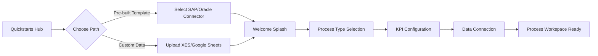
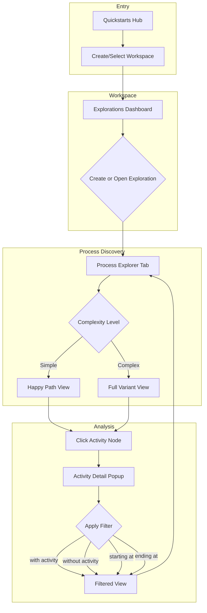
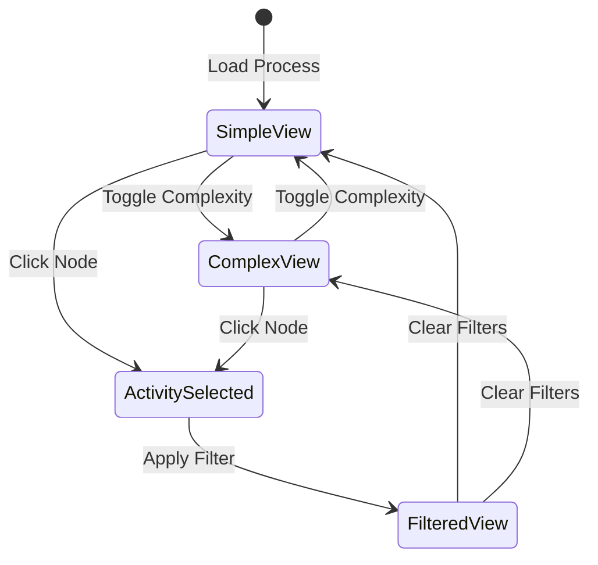

# Celonis UI Product Research Reports

This document contains comprehensive product research analysis of two Celonis modules:

1. **Business Miner** - Onboarding & Workspace Setup
2. **Process Explorer** - Flow Visualization & Complexity Filtering

---

# Part 1: Business Miner

## Executive Summary

This is **Celonis Business Miner** — an enterprise-grade process mining onboarding and workspace setup module. The target user is a **Process Analyst or Business Operations professional** who needs to quickly connect organizational data sources (SAP, Oracle) to begin process discovery. The design prioritizes guided, wizard-based onboarding to reduce time-to-value for complex enterprise deployments.

---

## Component Catalog

### Screen 1: Quickstarts / Data Connection Hub

| Element                            | Type              | Location        | Purpose Hypothesis                                          | Priority |
| ---------------------------------- | ----------------- | --------------- | ----------------------------------------------------------- | -------- |
| Celonis Logo (C)                   | Branding          | Top-left corner | Brand identity anchor                                       | Low      |
| **Quickstarts**                    | Nav Item (Active) | Left Sidebar    | Entry point for guided setup; currently active state        | Critical |
| Business Miner                     | Nav Item          | Left Sidebar    | Core process mining workbench                               | High     |
| Celonis Gallery                    | Nav Item          | Left Sidebar    | Pre-built templates/accelerators                            | Medium   |
| More (…)                           | Expandable Nav    | Left Sidebar    | Hide less-used items; declutter navigation                  | Medium   |
| Data                               | Nav Item          | Bottom Sidebar  | Data management/connections                                 | High     |
| Studio                             | Nav Item          | Bottom Sidebar  | Custom app building environment                             | Medium   |
| Admin & Settings                   | Nav Item          | Bottom Sidebar  | Platform configuration                                      | Medium   |
| Search                             | Action            | Bottom Sidebar  | Global search capability                                    | High     |
| Help Center                        | Action            | Bottom Sidebar  | Self-service support                                        | Medium   |
| User Avatar (naman agarwal, Admin) | Profile           | Bottom Sidebar  | User context, role indicator                                | Low      |
| **"[X] process" section**          | Section Header    | Main Content    | Categorizes quickstarts by source system                    | High     |
| Oracle Cards (x3)                  | Integration Tile  | Main Grid       | Order Mgmt, Procurement, generic Oracle connector           | Critical |
| SAP Cards (x4)                     | Integration Tile  | Main Grid       | Accounts Payable, Accounts Receivable, Procurement variants | Critical |
| **"[X]og" section**                | Section Header    | Main Content    | Event log import options                                    | High     |
| Google Sheets                      | Import Tile       | Main Grid       | Connect spreadsheet-based event logs                        | Medium   |
| XES File                           | Import Tile       | Main Grid       | Industry-standard process mining format import              | Medium   |

### Screen 2 & 4: Process Workspace Setup Wizard

| Element                         | Type           | Location    | Purpose Hypothesis                                                          | Priority |
| ------------------------------- | -------------- | ----------- | --------------------------------------------------------------------------- | -------- |
| Back Arrow + Breadcrumb         | Navigation     | Top Bar     | Contextual navigation: "Business Miner > Setting up your Process Workspace" | High     |
| Help Icon (?)                   | Action         | Top-right   | Contextual help access                                                      | Medium   |
| Step Indicator (①)              | Progress       | Card Header | Shows wizard progress; step 1 of N                                          | Critical |
| "Select your process type"      | Step Title     | Card Header | Clear instruction for current action                                        | Critical |
| Explanatory Subtext             | Help Text      | Below Title | Explains workspace purpose; mentions "Other process" escape hatch           | High     |
| **Process Type Dropdown**       | Form Control   | Card Body   | Primary input for process categorization                                    | Critical |
| Cancel Link                     | Action         | Card Footer | Escape route without commitment                                             | Medium   |
| **Dropdown Options** (Screen 4) | Select Options | Dropdown    | Predefined process types                                                    | Critical |
| - Accounts Payable              | Option         | Dropdown    | P2P/AP process type                                                         | High     |
| - Accounts Receivable           | Option         | Dropdown    | O2C/AR process type                                                         | High     |
| - Order Management              | Option         | Dropdown    | O2C subprocess                                                              | High     |
| - Procurement                   | Option         | Dropdown    | P2P process type                                                            | High     |
| - Claims Management             | Option         | Dropdown    | Insurance/vertical-specific                                                 | Medium   |
| - Credit Lifecycle              | Option         | Dropdown    | Financial services vertical                                                 | Medium   |
| - Customer Service              | Option         | Dropdown    | Support ticket processes                                                    | Medium   |

### Screen 3: Welcome/Onboarding Splash

| Element                             | Type         | Location     | Purpose Hypothesis                     | Priority |
| ----------------------------------- | ------------ | ------------ | -------------------------------------- | -------- |
| Illustration (Abstract Orbital)     | Decorative   | Center-top   | Visual appeal, brand consistency       | Low      |
| "Setting up your Process Workspace" | Hero Title   | Center       | Clear purpose statement                | Critical |
| Explanatory Paragraph               | Body Text    | Center       | Sets expectations, reduces anxiety     | High     |
| **"Let's get started →"**           | Primary CTA  | Center       | Single action to begin wizard          | Critical |
| Preview Screenshot                  | Social Proof | Bottom-right | Shows end-state to motivate completion | Medium   |

### Screen 5: KPI Configuration Panel

| Element                                   | Type        | Location     | Purpose Hypothesis                               | Priority |
| ----------------------------------------- | ----------- | ------------ | ------------------------------------------------ | -------- |
| Process Type Selected: "Accounts Payable" | Form State  | Dropdown     | Shows prior selection preserved                  | High     |
| **Process-specific KPIs** Section         | KPI Group   | Card Body    | Domain-specific metrics unlocked by process type | Critical |
| - On-Time Payment                         | KPI Chip    | KPI List     | AP-specific metric                               | High     |
| - Days Payable Outstanding                | KPI Chip    | KPI List     | AP-specific metric                               | High     |
| - No Touch                                | KPI Chip    | KPI List     | Automation metric                                | High     |
| - Cash Discount                           | KPI Chip    | KPI List     | Working capital metric                           | High     |
| **Standard KPIs** Section                 | KPI Group   | Card Body    | Universal process metrics                        | High     |
| - Automation                              | KPI Chip    | KPI List     | Cross-process efficiency metric                  | High     |
| - On Time                                 | KPI Chip    | KPI List     | Universal delivery metric                        | High     |
| - Throughput Time                         | KPI Chip    | KPI List     | Cycle time metric                                | High     |
| - Unwanted activity                       | KPI Chip    | KPI List     | Deviation detection                              | High     |
| Cancel Link                               | Action      | Footer-left  | Exit without saving                              | Medium   |
| **Continue Button**                       | Primary CTA | Footer-right | Proceed to next step                             | Critical |
| Preview Screenshot                        | Contextual  | Bottom-right | Persistent motivation element                    | Low      |

---

## User Journey Context

**Primary Flow**: User lands on Quickstarts → Selects source system → Guided wizard → Process workspace created

---

## User Stories

### Feature: Data Source Connection

**Epic**: Initial Platform Onboarding

---

**User Story 1**: Connect Enterprise ERP System

> As a **Process Analyst**,
> I want to **select my organization's ERP system (SAP/Oracle) from a visual catalog**,
> So that **I can quickly establish a connection to my transactional data without manual configuration**.

**Acceptance Criteria**:

- [ ] Given I am on the Quickstarts page, when I click an Oracle tile, then I am taken to the Oracle-specific connection wizard
- [ ] Given I am on the Quickstarts page, when I click an SAP tile, then I am taken to the SAP-specific connection wizard
- [ ] Given a tile is clicked, when the connection succeeds, then I am redirected to the Process Workspace setup
- [ ] Edge case: Connection failure → Clear error message with troubleshooting link

**Inferred Priority**: Critical
**Reasoning**: This is the primary entry point for enterprise customers with existing ERP investments
**UI Elements Involved**:

- Integration Tiles: Visual recognition of source system branding
- Section Headers: Categorization by use case vs. data format

**Dependencies**: Platform authentication, network access to source systems

**Open Questions**:

- What credentials are required for each connector type?
- Is there a "test connection" step before proceeding?

---

**User Story 2**: Import Generic Event Log

> As a **Business Analyst with spreadsheet data**,
> I want to **upload an XES file or connect a Google Sheet**,
> So that **I can analyze process data that doesn't originate from a supported ERP system**.

**Acceptance Criteria**:

- [ ] Given I select Google Sheets, when I authenticate with Google, then my Drive files are browsable
- [ ] Given I select XES File, when I upload a valid XES, then the file is parsed and validated
- [ ] Given invalid data format, when upload completes, then validation errors are displayed with line numbers
- [ ] Edge case: Large file (>1GB) → Progress indicator with cancellation option

**Inferred Priority**: Medium
**Reasoning**: Enables adoption before full IT integration; supports POC/evaluation scenarios
**UI Elements Involved**:

- Google Sheets tile: OAuth integration point
- XES File tile: File upload trigger

**Dependencies**: File upload service, XES parser, Google OAuth configuration

**Open Questions**:

- What is the maximum supported file size?
- Are partial uploads resumable?

---

### Feature: Process Workspace Initialization

**Epic**: Guided Onboarding Experience

---

**User Story 3**: Select Process Category

> As a **new user setting up my first workspace**,
> I want to **choose from a predefined list of business process types**,
> So that **the platform can preconfigure relevant KPIs, views, and best practices for my use case**.

**Acceptance Criteria**:

- [ ] Given I am on the process type step, when I click the dropdown, then I see at least 7 process types
- [ ] Given I select "Accounts Payable", when selection confirms, then AP-specific KPIs appear
- [ ] Given my process isn't listed, when I click "Other process" link, then I can define a custom process type
- [ ] Edge case: Accidental selection → Dropdown allows re-selection before continuing

**Inferred Priority**: Critical
**Reasoning**: This decision cascades to KPI configuration, dashboards, and benchmarking
**UI Elements Involved**:

- Dropdown: Process type selection
- "Other process" link: Escape hatch for edge cases
- Cancel link: Abandon flow

**Dependencies**: Process type taxonomy, KPI template library

**Open Questions**:

- Can users change process type after workspace creation?
- Are custom process types shareable across the organization?

---

**User Story 4**: Configure Process KPIs

> As a **Process Owner**,
> I want to **review and confirm the KPIs that will be tracked for my process**,
> So that **my dashboards and analytics focus on the metrics that matter to my organization**.

**Acceptance Criteria**:

- [ ] Given I've selected Accounts Payable, when the KPI panel loads, then I see 4 process-specific KPIs
- [ ] Given KPIs are displayed, when I click Continue, then all displayed KPIs are saved to my workspace
- [ ] Given I want different KPIs, when I check/uncheck chips, then my selection persists
- [ ] Edge case: No KPIs selected → Validation error before continuing

**Inferred Priority**: High
**Reasoning**: KPI configuration directly affects the value users derive from the platform
**UI Elements Involved**:

- Process-specific KPIs section: Domain expertise demonstration
- Standard KPIs section: Universal baseline metrics
- Continue button: Confirmation action

**Dependencies**: Prior step (process type selection)

**Open Questions**:

- Can KPIs be added/removed after workspace creation?
- Are KPI definitions customizable (thresholds, formulas)?

---

**User Story 5**: Complete Onboarding Wizard

> As a **first-time user**,
> I want to **see a welcoming introduction before starting configuration**,
> So that **I understand what's expected and feel confident proceeding**.

**Acceptance Criteria**:

- [ ] Given I initiate workspace setup, when the welcome screen loads, then I see reassuring copy and preview
- [ ] Given I click "Let's get started", when the wizard advances, then I'm on step 1 (process type selection)
- [ ] Given I need to exit, when I click Cancel at any step, then I'm returned to the Quickstarts hub
- [ ] Edge case: Browser back button → Gracefully return to previous step, not break wizard

**Inferred Priority**: High
**Reasoning**: First impressions drive adoption; wizard anxiety is a real barrier
**UI Elements Involved**:

- Hero illustration: Emotional engagement
- Preview screenshot: Outcome visualization
- CTA button: Single clear action

**Dependencies**: None (entry point to wizard)

**Open Questions**:

- Is there a "skip tutorial" option for power users?
- Can users bookmark/resume a partial wizard?

---

### Feature: Global Navigation

**Epic**: Platform Information Architecture

---

**User Story 6**: Navigate Between Platform Modules

> As a **platform user**,
> I want to **access different modules (Business Miner, Studio, Data) from a persistent sidebar**,
> So that **I can context-switch efficiently without losing my place**.

**Acceptance Criteria**:

- [ ] Given I am anywhere in the platform, when I click a sidebar item, then that module loads
- [ ] Given I have unsaved work, when I navigate away, then I receive a confirmation prompt
- [ ] Given I am an Admin user, when I view the sidebar, then Admin & Settings is visible
- [ ] Edge case: Collapsed sidebar → Icons remain accessible with tooltips

**Inferred Priority**: High
**Reasoning**: Navigation architecture determines discoverability and wayfinding
**UI Elements Involved**:

- Left sidebar: Persistent navigation
- Active state indicator: Current location awareness
- User profile section: Identity and role context

**Dependencies**: Role-based access control

**Open Questions**:

- Can the sidebar be collapsed/expanded?
- Are module badges shown for notifications?

---

## Strategic Observations

### Target Persona Signals

| Signal                                                   | Interpretation                                               |
| -------------------------------------------------------- | ------------------------------------------------------------ |
| Enterprise ERP logos (SAP, Oracle) prominently displayed | Target: Large enterprises with existing ERP investments      |
| Pre-defined process types (AP, AR, O2C)                  | Target: Operations/Finance professionals, not IT             |
| Admin role visible on user profile                       | Target: Teams with governance needs                          |
| Wizard-based onboarding                                  | Target: Users new to process mining, not just new to Celonis |

### Competitive Positioning

- **Differentiated by**: Pre-built connectors with domain-specific KPIs (vs. generic BI tools)
- **Emphasis on**: Speed to value through guided setup (vs. technical configuration)
- **Implicit promise**: "You don't need to be a data engineer to analyze your processes"

### Maturity Indicators

| Indicator                                      | Assessment                                           |
| ---------------------------------------------- | ---------------------------------------------------- |
| Polish level of UI (illustrations, animations) | Mature product (Series C+ or established enterprise) |
| Predefined industry processes (Claims, Credit) | Vertical expansion underway                          |
| "More" overflow in sidebar                     | Feature-rich platform requiring hierarchy            |
| Google Sheets integration                      | Accessibility play for mid-market                    |

---

## Gaps & Opportunities

> [!TIP]
> **Missing Capability: Progress Persistence**
> No visible indication that partial wizard progress is saved. Users may fear data loss if they navigate away.

> [!IMPORTANT]
> **UX Improvement: KPI Checkboxes**
> KPIs appear read-only. Adding toggle controls would give users agency and confidence their input matters.

> [!NOTE]
> **Feature Extension: Connection Templates**
> Allow organizations to create custom "Quickstart" tiles for internal systems not covered by standard connectors.

> [!WARNING]
> **Potential Friction: "Other Process" Escape**
> The "Other process" link is easy to miss. Users with non-standard processes may feel unsupported.

---

## Open Questions for Stakeholders

1. **What happens after "Continue" on the KPI screen?** Is there a data mapping step, or does the workspace immediately scaffold?

2. **Are process types extensible by customers?** Enterprise customers often have proprietary process taxonomies.

3. **What is the expected time to complete this wizard?** This affects whether users need session-save functionality.

4. **How are KPI thresholds configured?** The preview suggests benchmarks exist—are these industry standards or customer-defined?

5. **Is there telemetry on wizard drop-off points?** Understanding where users abandon would prioritize UX investment.

6. **What role does "Celonis Gallery" play in this flow?** It's prominent in navigation but not referenced in the wizard.

---

## Technical Implementation Notes

For the `process_platform_demo` project, key patterns to replicate:

1. **Wizard State Machine**: Multi-step forms with back/next navigation and progress indicators
2. **Dynamic Content Loading**: KPI sections that appear based on prior selections
3. **Integration Tile Grid**: Flexible grid of branded connector cards
4. **Persistent Sidebar Navigation**: Multi-section sidebar with user context at bottom
5. **Preview Panels**: Contextual screenshots/imagery to motivate completion

---

---

# Part 2: Process Explorer & Flow Complexity

## Executive Summary

**Process Explorer** is Celonis's core process visualization module — the analytical "workbench" where Process Analysts discover, filter, and understand process variants. The key differentiating capability shown here is the **flow complexity control**, which allows users to toggle between simplified "happy path" views and full variant explosion views. Target users are **Process Analysts and Operations Managers** who need to identify process deviations, bottlenecks, and automation opportunities within procurement workflows.

---

## Component Catalog

### Screen 2: Process Workspace - Explorations Dashboard

| Element                                          | Type             | Location     | Purpose Hypothesis                 | Priority |
| ------------------------------------------------ | ---------------- | ------------ | ---------------------------------- | -------- |
| **Business Miner** Header                        | Title Chip       | Top Bar      | Current module identification      | Medium   |
| **Create Process Workspace**                     | Primary CTA      | Top Right    | Create new analysis workspace      | High     |
| Help Icon (?)                                    | Action           | Top Right    | Contextual documentation           | Low      |
| **File Upload** Badge                            | Label            | Header Area  | Indicates data source type         | Medium   |
| "[Quickstarts] CSV/XLSX - File Upload Workspace" | Workspace Title  | Header       | Descriptive workspace name         | High     |
| User Avatar (N)                                  | Profile          | Header       | Workspace owner indicator          | Low      |
| **Share** Button                                 | Action           | Header       | Collaboration trigger              | High     |
| **Data Model** Status                            | Info Panel       | Header Right | Shows "Quickstarts CSV/XLSX" model | Medium   |
| **● Data available**                             | Status Indicator | Header Right | Green = healthy data connection    | Critical |
| "Last loaded: Dec 5, 2025"                       | Timestamp        | Header Right | Data freshness indicator           | Medium   |
| ⋮ More Menu                                      | Action           | Header Right | Additional workspace actions       | Low      |
| **Process Explorations**                         | Section Title    | Main Content | Container for analysis artifacts   | High     |
| **Created by me (1)**                            | Tab Filter       | Tab Bar      | Personal exploration filter        | High     |
| **All Explorations (1)**                         | Tab Filter       | Tab Bar      | Team-wide exploration view         | High     |
| **Create Exploration**                           | Action Card      | Card Grid    | Primary CTA to start new analysis  | Critical |
| **"What does your process look like?"**          | Exploration Card | Card Grid    | Pre-built exploration template     | High     |
| Created by / Date                                | Metadata         | Card Footer  | Authorship and timestamp           | Low      |
| ⋮ Card Menu                                      | Action           | Card Corner  | Edit/Delete/Duplicate actions      | Medium   |

### Screen 3: Process Explorer - Simple Flow View

| Element                                     | Type          | Location           | Purpose Hypothesis                 | Priority |
| ------------------------------------------- | ------------- | ------------------ | ---------------------------------- | -------- |
| **Process Discovery**                       | Module Title  | Top Bar            | Parent module context              | High     |
| **Process Explorer**                        | Tab (Active)  | Tab Bar            | Current analysis mode              | Critical |
| Benchmarking                                | Tab           | Tab Bar            | Comparative analysis mode          | High     |
| Automation                                  | Tab           | Tab Bar            | Automation opportunity analysis    | High     |
| Cycle Time                                  | Tab           | Tab Bar            | Duration analysis mode             | High     |
| Productivity Deep Dive                      | Tab           | Tab Bar            | Efficiency analysis                | Medium   |
| Notes                                       | Tab           | Tab Bar            | Annotation/documentation mode      | Low      |
| **"Procurement_1"**                         | Process Name  | Top Right          | Current process identifier         | Medium   |
| ✕ Close                                     | Action        | Top Right Corner   | Exit Process Discovery modal       | Medium   |
| **Celonis Logo (C)**                        | Branding      | Left Metrics Panel | Brand presence                     | Low      |
| **# PO Items: 1.2M**                        | Metric Card   | Left Panel         | Case count summary                 | Critical |
| **Net Order Value: $2.7B**                  | Metric Card   | Left Panel         | Value-weighted metric              | Critical |
| **Variants: 1223**                          | Metric Card   | Left Panel         | Process variant count              | Critical |
| **Toolbar** (Filter icons)                  | Action Bar    | Left of Graph      | Graph manipulation tools           | High     |
| ✓ Checkmark Icon                            | Filter Toggle | Toolbar            | Possibly "show completed" filter   | Medium   |
| Arrange Icon                                | Action        | Toolbar            | Layout algorithm trigger           | Medium   |
| ⋯ More                                      | Action        | Toolbar            | Additional graph options           | Low      |
| **Start Node**                              | Graph Element | Process Graph      | Entry point indicator              | Critical |
| **Create Purchase Requisition Item**        | Activity Node | Process Graph      | First activity step                | Critical |
| **Create Purchase Order Item**              | Activity Node | Process Graph      | Subsequent activity                | Critical |
| **Send Purchase Order**                     | Activity Node | Process Graph      | Outbound transaction               | Critical |
| **Record Goods Receipt**                    | Activity Node | Process Graph      | Fulfillment confirmation           | Critical |
| **Record Invoice Receipt**                  | Activity Node | Process Graph      | Financial matching                 | Critical |
| **Clear Invoice**                           | Activity Node | Process Graph      | Payment processing                 | Critical |
| **End Node**                                | Graph Element | Process Graph      | Exit point indicator               | Critical |
| **Edge Labels** (e.g., "12 h", "4 d")       | Duration      | Graph Edges        | Transition time between activities | Critical |
| **Activity Counts** (e.g., "1.17M", "811K") | Metric        | Node Labels        | Frequency annotation               | Critical |
| **Zoom Controls** (+/-/slider)              | Action        | Right Edge         | Graph zoom control                 | Medium   |
| **Minimap** (implied)                       | Navigation    | Right Edge         | Large graph navigation             | Medium   |

### Screen 4: Activity Detail Popup

| Element                              | Type                   | Location      | Purpose Hypothesis                           | Priority |
| ------------------------------------ | ---------------------- | ------------- | -------------------------------------------- | -------- |
| **"Record Goods Receipt" Header**    | Popup Title            | Popup Top     | Selected activity context                    | Critical |
| Settings Icon                        | Action                 | Popup Header  | Activity configuration                       | Low      |
| External Link Icon                   | Action                 | Popup Header  | Open in new tab/detail view                  | Medium   |
| ✕ Close                              | Action                 | Popup Corner  | Dismiss popup                                | Medium   |
| **99% of cases**                     | Metric                 | Popup Body    | Coverage percentage                          | Critical |
| Progress Ring                        | Visualization          | Popup Body    | Visual percentage indicator                  | High     |
| **1,169,912 of 1,182,801**           | Detail Text            | Below Metric  | Absolute case counts                         | High     |
| **1.17M times / Activity Frequency** | Metric                 | Popup Body    | Execution count                              | High     |
| **"Filter cases"**                   | Section Header         | Popup Body    | Case filtering options                       | Critical |
| **"with this activity"**             | Filter Button (Active) | Filter Group  | Include cases with activity                  | Critical |
| **"without this activity"**          | Filter Button          | Filter Group  | Exclude cases with activity                  | Critical |
| **"starting at this activity"**      | Filter Button          | Filter Group  | Flow-start filter                            | High     |
| **"ending at this activity"**        | Filter Button          | Filter Group  | Flow-end filter                              | High     |
| Case Counts per Filter               | Metrics                | Button Labels | Impact preview (e.g., "1,169,912 cases 99%") | Critical |

### Screen 5: Complex Flow View - Variant Explosion

| Element                                 | Type              | Location      | Purpose Hypothesis              | Priority |
| --------------------------------------- | ----------------- | ------------- | ------------------------------- | -------- |
| **Parallel Paths**                      | Graph Pattern     | Process Graph | Split/merge decision points     | Critical |
| **"Create Free-Text Requisition Item"** | Alternative Start | Graph         | Non-standard entry path         | High     |
| **"Change Price"**                      | Deviation Node    | Graph         | Price modification activity     | High     |
| **"Get Order Confirmation"**            | Deviation Node    | Graph         | Vendor response activity        | Medium   |
| **"Change Requested Date"**             | Deviation Node    | Graph         | Timeline modification           | High     |
| **"Block Purchase Order"**              | Deviation Node    | Graph         | Hold/exception activity         | High     |
| **"Change Quantity"**                   | Deviation Node    | Graph         | Order modification activity     | High     |
| **"Postponed Delivery Date"**           | Deviation Node    | Graph         | Delay activity                  | High     |
| **"Due Date Passed"**                   | Exception Node    | Graph         | SLA breach indicator            | Critical |
| **"Partial Delivery"**                  | Resolution Node   | Graph         | Fulfillment workaround          | High     |
| **Multiple Edge Paths**                 | Graph Pattern     | Graph         | Variant branching visualization | Critical |
| **Time Labels on All Edges**            | Duration          | Edges         | Full timing transparency        | High     |

---

## User Journey Context

**Critical Insight**: The **complexity toggle** (inferred from the stark difference between Screen 3 and Screen 5) is the key UX pattern for managing cognitive load when analyzing processes with 1000+ variants.

---

## User Stories

### Feature: Process Flow Visualization

**Epic**: Process Discovery & Analysis

---

**User Story 1**: View Simplified Happy Path

> As a **Process Analyst new to a process**,
> I want to **view a simplified "happy path" visualization showing only the most common activities**,
> So that **I can quickly understand the standard process flow before diving into deviations**.

**Acceptance Criteria**:

- [ ] Given I open Process Explorer, when the view loads, then I see a linear flow with < 10 nodes by default
- [ ] Given I'm in simple view, when activities are shown, then only activities occurring in >80% of cases appear
- [ ] Given simple view is active, when I see edge labels, then durations reflect median times
- [ ] Edge case: Process with no clear happy path → Show "No dominant variant" message with suggestion to use complex view

**Inferred Priority**: Critical
**Reasoning**: Cognitive overload is the #1 barrier to process mining adoption; simple view is the accessibility gateway
**UI Elements Involved**:

- Activity nodes: Filtered to high-frequency only
- Edge labels: Simplified duration display
- Toolbar toggle: Complexity level control

**Dependencies**: Variant analysis algorithm, frequency threshold configuration

**Open Questions**:

- What is the default frequency threshold for "happy path" inclusion?
- Can users customize the complexity threshold?

---

**User Story 2**: Expand to Full Variant Complexity

> As an **experienced Process Analyst investigating deviations**,
> I want to **toggle to a full complexity view showing all process variants and exception paths**,
> So that **I can identify root causes of delays, rework, and non-compliance**.

**Acceptance Criteria**:

- [ ] Given I toggle to complex view, when the graph redraws, then all 1223 variants are represented in the graph structure
- [ ] Given complex view is shown, when I see parallel paths, then branch/merge points are clearly indicated
- [ ] Given nodes overlap, when I hover, then the hovered node elevates and shows full label
- [ ] Edge case: > 5000 variants → Aggregate low-frequency variants into "Other" cluster

**Inferred Priority**: Critical
**Reasoning**: This is where the deep analytical value lives; power users spend most time here
**UI Elements Involved**:

- Graph canvas: Expanded to show all paths
- Zoom controls: Essential for navigation
- Node density: Visual indicator of variant concentration

**Dependencies**: Simple view as baseline, zoom/pan controls

**Open Questions**:

- Is there a performance limit on nodes rendered?
- Can users save a "focused" view of specific variants?

---

**User Story 3**: Inspect Activity Details

> As a **Process Owner investigating a specific step**,
> I want to **click on an activity node to see detailed statistics and filtering options**,
> So that **I can understand how often the step occurs and isolate cases that include or exclude it**.

**Acceptance Criteria**:

- [ ] Given I click any activity node, when the popup appears, then I see percentage of cases, absolute count, and frequency
- [ ] Given the popup is open, when I see filter buttons, then "with this activity" is pre-selected/highlighted
- [ ] Given I click a filter option, when the selection registers, then the case count for that filter is shown alongside
- [ ] Edge case: Activity with 0% occurrence → Show with "Not in current filter" message

**Inferred Priority**: Critical
**Reasoning**: This is the primary interaction pattern for hypothesis testing and root cause analysis
**UI Elements Involved**:

- Activity node: Click target
- Detail popup: Information container
- Filter buttons: Direct action triggers
- Case counts: Impact preview

**Dependencies**: Click event handling, case-level data availability

**Open Questions**:

- Does filtering persist when popup is closed?
- Can multiple filter conditions be combined (AND/OR)?

---

**User Story 4**: Filter Cases by Activity Presence

> As a **Compliance Officer auditing process adherence**,
> I want to **filter the process view to show only cases that include (or exclude) a specific activity**,
> So that **I can identify non-compliant cases that skip mandatory steps**.

**Acceptance Criteria**:

- [ ] Given I select "without this activity", when filter applies, then the graph redraws showing only excluded cases' paths
- [ ] Given filter is active, when I view metrics panel, then KPIs (# PO Items, Net Value) update to reflect filtered subset
- [ ] Given I want to reset, when I clear filters, then the full dataset view restores
- [ ] Edge case: Filter results in 0 cases → Show empty state with "No cases match these criteria"

**Inferred Priority**: High
**Reasoning**: Compliance use cases drive enterprise value; this is core to audit workflows
**UI Elements Involved**:

- Filter buttons: "with/without/starting/ending at this activity"
- Filtered case count: Preview before applying
- Metrics panel: Must respond to filter context

**Dependencies**: Activity detail popup, real-time filter computation

**Open Questions**:

- Can filters be saved as named segments?
- Is there a filter history/undo stack?

---

**User Story 5**: Analyze Transition Durations

> As an **Operations Manager optimizing cycle time**,
> I want to **see the time duration between each activity step displayed on the graph edges**,
> So that **I can identify bottlenecks where excessive wait times occur**.

**Acceptance Criteria**:

- [ ] Given I view the process graph, when edges are visible, then duration labels show time in appropriate units (h/d)
- [ ] Given an edge shows "52 d", when I hover, then I see breakdown (median, avg, p90)
- [ ] Given multiple parallel edges exist, when I compare, then I can visually identify the slowest path
- [ ] Edge case: Instant transitions (< 1 min) → Show "< 1 min" rather than "0"

**Inferred Priority**: Critical
**Reasoning**: Time-to-completion is the most common optimization target in process mining
**UI Elements Involved**:

- Edge labels: Duration display
- Edge thickness (potential): Could encode frequency or bottleneck severity
- Hover tooltip: Detailed timing statistics

**Dependencies**: Timestamp data in event log

**Open Questions**:

- Is duration median, mean, or configurable?
- Can edges be colored by duration threshold (red = SLA breach)?

---

**User Story 6**: Create and Manage Explorations

> As a **Business Analyst building reusable analyses**,
> I want to **create, name, and save explorations within a workspace**,
> So that **I can return to my analysis later and share it with colleagues**.

**Acceptance Criteria**:

- [ ] Given I click "Create Exploration", when the dialog appears, then I can name and configure my exploration
- [ ] Given I've run an analysis, when I navigate away, then my exploration state is auto-saved
- [ ] Given I select "All Explorations", when the list loads, then I see explorations from all workspace members
- [ ] Edge case: Duplicate name → Append timestamp or prompt for unique name

**Inferred Priority**: High
**Reasoning**: Collaboration and persistence are enterprise requirements; one-off analyses have low value
**UI Elements Involved**:

- Create Exploration card: Entry point
- Exploration cards: List representation
- Tabs (Created by me / All): Ownership filtering
- Share button: Collaboration trigger

**Dependencies**: User authentication, workspace permissions

**Open Questions**:

- Can explorations be versioned?
- Are there exploration templates beyond the default?

---

### Feature: Data Health Monitoring

**Epic**: Platform Trust & Reliability

---

**User Story 7**: Verify Data Availability

> As a **Platform Administrator**,
> I want to **see a clear indicator that data is successfully loaded and current**,
> So that **I have confidence that analyses reflect accurate, up-to-date information**.

**Acceptance Criteria**:

- [ ] Given data loaded successfully, when I view workspace header, then I see green "● Data available" indicator
- [ ] Given data is stale, when I view header, then I see yellow/orange warning with last load time
- [ ] Given data load failed, when I view header, then I see red indicator with error details
- [ ] Edge case: Data loading in progress → Show spinner with "Loading data..."

**Inferred Priority**: High
**Reasoning**: Data trust is foundational; users won't act on insights they don't trust
**UI Elements Involved**:

- Status indicator: Color-coded dot
- Last loaded timestamp: Freshness context
- ⋮ Menu: Likely includes "Refresh Data" action

**Dependencies**: Data pipeline status API

**Open Questions**:

- Can users manually trigger data refresh from the UI?
- What data freshness SLA does the status represent?

---

## Strategic Observations

### Target Persona Signals

| Signal                                                     | Interpretation                                              |
| ---------------------------------------------------------- | ----------------------------------------------------------- |
| 1.2M cases, $2.7B value displayed prominently              | Target: Enterprise-scale operations                         |
| Procurement-specific process (PO, Goods Receipt, Invoice)  | Target: Procurement/Supply Chain professionals              |
| Variant count (1223) as KPI                                | Target: Users comfortable with process mining concepts      |
| Tab bar includes "Automation" and "Productivity Deep Dive" | Target: Transformation-focused analysts, not just reporters |

### Complexity Toggle: Key Design Pattern

> [!IMPORTANT]
> **The Simple vs. Complex view toggle is the standout UX innovation in this module.**
>
> - **Why it matters**: Process graphs with 1000+ variants are unreadable without filtering
> - **Mental model**: "Start simple, drill down to complexity" mirrors natural investigation flow
> - **Implementation pattern**: Server-side variant aggregation with client-side toggle for instant switching

### Competitive Positioning

| Differentiator                  | Evidence                                                    |
| ------------------------------- | ----------------------------------------------------------- |
| **Pre-built process templates** | "Procurement_1" suggests named, industry-standard processes |
| **Integrated KPI panels**       | Left sidebar shows contextual metrics (not just graph)      |
| **One-click case filtering**    | Popup with immediate "Filter cases" actions                 |
| **Collaboration built-in**      | Share button, "All Explorations" tab                        |

### Maturity Indicators

| Indicator                                                     | Assessment                               |
| ------------------------------------------------------------- | ---------------------------------------- |
| Handling 1.2M cases smoothly                                  | Enterprise-grade backend performance     |
| Sophisticated graph layout with parallel paths                | Years of R&D on visualization algorithms |
| Multiple analysis tabs (Benchmarking, Automation, Cycle Time) | Feature-rich, mature platform            |
| Data model abstraction ("Quickstarts CSV/XLSX")               | Flexible data integration architecture   |

---

## Gaps & Opportunities

> [!TIP]
> **Missing Capability: Complexity Slider**
> A discrete Simple/Complex toggle may be limiting. Consider a continuous slider (0-100%) that adjusts the variant inclusion threshold interactively.

> [!IMPORTANT]
> **UX Improvement: Combined Filters**
> Current popup allows single-filter selection. Power users need AND/OR combinations (e.g., "Cases WITH 'Record Goods Receipt' but WITHOUT 'Partial Delivery'").

> [!NOTE]
> **Feature Extension: Saved Views**
> Allow users to save specific complexity + filter + zoom configurations as named "Views" for quick access.

> [!WARNING]
> **Performance Concern: Complex View**
> Screen 5 shows dense graph that may be slow to render or interact with at scale. Consider progressive loading or level-of-detail rendering.

> [!CAUTION]
> **Accessibility Gap: Color Reliance**
> Blue deviation nodes in complex view may not be distinguishable for colorblind users. Add shape/pattern differentiation.

---

## Open Questions for Stakeholders

1. **What algorithm determines the "happy path" in simple view?** Is it most-frequent-variant or majority-activities-by-coverage?

2. **How is the complexity toggle exposed in the UI?** I infer it exists from the contrast between screens but don't see the control explicitly.

3. **Can filter conditions be serialized and shared?** E.g., sending a link to "Cases without Goods Receipt in Procurement_1"?

4. **What's the rendering strategy for 1000+ node graphs?** Canvas vs. SVG, viewport culling, etc.?

5. **Is there an API for external tools to consume exploration results?** E.g., pushing filtered case IDs to downstream systems?

6. **How do the other tabs (Benchmarking, Automation, Cycle Time) differ in visualization approach?** Are they variations on the graph or entirely different views?

---

## Technical Implementation Notes

For the `process_platform_demo` project, key patterns to replicate:

| Pattern                   | Implementation Hint                                                   |
| ------------------------- | --------------------------------------------------------------------- |
| **Simple/Complex Toggle** | Precompute variant tiers; filter graph data client-side               |
| **Activity Detail Popup** | React portal with positioned card; close on outside click             |
| **Case Filter Buttons**   | State machine per filter type; optimistic UI with count preview       |
| **Edge Duration Labels**  | SVG text positioned at edge midpoint; auto-hide on zoom-out           |
| **Metrics Panel Sync**    | Zustand store linking filters to aggregated KPIs                      |
| **Graph Layout**          | dagre-d3 or ELK.js for hierarchical layout with parallel path support |
| **Data Status Indicator** | Polling or WebSocket for pipeline status; color-coded badge           |

### Graph State Machine

