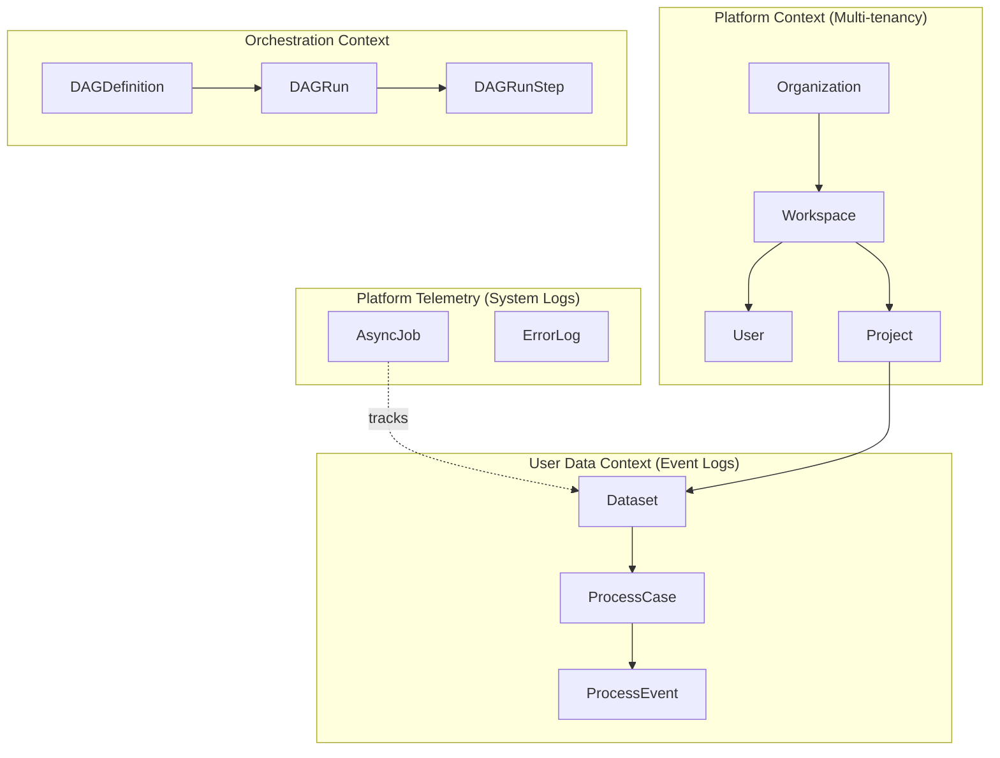
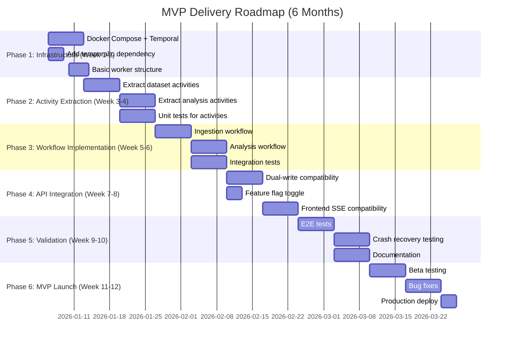

# Process Mining MVP - Comprehensive Strategic Plan

## Executive Summary

**Goal**: Deliver a production-ready Process Mining SaaS MVP with durable workflow orchestration, comprehensive analytics, and scalable architecture.

**Key Decision**: Migrate from Celery to Temporal for stateful, durable workflow execution.

**Timeline**: 6-month phased implementation with Local MVP validation before cloud deployment.

---

## Domain Ontology

> Clear separation between User Data, Platform Telemetry, and Orchestration.

### Bounded Contexts



### Entity Definitions

| Entity | Context | Description | Owner |
|--------|---------|-------------|-------|
| **Organization** | Platform | Top-level tenant | Platform Team |
| **Workspace** | Platform | Collaboration space within org | Platform Team |
| **User** | Platform | Authenticated actor | Platform Team |
| **Project** | Platform | Container for datasets/analyses | Platform Team |
| **Dataset** | User Data | User's uploaded event log (CSV/XES) | Feature Team |
| **ProcessCase** | User Data | Single process instance (trace) | Feature Team |
| **ProcessEvent** | User Data | Single event in a case | Feature Team |
| **AsyncJob** | Platform Telemetry | Tracks long-running operations | Platform Team |
| **ErrorLog** | Platform Telemetry | System error tracking | Platform Team |
| **DAGDefinition** | Orchestration | Workflow template | Platform Team |
| **DAGRun** | Orchestration | Workflow execution instance | Platform Team |

### Business Vocabulary

#### Nouns (Entities)
| Term | Meaning | DB Table |
|------|---------|----------|
| Event Log | User's uploaded file containing process data | `datasets` |
| Case | One execution of a business process (e.g., one order) | `process_cases` |
| Event | Single activity occurrence with timestamp | `process_events` |
| Activity | Named step in a process (e.g., "Approve Request") | `lookup_activities` |
| Variant | Unique sequence of activities in a case | computed |
| Process Model | Discovered graph of the process | `process_models` |

#### Verbs (Operations)
| Verb | Actor | Object | Async? |
|------|-------|--------|--------|
| **Upload** | User | Event Log | No |
| **Validate** | System | Event Log | Yes (Job) |
| **Map Columns** | User | Event Log | No |
| **Ingest** | System | Event Log → Cases/Events | Yes (Job) |
| **Discover** | System | Event Log → Model | Yes (Job) |
| **Check Conformance** | System | Model + Log → Results | Yes (Job) |
| **Train Model** | System | Event Log → Prediction Model | Yes (Job) |

### Key Separation Principles

> [!IMPORTANT]
> **User Data vs Platform Telemetry**
> 
> - [ProcessEvent](file:///Users/namanagarwal/system/backend/src/features/process_mining/models/events.py#42-84) = User's business data (their customers' actions)
> - [ErrorLog](file:///Users/namanagarwal/system/backend/src/platform/models.py#83-108) = Our system errors (for debugging)
> - [AsyncJob](file:///Users/namanagarwal/system/backend/src/platform/models.py#39-76) = Our operational tracking (job status)
> 
> These should NEVER be mixed in queries or APIs.


---

## Complete Workflow Inventory

### Core Workflows (Must Have for MVP)

```mermaid
graph TB
    subgraph "1. Dataset Lifecycle"
        D1[Upload] --> D2[Validate]
        D2 --> D3[Detect Columns]
        D3 --> D4[Map Columns]
        D4 --> D5[Ingest to DB]
        D5 --> D6[Compute Stats]
    end
    
    subgraph "2. Process Discovery"
        P1[Load Event Log] --> P2[Apply Filters]
        P2 --> P3[Mine Model]
        P3 --> P4[Compute Metrics]
        P4 --> P5[Cache Graph]
    end
    
    subgraph "3. Conformance Checking"
        C1[Load Model] --> C2[Token Replay]
        C2 --> C3[Alignment]
        C3 --> C4[Fitness Metrics]
    end
    
    subgraph "4. Analytics Pipeline"
        A1[Load Data] --> A2[Bottleneck Detection]
        A2 --> A3[Rework Analysis]
        A3 --> A4[Variant Analysis]
        A4 --> A5[SLA Monitoring]
    end
```



### All Workflows Detailed

| # | Workflow | Current Location | Complexity | Duration | Priority |
|---|----------|-----------------|------------|----------|----------|
| 1 | **Dataset Upload** | [object_storage.py](file:///Users/namanagarwal/system/backend/src/platform/infrastructure/object_storage.py) | Low | Seconds | P0 |
| 2 | **File Validation** | [dataset_tasks.py:257-560](file:///Users/namanagarwal/system/backend/src/platform/infrastructure/tasks/dataset_tasks.py) | Medium | 1-5 min | P0 |
| 3 | **Column Detection** | [unified.py](file:///Users/namanagarwal/system/backend/src/features/process_mining/services/ingestion/unified.py) | Low | Seconds | P0 |
| 4 | **Column Mapping** | API-driven (sync) | Low | Sync | P0 |
| 5 | **Dataset Ingestion** | [dataset_tasks.py:568-915](file:///Users/namanagarwal/system/backend/src/platform/infrastructure/tasks/dataset_tasks.py) | High | 5-30 min | P0 |
| 6 | **Process Discovery** | [analysis_tasks.py:184-360](file:///Users/namanagarwal/system/backend/src/platform/infrastructure/tasks/analysis_tasks.py) | High | 2-10 min | P0 |
| 7 | **Conformance Check** | [analysis_tasks.py:368-500](file:///Users/namanagarwal/system/backend/src/platform/infrastructure/tasks/analysis_tasks.py) | Medium | 1-5 min | P1 |
| 8 | **Analytics Computation** | [analytics.py](file:///Users/namanagarwal/system/backend/src/features/process_mining/services/analytics.py) | Medium | 1-3 min | P0 |
| 9 | **ML Model Training** | [ml_tasks.py](file:///Users/namanagarwal/system/backend/src/platform/infrastructure/tasks/ml_tasks.py) | High | 10-60 min | P2 |
| 10 | **OCEL Processing** | [ocpm.py](file:///Users/namanagarwal/system/backend/src/features/process_mining/services/ocpm.py) | High | 5-20 min | P2 |
| 11 | **Social Network Mining** | [organizational.py](file:///Users/namanagarwal/system/backend/src/features/process_mining/services/organizational.py) | Medium | 2-5 min | P2 |
| 12 | **Zombie Job Cleanup** | [maintenance_tasks.py](file:///Users/namanagarwal/system/backend/src/platform/infrastructure/tasks/maintenance_tasks.py) | Low | Seconds | P1 |

---

## Capability Matrix

### MVP Capabilities (Must Ship)

| Capability | Status | Backend Ready | Frontend Ready | Gap |
|------------|--------|--------------|----------------|-----|
| User Auth (JWT) | ✅ | Yes | Yes | None |
| Workspace/Project Management | ✅ | Yes | Yes | None |
| CSV Upload (Direct) | ✅ | Yes | Yes | None |
| Presigned URL Upload (S3) | ✅ | Yes | Partial | Progress tracking |
| Column Detection | ✅ | Yes | Yes | None |
| AI Column Suggestions | ✅ | Yes | Yes | None |
| Manual Column Mapping | ✅ | Yes | Yes | None |
| DuckDB Ingestion | ✅ | Yes | N/A | None |
| Alpha Miner Discovery | ✅ | Yes | Yes | None |
| Inductive Miner | ✅ | Yes | Yes | None |
| Heuristic Miner | ✅ | Yes | Yes | None |
| Token Replay Conformance | ✅ | Yes | Yes | None |
| Process Visualization | ✅ | Yes | Yes | None |
| Basic Statistics | ✅ | Yes | Yes | None |
| Bottleneck Detection | ✅ | Yes | Partial | UI polish |
| Variant Analysis | ✅ | Yes | Partial | UI polish |

### Post-MVP Capabilities

| Capability | Backend Ready | Priority | Effort |
|------------|--------------|----------|--------|
| Alignment Conformance | Partial | P1 | Medium |
| OCEL 2.0 Support | Yes | P2 | Low |
| ML Predictions | Yes | P2 | Low |
| Social Network Mining | Yes | P2 | Medium |
| Root Cause Analysis | Yes | P2 | Medium |
| What-If Simulation | Partial | P3 | High |
| Real-time Streaming | No | P3 | High |

---

## Current Architecture Issues

> Referenced from [ARCHITECTURE_IMPROVEMENTS.md](file:///Users/namanagarwal/system/ARCHITECTURE_IMPROVEMENTS.md)

### Critical Issues (Blocking MVP Quality)

| Issue | Impact | Current State | Risk Level |
|-------|--------|--------------|------------|
| **Fire-and-Forget Tasks** | Lost work on crash | Celery tasks don't resume | 🔴 Critical |
| **No Heartbeat for Long Tasks** | 30+ min tasks timeout | `SoftTimeLimitExceeded` kills worker | 🔴 Critical |
| **State in Redis (Volatile)** | Lost on Redis restart | Progress, results all in Redis | 🔴 Critical |
| **Monolithic Task Files** | Hard to test/maintain | [dataset_tasks.py](file:///Users/namanagarwal/system/backend/src/platform/infrastructure/tasks/dataset_tasks.py) is 900+ lines | 🟡 Medium |
| **DB Writes in Loops** | Performance, atomicity | Progress updates inline | 🟡 Medium |

### Operational Issues

| Issue | Impact | Workaround Today |
|-------|--------|-----------------|
| **Zombie Jobs** | Stuck "Processing" forever | [reap_zombie_jobs](file:///Users/namanagarwal/system/backend/src/platform/infrastructure/tasks/maintenance_tasks.py#18-157) scheduled task |
| **No Retry Visibility** | Can't see retry attempts | Manual log checking |
| **Worker Crash = Lost Progress** | Re-process from scratch | User re-triggers manually |
| **Payload Size Limits** | Memory exhaustion | None (crashes on large files) |

---

## Temporal Migration Strategy

### Why Temporal over Celery

| Factor | Celery | Temporal | Winner |
|--------|--------|----------|--------|
| **State Durability** | Redis (volatile) | Event Sourced (persistent) | Temporal |
| **Crash Recovery** | Retry from scratch | Resume from heartbeat | Temporal |
| **Long-Running Tasks** | Hard timeout kills | Heartbeat liveness | Temporal |
| **Visibility** | Custom metrics | Built-in Web UI | Temporal |
| **Retry Policies** | Manual configuration | Declarative per-activity | Temporal |
| **Testing** | Complex mocking | `WorkflowEnvironment` | Temporal |
| **Maturity** | Battle-tested | Growing rapidly | Celery |
| **Learning Curve** | Familiar | New paradigm | Celery |

### Temporal Workflow Design

#### Dataset Lifecycle Workflow
```
Workflow ID: dataset-{dataset_uuid}
Queue: ingestion-queue
Duration: 5-30 minutes

Activities:
1. validate_file_activity (5 min timeout)
   └─ Magic byte check, encoding detection
   
2. detect_columns_activity (2 min timeout)
   └─ Parse sample, AI suggestions
   
3. parse_to_parquet_activity (30 min, 30s heartbeat)
   └─ Stream CSV → Parquet, periodic heartbeat
   └─ Returns: S3 key (Claim Check pattern)
   
4. bulk_copy_to_db_activity (10 min timeout)
   └─ Parquet → PostgreSQL bulk insert
   
5. compute_statistics_activity (5 min timeout)
   └─ Case counts, variants, durations
```

#### Analysis Workflow
```
Workflow ID: analysis-{analysis_uuid}
Queue: analysis-queue
Duration: 2-15 minutes

Activities:
1. load_event_log_activity (5 min timeout)
2. apply_filters_activity (1 min timeout)
3. mine_model_activity (10 min, 30s heartbeat)
4. compute_metrics_activity (2 min timeout)
5. cache_graph_activity (1 min timeout)
```

---

## Testing Strategy with Cleanup

### Test Pyramid

```
         ┌─────────────────────────────┐
         │    E2E Tests (5%)          │  ← Docker Compose, full cleanup
         │  Full API → Workflow → DB   │
         └──────────────┬──────────────┘
    ┌───────────────────┴───────────────────┐
    │     Integration Tests (25%)           │  ← Temporal Test Server
    │   Workflow + Activities + Mock S3     │
    └──────────────────┬────────────────────┘
┌──────────────────────┴──────────────────────┐
│          Unit Tests (70%)                   │  ← Mocked everything
│   Activity logic, pure functions            │
└─────────────────────────────────────────────┘
```

### Cleanup Strategy

| Test Type | DB Cleanup | S3 Cleanup | Temporal Cleanup |
|-----------|------------|------------|------------------|
| Unit | N/A | N/A | N/A |
| Integration | Transaction rollback | Fixture deletes keys | Auto-terminates |
| E2E | `DELETE WHERE name LIKE 'test_%'` | List & delete prefix | Manual cancel |

### Key Test Files to Create

| File | Purpose |
|------|---------|
| `tests/temporal/conftest.py` | Shared fixtures, cleanup |
| `tests/unit/temporal/test_activities.py` | Activity unit tests |
| `tests/integration/test_ingestion_workflow.py` | Full ingestion test |
| `tests/integration/test_analysis_workflow.py` | Full analysis test |
| `tests/e2e/test_api_to_workflow.py` | API → Temporal → DB |

---

## Worker Management

### Worker Pool Design

```
┌─────────────────────────────────────────────────────────┐
│                    TEMPORAL SERVER                       │
│  ┌─────────────┐  ┌─────────────┐  ┌─────────────┐     │
│  │ ingestion-  │  │ analysis-   │  │ ml-queue    │     │
│  │ queue       │  │ queue       │  │             │     │
│  └──────┬──────┘  └──────┬──────┘  └──────┬──────┘     │
└─────────┼────────────────┼────────────────┼─────────────┘
          │                │                │
    ┌─────▼─────┐    ┌─────▼─────┐    ┌─────▼─────┐
    │ Ingestion │    │ Analysis  │    │ ML Worker │
    │ Worker x2 │    │ Worker x2 │    │ x1        │
    │ (memory   │    │ (CPU      │    │ (GPU opt) │
    │  heavy)   │    │  heavy)   │    │           │
    └───────────┘    └───────────┘    └───────────┘
```

### Worker Configuration

```python
# src/platform/temporal/config.py
@dataclass
class WorkerConfig:
    # Queue assignments
    QUEUE_INGESTION = "ingestion-queue"
    QUEUE_ANALYSIS = "analysis-queue"
    QUEUE_ML = "ml-queue"
    
    # Worker scaling
    ingestion_workers: int = 2      # Memory-bound
    analysis_workers: int = 2       # CPU-bound
    ml_workers: int = 1             # GPU optional
    
    # Concurrency limits
    max_concurrent_activities: int = 3
    max_cached_workflows: int = 100
```

### Local Development Commands

```bash
# Start all workers (development)
make temporal-workers

# Start specific worker
make temporal-ingestion

# View worker status
temporal workflow list --namespace default

# Stop all workers
make temporal-stop
```

### Production Deployment

| Aspect | Local MVP | Production |
|--------|-----------|------------|
| **Deployment** | Docker Compose | Kubernetes Deployment |
| **Scaling** | Fixed (2-2-1) | HPA on queue depth |
| **Temporal Server** | `temporal server start-dev` | Temporal Cloud / Self-hosted |
| **Monitoring** | Web UI (localhost:8088) | Prometheus + Grafana |

---

## Frontend Changes

### Current Job Handling

The frontend uses [useJobStream.ts](file:///Users/namanagarwal/system/frontend-new/src/features/platform/upload-wizard/hooks/useJobStream.ts):

1. API returns `job_id`
2. Opens SSE to `/jobs/{id}/stream`
3. Updates UI on progress events

### Migration Phases

| Phase | Frontend Change | Backend Support |
|-------|-----------------|-----------------|
| **Phase 1** | None | Dual-write: Temporal + Redis for SSE |
| **Phase 2** | Accept `workflow_id` | Return both IDs |
| **Phase 3** | New `useWorkflowStatus` hook | Temporal query endpoint |

### New API Contracts

```typescript
// Response includes both for backwards compat
interface IngestResponse {
  job_id: string;       // Legacy (deprecated)
  workflow_id: string;  // New
  workflow_run_id: string;
}

// New workflow status endpoint
GET /workflows/{id}/status
{
  "status": "RUNNING",
  "current_activity": "parse_to_parquet",
  "progress": 45,
  "started_at": "2026-01-06T12:00:00Z"
}
```

### Recommended Approach

> [!TIP]
> **Recommended: Keep SSE for Phase 1-2**
> 
> Backend translates Temporal state → Redis → SSE. Minimal frontend changes required.

---

## System-Wide Gap Analysis

### API Layer

| Endpoint | Current | Gap | Fix |
|----------|---------|-----|-----|
| `POST /datasets/upload` | Returns `job_id` | SSE tied to Celery | Add Temporal query |
| `GET /datasets/:id/status` | Polls [AsyncJob](file:///Users/namanagarwal/system/backend/src/platform/models.py#39-76) | No workflow state | Add `workflow_id` |
| `POST /discovery/discover` | Fire-and-forget | No durability | Return `workflow_id` |
| `GET /jobs/:id` | Celery-specific | Tightly coupled | Abstract to handles |

### Database Schema

| Table | Change Required |
|-------|----------------|
| `async_jobs` | Add `workflow_id`, `workflow_run_id` columns |
| `datasets` | Add `workflow_id` column |
| `analyses` | Add `workflow_id` column |
| `dag_runs` | Deprecate after migration |

### Service Layer

| Service | Current → Temporal |
|---------|-------------------|
| `job_service.py` | Celery dispatch → Temporal start |
| `event_stream.py` | Redis pub/sub → Temporal queries |
| [dataset_tasks.py](file:///Users/namanagarwal/system/backend/src/platform/infrastructure/tasks/dataset_tasks.py) | 900 lines → 3-5 activities |

---

## Phased Implementation Roadmap



### Phase 1: Infrastructure (Week 1-2)

| Task | Deliverable | Owner |
|------|-------------|-------|
| Docker Compose for Temporal | `docker-compose.temporal.yml` | DevOps |
| Add temporalio to deps | Updated `pyproject.toml` | Backend |
| Basic worker skeleton | `src/platform/temporal/worker.py` | Backend |
| Config management | `src/platform/temporal/config.py` | Backend |

### Phase 2: Activity Extraction (Week 3-4)

| Task | Deliverable |
|------|-------------|
| Dataset activities | `activities/dataset.py` with 5 activities |
| Analysis activities | `activities/analysis.py` with 4 activities |
| Pure function extraction | Refactored business logic |
| Activity unit tests | 80%+ coverage |

### Phase 3: Workflow Implementation (Week 5-6)

| Task | Deliverable |
|------|-------------|
| `DatasetIngestionWorkflow` | Full lifecycle workflow |
| `ProcessDiscoveryWorkflow` | Mining + metrics workflow |
| Integration tests | Temporal test server tests |

### Phase 4: API Integration (Week 7-8)

| Task | Deliverable |
|------|-------------|
| Dual-write dispatcher | `compat.py` with feature flag |
| New workflow status endpoint | `GET /workflows/{id}/status` |
| Schema migration | Add `workflow_id` columns |

### Phase 5: Validation (Week 9-10)

| Task | Deliverable |
|------|-------------|
| E2E tests | Full API → DB tests |
| Chaos testing | Kill workers, verify resume |
| Runbook documentation | Operational procedures |

---

## Long-Term Guidance

### Q2 2026: Post-MVP Enhancements

| Initiative | Benefit | Effort |
|------------|---------|--------|
| **OCEL 2.0 Workflows** | Object-centric PM | Medium |
| **ML Prediction Workflows** | Next activity, remaining time | Medium |
| **Real-time Conformance** | Live monitoring | High |
| **Multi-region Support** | Global users | High |

### Q3 2026: Scale & Optimize

| Initiative | Benefit |
|------------|---------|
| **Temporal Cloud Migration** | Managed infrastructure |
| **Worker Auto-scaling** | Cost optimization |
| **Advanced Caching** | 50-80% compute reduction |
| **GraphQL Gateway** | Flexible data fetching |

### Q4 2026: Platform Maturity

| Initiative | Benefit |
|------------|---------|
| **Service Decomposition** | Independent scaling |
| **Event-Driven Architecture** | Loose coupling |
| **Frontend Module Federation** | Independent deployments |
| **MLOps Platform** | Model lifecycle management |

### Technology Radar

| Adopt | Trial | Assess | Hold |
|-------|-------|--------|------|
| Temporal | Temporal Cloud | Apache Flink | Celery (phase out) |
| DuckDB | ClickHouse | GraphQL | In-memory caching |
| PostgreSQL | CockroachDB | Vector DBs | Redis for state |
| Prometheus | Grafana Tempo | OpenTelemetry | Custom metrics |

---

## Decision Points for Review

> [!IMPORTANT]
> **Decision 1: Workflow Granularity**
> 
> - **Option A**: One workflow per dataset lifecycle (always-running)
> - **Option B**: Separate workflows per operation (validate, ingest, analyze)
> 
> Recommendation: Start with Option B for simpler testing, evolve to A later.

> [!WARNING]
> **Decision 2: Progress Reporting**
> 
> - **Option A**: Keep dual-write (Temporal + Redis for SSE)
> - **Option B**: Query Temporal directly (higher latency)
> 
> Recommendation: Option A for MVP, migrate to B with frontend changes.

> [!CAUTION]
> **Decision 3: Celery Sunset Timeline**
> 
> Celery should remain for non-critical tasks until Temporal proves stable (4-6 weeks post-launch).

---

## Appendix: File Structure

```
src/platform/temporal/
├── __init__.py
├── config.py              # Worker configuration
├── client.py              # Temporal client setup
├── compat.py              # Celery/Temporal compatibility layer
├── activities/
│   ├── __init__.py
│   ├── dataset.py         # Dataset activities
│   ├── analysis.py        # Analysis activities
│   └── prediction.py      # ML activities
├── workflows/
│   ├── __init__.py
│   ├── ingestion.py       # DatasetIngestionWorkflow
│   └── analysis.py        # AnalysisWorkflow
└── workers/
    ├── __init__.py
    ├── ingestion_worker.py
    ├── analysis_worker.py
    └── ml_worker.py
```
