# Process Mining SaaS Platform - Complete API Reference

This document provides comprehensive documentation of all APIs, the unified Database Entity Relationship Diagram, and API Endpoint Call Graphs organized by business flow.

---

## API Inventory

### Complete API Endpoint Catalog

The platform exposes **17 API routers** with **150+ endpoints** organized into the following categories:

| Router                   | Prefix                                | Endpoints | Purpose                            |
| ------------------------ | ------------------------------------- | --------- | ---------------------------------- |
| **Auth**                 | `/api/v1/auth`                        | 3         | Authentication & user management   |
| **Processes** ⭐         | `/api/v1/processes`                   | 14        | Unified process data management    |
| ├─ Discovery             | `/api/v1/processes/{id}/discovery`    | 6         | Model discovery (nested)           |
| ├─ Conformance           | `/api/v1/processes/{id}/conformance`  | 8         | Conformance checking (nested)      |
| ├─ Performance           | `/api/v1/processes/{id}/performance`  | 7         | Performance analysis (nested)      |
| ├─ Analytics             | `/api/v1/processes/{id}/analytics`    | 6         | Analytics & insights (nested)      |
| └─ Organization          | `/api/v1/processes/{id}/organization` | 5         | Organizational mining (nested)     |
| **Miners** ⭐            | `/api/v1/miners`                      | 3         | Mining algorithm catalog           |
| **Logs** (Legacy)        | `/api/v1/logs`                        | 12        | Event log ingestion (deprecated)   |
| **Discovery** (Legacy)   | `/api/v1/discovery`                   | 8         | Process model discovery            |
| **Conformance** (Legacy) | `/api/v1/conformance`                 | 7         | Conformance checking               |
| **Performance** (Legacy) | `/api/v1/performance`                 | 7         | Performance analysis & bottlenecks |
| **Org** (Legacy)         | `/api/v1/org`                         | 5         | Organizational mining & SNA        |
| **Analytics** (Legacy)   | `/api/v1/analytics`                   | 6         | Dashboard & analytics              |
| **Process Mining**       | `/api/v1/process-mining`              | 13        | Advanced PM4Py capabilities        |
| **Transitions**          | `/api/v1/transitions`                 | 4         | DFG edge analysis                  |
| **Models**               | `/api/v1/models`                      | 5         | Process model management           |
| **Enhancement**          | `/api/v1/enhancement`                 | 5         | Process enhancement & KPIs         |
| **Workflows**            | `/api/v1/workflows`                   | 5         | Workflow automation                |
| **Notifications**        | `/api/v1/notifications`               | 6         | Alert & notification management    |
| **Integrations**         | `/api/v1/integrations`                | 12        | External system connectors         |
| **OCPM**                 | `/api/v1/ocpm`                        | 10        | Object-Centric Process Mining      |

> ⭐ **New in v2.0:** The unified `/processes` router with nested sub-routers is the recommended API. Legacy routers are maintained for backward compatibility.

---

## Unified Database Entity Relationship Diagram

```mermaid
erDiagram
    %% =====================================================
    %% CORE ENTITIES
    %% =====================================================
    EventLogModel ||--o{ ProcessCaseModel : contains
    EventLogModel ||--o{ ProcessModelModel : generates
    EventLogModel ||--o{ TransitionModel : has_transitions
    EventLogModel ||--o{ ProcessVariantModel : has_variants
    EventLogModel ||--o{ ResourceProfileModel : has_resources
    EventLogModel ||--o{ EventLogVersionModel : has_versions
    EventLogModel ||--o{ ActivityTypeModel : has_activity_types

    ProcessCaseModel ||--o{ ProcessEventModel : contains_events

    ProcessModelModel ||--o{ ProcessModelVersionModel : versions
    ProcessModelModel ||--o{ ConformanceResultModel : conformance
    ProcessModelModel }o--|| ProcessModelRepositoryModel : belongs_to

    %% =====================================================
    %% PHASE 1: PROCESS PERSPECTIVE
    %% =====================================================
    ProcessVariantModel ||--o{ VariantActivityModel : has_activities

    %% =====================================================
    %% PHASE 2: PROCESS DISCOVERY & MODEL MANAGEMENT
    %% =====================================================
    ProcessModelVersionModel ||--o{ PetriNetPlaceModel : places
    ProcessModelVersionModel ||--o{ PetriNetTransitionModel : transitions
    ProcessModelVersionModel ||--o{ PetriNetArcModel : arcs
    ProcessModelVersionModel ||--o{ DirectlyFollowsEdgeModel : dfg_edges
    ProcessModelVersionModel ||--o{ ModelQualityMetricModel : quality

    ProcessDiscoveryRunModel }o--|| EventLogModel : discovers_from

    %% =====================================================
    %% PHASE 3: CONFORMANCE & COMPLIANCE
    %% =====================================================
    ReferenceModelModel ||--o{ ComplianceRuleModel : has_rules
    ReferenceModelModel ||--o{ ConformanceCheckRunModel : checked_against

    ConformanceCheckRunModel ||--o{ CaseConformanceResultModel : case_results
    ConformanceCheckRunModel ||--o{ DeviationTypeModel : deviation_types

    CaseConformanceResultModel ||--o{ AlignmentStepModel : alignment_steps
    CaseConformanceResultModel ||--o{ DeviationInstanceModel : deviations

    ComplianceRuleModel ||--o{ ComplianceViolationModel : violations
    DeviationTypeModel ||--o{ DeviationInstanceModel : instances

    %% =====================================================
    %% PHASE 4: PERFORMANCE ANALYTICS & KPIs
    %% =====================================================
    PerformanceAnalysisRunModel ||--o{ ActivityPerformanceMetricModel : activity_metrics
    PerformanceAnalysisRunModel ||--o{ TransitionPerformanceMetricModel : transition_metrics
    PerformanceAnalysisRunModel ||--o{ ResourcePerformanceMetricModel : resource_metrics
    PerformanceAnalysisRunModel ||--o{ BottleneckFindingModel : bottlenecks
    PerformanceAnalysisRunModel }o--|| EventLogModel : analyzes

    ProcessKPIModel ||--o{ KPIMeasurementModel : measurements
    ProcessKPIModel ||--o{ KPITargetModel : targets
    ProcessKPIModel ||--o{ KPIAlertModel : alerts

    %% =====================================================
    %% RESOURCE & SLA PERSPECTIVE
    %% =====================================================
    ResourceProfileModel ||--o{ HandoffModel : handoffs_from

    SLADefinitionModel ||--o{ SLABreachModel : breaches

    %% =====================================================
    %% PHASE 5: OBJECT-CENTRIC PROCESS MINING (OCEL 2.0)
    %% =====================================================
    OCELLogModel ||--o{ OCELObjectTypeModel : object_types
    OCELLogModel ||--o{ OCELEventModel : events
    OCELLogModel ||--o{ OCELObjectRelationshipModel : relationships
    OCELLogModel ||--o{ OCPetriNetModel : petri_nets

    OCELObjectTypeModel ||--o{ OCELObjectModel : objects

    OCELEventModel ||--o{ OCELEventObjectModel : object_links
    OCELObjectModel ||--o{ OCELEventObjectModel : event_links

    %% =====================================================
    %% PHASE 6: MULTI-TENANCY & FILTERING
    %% =====================================================
    WorkspaceModel ||--o{ ProjectModel : contains
    WorkspaceModel ||--o{ WorkspaceMemberModel : has_members
    WorkspaceModel ||--o{ SharedAssetModel : shares

    ProjectModel ||--o{ EventLogModel : contains_logs
    ProjectModel ||--o{ SavedFilterModel : has_filters
    ProjectModel ||--o{ DashboardModel : has_dashboards

    SavedFilterModel ||--o{ FilterConditionModel : has_conditions
    DashboardModel ||--o{ DashboardWidgetModel : has_widgets

    %% =====================================================
    %% PHASE 7: TEMPORAL ANALYSIS & COMPARISONS
    %% =====================================================
    EventLogModel ||--o{ TimeSeriesModel : has_time_series
    EventLogModel ||--o{ DriftDetectionModel : has_drifts
    EventLogModel ||--o{ PeriodComparisonModel : has_comparisons
    EventLogModel ||--o{ SeasonalityPatternModel : has_patterns
    EventLogModel ||--o{ ComparisonModel : segment_comparisons

    ComparisonModel ||--o{ ComparisonDimensionModel : has_dimensions
    RootCauseAnalysisModel ||--o{ RootCauseFactorModel : has_factors

    %% =====================================================
    %% PHASE 8: ADVANCED VARIANTS & PATH ANALYSIS
    %% =====================================================
    EventLogModel ||--o{ VariantClusterModel : has_clusters
    EventLogModel ||--o{ LoopPatternModel : has_loops
    EventLogModel ||--o{ PathQueryModel : has_queries
    EventLogModel ||--o{ SequencePatternModel : has_sequences

    LoopPatternModel ||--o{ LoopInstanceModel : has_instances

    %% =====================================================
    %% PHASE 9: COLLABORATION & ANALYSIS SESSIONS
    %% =====================================================
    ProjectModel ||--o{ AnalysisSessionModel : has_sessions

    AnalysisSessionModel ||--o{ AnalysisStepModel : has_steps
    AnalysisSessionModel ||--o{ AnalysisFindingModel : has_findings
    AnalysisSessionModel ||--o{ AnalysisCommentModel : has_comments

    ProcessCaseModel ||--o{ CaseAnnotationModel : has_annotations
    ProcessCaseModel ||--o{ CaseFlagModel : has_flags

    EventLogModel ||--o{ InvestigationModel : has_investigations
    InvestigationModel ||--o{ InvestigationThreadModel : has_threads

    %% =====================================================
    %% PHASE 10: REPORTS
    %% =====================================================
    ProjectModel ||--o{ ReportModel : has_reports
    ReportModel ||--o{ ReportSectionModel : has_sections
    ReportModel ||--o{ ScheduledReportRunModel : has_schedules

    %% =====================================================
    %% PHASE 11: SYSTEM INFRASTRUCTURE
    %% =====================================================
    DomainEventModel
    BackgroundJobModel
    AuditLogModel
    ExportModel
    AsyncJobModel
```



---

## Complete Database Tables Reference — 84 Tables Total

| Phase                            | Tables                                                                                                                                                                                                                | Purpose               |
| -------------------------------- | --------------------------------------------------------------------------------------------------------------------------------------------------------------------------------------------------------------------- | --------------------- |
| **Core**                         | `event_logs`, `process_cases`, `process_events`, `process_models`, `conformance_results`, `domain_events`, `background_jobs`                                                                                          | Foundation entities   |
| **Phase 1: Process Perspective** | `event_log_versions`, `activity_types`, `process_variants`, `variant_activities`                                                                                                                                      | Process perspective   |
| **Transitions**                  | `transitions`, `directly_follows_edges`                                                                                                                                                                               | DFG data storage      |
| **Resources**                    | `resource_profiles`, `handoffs`                                                                                                                                                                                       | Org perspective       |
| **SLA**                          | `sla_definitions`, `sla_breaches`                                                                                                                                                                                     | Time perspective      |
| **Phase 2: Discovery**           | `process_model_repositories`, `process_model_versions`, `process_discovery_runs`, `model_quality_metrics`, `petri_net_places`, `petri_net_transitions`, `petri_net_arcs`                                              | Model management      |
| **Phase 3: Conformance**         | `reference_models`, `conformance_check_runs`, `case_conformance_results`, `alignment_steps`, `deviation_types`, `deviation_instances`, `compliance_rules`, `compliance_violations`                                    | Conformance checking  |
| **Phase 4: Performance**         | `performance_analysis_runs`, `activity_performance_metrics`, `transition_performance_metrics`, `resource_performance_metrics`, `bottleneck_findings`, `process_kpis`, `kpi_measurements`, `kpi_targets`, `kpi_alerts` | Performance analytics |
| **Phase 5: OCPM**                | `ocel_logs`, `ocel_object_types`, `ocel_objects`, `ocel_events`, `ocel_event_objects`, `ocel_object_relationships`, `oc_petri_nets`                                                                                   | Object-centric PM     |
| **Phase 6: Multi-Tenancy** ⭐    | `workspaces`, `projects`, `workspace_members`, `shared_assets`, `saved_filters`, `filter_conditions`, `dashboards`, `dashboard_widgets`                                                                               | Multi-tenancy         |
| **Phase 7: Temporal**            | `time_series`, `drift_detections`, `period_comparisons`, `seasonality_patterns`, `comparisons`, `comparison_dimensions`, `root_cause_analyses`, `root_cause_factors`, `correlation_analyses`                          | Temporal analysis     |
| **Phase 8: Advanced Variants**   | `variant_clusters`, `loop_patterns`, `loop_instances`, `path_queries`, `sequence_patterns`                                                                                                                            | Advanced variants     |
| **Phase 9: Collaboration**       | `analysis_sessions`, `analysis_steps`, `analysis_findings`, `analysis_comments`, `case_annotations`, `case_flags`, `investigations`, `investigation_threads`                                                          | Collaboration         |
| **Phase 10: Reports**            | `reports`, `report_sections`, `scheduled_report_runs`                                                                                                                                                                 | Reporting             |
| **Phase 11: Infrastructure**     | `audit_logs`, `exports`, `async_jobs`                                                                                                                                                                                 | System infrastructure |

---

## Unified API Endpoint Call Graph by Flow

```mermaid
flowchart TB
    subgraph Auth["🔐 Authentication"]
        LOGIN["/auth/login<br/>POST"]
        ME["/auth/me<br/>GET"]
        LOGOUT["/auth/logout<br/>POST"]
    end

    subgraph Ingestion["📂 Event Log Ingestion"]
        PREVIEW["/logs/preview<br/>POST"]
        DETECT["/logs/detect-columns<br/>POST"]
        UPLOAD["/logs/upload<br/>POST"]
        LIST_LOGS["/logs<br/>GET"]
        GET_LOG["/logs/{id}<br/>GET"]
        PATCH_LOG["/logs/{id}<br/>PATCH"]
        DELETE_LOG["/logs/{id}<br/>DELETE"]
        STATS["/logs/{id}/statistics<br/>GET"]
        QUALITY["/logs/{id}/quality<br/>GET"]
        VARIANTS["/logs/{id}/variants<br/>GET"]
        ENHANCED_VARIANTS["/logs/{id}/variants/enhanced<br/>GET"]
        ACTIVITIES["/logs/{id}/activities<br/>GET"]
    end

    subgraph Discovery["🔍 Process Discovery"]
        MINERS["/discovery/miners<br/>GET"]
        DISCOVER["/discovery/discover<br/>POST"]
        DFG["/discovery/dfg/{log_id}<br/>GET"]
        DFG_DETAILED["/discovery/dfg/{log_id}/detailed<br/>GET"]
        VISUALIZE["/discovery/visualize/{model_id}<br/>GET"]
        PETRI_NET["/discovery/petri-net/{model_id}<br/>GET"]
        PROC_TREE["/discovery/process-tree/{model_id}<br/>GET"]
        MODEL_QUALITY["/discovery/model/{model_id}/quality<br/>GET"]
    end

    subgraph Models["📋 Process Models"]
        LIST_MODELS["/models<br/>GET"]
        GET_MODEL["/models/{id}<br/>GET"]
        PATCH_MODEL["/models/{id}<br/>PATCH"]
        VIZ_MODEL["/models/{id}/visualize<br/>GET"]
        DEL_MODEL["/models/{id}<br/>DELETE"]
    end

    subgraph Conformance["✅ Conformance Checking"]
        CHECK["/conformance/check<br/>POST"]
        FITNESS["/conformance/fitness<br/>GET"]
        PRECISION["/conformance/precision<br/>GET"]
        DIAGNOSTICS["/conformance/diagnostics<br/>GET"]
        DEVIATIONS["/conformance/deviations<br/>GET"]
        ALIGNMENTS["/conformance/alignments<br/>GET"]
        PATTERNS["/conformance/deviation-patterns<br/>GET"]
        COMP_QUALITY["/conformance/comprehensive-quality<br/>GET"]
    end

    subgraph Performance["⏱️ Performance Analysis"]
        ANALYZE["/performance/analyze/{log_id}<br/>POST"]
        SUMMARY["/performance/summary/{log_id}<br/>GET"]
        BOTTLENECKS["/performance/bottlenecks/{log_id}<br/>GET"]
        HISTOGRAM["/performance/duration-histogram/{log_id}<br/>GET"]
        ACT_PERF["/performance/activities/{log_id}<br/>GET"]
        TRANS_PERF["/performance/transitions/{log_id}<br/>GET"]
    end

    subgraph OrgMining["👥 Organizational Mining"]
        RESOURCES["/org/resources/{log_id}<br/>GET"]
        HANDOVER["/org/handover-network/{log_id}<br/>GET"]
        WORKING["/org/working-together/{log_id}<br/>GET"]
        ROLES["/org/roles/{log_id}<br/>GET"]
        WORKLOAD["/org/workload/{log_id}<br/>GET"]
    end

    subgraph Analytics["📊 Analytics"]
        DASHBOARD["/analytics/dashboard/{log_id}<br/>GET"]
        VAR_STATS["/analytics/variants/{log_id}<br/>GET"]
        RES_STATS["/analytics/resources/{log_id}<br/>GET"]
        TIME["/analytics/time/{log_id}<br/>GET"]
        INSIGHTS["/analytics/insights/{log_id}<br/>GET"]
        ANOMALIES["/analytics/anomalies/{log_id}<br/>GET"]
    end

    subgraph ProcessMining["⚙️ Process Mining (PM4Py)"]
        FOOTPRINTS["/process-mining/footprints/{log_id}<br/>GET"]
        SKELETON["/process-mining/log-skeleton/{log_id}<br/>GET"]
        SNA["/process-mining/sna/{log_id}<br/>GET"]
        PM_ROLES["/process-mining/roles/{log_id}<br/>GET"]
        BATCHES["/process-mining/batches/{log_id}<br/>GET"]
        TRANS_SYS["/process-mining/transition-system/{log_id}<br/>GET"]
        PM_TREE["/process-mining/process-tree/{log_id}<br/>GET"]
        DURATION["/process-mining/duration-stats/{log_id}<br/>GET"]
        ARRIVAL["/process-mining/arrival-rate/{log_id}<br/>GET"]
        COMPREHENSIVE["/process-mining/comprehensive/{log_id}<br/>GET"]
        PM_VARIANTS["/process-mining/variants/{log_id}<br/>GET"]
        START_ACT["/process-mining/start-activities/{log_id}<br/>GET"]
        END_ACT["/process-mining/end-activities/{log_id}<br/>GET"]
    end

    subgraph Transitions["🔄 Transitions"]
        TRANS["/transitions/{log_id}<br/>GET"]
        GATEWAYS["/transitions/{log_id}/gateways<br/>GET"]
        START_END["/transitions/{log_id}/start-end<br/>GET"]
        ACT_TRANS["/transitions/{log_id}/activity/{name}<br/>GET"]
    end

    subgraph Enhancement["📈 Enhancement"]
        ENH_PERF["/enhancement/performance/{log_id}<br/>GET"]
        KPIS["/enhancement/kpis/{log_id}<br/>GET"]
        ENH_ACT["/enhancement/activities/{log_id}<br/>GET"]
        ENH_CASES["/enhancement/cases/{log_id}<br/>GET"]
        ENH_BOTTLENECKS["/enhancement/bottlenecks/{log_id}<br/>GET"]
    end

    subgraph OCPM["🔷 Object-Centric PM"]
        OCEL_UPLOAD["/ocpm/upload<br/>POST"]
        OCEL_LIST["/ocpm/logs<br/>GET"]
        OCEL_GET["/ocpm/logs/{id}<br/>GET"]
        OCEL_TYPES["/ocpm/logs/{id}/object-types<br/>GET"]
        OCEL_STATS["/ocpm/logs/{id}/statistics<br/>GET"]
        OCEL_DELETE["/ocpm/logs/{id}<br/>DELETE"]
        OC_DISCOVER["/ocpm/discover<br/>POST"]
        OC_MODELS["/ocpm/models<br/>GET"]
        OC_MODEL["/ocpm/models/{id}<br/>GET"]
    end

    subgraph Workflows["🔧 Workflows"]
        PIPELINES["/workflows/pipelines<br/>GET"]
        START_PIPE["/workflows/start<br/>POST"]
        EXECUTIONS["/workflows/executions<br/>GET"]
        EXEC_STATUS["/workflows/executions/{id}<br/>GET"]
        CANCEL["/workflows/executions/{id}/cancel<br/>POST"]
    end

    subgraph Notifications["🔔 Notifications"]
        SEND["/notifications/send<br/>POST"]
        LIST_NOTIF["/notifications<br/>GET"]
        CHANNELS["/notifications/channels<br/>GET"]
        GET_NOTIF["/notifications/{id}<br/>GET"]
        SUBSCRIBE["/notifications/subscribe<br/>POST"]
        CONFIGURE["/notifications/configure<br/>POST"]
    end

    subgraph Integrations["🔌 Integrations"]
        CONN_TYPES["/integrations/connector-types<br/>GET"]
        CREATE_CONN["/integrations/connectors<br/>POST"]
        LIST_CONN["/integrations/connectors<br/>GET"]
        GET_CONN["/integrations/connectors/{id}<br/>GET"]
        DEL_CONN["/integrations/connectors/{id}<br/>DELETE"]
        CONNECT["/integrations/connectors/{id}/connect<br/>POST"]
        DISCONNECT["/integrations/connectors/{id}/disconnect<br/>POST"]
        TEST_CONN["/integrations/connectors/{id}/test<br/>POST"]
        SYNC["/integrations/connectors/{id}/sync<br/>POST"]
        TABLES["/integrations/connectors/{id}/tables<br/>GET"]
        FETCH["/integrations/connectors/{id}/fetch<br/>POST"]
        SYNC_HIST["/integrations/sync-history<br/>GET"]
    end

    %% =====================================================
    %% FLOW CONNECTIONS
    %% =====================================================

    %% Authentication Flow
    LOGIN --> ME
    ME --> LOGOUT

    %% Ingestion Flow
    PREVIEW --> DETECT
    DETECT --> UPLOAD
    UPLOAD --> GET_LOG
    GET_LOG --> STATS
    GET_LOG --> QUALITY
    GET_LOG --> VARIANTS
    GET_LOG --> ACTIVITIES
    VARIANTS --> ENHANCED_VARIANTS

    %% Discovery Flow
    GET_LOG --> MINERS
    MINERS --> DISCOVER
    GET_LOG --> DFG
    DFG --> DFG_DETAILED
    DISCOVER --> GET_MODEL
    GET_MODEL --> VISUALIZE
    GET_MODEL --> PETRI_NET
    GET_MODEL --> PROC_TREE
    GET_MODEL --> MODEL_QUALITY

    %% Conformance Flow
    GET_LOG --> CHECK
    GET_MODEL --> CHECK
    CHECK --> FITNESS
    CHECK --> PRECISION
    CHECK --> DIAGNOSTICS
    CHECK --> DEVIATIONS
    CHECK --> ALIGNMENTS
    DEVIATIONS --> PATTERNS
    CHECK --> COMP_QUALITY

    %% Performance Flow
    GET_LOG --> ANALYZE
    ANALYZE --> SUMMARY
    ANALYZE --> BOTTLENECKS
    ANALYZE --> HISTOGRAM
    ANALYZE --> ACT_PERF
    ANALYZE --> TRANS_PERF

    %% Org Mining Flow
    GET_LOG --> RESOURCES
    GET_LOG --> HANDOVER
    GET_LOG --> WORKING
    GET_LOG --> ROLES
    GET_LOG --> WORKLOAD

    %% Analytics Flow
    GET_LOG --> DASHBOARD
    GET_LOG --> VAR_STATS
    GET_LOG --> RES_STATS
    GET_LOG --> TIME
    GET_LOG --> INSIGHTS
    GET_LOG --> ANOMALIES

    %% Process Mining Flow
    GET_LOG --> FOOTPRINTS
    GET_LOG --> SKELETON
    GET_LOG --> SNA
    GET_LOG --> PM_ROLES
    GET_LOG --> BATCHES
    GET_LOG --> TRANS_SYS
    GET_LOG --> PM_TREE
    GET_LOG --> DURATION
    GET_LOG --> ARRIVAL
    GET_LOG --> COMPREHENSIVE

    %% OCPM Flow
    OCEL_UPLOAD --> OCEL_GET
    OCEL_GET --> OCEL_TYPES
    OCEL_GET --> OCEL_STATS
    OCEL_GET --> OC_DISCOVER
    OC_DISCOVER --> OC_MODEL
```



---

## Detailed API Endpoint Reference

### 1. Authentication (`/api/v1/auth`)

| Method | Endpoint  | Description                                      |
| ------ | --------- | ------------------------------------------------ |
| POST   | `/login`  | Login with email and password, returns JWT token |
| GET    | `/me`     | Get current user profile                         |
| POST   | `/logout` | Logout (client should discard token)             |

---

### 2. Processes - Unified API ⭐ (`/api/v1/processes`)

The unified Processes API replaces the legacy Logs router and provides a consistent interface for both traditional and object-centric event logs.

#### Core Endpoints

| Method | Endpoint             | Description                          |
| ------ | -------------------- | ------------------------------------ |
| POST   | `/upload`            | Upload process data (CSV, XES, OCEL) |
| POST   | `/detect-columns`    | Detect column types from CSV         |
| POST   | `/preview`           | Preview file before ingestion        |
| GET    | `/`                  | List all processes (paginated)       |
| GET    | `/{id}`              | Get process details                  |
| PATCH  | `/{id}`              | Update process metadata              |
| DELETE | `/{id}`              | Delete a process                     |
| GET    | `/{id}/statistics`   | Get detailed statistics              |
| GET    | `/{id}/quality`      | Get quality assessment               |
| GET    | `/{id}/variants`     | Get process variants                 |
| GET    | `/{id}/activities`   | Get activities                       |
| GET    | `/{id}/cases`        | Get cases/traces                     |
| GET    | `/{id}/object-types` | Get object types (OCPM)              |
| POST   | `/compare`           | Compare multiple processes           |

#### Discovery Sub-Router (`/api/v1/processes/{id}/discovery`)

| Method | Endpoint                   | Description                 |
| ------ | -------------------------- | --------------------------- |
| POST   | `/`                        | Discover process model      |
| GET    | `/dfg`                     | Get Directly-Follows Graph  |
| GET    | `/dfg/visualize`           | Get DFG visualization (SVG) |
| GET    | `/petri-net/{model_id}`    | Get Petri Net structure     |
| GET    | `/process-tree/{model_id}` | Get Process Tree            |
| GET    | `/quality/{model_id}`      | Get model quality metrics   |

#### Conformance Sub-Router (`/api/v1/processes/{id}/conformance`)

| Method | Endpoint                 | Description                      |
| ------ | ------------------------ | -------------------------------- |
| POST   | `/check`                 | Check conformance with model     |
| GET    | `/fitness`               | Get fitness score                |
| GET    | `/precision`             | Get precision score              |
| GET    | `/alignments`            | Get detailed alignments          |
| GET    | `/deviations`            | Detect deviations                |
| GET    | `/deviation-patterns`    | Get clustered deviation patterns |
| GET    | `/diagnostics`           | Get conformance diagnostics      |
| GET    | `/comprehensive-quality` | Get all quality metrics          |

#### Performance Sub-Router (`/api/v1/processes/{id}/performance`)

| Method | Endpoint              | Description                |
| ------ | --------------------- | -------------------------- |
| POST   | `/analyze`            | Run performance analysis   |
| GET    | `/summary`            | Get performance summary    |
| GET    | `/bottlenecks`        | Get detected bottlenecks   |
| GET    | `/duration-histogram` | Get duration distribution  |
| GET    | `/activities`         | Get activity performance   |
| GET    | `/transitions`        | Get transition performance |

#### Analytics Sub-Router (`/api/v1/processes/{id}/analytics`)

| Method | Endpoint     | Description             |
| ------ | ------------ | ----------------------- |
| GET    | `/dashboard` | Get dashboard data      |
| GET    | `/variants`  | Get variant statistics  |
| GET    | `/resources` | Get resource statistics |
| GET    | `/time`      | Get time-based analysis |
| GET    | `/insights`  | Get process insights    |
| GET    | `/anomalies` | Detect anomalous cases  |

#### Organization Sub-Router (`/api/v1/processes/{id}/organization`)

| Method | Endpoint            | Description                    |
| ------ | ------------------- | ------------------------------ |
| GET    | `/resources`        | Get resource profiles          |
| GET    | `/handover-network` | Get handover of work network   |
| GET    | `/working-together` | Get collaboration network      |
| GET    | `/roles`            | Discover organizational roles  |
| GET    | `/workload`         | Get resource workload analysis |

---

### 3. Miners (`/api/v1/miners`)

| Method | Endpoint              | Description                          |
| ------ | --------------------- | ------------------------------------ |
| GET    | `/`                   | List all available mining algorithms |
| GET    | `/{miner_id}`         | Get miner details and parameters     |
| GET    | `/for/{process_type}` | Get miners for process type          |

---

### 4. Event Logs - Legacy (`/api/v1/logs`)

> ⚠️ **Deprecated:** Use `/api/v1/processes` instead

| Method | Endpoint                      | Description                                          |
| ------ | ----------------------------- | ---------------------------------------------------- |
| POST   | `/upload`                     | Upload event log file (CSV or XES)                   |
| POST   | `/detect-columns`             | Detect column types from CSV preview                 |
| POST   | `/preview`                    | Preview file before full ingestion                   |
| GET    | `/`                           | List all event logs with pagination, search, sorting |
| GET    | `/{log_id}`                   | Get event log details                                |
| PATCH  | `/{log_id}`                   | Update event log metadata                            |
| DELETE | `/{log_id}`                   | Delete an event log                                  |
| GET    | `/{log_id}/statistics`        | Get detailed log statistics                          |
| GET    | `/{log_id}/quality`           | Get quality assessment report                        |
| GET    | `/{log_id}/variants`          | Get process variants                                 |
| GET    | `/{log_id}/variants/enhanced` | Get enhanced variants with performance metrics       |
| GET    | `/{log_id}/activities`        | Get all activities in log                            |

---

### 3. Process Discovery (`/api/v1/discovery`)

| Method | Endpoint                    | Description                                      |
| ------ | --------------------------- | ------------------------------------------------ |
| GET    | `/miners`                   | List available mining algorithms                 |
| POST   | `/discover`                 | Discover process model from event log            |
| GET    | `/dfg/{log_id}`             | Get Directly-Follows Graph (JSON)                |
| GET    | `/dfg/{log_id}/detailed`    | Get detailed DFG with frequencies, probabilities |
| GET    | `/visualize/{model_id}`     | Get SVG visualization of model                   |
| GET    | `/petri-net/{model_id}`     | Get structured Petri Net representation          |
| GET    | `/process-tree/{model_id}`  | Get Process Tree representation                  |
| GET    | `/model/{model_id}/quality` | Get model quality metrics (4 dimensions)         |

---

### 4. Process Models (`/api/v1/models`)

| Method | Endpoint                | Description                   |
| ------ | ----------------------- | ----------------------------- |
| GET    | `/`                     | List all process models       |
| GET    | `/{model_id}`           | Get process model details     |
| PATCH  | `/{model_id}`           | Update process model metadata |
| GET    | `/{model_id}/visualize` | Get SVG visualization         |
| DELETE | `/{model_id}`           | Delete a process model        |

---

### 5. Conformance Checking (`/api/v1/conformance`)

| Method | Endpoint                 | Description                             |
| ------ | ------------------------ | --------------------------------------- |
| POST   | `/check`                 | Check conformance between log and model |
| GET    | `/fitness`               | Calculate fitness score                 |
| GET    | `/precision`             | Calculate precision score               |
| GET    | `/diagnostics`           | Get detailed conformance diagnostics    |
| GET    | `/deviations`            | Detect deviations from process model    |
| GET    | `/alignments`            | Get detailed alignment results per case |
| GET    | `/deviation-patterns`    | Get clustered deviation patterns        |
| GET    | `/comprehensive-quality` | Get all quality metrics combined        |

---

### 6. Performance Analysis (`/api/v1/performance`)

| Method | Endpoint                       | Description                           |
| ------ | ------------------------------ | ------------------------------------- |
| POST   | `/analyze/{log_id}`            | Run performance analysis on event log |
| GET    | `/summary/{log_id}`            | Get aggregated performance summary    |
| GET    | `/bottlenecks/{log_id}`        | Get detected bottlenecks              |
| GET    | `/duration-histogram/{log_id}` | Get case duration histogram           |
| GET    | `/activities/{log_id}`         | Get activity performance metrics      |
| GET    | `/transitions/{log_id}`        | Get transition performance metrics    |

---

### 7. Organizational Mining (`/api/v1/org`)

| Method | Endpoint                     | Description                                 |
| ------ | ---------------------------- | ------------------------------------------- |
| GET    | `/resources/{log_id}`        | Get resource profiles with workload metrics |
| GET    | `/handover-network/{log_id}` | Get handover of work network (SNA)          |
| GET    | `/working-together/{log_id}` | Get working together network                |
| GET    | `/roles/{log_id}`            | Discover organizational roles               |
| GET    | `/workload/{log_id}`         | Get resource workload analysis              |

---

### 8. Analytics (`/api/v1/analytics`)

| Method | Endpoint              | Description                      |
| ------ | --------------------- | -------------------------------- |
| GET    | `/dashboard/{log_id}` | Get comprehensive dashboard data |
| GET    | `/variants/{log_id}`  | Get detailed variant statistics  |
| GET    | `/resources/{log_id}` | Get resource/user statistics     |
| GET    | `/time/{log_id}`      | Get time-based analysis          |
| GET    | `/insights/{log_id}`  | Get process insights             |
| GET    | `/anomalies/{log_id}` | Detect anomalous cases           |

---

### 9. Process Mining - PM4Py (`/api/v1/process-mining`)

| Method | Endpoint                      | Description                                   |
| ------ | ----------------------------- | --------------------------------------------- |
| GET    | `/footprints/{log_id}`        | Get footprint analysis (behavioral relations) |
| GET    | `/log-skeleton/{log_id}`      | Get log skeleton (declarative constraints)    |
| GET    | `/sna/{log_id}`               | Get Social Network Analysis                   |
| GET    | `/roles/{log_id}`             | Discover organizational roles via PM4Py       |
| GET    | `/batches/{log_id}`           | Detect batch processing patterns              |
| GET    | `/transition-system/{log_id}` | Build transition system                       |
| GET    | `/process-tree/{log_id}`      | Discover process tree (inductive miner)       |
| GET    | `/duration-stats/{log_id}`    | Get case duration statistics                  |
| GET    | `/arrival-rate/{log_id}`      | Get average case arrival rate                 |
| GET    | `/comprehensive/{log_id}`     | Run comprehensive PM4Py analysis              |
| GET    | `/variants/{log_id}`          | Get process variants with counts              |
| GET    | `/start-activities/{log_id}`  | Get start activities with frequencies         |
| GET    | `/end-activities/{log_id}`    | Get end activities with frequencies           |

---

### 10. Transitions (`/api/v1/transitions`)

| Method | Endpoint                    | Description                                 |
| ------ | --------------------------- | ------------------------------------------- |
| GET    | `/{log_id}`                 | Get all DFG transitions for event log       |
| GET    | `/{log_id}/gateways`        | Detect gateways (splits and joins)          |
| GET    | `/{log_id}/start-end`       | Get start and end activities                |
| GET    | `/{log_id}/activity/{name}` | Get transitions involving specific activity |

---

### 11. Enhancement (`/api/v1/enhancement`)

| Method | Endpoint                | Description               |
| ------ | ----------------------- | ------------------------- |
| GET    | `/performance/{log_id}` | Get performance analysis  |
| GET    | `/kpis/{log_id}`        | Get KPIs for event log    |
| GET    | `/activities/{log_id}`  | Get activity statistics   |
| GET    | `/cases/{log_id}`       | Get case statistics       |
| GET    | `/bottlenecks/{log_id}` | Get bottleneck activities |

---

### 12. Object-Centric PM (`/api/v1/ocpm`)

| Method | Endpoint                      | Description                          |
| ------ | ----------------------------- | ------------------------------------ |
| POST   | `/upload`                     | Upload OCEL file (JSON, SQLite, XML) |
| GET    | `/logs`                       | List all OCEL logs                   |
| GET    | `/logs/{log_id}`              | Get OCEL log details                 |
| GET    | `/logs/{log_id}/object-types` | Get object types in OCEL log         |
| GET    | `/logs/{log_id}/statistics`   | Get detailed OCEL statistics         |
| DELETE | `/logs/{log_id}`              | Delete an OCEL log                   |
| POST   | `/discover`                   | Discover Object-Centric Petri Net    |
| GET    | `/models`                     | List all OC-PNs                      |
| GET    | `/models/{model_id}`          | Get OC-PN details                    |

---

### 13. Workflows (`/api/v1/workflows`)

| Method | Endpoint                  | Description                       |
| ------ | ------------------------- | --------------------------------- |
| GET    | `/pipelines`              | List available workflow pipelines |
| POST   | `/start`                  | Start a workflow pipeline         |
| GET    | `/executions`             | List pipeline executions          |
| GET    | `/executions/{id}`        | Get execution status              |
| POST   | `/executions/{id}/cancel` | Cancel a running execution        |

---

### 14. Notifications (`/api/v1/notifications`)

| Method | Endpoint             | Description                          |
| ------ | -------------------- | ------------------------------------ |
| POST   | `/send`              | Send a notification                  |
| GET    | `/`                  | List notifications with filters      |
| GET    | `/channels`          | List available notification channels |
| GET    | `/{notification_id}` | Get notification by ID               |
| POST   | `/subscribe`         | Subscribe to event notifications     |
| POST   | `/configure`         | Configure notification channel       |

---

### 15. Integrations (`/api/v1/integrations`)

| Method | Endpoint                      | Description                           |
| ------ | ----------------------------- | ------------------------------------- |
| GET    | `/connector-types`            | List available connector types        |
| POST   | `/connectors`                 | Create a new connector                |
| GET    | `/connectors`                 | List all configured connectors        |
| GET    | `/connectors/{id}`            | Get connector details                 |
| DELETE | `/connectors/{id}`            | Delete a connector                    |
| POST   | `/connectors/{id}/connect`    | Connect to external system            |
| POST   | `/connectors/{id}/disconnect` | Disconnect from external system       |
| POST   | `/connectors/{id}/test`       | Test connector connection             |
| POST   | `/connectors/{id}/sync`       | Synchronize data from external system |
| GET    | `/connectors/{id}/tables`     | Get available tables from connector   |
| POST   | `/connectors/{id}/fetch`      | Fetch event data from connector       |
| GET    | `/sync-history`               | Get synchronization history           |

---

## Business Flow Mapping

### Flow 1: Event Log Ingestion

```
Upload File → Detect Columns → Ingest → Validate → Statistics → Quality Report
```

### Flow 2: Process Discovery

```
Select Log → Choose Miner → Discover → Get Model → Visualize → Quality Metrics
```

### Flow 3: Conformance Checking

```
Select Log + Model → Check → Fitness/Precision → Diagnostics → Alignments → Deviations
```

### Flow 4: Performance Analysis

```
Select Log → Analyze → Summary → Bottlenecks → Activity/Transition Metrics → Histogram
```

### Flow 5: Organizational Mining

```
Select Log → Extract Resources → Handover Network → Working Together → Role Discovery
```

### Flow 6: Object-Centric Process Mining

```
Upload OCEL → Object Types → Statistics → Discover OC-PN → Analyze
```

---

## Quick Start Testing URLs

| Test         | URL                                                |
| ------------ | -------------------------------------------------- |
| API Docs     | `http://localhost:8001/docs`                       |
| ReDoc        | `http://localhost:8001/redoc`                      |
| Health Check | `http://localhost:8001/health`                     |
| Test Bench   | `http://localhost:8001/static/api_test_bench.html` |

---

_Last updated: 2025-12-29_
