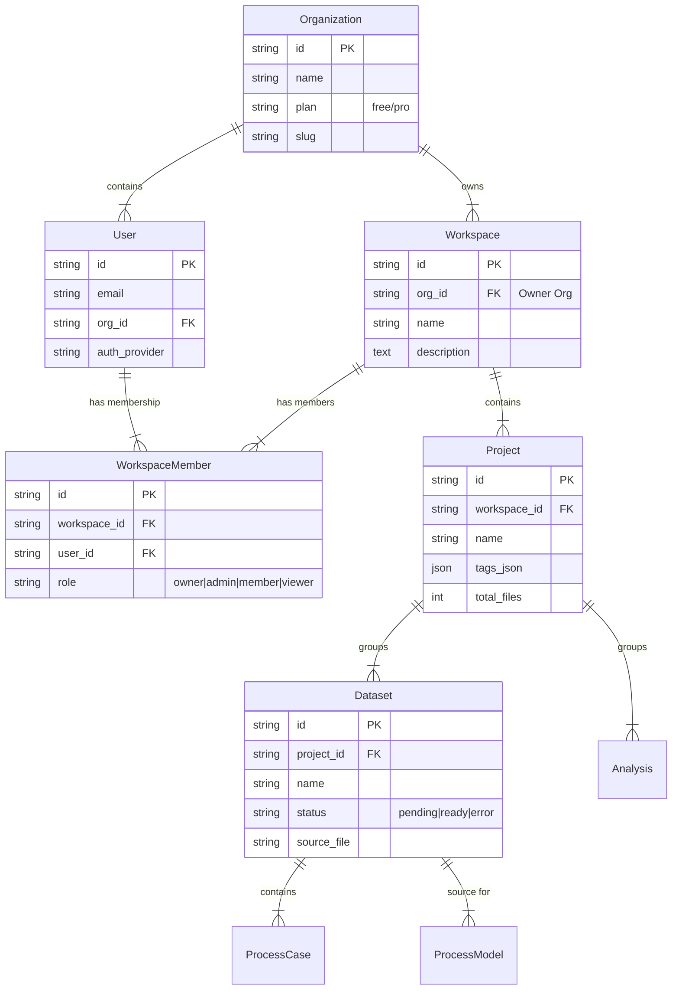
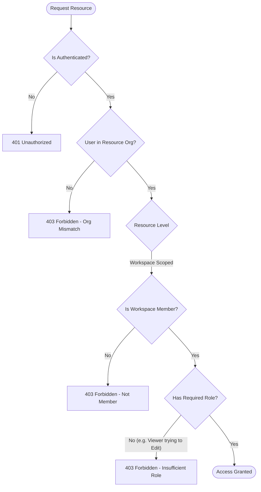
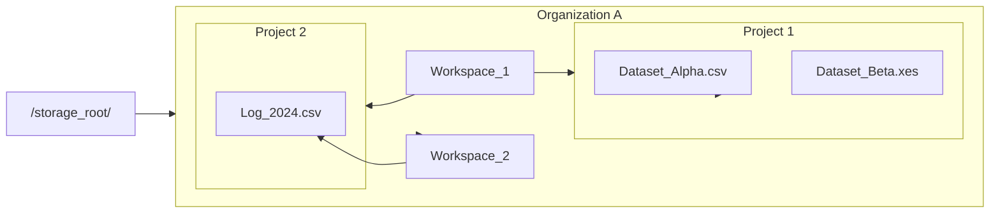

# Workspace & Project Management: End-to-End Architecture

This document details the logical architecture, data models, and user flows for the Workspace & Project Management modules.

## 1. Entity Relationship Diagram (ERD)
The core hierarchy follows a standard SaaS Multi-tenancy model: `Organization` → `Workspace` → `Project`.



## 2. System Architecture & Data Flow

This diagram illustrates how a user interacts with the system to create projects and how data flows through the backend services.

```mermaid
graph TD
    %% Actors
    User([User])
    
    %% Frontend Layer
    subgraph Frontend ["Frontend (Explorer/Platform)"]
        UI_Context["Workspace Context Provider"]
        UI_Projects["Project List Page"]
        UI_Create["Create Project Modal"]
        API_Client["API Client (Axios)"]
    end

    %% Backend Layer
    subgraph Backend ["Backend API"]
        Router["/api/v1/projects"]
        AuthService["AuthorizationService"]
        Repo["ProjectRepository"]
        Storage["StorageService"]
    end

    %% Data Layer
    subgraph Database ["Persistence"]
        DB[(PostgreSQL/SQLite)]
        FS[("File Storage (Local/S3)")]
    end

    %% Flows
    User -->|1. Selects Workspace| UI_Context
    UI_Context -->|2. Stores Active WorkspaceID| UI_Projects
    
    User -->|3. Clicks 'New Project'| UI_Create
    UI_Create -->|4. POST /projects (name, workspace_id)| API_Client
    API_Client -->|5. HTTP Request| Router
    
    Router -->|6. Check Permissions| AuthService
    AuthService -->|7. Verify WorkspaceMember| DB
    
    AuthService -- "Valid (Admin/Editor)" --> Router
    Router -->|8. Create Record| Repo
    
    Repo -->|9. INSERT Project| DB
    Repo -->|10. Create Project Folder| Storage
    Storage -->|11. mkdir {workspace_id}/{project_id}| FS
    
    Repo -- "Success" --> Router
    Router -- "201 Created" --> API_Client
    API_Client -->|12. Refresh List| UI_Projects
```

## 3. Authorization Logic (RBAC)

The `AuthorizationService` enforces permissions at each level of the hierarchy.



## 4. Storage Structure
Physical storage mirrors the logical hierarchy to ensure isolation and easy cleanup.


